<p id="top" style="font-size:48px;color:green; font-weight:bolder;">AI</p>

<p><a href="#top" style="position:fixed;">回到顶部</a></p>

目录：   

- [大模型](#大模型)
  - [大模型相关论文PDF汇总](#大模型相关论文pdf汇总)
    - [大名鼎鼎的Transformer](#大名鼎鼎的transformer)
    - [CV领域的新基石： Vision Transformer](#cv领域的新基石-vision-transformer)
    - [文生图、文生视频的基石：Diffusion Transformer](#文生图文生视频的基石diffusion-transformer)
    - [分割一切大模型](#分割一切大模型)
    - [开源文生视频： Stable Video Diffusion](#开源文生视频-stable-video-diffusion)
    - [什么是微调？](#什么是微调)
    - [什么是强化学习？](#什么是强化学习)
    - [Google IO 2024发布内容简介](#google-io-2024发布内容简介)
  - [大模型文件后缀名及其含义](#大模型文件后缀名及其含义)
  - [Huggingface](#huggingface)
    - [Hugging Face镜像站](#hugging-face镜像站)
    - [指定本地路径，避免反复下载](#指定本地路径避免反复下载)
  - [强化学习](#强化学习)
  - [深度学习](#深度学习)
  - [深度学习的基本概念](#深度学习的基本概念)
    - [残差连接](#残差连接)
    - [归一化](#归一化)
    - [线性层](#线性层)
    - [SoftMax](#softmax)
    - [激活函数](#激活函数)
    - [epoch](#epoch)
    - [repeat](#repeat)
    - [batch-size](#batch-size)
    - [过拟合和欠拟合的最通俗解释](#过拟合和欠拟合的最通俗解释)
  - [PyTorch](#pytorch)
    - [PyTorch相对Numpy的优势](#pytorch相对numpy的优势)
    - [将张量放入GPU环境](#将张量放入gpu环境)
  - [张量](#张量)
    - [张量简介](#张量简介)
    - [张量的元素类型](#张量的元素类型)
    - [特殊的张量](#特殊的张量)
    - [张量和Numpy数组的互转](#张量和numpy数组的互转)
    - [矩阵的乘法](#矩阵的乘法)
- [ComfyUI](#comfyui)
  - [文生视频知识点梳理](#文生视频知识点梳理)
  - [安装和部署](#安装和部署)
    - [硬件要求](#硬件要求)
    - [云平台硬件计费说明](#云平台硬件计费说明)
    - [阿里云部署参考文档](#阿里云部署参考文档)
    - [文件结构](#文件结构)
    - [典型文件的位置](#典型文件的位置)
    - [自定义模型文件的位置](#自定义模型文件的位置)
    - [SD3下载](#sd3下载)
    - [模型插件管理器 ComfyUI Manager](#模型插件管理器-comfyui-manager)
  - [常见节点的输入、输出、参数说明](#常见节点的输入输出参数说明)
    - [KSampler 采样器节点](#ksampler-采样器节点)
    - [VAE Decode](#vae-decode)
    - [加载器（效率）](#加载器效率)
    - [K采样器（效率）](#k采样器效率)
    - [LoRA堆](#lora堆)
  - [AnimateDiff](#animatediff)
  - [SDXL 组成](#sdxl-组成)
  - [ControlNet](#controlnet)
  - [ControlNet简介](#controlnet简介)
  - [Adapter](#adapter)
    - [T2I adpter](#t2i-adpter)
    - [IP Adapter](#ip-adapter)
    - [IP Adapter 的功能分类](#ip-adapter-的功能分类)
    - [ViT-H 和ViT-G](#vit-h-和vit-g)
  - [ComfyUI简介](#comfyui简介)
  - [ComfyUI的默认工作流](#comfyui的默认工作流)
- [Gradio](#gradio)
  - [安装gradio](#安装gradio)
  - [导入gradio](#导入gradio)
  - [一个简单的示例](#一个简单的示例)
  - [gr.Interface()的三大重要参数](#grinterface的三大重要参数)
  - [Interface()的其它参数](#interface的其它参数)
  - [数据类型](#数据类型)
  - [输出组件的类型](#输出组件的类型)
  - [Gradio集成大模型](#gradio集成大模型)
- [Stable Diffusion](#stable-diffusion)
  - [AI绘画的应用场景](#ai绘画的应用场景)
  - [Stable Diffusion](#stable-diffusion-1)
    - [SD的发布时间](#sd的发布时间)
    - [SDXL简介](#sdxl简介)
    - [SD的主要原理](#sd的主要原理)
    - [从 U-Net 到Transformer](#从-u-net-到transformer)
    - [隐空间的作用](#隐空间的作用)
    - [SD应用的主要文件夹](#sd应用的主要文件夹)
  - [LoRA训练](#lora训练)
    - [repeat、epoch、batch\_size的区别](#repeatepochbatch_size的区别)
    - [学习率](#学习率)
    - [打tag](#打tag)
  - [提示词](#提示词)
    - [权重语法](#权重语法)
  - [Sora](#sora)
    - [Sora简介](#sora简介)
    - [Sora有望推动机器人的发展](#sora有望推动机器人的发展)
  - [SVD](#svd)
    - [Stable Video Diffusion简介](#stable-video-diffusion简介)
    - [SVD的训练过程](#svd的训练过程)
  - [SVD配合ComfyUI](#svd配合comfyui)
- [Transformer](#transformer)
  - [Transformer 示意图](#transformer-示意图)
  - [Transformer 源码](#transformer-源码)


# 大模型


## 大模型相关论文PDF汇总

###  大名鼎鼎的Transformer

-  标题： Attention  Is  All  You  Need
-  中文标题： 注意力是你所需要的一切
-  发表时间： 2017年


###  CV领域的新基石： Vision Transformer

-  标题： An Image Is Worth 16X16 Words： Transformers for Image Recognition At Scale
-  中文标题： 一张图片等价于16x16大小的字：将Transformer用于图像识别
-  发表时间： 2020年10月
-  论文地址： https://arxiv.org/abs/2010.11929


###  文生图、文生视频的基石：Diffusion Transformer

-  标题： Scalsble Diffusion Models with Transformers   （DiT）
-  中文标题： 基于Transformers的可扩展的扩散模型
-  发表时间： 2022年12月
-  地址： https://arxiv.org/pdf/2212.09748


### 分割一切大模型

-  标题： Segment Anything
-  中文标题： 分割一切


###  开源文生视频： Stable Video Diffusion

-  发布时间： 2023年11月


### 什么是微调？

从头开始训练模型，成本高昂。  对所有的参数进行微调，是低效的。 固定前面的层，只微调接近下游的那几层参数，效果又不好。  将高维映射到低维，然后经过一个线性层，再从低维还原到高维。

### 什么是强化学习？

通过与环境交互，根据反馈来学习最佳行为。 智能体评估当前的状态，采取相应的动作，根据动作的正确与否得到奖励或惩罚。  智能体通过与环境的互动，学习到一个策略，使奖励最大化。

###  Google IO 2024发布内容简介

基本围绕AI。Veo视频生成模型。Gemini 大模型。 Agent工具。AI辅助编程工具等。

## 大模型文件后缀名及其含义

（1）  safetensors

这是由 Hugging Face 推出的一种新型安全模型存储格式，特别关注模型安全性、隐私保护和快速加载。它仅包含模型的权重参数，而不包括执行代码，这样可以减少模型文件大小，提高加载速度。

（2） ckpt

PyTorch Lightning 框架采用的模型存储格式。它不仅包含了模型参数，还包括优化器状态以及可能的训练元数据信息，使得用户可以无缝地恢复训练或执行推理。

（3） bin

通常是一种通用的二进制格式文件，它可以用来存储任意类型的数据。但在某些情况下可用于存储原始二进制权重数据，加载时需额外处理。

（4） pth

是 PyTorch 中用于保存模型状态的标准格式。方便模型的持久化和复用，支持完整模型结构和参数的保存与恢复。


##  Huggingface

###  Hugging Face镜像站

国内网络环境无法使用Huggingface，可以使用其镜像站 ：https://hf-mirror.com

要下载镜像站的大模型文件，有两种方式。

方法一： 直接在网页下载

打开大模型页面 https://hf-mirror.com/用户名/模型名  ，进入files标签，直接下载里面的文件。

方法二： 使用命令行工具

首先安装命令行工具Python包：

```sh
pip  install  -U  huggingface_hub
```

然后设置环境变量  HF_ENDPOINT  =  "https://hf-mirror.com"

然后下载模型：

```sh
huggingface-cli  download  --resume-download  gpt2  --local-dir  gpt2
```

下载数据集：

```sh
huggingface-cli  download  --repo-type  drataset  --esume-download  wikitext  --local-dir  wikitext
```

注意，有些项目需要登录Huggingface Face源站获取Token才能下载。

### 指定本地路径，避免反复下载

大模型文件很大，每次都重新下载费时费力，因此可以指定本地路径。from_pretrain 函数可以接收一个模型的id，也可以接收模型的本地存储路径。

先在网络较好时将HF上的整个文件夹下载下来，然后推理的时候指定本地的这个文件夹即可。


## 强化学习

-  提示学习

插槽式、类似于插值字符串

-  语境学习

带有情感极性的句子示例

-  高效模型微调LoRA

在原本矩阵旁边添加低秩矩阵
在残差连接添加适配层作为可训练参数

-  低秩矩阵

秩序：矩阵中最大不相关向量的个数，可以理解为有秩序的程度。

矩阵的秩的度量其实就是矩阵的行列之间的相关性。如果矩阵的各行或列是线性无关的，矩阵就是满秩的。非零元素的行数或列数决定了秩的多少。

低秩矩阵：矩阵的秩相对矩阵的行数或列数而言很小。

图像处理中，秩可以理解为包含信息的丰富程度。如果一张草原图全是草，那么就是低秩。

-  稀疏矩阵

稀疏是指矩阵中非零元素的个数少。

-  思维链

解题思路和步骤输入给模型，使得模型不仅有结果，还有中间步骤。

## 深度学习

##  深度学习的基本概念

###  残差连接	

将输入多次处理后，再和最开始的那个输入做一次加法运算

###  归一化	

使一组数据限定在一个范围内，如0~1或-1~1，以加快收敛

### 线性层	

加入一组权重，然后不断训练调整

### SoftMax	

将一组值转为一组概率，总和为1

### 激活函数	

增加非线性，如果没有激活函数，就算层再多跟一层也没区别。目前最常用的是ReLu。

###  epoch

把整个数据集遍历一次称为一个epoch。推荐每运行完一个epoch就保存一次记录，这样就有更多的模型可供选择。

###  repeat

单张图片的重复遍历次数。在当前的epoch中，每张图片被遍历的次数。

###  batch-size

批次大小。较大的批次训练速度更快，但需要更大的显存，需要更多的批次才能收敛。较小的batch size训练较慢，但显存占用更小，模型收敛的更快。


### 过拟合和欠拟合的最通俗解释

欠拟合：没学会。
过拟合：学会了，但是学痴了，但能举一反三。

##  PyTorch

###  PyTorch相对Numpy的优势

PyTorch和Numpy的数组可以互相转换，本质上并无区别。PyTorch相对于Numpy的优势在于：
-  支持GPU并行加速
-  自动微分

所以，PyTorch 比 Numpy 快，而 Numpy 又比 Python 原生数组快！

###  将张量放入GPU环境

```
import torch 
print(torch.__version__)# torch版本
print(torch.version.cuda) #cuda版本
print(torch.cuda.is_available()) #cuda是否可用
```


代码	|	注释
--- 	|	---
device = torch.device("cuda")	|	使用GPU环境
device = torch.device("cpu")	|	使用CPU环境
A.device	|	判断对象在哪个环节
A= A.to(device)	|	放入device中
A.cpu().device	|	放入CPU中

torch.tensor(1.0) #标量
torch.tensor([[1.0,1.0],[1.0,1.0]])#二维数组 (2,2)

## 张量

### 张量简介

张量是PyTorch等深度学习框架中最基本的数据结构。张量的本质是多维数组，可以是一维的向量、二维的矩阵、三维的数组。

###  张量的元素类型

类型	|	CPU表示	|	GPU表示
---	|	---	|	---
32位短整型	|	torch.IntTensor	|	torch.cuda.intTensor
64位长整型	|	torch.LongTensor	|	torch.cuda.LongTensor
单精度浮点型	|	torch.FloatTensor	|	torch.cuda.FloatTensor
双精度浮点型	|	torch.DoubleTensor	|	torch.cuda.DoubleTensor

###  特殊的张量

代码	|	作用
---	|	---
torch.zeros(m,n)	|	mxn的全0矩阵
torch.ones(m,n)	|	mxn的全1矩阵
torch.eye(m,n)	|	mxn的单位矩阵，对角线为1，其它为0
torch.randn(m,n)	|	mxn的正态分布的随机数，0~1之间
torch.rand(m,n)	|	mxn的均匀分布的随机数，0~1之间
torch.Tensor([4,5,5,6])	|	根据数组字面量直接创建张量
torch.IntTensor([1,2])	|	指定数据类型

索引操作
y = x[0,  :  ]  第1行


###  张量和Numpy数组的互转

Numpy转Tensor： 

```
arr = np.ones(5,3)
T  = torch.from_numpy(a)
```

改变张量的形状

张量对象调用view()方法可以改变形状 ，例如：

```
import torch 
T1 = Torch.ones(3,8)
T2 = T1.view(4,6)
```

也可以将某个维度的长度设置为-1，会自动计算：

```
import torch 
T1 = Torch.ones(3,8)
T2 = T1.view(-1 ,6)   # 第一维自动计算
```

还有两个方法去掉或增加长度为1的维度：
-  squeeze(T) ： 去掉长度为1的维度
-  unsqueeze(T) ： 增加长度为1的维度

dataloader的参数

dataset	数据集
batch_size	批次大小，默认1

Epoch： 所有的样本都输入到模型中，称为一个epoch
Iteration： 一个Batch的样本输入到模型中，称为一个Iteration
batch_size： 一个批次的大小，一个Epoch=Batchsize*Iteration

DataLoader()的参数：
dataset	数据集
batch_size	批次大小
shuffle	是否乱序
sampler	样本采样函数，一般无需设置
batch_sampler	批次采样函数，一般无需设置
num_workers	使用多进程读取数据，使用的进程数
collate_fn	整理一个批次数据的函数
    


Dataset	数据集
DataLoader	数据装载器

自建数据集：
dataset = TensorDataset(torch.arange(1, 40))
dl = DataLoader(dataset, batch_size=10)   # 批次大小10，因此有4个批次


###  矩阵的乘法
T1.matmul(T2)
T1 @  T2  # 与上等价

神经网络和矩阵乘法的对应

神经网络和矩阵乘法的对应关系如下图所示：

    
    首先将输入展平为一个一维向量，中间的每条线对应着一个数值，这些数值组合起来就是一个矩阵，在深度学习中叫做权重。如果每个输入跟每个输出全部相连，就叫做全连接。
    
torch.nn
torch.nn是神经网络工具箱，该工具箱建立于Autogard（主要有自动求导和梯度反向传播功能），提供了网络搭建的模组，优化器等一系列功能。

搭建一个神经网络的整体流程：
    数组读取
    定义模型
    定义损失函数和优化器
    模型训练
    获取训练结果

Torch 运算
torch.item()	 取出数据，注意，只有一个元素时才能用
T.numpy()	转为Numpy
T.from_numpy()	从Numpy导入
T.view()	变形、重构尺寸，类
    似Numpy的reshape变形
T.transpose(0,1)	行列交换


拼接stack
torch.stack((A,B), dim=0) dim表示拼接方向


正向传播、反向传播

正向：由输入得到输出
反向：根据损失函数计算预测值与真实值之间的误差，计算每个节点对应的输入的梯度，最终得到参数的梯度信息。

梯度
为什么要算梯度？
使得损失函数最小，梯度（斜率）为0
y.backward() 计算梯度
x.grad 获取梯度值

梯度下降法是一种致力于找到函数极值点的算法。所谓“训练”或“学习”就是改进模型参数，以便通过大量训练步骤将损失最小化。梯度下降法的思路很简单，就是沿着函数下降最快的方向改变模型参数，直到到达最低点。

超参数
超参数就是需要用户手工配置的参数。

学习率
Wi+1  =  Wi  -  学习率 x  ▽Wi 
学习率就是每次下降的幅度。太小，则需要很多轮迭代，浪费资源； 太大，则可能会跳过最小点


一个简单的神经网络示例

我们拿一个最简单的FNN网络来对经典数据集diabetes糖尿病数据集来进行分类预测。

```        
    import numpy as np	
    import torch
    import matplotlib.pyplot as plt
    from torch.utils.data import Dataset, DataLoader
     
     
    # Prepare the dataset 准备数据集
    class DiabetesDateset(Dataset):
        # 加载数据集
        def __init__(self, filepath):
            xy = np.loadtxt(filepath, delimiter=',', dtype=np.float32, encoding='utf-8')
            self.len = xy.shape[0]  # shape[0]是矩阵的行数,shape[1]是矩阵的列数
            self.x_data = torch.from_numpy(xy[:, :-1])
            self.y_data = torch.from_numpy(xy[:, [-1]])
     
        # 获取数据索引
        def __getitem__(self, index):
            return self.x_data[index], self.y_data[index]
     
        # 获得数据总量
        def __len__(self):
            return self.len
     
     
    dataset = DiabetesDateset('diabetes.csv')
    
    train_loader = DataLoader(dataset=dataset, batch_size=32, shuffle=True, num_workers=2)  
    # num_workers为多线程
     
     
    # Define the model   定义模型
    
    class FNNModel(torch.nn.Module):
        def __init__(self):
            super(FNNModel, self).__init__()
            self.linear1 = torch.nn.Linear(8, 6)  # 输入数据的特征有8个,也就是有8个维度,随后将其降维到6维
            self.linear2 = torch.nn.Linear(6, 4)  # 6维降到4维
            self.linear3 = torch.nn.Linear(4, 2)  # 4维降到2维
            self.linear4 = torch.nn.Linear(2, 1)  # 2w维降到1维
            self.sigmoid = torch.nn.Sigmoid()  # 可以视其为网络的一层,而不是简单的函数使用
     
        def forward(self, x):
            x = self.sigmoid(self.linear1(x))
            x = self.sigmoid(self.linear2(x))
            x = self.sigmoid(self.linear3(x))
            x = self.sigmoid(self.linear4(x))
            return x
     
     
    model = FNNModel()
     
    # Define the criterion and optimizer 定义优化和损失
    criterion = torch.nn.BCELoss(reduction='mean')  # 返回损失的平均值
    optimizer = torch.optim.SGD(model.parameters(), lr=0.01)
     
    epoch_list = []
    loss_list = []
     
    # Training  训练
    if __name__ == '__main__': 
        for epoch in range(100):
            # i是一个epoch中第几次迭代,一共756条数据,每个mini_batch为32,所以一个epoch需要迭代23次
            # data获取的数据为(x,y)
            loss_one_epoch = 0
            for i, data in enumerate(train_loader, 0):
                inputs, labels = data    # 输入实际
                y_pred = model(inputs)  #  预测输入
                loss = criterion(y_pred, labels)  # 预测实际
                loss_one_epoch += loss.item()
     
                optimizer.zero_grad()
                loss.backward()
                optimizer.step()
            loss_list.append(loss_one_epoch / 23)
            epoch_list.append(epoch)
            print('Epoch[{}/{}],loss:{:.6f}'.format(epoch + 1, 100, loss_one_epoch / 23))
     
        # Drawing
        plt.plot(epoch_list, loss_list)
        plt.xlabel('epoch')
        plt.ylabel('loss')
        plt.show()
```  


# ComfyUI

##   文生视频知识点梳理

-  部署
    -  本地
    -  云端
    -  在线网站
-  ControlNet
    -  风格转移
    -  骨架
    -  语义分割
    -  草绘生图
    -  inpaint
    -  openpose骨架
-  LoRA
-  工作流的使用、分享、格式分析
-  局部细节修复
-  图片放大
-  SR、CCSR、APISR
-  AnimateDiff
-  Segment Anything
-  TensorRT
-  Adapter
-  Deforum
-  Reactor 换脸
-  SVD AI视频
-  应用
    -  换脸
    -  换衣服
    -  静图变动图
    -  目标跟踪
    -  语义分割

##  安装和部署

要用到的模型： checkpoint主模型、VAE模型、 ControlNet模型、Lora、Embedding、Hypernetwork ，需要一个超大存储空间。

### 硬件要求

硬件  | 要求
|---|---|
GPU | 4060Ti以上
GPU存储（显存）|最低4GB，流畅运行推荐8GB
CPU | 要求较低，Intel10代i3以上就可以
CPU存储（内存）|最低16GB，推荐32GB


###  云平台硬件计费说明

硬件|计费说明
|---|---|
GPU+显存| 依据GPU的性能，每GB每秒
CPU+内存| 依据CPU的性能，每GB每秒

费用举例：


###  阿里云部署参考文档

[函数计算部署](https://help.aliyun.com/zh/functioncompute/deploying-comfyui-through-function-computation-to-implement-an-aigc-image-generation-system)

[PAI-EAS部署](https://help.aliyun.com/zh/pai/user-guide/use-comfyui-to-deploy-an-ai-video-generation-model-service)

###  文件结构

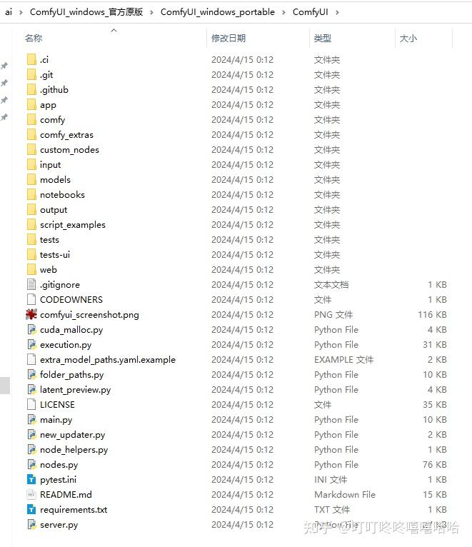

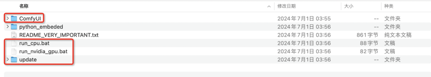

根目录下的四个文件（夹）的作用如下：
-  ComfyUI ： 最关键的文件夹，存放着所有模型、节点。包括checkpoint大模型、LoRA模型、ControlNet模型等。
-  run_cpu.bat ： 用CPU运行
-  run_nvidia_gpu.bat ： 用GPU运行
-  update： 版本升级

###  典型文件的位置

位置  | 作用
|---|---|
模型文件|ComfyUI/models
自定义节点  | ComfyUI\custom_nodes\
基础模型（大模型）| ComfyUI/models/checkpoints
VAE | ComfyUI/models/vae 
LoRA模型 |  ComfyUI\models\loras


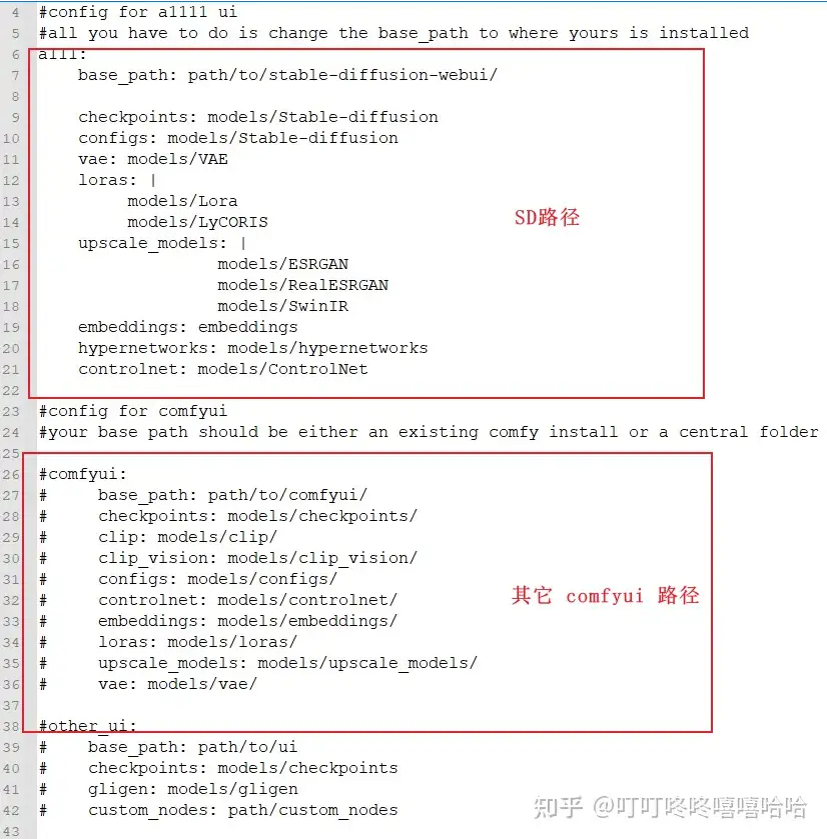


###  自定义模型文件的位置

除了默认位置外，还可以自定义位置，在 ` ComfyUI\extra_model_paths.yaml ` 文件中更改。


###  SD3下载

https://pan.baidu.com/s/1Su7BzC9GQ1uD_YgCVVpruQ?pwd=tfue

###  模型插件管理器 ComfyUI Manager 

下载 https://github.com/ltdrdata/ComfyUI-Manager ，解压到 ` ComfyUI\custom_nodes\ ` 中。

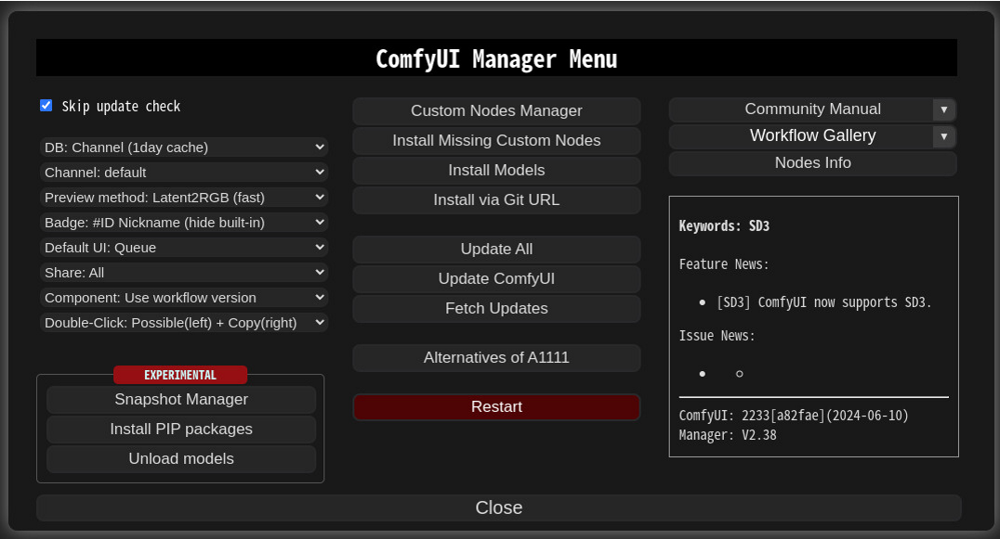

有两种方式。第一种是使用git clone。

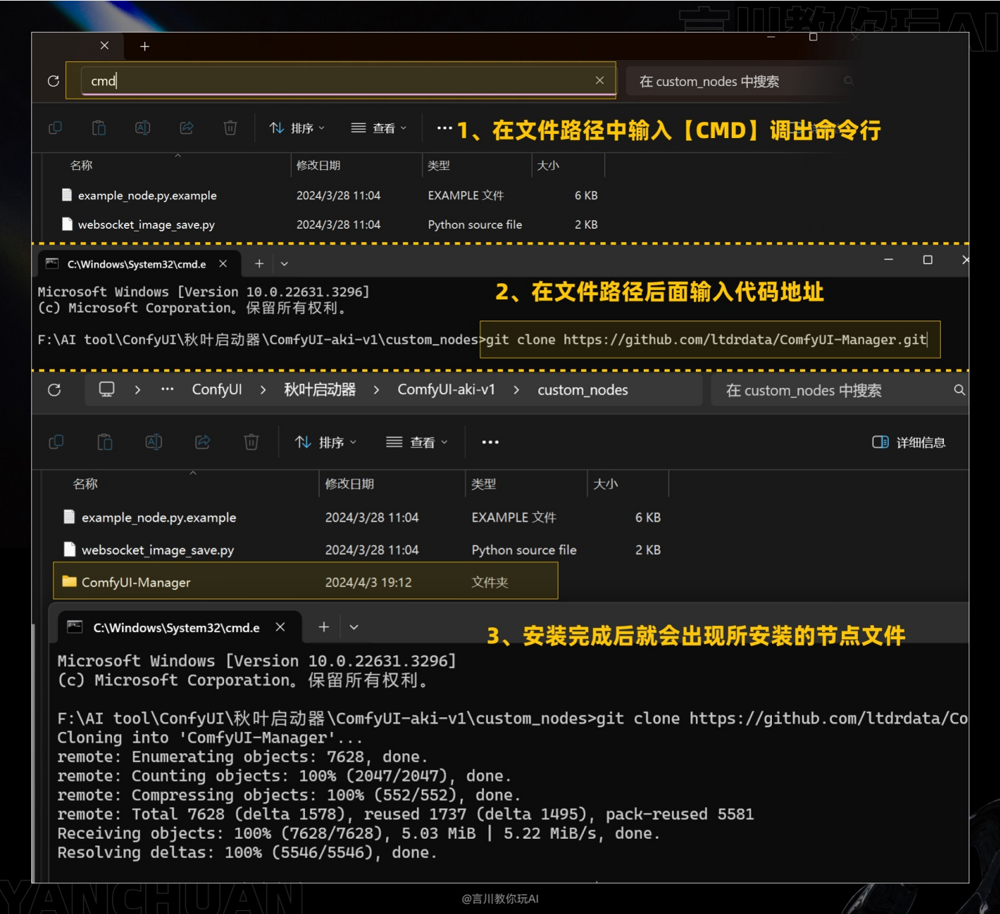

第二种是直接下载zip包再解压。


##  常见节点的输入、输出、参数说明 

###  KSampler 采样器节点

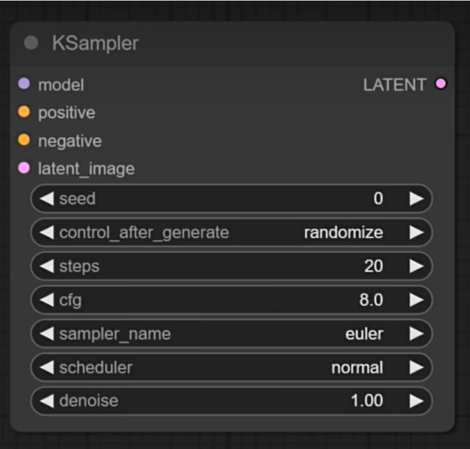


|参数	|	作用|
|---	|	---|
model	|	指定大模型
positive	|	正向提示词
negative	|	反向提示词
latent_image	|	是一个空的图像空间，用于在其中存储生成的图片数据，它来自于Empty Latent Image节点，这个节点提供指定宽高和数量的空图像空间。之所以用Latent这个词，是因为采样产生的图像数据还不是真正的图像格式，是一种图片数据的压缩格式，称为潜空间图像。
seed	|	图片生成的种子，每次使用不同的种子就会引入不同的随机特征，同样的参数就可以生成主题相同但变化的图像。使用完全相同的参数和种子将生成完全相同的图像。
control_after_generate	|	运行后操作，里面有四个选项：固定、增加、减少、随机。一般我们就使用固定或随机即可。
steps	|	迭代步数，一般设置30-40左右。
cfg	|	提示词相关性。参数越大，图片效果越接近提示词。参数越小，AI 发挥空间越大。默认为8，一般设置为10比较好。
sampler_name	|	采样器，反向扩散时去除噪音的方法，不同的方法对速度和质量会有不同的影响。默认选择的是euler，兼顾了生成图片的质量和速度，质量要求高时推荐选择dpmpp类的采样器。
scheduler	|	采样调度器。控制在整个采样过程的时间线上每一步降噪的幅度。如果对默认的调度器不满意，可以试试Karras，它可以让生成获得更高的采样效率和图片质量。
denoise	|	去噪幅度，最大1.0。越高的值代表初识噪音保留的越少，图像特征越清晰；越低的值代表初识噪音保留的较多，图像更抽象或者有某种艺术效果。生成图片时要一起考虑提示词、图像尺寸、采样策略等因素的影响。

### VAE Decode

采样器生成的图片数据是一种特殊的压缩格式，和真正的图片数据格式不同，要获取真正的图片数据，还需要VAE解码。

VAE解码需要使用一个VAE模型，VAE模型一般包含在SD基础模型中，也可以使用单独的VAE模型。

### 加载器（效率）

-  输入： LoRA堆、ControlNet堆
-  输出： 模型、正面、负面、Latent、VAE、Clip、
-  参数： CKPT模型名称、VAE、Clip Skip、LoRA、正面、反面提、宽度、高度、批次大小

### K采样器（效率）
-  输入： 模型、正面、负面、Latent、VAE、脚本
-  输出： 模型、正面、负面、Latent、VAE、图像
-  参数： 随机种子、步数、CFG、采样器、调度器

### LoRA堆
-  输入： 
-  输出： 
-  参数： 输入模式、LoRA数量、LoRA1、LoRA1的权重、LoRA2、LoRA2的权重、......

##  AnimateDiff

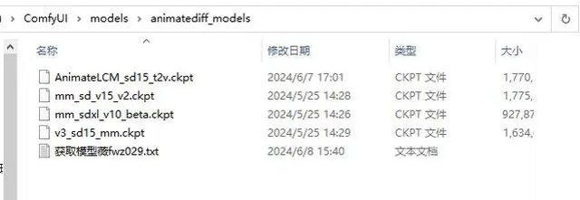


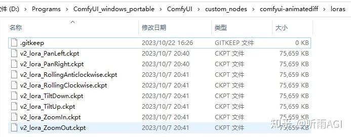 

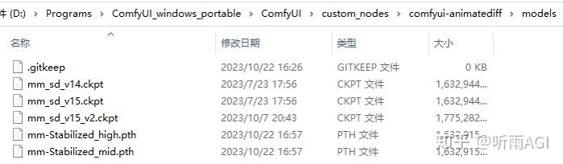

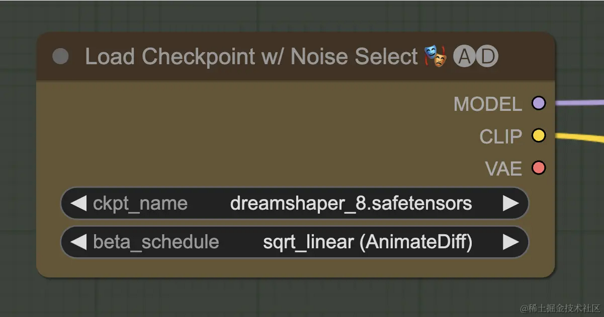

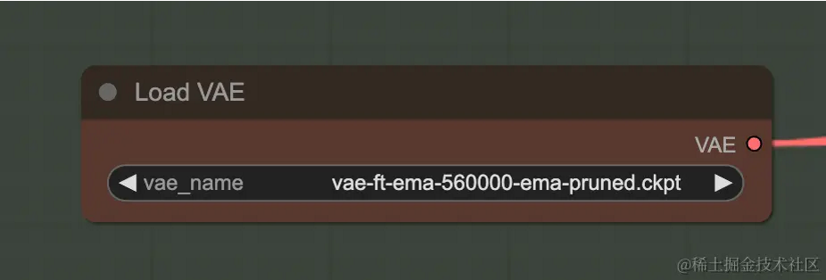

## SDXL 组成

SDXL Base模型由U-Net、VAE以及CLIP Text Encoder（两个）三个模块组成，在FP16精度下Base模型大小6.94G（FP32：13.88G），其中U-Net占5.14G、VAE模型占167M以及两个CLIP Text Encoder一大一小（OpenCLIP ViT-bigG和OpenAI CLIP ViT-L）分别是1.39G和246M。

SDXL Refiner模型同样由U-Net、VAE和CLIP Text Encoder（一个）三个模块组成，在FP16精度下Refiner模型大小6.08G，其中U-Net占4.52G、VAE模型占167M（与Base模型共用）以及CLIP Text Encoder模型（OpenCLIP ViT-bigG）大小1.39G（与Base模型共用）。

Base的作用是生成图像的Latent特征，Refiner的作用是小噪声去除和细节质量提升。


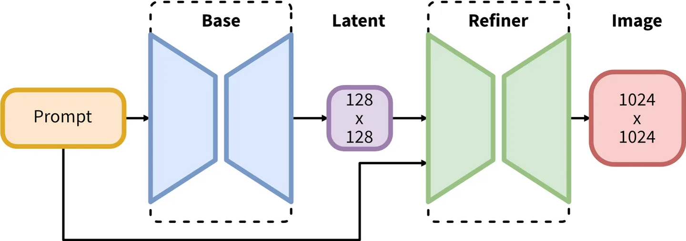


SDXL Base 地址： https://hf-mirror.com/stabilityai/stable-diffusion-xl-base-1.0/resolve/main/sd_xl_base_1.0.safetensors

SDXL Refinery 地址： https://hf-mirror.com/stabilityai/stable-diffusion-xl-refiner-1.0/resolve/main/sd_xl_refiner_1.0.safetensors

Stable Diffusion XL模型放到ComfyUI/models/checkpoints/路径下。

总之，base加refiner比单独的base好，SD XL 比SD好。

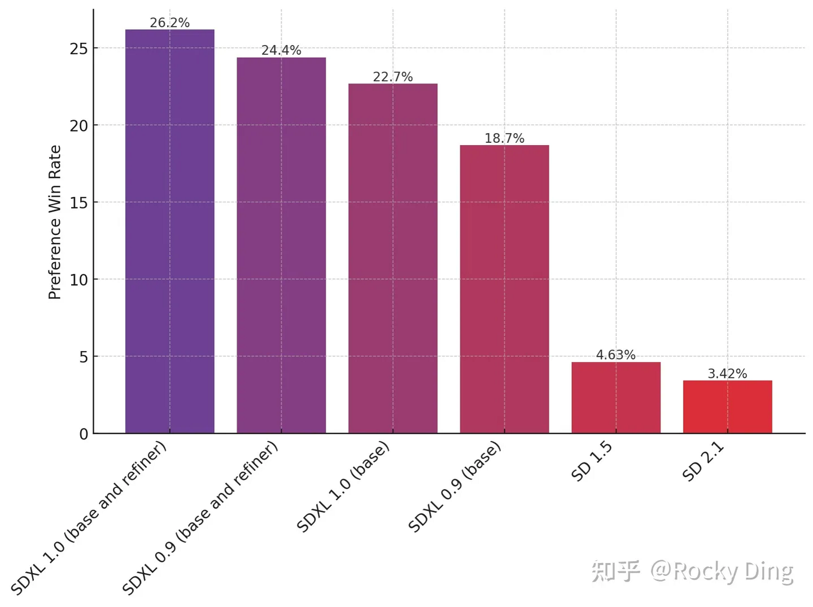

##  ControlNet

## ControlNet简介

通过你手上已有的图而不是咒语，实现对AI绘图的控制。比如通过线稿生成图片、风格迁移。

可以认为是大模型的插件，增强文生图的功能，生成更符合期望的图片。

## Adapter

Adapter ，就是将一张图像的风格，迁移到另一张图像上去。通俗的讲，就是垫图。

### T2I adpter

T2I  adapter 比ControlNet轻量，模型文件只有300M左右。T2I 给输入图片追加一定的条件，比如姿势图、草图、深度图，这样图片根据条件生成新图。


###  IP Adapter

IP adapter 根据参考图控制图像的生成。输入一张参考图和限定文字，可以生成符合文字要求的新图。输入一张参考图和另一张图片，可以生成基于参考图且叠加另一种图片要素的新图。

IP Adapter 中的“IP”不是网络中的IP，这里的“I”指的是Image（图片），“P”指的是Prompt（提示词）。所以，IP Adapter的直译是“图像提示适配器”。


IP adapter 只有22M参数，比ControlNet和T2I更加轻量。

下载完后需要放在 /ComfyUI/models/ipadapter 目录下


按照推出的先后时间是： ControlNet ->  T2I Adapter ->  IP Adapter 。

###  IP Adapter 的功能分类

-  clip ：将参考图整体看作提示。
-  face_id： 将人物面部特征作为提示。

其中，face_id又分为两个版本：
-  face_id
-  face_id_plus
-  face_id_plusV2： 改进版，效果最好。

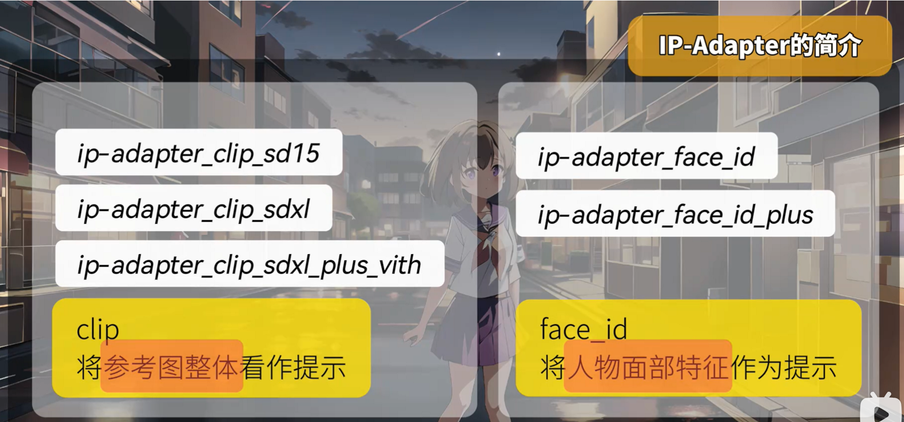

###   ViT-H 和ViT-G

这两个都是图像编码器，SDXL默认使用Vit-G，SD1.5默认使用ViT-H。

例如ip-adapter-clip-sdxl这个模型，只标明了SDXL，没标明图像编码器，那么默认就是ViT-G。而ip-adapter_clip_sdxl_plus_vith则表示sdxl基础模型搭配ViT-H图像编码器。

##  ComfyUI简介

ComfyUI是基于Stable Diffusion 开源绘画大模型的节点可视化工具。comfy，英文释义是轻松的，这表明作者希望用户更轻松的使用Stable Diffusion。与之前的Web UI不同，ComfyUI不使用输入框，而是使用节点工作流，可控制的参数更多，可以更自由的实现各种效果。

ComfyUI的Github地址：   https://github.com/comfyanonymous/ComfyUI

ComfyUI相比WebUI的优点是： 生成性能高、 节点式界面更直观、 丰富的自定义节点、 丰富的社区生态


##  ComfyUI的默认工作流

ComfyUI的默认工作流如下，更复杂的工作流都是基于这个默认工作流进行自定义和扩展的。


# Gradio

## 安装gradio

```
pip install gradio
```

## 导入gradio

```py
import gradio as gr
```

 ##  一个简单的示例

```py
import gradio as gr

def greet(name, intensity):  # 参数列表对应输入 name文本框、intensity滑块
    return "Hello, " + name + "!" * int(intensity)   # 输出对应，文本框

demo = gr.Interface(
    fn=greet ,   # 指定函数
    inputs=  ["text", "slider"] ,  # 指定输入类型： 一个文本框、一个滑块
    outputs = ["text"], # 指定输出类型
)

demo.launch()
```

## gr.Interface()的三大重要参数

Gradio的核心是Interface类，它允许用户定义输入和输出类型，创建交互式的Web界面。gr.Interface()有三大重要参数： 

-  fn处理函数： 用于定义如何根据输入返回输出。
-  inputs输入列表： 输入可以有一个或多个（列表）。每个元素支持多种输入类型，如gr.Text()用于文本输入，gr.Image()用于图像上传，gr.Audio()用于音频输入等。
-  outputs输出列表：输出使用函数的return指定，可以输出一个或多个。

## Interface()的其它参数

-  title ：标题
-  description ：描述
-  layout： 输入输出组件的布局
-  theme 界面主题风格，如dark
-  css ： css样式
-  layout： 使用layout="grouped"或layout="stacked"来更改组件的排列方式，使界面更加紧凑或分散。


##  数据类型

文本类：

类型	|	简写	|	含义	|	参数列表
---	|	---	|	---	|	---
gr.Text()	|	text	|	单行文本输入框	|	
gr.Textbox()	|	textbox	|	单行文本输入框	|	default：默认文本;placeholder：占位符文本
gr.Textarea()	|	textarea	|	多行文本输入框	|	lines：显示行数，整数值;placeholder： 占位符文本
gr.Number()	|	number	|	数字输入框	|	default：默认数字;label：标签文本
gr.Time()	|	time	|	输入时间	|	label：标签文本
gr.Slider()	|	slider	|	滑动条，用于选择一定范围的数值	|	minimum： 最小值;maximum：最大;step：步长;label：标签文本
gr.Radio()	|	radio	|	单选框	|	choices：字符串数组;label： 标签文本
gr.Checkbox()	|	checkbox	|	复选框，布尔类型	|	label：复选框旁边的文本
gr.ColorPicker()	|	colorpicker	|	选择颜色，十六进制颜色代码	|	default：默认颜色值
gr.Dropdown()	|	dropdown	|	下拉菜单	|	choices：字符串数组

附件类：

类型	|	简写	|	含义	|	参数列表
---	|	---	|	---	|	---
gr.File()	|	file	|	上传任意文件	|	file_count： 允许上传的数量，取值single（只能传一个）、multiple（可以传多个）; type： 数据类型，如file、audio
gr.Dataframe()	|	dataframe	|	上传csv文件或输入dataframe	|	headers: 列标题数组; row_count: 初始显示的行数
gr.Data()	|	data	|	上传二进制数据，用于上传音频或视频的原始字节	|	type：类型，可以是 auto 自动推断
gr.Image()	|	image	|	上传图片，支持多种图像格式	|	type： 图像类型，如pil
gr.Video()	|	video	|	上传视频	|	label：标签文本
gr.Audio()	|	audio	|	上传音频	|	source：指定音频来源;type：指定返回类型;label：标签文本


## 输出组件的类型

输出组件的类型除了包括上面表格中的类型以外，还包括：

-  Carousel：以轮播方式展示多个输出，适用于图像集多个数据点。参数：item_type 设置轮播项目类型。例：gr.Carousel(item_type="image")
-  Gallery：以画廊形式展示一系列图像。
-  HTML：展示HTML内容，适用于富文本或网页布局。
-  Image：展示图像。参数：type 指定图像格式。 例：gr.Image(type="pil")
-  JSON：以JSON格式展示数据，便于查看结构化数据。
-  KeyValues：以键值对形式展示数据。
-  Label：展示文本标签，适用于简单的文本输出。
-  Markdown：支持Markdown格式的文本展示。
-  Plot：展示图表，如matplotlib生成的图表。
-  Text：用于显示文本，适合较长的输出。

## Gradio集成大模型

如下代码集成了HuggingFace的图像分类模型：

```py
import gradio as gr
from transformers import pipeline

# 加载Huggingface上的预训练模型
model = pipeline('image-classification')

# 定义处理函数
def classify_image(img):
    return {i['label']: i['score'] for i in model(img)}

# 创建Gradio界面
iface = gr.Interface(
    fn=classify_image,
    inputs=gr.Image(type="pil"),   ## 图片类型
    outputs=gr.Label(num_top_classes=5))
iface.launch()

```


# Stable Diffusion

##  AI绘画的应用场景

-  人物
   -  换脸
   -  换装
   -  换姿势
   -  换表情
-  抠图
-  局部重绘
-  放大
-  换背景
-  换颜色

##  Stable Diffusion

###  SD的发布时间

1.0发布于2022年9月，2.0发布于2022年11月，3.0发布于2024年5月。

### SDXL简介

SDXL 就是 SD 的升级版，图片生成的效果更好、更逼真、分辨率更高。

### SD的主要原理

将输入（文本或图片）向量化 ——>    通过VAE压缩到Latent隐空间 ——>  在隐空间中多次去噪 ——> 通过VAE解码还原到像素空间

###   从 U-Net 到Transformer 

由于自注意力的可扩展性、强大的性能，扩散模型背后的骨干网络，已经由U-Net替换成了Transformer架构。Transformer 已然完成了深度学习领域的大一统。

### 隐空间的作用

隐空间通俗来说将图片数据量压缩，这样便于提升训练和推理的性能。类似于视频帧的压缩。

###  SD应用的主要文件夹

重点关注几个文件夹： checkpoint 大模型文件夹 、 embeddings 向量化、Lora微调、VAE变分自编码器、 ControlNet插件、Custom Nodes 自定义节点


## LoRA训练

###   repeat、epoch、batch_size的区别

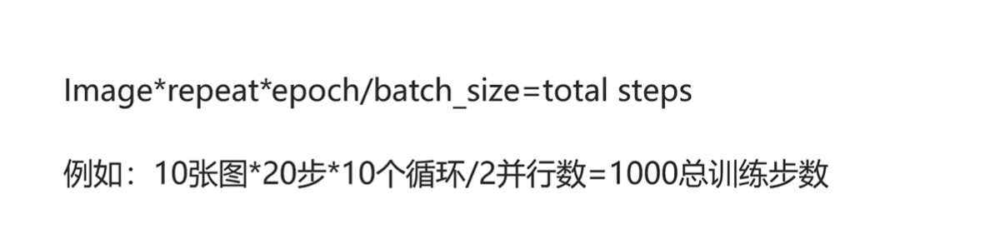


###  学习率 

学习率类似于车速。学习率过高，学的太快，囫囵吞枣，可能会过拟合。学习率太低，可以更好看清路上的风景，也就是AI可以更细致的去学习，但是可能会导致不拟合，也就是出图完全不像，学的太慢了，并且花费的时间更多。

学习率默认值1e-4，即0.0001。


###  打tag

**如果是希望灵活调整的特征，都必须把tag打清楚**。如果是固化在模型里面的特征，都不要去打tag。例如，如果希望头发颜色可以自定义，则必须写明 red hair ，如果不写明，将来AI会认为“人类的头发就是红色的”，将来所有生成的图片都将是红色头发。


##  提示词

###  权重语法


SD权重语法汇总如下：

语法	|	说明
---	|	---
`prompt`	|	没有任何符号，默认情况，1倍的权重
`(prompt)`	|	增加权重，1层为1.1倍，2层为1.21倍，3层为1.331倍
`(prompt: x)`	|	自定义权重，x最好控制在0.4~1.6之间。太小容易被忽视，太大容易拟合图像出错
`[prompt]` | 降低权重。1层中括号为0.9倍，3层中括号为0.729倍
`{prompt}` | 轻微增加权重。1层花括号为1.05倍，三层大括号为1.15倍
`[prompt1 and prompt2]`	|	prompt1和prompt2的混合，例如`[hot and dog]`表示在火中的狗
`[prompt1_prompt2]`	|	组合语法。比如`[coffee_cake]`表示咖啡蛋糕，既不是生成咖啡，也不是生成蛋糕。
`[prompt:0.8]`	|	在80%时刻才开始生成prompt，前面的时间跟该prompt无关
`[prompt::0.8]`	|	前80%时间段生成prompt，后面的时间跟该prompt无关
`[prompt1:prompt2:0.8]`	|	前80%的时间渲染prompt1，后20%的时间渲染prompt2
`[prompt1 \| prompt2 \| prompt3]`	|	循环往复，交替采样。如果你想把两种，将多种东西融合成一种，比如颜色渐变。
`[prompt1 break prompt2] `|在两个提示词中间写上“break”，作用就是把两个词完全隔离开，避免提示词之间的污染。
`prompt1 AND prompt2` | 组合提示词，AND必须大写。例如，如果想要头发又有紫色又有绿色，则 purple hair AND green hair。


##  Sora

### Sora简介

Sora 由OpenAI发布于2024年2月份，一经发布就轰动了世界。

Sora是一种文生视频大模型，但OpenAI的野心不止于此，官网的副标题是“Word Simulator（世界模拟器）”。因为Sora在使用大量的视频训练的过程中，学习到了客观世界的物理规律，例如行走、自由落体、视角变换、近大远小等。

###  Sora有望推动机器人的发展

Sora推出之所以轰动，不是因为它是文生视频，而是因为它通过观看大量的视频，理解了真实世界的物理规律。这就是“涌现”能力，除了文生视频带动视频相关行业的颠覆，还有两个更重要的价值： 通过AGI的途径之一（多种模态）、 直接用在机器人上。


## SVD

###  Stable Video Diffusion简介

Stable Video Diffusion，简称SVD，由StabilityAI发布于2023年11月，开源，能够生成帧率 14、分辨率 576x1024 的视频。

SVD-XT是SVD 的微调升级版，分辨率不变，但能够生成帧率 25 的视频；

###  SVD的训练过程

先搜集了5.8亿个视频剪辑。经过层层筛选，最后保留了1.5亿个视频片段的超高质量数据集。

SVD的训练分为三个主要步骤： 文生图预训练、 视频生成预训练、 高质量视频微调。

## SVD配合ComfyUI 


# Transformer

## Transformer 示意图


## Transformer 源码

```py
import numpy as np
import torch
import torch.nn as nn
import torch.optim as optim
import matplotlib.pyplot as plt

def make_batch(sentences):
    input_batch = [[src_vocab[n] for n in sentences[0].split()]]
    output_batch = [[tgt_vocab[n] for n in sentences[1].split()]]
    target_batch = [[tgt_vocab[n] for n in sentences[2].split()]]
    return torch.LongTensor(input_batch), torch.LongTensor(output_batch), torch.LongTensor(target_batch)

def get_sinusoid_encoding_table(n_position, d_model):
    def cal_angle(position, hid_idx):
        return position / np.power(10000, 2 * (hid_idx // 2) / d_model)
    def get_posi_angle_vec(position):
        return [cal_angle(position, hid_j) for hid_j in range(d_model)]

    sinusoid_table = np.array([get_posi_angle_vec(pos_i) for pos_i in range(n_position)])
    sinusoid_table[:, 0::2] = np.sin(sinusoid_table[:, 0::2])  # dim 2i
    sinusoid_table[:, 1::2] = np.cos(sinusoid_table[:, 1::2])  # dim 2i+1
    return torch.FloatTensor(sinusoid_table)

def get_attn_pad_mask(seq_q, seq_k):
    batch_size, len_q = seq_q.size()
    batch_size, len_k = seq_k.size()
    # eq(zero) is PAD token
    pad_attn_mask = seq_k.data.eq(0).unsqueeze(1)  # batch_size x 1 x len_k(=len_q), one is masking
    return pad_attn_mask.expand(batch_size, len_q, len_k)  # batch_size x len_q x len_k

def get_attn_subsequent_mask(seq):
    attn_shape = [seq.size(0), seq.size(1), seq.size(1)]
    subsequent_mask = np.triu(np.ones(attn_shape), k=1)
    subsequent_mask = torch.from_numpy(subsequent_mask).byte()
    return subsequent_mask

class ScaledDotProductAttention(nn.Module):
    def __init__(self):
        super(ScaledDotProductAttention, self).__init__()
    def forward(self, Q, K, V, attn_mask):
        scores = torch.matmul(Q, K.transpose(-1, -2)) / np.sqrt(d_k) # scores : [batch_size x n_heads x len_q(=len_k) x len_k(=len_q)]
        scores.masked_fill_(attn_mask, -1e9) # Fills elements of self tensor with value where mask is one.
        attn = nn.Softmax(dim=-1)(scores)
        context = torch.matmul(attn, V)
        return context, attn

class MultiHeadAttention(nn.Module):
    def __init__(self):
        super(MultiHeadAttention, self).__init__()
        self.W_Q = nn.Linear(d_model, d_k * n_heads)
        self.W_K = nn.Linear(d_model, d_k * n_heads)
        self.W_V = nn.Linear(d_model, d_v * n_heads)
        self.linear = nn.Linear(n_heads * d_v, d_model)
        self.layer_norm = nn.LayerNorm(d_model)

    def forward(self, Q, K, V, attn_mask):
        # q: [batch_size x len_q x d_model], k: [batch_size x len_k x d_model], v: [batch_size x len_k x d_model]
        residual, batch_size = Q, Q.size(0)
        # (B, S, D) -proj-> (B, S, D) -split-> (B, S, H, W) -trans-> (B, H, S, W)
        q_s = self.W_Q(Q).view(batch_size, -1, n_heads, d_k).transpose(1,2)  # q_s: [batch_size x n_heads x len_q x d_k]
        k_s = self.W_K(K).view(batch_size, -1, n_heads, d_k).transpose(1,2)  # k_s: [batch_size x n_heads x len_k x d_k]
        v_s = self.W_V(V).view(batch_size, -1, n_heads, d_v).transpose(1,2)  # v_s: [batch_size x n_heads x len_k x d_v]
        attn_mask = attn_mask.unsqueeze(1).repeat(1, n_heads, 1, 1) # attn_mask : [batch_size x n_heads x len_q x len_k]
        # context: [batch_size x n_heads x len_q x d_v], attn: [batch_size x n_heads x len_q(=len_k) x len_k(=len_q)]
        context, attn = ScaledDotProductAttention()(q_s, k_s, v_s, attn_mask)
        context = context.transpose(1, 2).contiguous().view(batch_size, -1, n_heads * d_v) 
            # context: [batch_size x len_q x n_heads * d_v]
        output = self.linear(context)
        return self.layer_norm(output + residual), attn # output: [batch_size x len_q x d_model]

class PoswiseFeedForwardNet(nn.Module):
    def __init__(self):
        super(PoswiseFeedForwardNet, self).__init__()
        self.conv1 = nn.Conv1d(in_channels=d_model, out_channels=d_ff, kernel_size=1)
        self.conv2 = nn.Conv1d(in_channels=d_ff, out_channels=d_model, kernel_size=1)
        self.layer_norm = nn.LayerNorm(d_model)
    def forward(self, inputs):
        residual = inputs # inputs : [batch_size, len_q, d_model]
        output = nn.ReLU()(self.conv1(inputs.transpose(1, 2)))
        output = self.conv2(output).transpose(1, 2)
        return self.layer_norm(output + residual)


class EncoderLayer(nn.Module):

    def __init__(self):
        super(EncoderLayer, self).__init__()
        self.enc_self_attn = MultiHeadAttention()
        self.pos_ffn = PoswiseFeedForwardNet()

    def forward(self, enc_inputs, enc_self_attn_mask):
        enc_outputs, attn = self.enc_self_attn(enc_inputs, enc_inputs, enc_inputs, enc_self_attn_mask) 
            # enc_inputs to same Q,K,V
        enc_outputs = self.pos_ffn(enc_outputs) # enc_outputs: [batch_size x len_q x d_model]
        return enc_outputs, attn


class DecoderLayer(nn.Module):

    def __init__(self):
        super(DecoderLayer, self).__init__()
        self.dec_self_attn = MultiHeadAttention()
        self.dec_enc_attn = MultiHeadAttention()
        self.pos_ffn = PoswiseFeedForwardNet()

    def forward(self, dec_inputs, enc_outputs, dec_self_attn_mask, dec_enc_attn_mask):
        dec_outputs, dec_self_attn = self.dec_self_attn(dec_inputs, dec_inputs, dec_inputs, dec_self_attn_mask)
        dec_outputs, dec_enc_attn = self.dec_enc_attn(dec_outputs, enc_outputs, enc_outputs, dec_enc_attn_mask)
        dec_outputs = self.pos_ffn(dec_outputs)
        return dec_outputs, dec_self_attn, dec_enc_attn


##### 编码器


class Encoder(nn.Module):

    def __init__(self):
        super(Encoder, self).__init__()
        # 将输入单词进行Embedding
        self.src_emb = nn.Embedding(src_vocab_size, d_model) # src_vocab_size：词表大小；d_model：嵌入维度
        # 添加位置编码
        self.pos_emb = nn.Embedding.from_pretrained(get_sinusoid_encoding_table(src_len+1, d_model),freeze=True)
        # 前馈神经网络
        self.layers = nn.ModuleList([EncoderLayer() for _ in range(n_layers)])

    def forward(self, enc_inputs): # enc_inputs : [batch_size x source_len]
        # 词向量 和 位置编码进行相加
        enc_outputs = self.src_emb(enc_inputs) + self.pos_emb(torch.LongTensor([[1,2,3,4,0]]))
        #
        enc_self_attn_mask = get_attn_pad_mask(enc_inputs, enc_inputs)
        enc_self_attns = []
        for layer in self.layers:
            enc_outputs, enc_self_attn = layer(enc_outputs, enc_self_attn_mask)
            enc_self_attns.append(enc_self_attn)
        return enc_outputs, enc_self_attns


class Decoder(nn.Module):

    def __init__(self):
        super(Decoder, self).__init__()
        self.tgt_emb = nn.Embedding(tgt_vocab_size, d_model)
        self.pos_emb = nn.Embedding.from_pretrained(get_sinusoid_encoding_table(tgt_len+1, d_model),freeze=True)
        self.layers = nn.ModuleList([DecoderLayer() for _ in range(n_layers)])

    def forward(self, dec_inputs, enc_inputs, enc_outputs): # dec_inputs : [batch_size x target_len]
        dec_outputs = self.tgt_emb(dec_inputs) + self.pos_emb(torch.LongTensor([[5,1,2,3,4]]))
        dec_self_attn_pad_mask = get_attn_pad_mask(dec_inputs, dec_inputs)
        dec_self_attn_subsequent_mask = get_attn_subsequent_mask(dec_inputs)
        dec_self_attn_mask = torch.gt((dec_self_attn_pad_mask + dec_self_attn_subsequent_mask), 0)
        dec_enc_attn_mask = get_attn_pad_mask(dec_inputs, enc_inputs)
        dec_self_attns, dec_enc_attns = [], []
        for layer in self.layers:
            dec_outputs, dec_self_attn, dec_enc_attn = layer(dec_outputs, enc_outputs, dec_self_attn_mask, dec_enc_attn_mask)
            dec_self_attns.append(dec_self_attn)
            dec_enc_attns.append(dec_enc_attn)
        return dec_outputs, dec_self_attns, dec_enc_attns


class Transformer(nn.Module):

    def __init__(self):
        super(Transformer, self).__init__()
        # 编码器
        self.encoder = Encoder()
        # 解码器
        self.decoder = Decoder()
        # 解码器最后的分类器，分类器的输入d_model是解码层每个token的输出维度大小，
            # 需要将其转为词表大小，再计算softmax；计算哪个词出现的概率最大
        self.projection = nn.Linear(d_model, tgt_vocab_size, bias=False)

    def forward(self, enc_inputs, dec_inputs):
        #  Transformer的两个输入，一个是编码器的输入（源序列），一个是解码器的输入（目标序列）
        # 其中，enc_inputs的大小应该是 [batch_size, src_len] ;  dec_inputs的大小应该是 [batch_size, dec_inputs]
        """
        源数据输入到encoder之后得到 enc_outputs, enc_self_attns；
        enc_outputs是需要传给decoder的矩阵，表示源数据的表示特征
        enc_self_attns表示单词之间的相关性矩阵
        """
        enc_outputs, enc_self_attns = self.encoder(enc_inputs)
        """
        decoder的输入数据包括三部分：
        1. encoder得到的表示特征enc_outputs、
        2. 解码器的输入dec_inputs（目标序列）、
        3. 以及enc_inputs
        """
        dec_outputs, dec_self_attns, dec_enc_attns = self.decoder(dec_inputs, enc_inputs, enc_outputs)
        """
        将decoder的输出映射到词表大小，最后进行softmax输出即可
        """
        dec_logits = self.projection(dec_outputs) # dec_logits : [batch_size x src_vocab_size x tgt_vocab_size]
        return dec_logits.view(-1, dec_logits.size(-1)), enc_self_attns, dec_self_attns, dec_enc_attns


def showgraph(attn):
    attn = attn[-1].squeeze(0)[0]
    attn = attn.squeeze(0).data.numpy()
    fig = plt.figure(figsize=(n_heads, n_heads)) # [n_heads, n_heads]
    ax = fig.add_subplot(1, 1, 1)
    ax.matshow(attn, cmap='viridis')
    ax.set_xticklabels(['']+sentences[0].split(), fontdict={'fontsize': 14}, rotation=90)
    ax.set_yticklabels(['']+sentences[2].split(), fontdict={'fontsize': 14})
    plt.show()


if __name__ == '__main__':
    # 句子的输入部分
    """
    第一个句子 是 编码器的输入
    第二个句子 是 解码器的输入
    第三个句子 是 标签
    P 可以理解为 编码器输入结束的字符（Padding填充字符）
    S 可以理解为 Start
    E 可以理解为 End
    此外，需要注意的是，由于文本内容长度往往会不一致，因此在代码实现过程中，我们往往会设置一个最大长度max_length，
    - 大于max_length的句子，多余的部分将会被裁剪
    - 小于max_length的句子，缺少的部分将会被填充
    """
    sentences = ['ich mochte ein bier P', 'S i want a beer', 'i want a beer E']
    # Transformer Parameters
    # Padding Should be Zero
    src_vocab = {'P': 0, 'ich': 1, 'mochte': 2, 'ein': 3, 'bier': 4}
    src_vocab_size = len(src_vocab)
    tgt_vocab = {'P': 0, 'i': 1, 'want': 2, 'a': 3, 'beer': 4, 'S': 5, 'E': 6}
    number_dict = {i: w for i, w in enumerate(tgt_vocab)}
    tgt_vocab_size = len(tgt_vocab)
    src_len = 5 # length of source 输入长度
    tgt_len = 5 # length of target 解码端的输入长度
    d_model = 512  # Embedding Size  Embedding后的长度
    d_ff = 2048  # FeedForward dimension  前馈神经网络的中间维度
    d_k = d_v = 64  # dimension of K(=Q), V
    n_layers = 6  # number of Encoder of Decoder Layer   Encoder和Decoder N的个数
    n_heads = 8  # number of heads in Multi-Head Attention  多头注意力机制分为几个头
    model = Transformer()
    criterion = nn.CrossEntropyLoss()
    optimizer = optim.Adam(model.parameters(), lr=0.001)
    enc_inputs, dec_inputs, target_batch = make_batch(sentences)
    for epoch in range(20):
        optimizer.zero_grad()
        outputs, enc_self_attns, dec_self_attns, dec_enc_attns = model(enc_inputs, dec_inputs)
        loss = criterion(outputs, target_batch.contiguous().view(-1))
        print('Epoch:', '%04d' % (epoch + 1), 'cost =', '{:.6f}'.format(loss))
        loss.backward()
        optimizer.step()
    # Test
    predict, _, _, _ = model(enc_inputs, dec_inputs)
    predict = predict.data.max(1, keepdim=True)[1]
    print(sentences[0], '->', [number_dict[n.item()] for n in predict.squeeze()])
    print('first head of last state enc_self_attns')
    showgraph(enc_self_attns)
    print('first head of last state dec_self_attns')
    showgraph(dec_self_attns)
    print('first head of last state dec_enc_attns')
    showgraph(dec_enc_attns)


```


