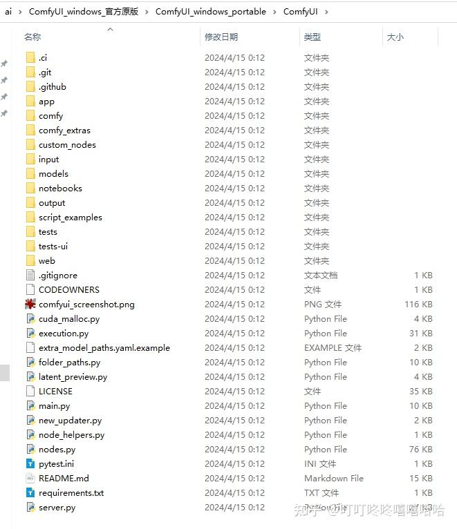
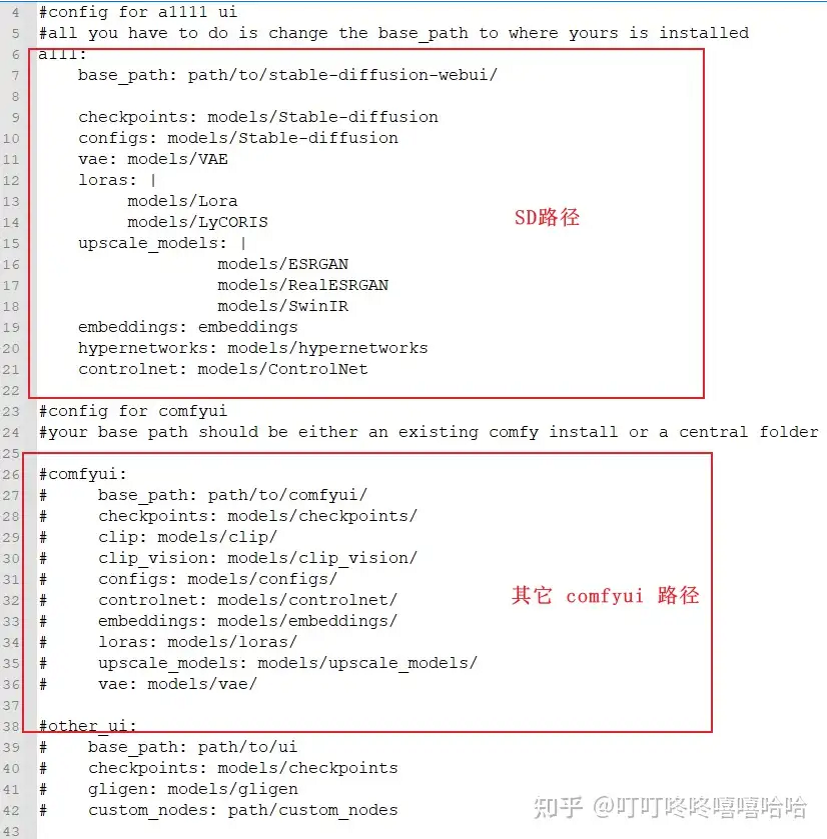
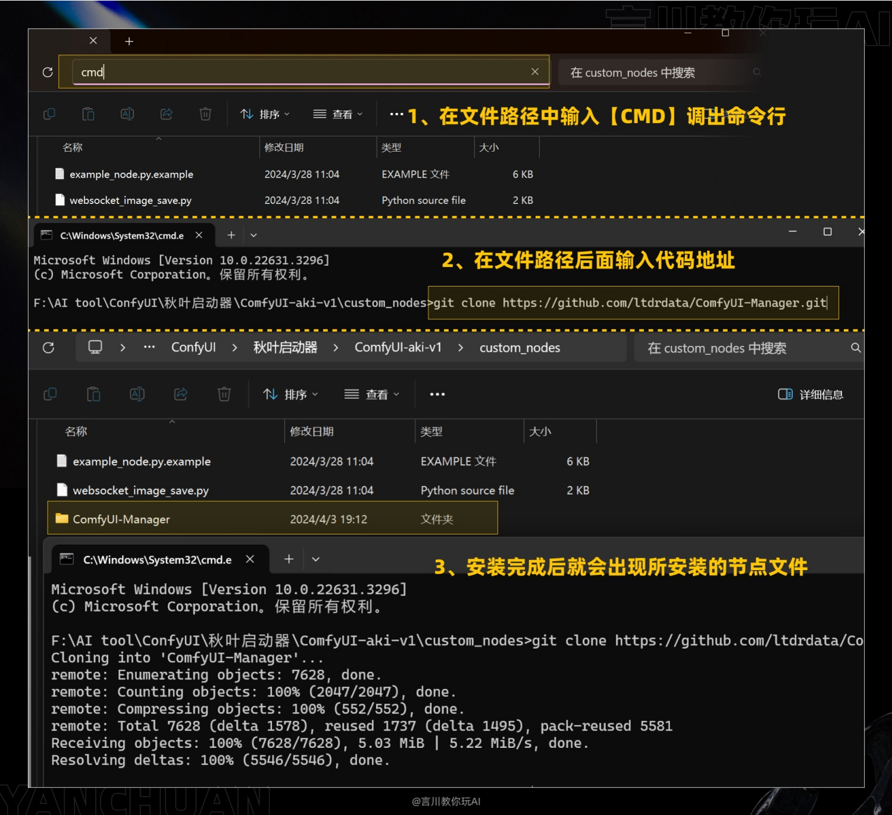
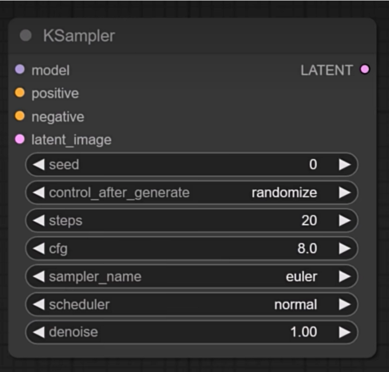
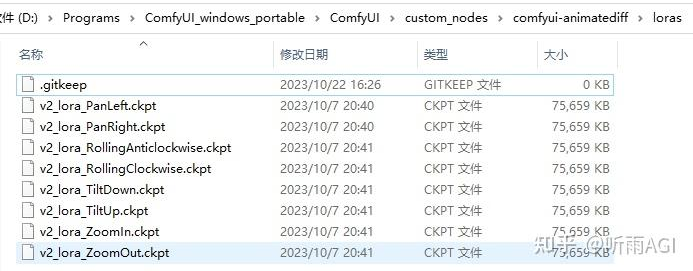
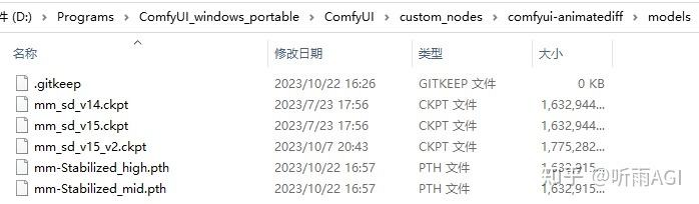
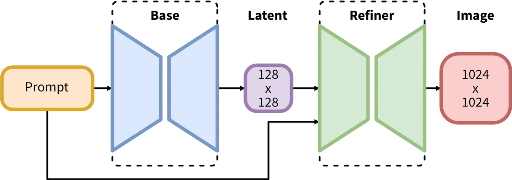

<a style="position: fixed;top:100px;left:-20px;" href="#top">回到顶部</a>

- [文生视频知识点梳理](#文生视频知识点梳理)
- [安装和部署](#安装和部署)
  - [硬件要求](#硬件要求)
  - [云平台硬件计费说明](#云平台硬件计费说明)
  - [阿里云部署参考文档](#阿里云部署参考文档)
  - [文件结构](#文件结构)
  - [典型文件的位置](#典型文件的位置)
  - [自定义模型文件的位置](#自定义模型文件的位置)
  - [SD3下载](#sd3下载)
  - [模型插件管理器 ComfyUI Manager](#模型插件管理器-comfyui-manager)
- [常见节点的输入、输出、参数说明](#常见节点的输入输出参数说明)
  - [KSampler 采样器节点](#ksampler-采样器节点)
  - [VAE Decode](#vae-decode)
  - [加载器（效率）](#加载器效率)
  - [K采样器（效率）](#k采样器效率)
  - [LoRA堆](#lora堆)
- [AnimateDiff](#animatediff)
- [SDXL 组成](#sdxl-组成)
- [ControlNet](#controlnet)
- [ControlNet简介](#controlnet简介)
- [Adapter](#adapter)
  - [T2I adpter](#t2i-adpter)
  - [IP Adapter](#ip-adapter)
  - [IP Adapter 的功能分类](#ip-adapter-的功能分类)
  - [ViT-H 和ViT-G](#vit-h-和vit-g)
- [ComfyUI简介](#comfyui简介)
- [ComfyUI的默认工作流](#comfyui的默认工作流)

##   文生视频知识点梳理

-  部署
    -  本地
    -  云端
    -  在线网站
-  ControlNet
    -  风格转移
    -  骨架
    -  语义分割
    -  草绘生图
    -  inpain
    -  openpose骨架
-  LoRA
-  工作流的使用、分享、格式分析
-  局部细节修复
-  图片放大
-  SR、CCSR、APISR
-  AnimateDiff
-  Segment Anything
-  TensorRT
-  Adapter
-  Deforum
-  Reactor 换脸
-  SVD AI视频
-  应用
    -  换脸
    -  换衣服
    -  静图变动图
    -  目标跟踪
    -  语义分割

##  安装和部署

要用到的模型： checkpoint主模型、VAE模型、 ControlNet模型、Lora、Embedding、Hypernetwork ，需要一个超大存储空间。

### 硬件要求

硬件  | 要求
|---|---|
GPU | 4060Ti以上
GPU存储（显存）|最低4GB，流畅运行推荐8GB
CPU | 要求较低，Intel10代i3以上就可以
CPU存储（内存）|最低16GB，推荐32GB

###  云平台硬件计费说明

硬件|计费说明
|---|---|
GPU+显存| 依据GPU的性能，每GB每秒
CPU+内存| 依据CPU的性能，每GB每秒

费用举例：

###  阿里云部署参考文档

[函数计算部署](https://help.aliyun.com/zh/functioncompute/deploying-comfyui-through-function-computation-to-implement-an-aigc-image-generation-system)

[PAI-EAS部署](https://help.aliyun.com/zh/pai/user-guide/use-comfyui-to-deploy-an-ai-video-generation-model-service)

###  文件结构

根目录下的四个文件（夹）的作用如下：
-  ComfyUI ： 最关键的文件夹，存放着所有模型、节点。包括checkpoint大模型、LoRA模型、ControlNet模型等。
-  run_cpu.bat ： 用CPU运行
-  run_nvidia_gpu.bat ： 用GPU运行
-  update： 版本升级

###  典型文件的位置

位置  | 作用
|---|---|
模型文件|ComfyUI/models
自定义节点  | ComfyUI\custom_nodes\
基础模型（大模型）| ComfyUI/models/checkpoints
VAE | ComfyUI/models/vae 
LoRA模型 |  ComfyUI\models\loras

###  自定义模型文件的位置

除了默认位置外，还可以自定义位置，在 ` ComfyUI\extra_model_paths.yaml ` 文件中更改。

###  SD3下载

https://pan.baidu.com/s/1Su7BzC9GQ1uD_YgCVVpruQ?pwd=tfue

###  模型插件管理器 ComfyUI Manager 

下载 https://github.com/ltdrdata/ComfyUI-Manager ，解压到 ` ComfyUI\custom_nodes\ ` 中。

有两种方式。第一种是使用git clone。

第二种是直接下载zip包再解压。

##  常见节点的输入、输出、参数说明 

###  KSampler 采样器节点

|参数	|	作用|
|---	|	---|
model	|	指定大模型
positive	|	正向提示词
negative	|	反向提示词
latent_image	|	是一个空的图像空间，用于在其中存储生成的图片数据，它来自于Empty Latent Image节点，这个节点提供指定宽高和数量的空图像空间。之所以用Latent这个词，是因为采样产生的图像数据还不是真正的图像格式，是一种图片数据的压缩格式，称为潜空间图像。
seed	|	图片生成的种子，每次使用不同的种子就会引入不同的随机特征，同样的参数就可以生成主题相同但变化的图像。使用完全相同的参数和种子将生成完全相同的图像。
control_after_generate	|	运行后操作，里面有四个选项：固定、增加、减少、随机。一般我们就使用固定或随机即可。
steps	|	迭代步数，一般设置30-40左右。
cfg	|	提示词相关性。参数越大，图片效果越接近提示词。参数越小，AI 发挥空间越大。默认为8，一般设置为10比较好。
sampler_name	|	采样器，反向扩散时去除噪音的方法，不同的方法对速度和质量会有不同的影响。默认选择的是euler，兼顾了生成图片的质量和速度，质量要求高时推荐选择dpmpp类的采样器。
scheduler	|	采样调度器。控制在整个采样过程的时间线上每一步降噪的幅度。如果对默认的调度器不满意，可以试试Karras，它可以让生成获得更高的采样效率和图片质量。
denoise	|	去噪幅度，最大1.0。越高的值代表初识噪音保留的越少，图像特征越清晰；越低的值代表初识噪音保留的较多，图像更抽象或者有某种艺术效果。生成图片时要一起考虑提示词、图像尺寸、采样策略等因素的影响。

### VAE Decode

采样器生成的图片数据是一种特殊的压缩格式，和真正的图片数据格式不同，要获取真正的图片数据，还需要VAE解码。

VAE解码需要使用一个VAE模型，VAE模型一般包含在SD基础模型中，也可以使用单独的VAE模型。

### 加载器（效率）

-  输入： LoRA堆、ControlNet堆
-  输出： 模型、正面、负面、Latent、VAE、Clip、
-  参数： CKPT模型名称、VAE、Clip Skip、LoRA、正面、反面提、宽度、高度、批次大小

### K采样器（效率）
-  输入： 模型、正面、负面、Latent、VAE、脚本
-  输出： 模型、正面、负面、Latent、VAE、图像
-  参数： 随机种子、步数、CFG、采样器、调度器

### LoRA堆
-  输入： 
-  输出： 
-  参数： 输入模式、LoRA数量、LoRA1、LoRA1的权重、LoRA2、LoRA2的权重、......

##  AnimateDiff

## SDXL 组成

SDXL Base模型由U-Net、VAE以及CLIP Text Encoder（两个）三个模块组成，在FP16精度下Base模型大小6.94G（FP32：13.88G），其中U-Net占5.14G、VAE模型占167M以及两个CLIP Text Encoder一大一小（OpenCLIP ViT-bigG和OpenAI CLIP ViT-L）分别是1.39G和246M。

SDXL Refiner模型同样由U-Net、VAE和CLIP Text Encoder（一个）三个模块组成，在FP16精度下Refiner模型大小6.08G，其中U-Net占4.52G、VAE模型占167M（与Base模型共用）以及CLIP Text Encoder模型（OpenCLIP ViT-bigG）大小1.39G（与Base模型共用）。

Base的作用是生成图像的Latent特征，Refiner的作用是小噪声去除和细节质量提升。

SDXL Base 地址： https://hf-mirror.com/stabilityai/stable-diffusion-xl-base-1.0/resolve/main/sd_xl_base_1.0.safetensors

SDXL Refinery 地址： https://hf-mirror.com/stabilityai/stable-diffusion-xl-refiner-1.0/resolve/main/sd_xl_refiner_1.0.safetensors

Stable Diffusion XL模型放到ComfyUI/models/checkpoints/路径下。

总之，base加refiner比单独的base好，SD XL 比SD好。

##  ControlNet

## ControlNet简介

通过你手上已有的图而不是咒语，实现对AI绘图的控制。比如通过线稿生成图片、风格迁移。

可以认为是大模型的插件，增强文生图的功能，生成更符合期望的图片。

## Adapter

Adapter ，就是将一张图像的风格，迁移到另一张图像上去。通俗的讲，就是垫图。

### T2I adpter

T2I  adapter 比ControlNet轻量，模型文件只有300M左右。T2I 给输入图片追加一定的条件，比如姿势图、草图、深度图，这样图片根据条件生成新图。

###  IP Adapter

IP adapter 根据参考图控制图像的生成。输入一张参考图和限定文字，可以生成符合文字要求的新图。输入一张参考图和另一张图片，可以生成基于参考图且叠加另一种图片要素的新图。

IP Adapter 中的“IP”不是网络中的IP，这里的“I”指的是Image（图片），“P”指的是Prompt（提示词）。所以，IP Adapter的直译是“图像提示适配器”。

IP adapter 只有22M参数，比ControlNet和T2I更加轻量。

下载完后需要放在 /ComfyUI/models/ipadapter 目录下

按照推出的先后时间是： ControlNet ->  T2I Adapter ->  IP Adapter 。

###  IP Adapter 的功能分类

-  clip ：将参考图整体看作提示。
-  face_id： 将人物面部特征作为提示。

其中，face_id又分为两个版本：
-  face_id
-  face_id_plus
-  face_id_plusV2： 改进版，效果最好。

###   ViT-H 和ViT-G

这两个都是图像编码器，SDXL默认使用Vit-G，SD1.5默认使用ViT-H。

例如ip-adapter-clip-sdxl这个模型，只标明了SDXL，没标明图像编码器，那么默认就是ViT-G。而ip-adapter_clip_sdxl_plus_vith则表示sdxl基础模型搭配ViT-H图像编码器。

##  ComfyUI简介

ComfyUI是基于Stable Diffusion 开源绘画大模型的节点可视化工具。comfy，英文释义是轻松的，这表明作者希望用户更轻松的使用Stable Diffusion。与之前的Web UI不同，ComfyUI不使用输入框，而是使用节点工作流，可控制的参数更多，可以更自由的实现各种效果。

ComfyUI的Github地址：   https://github.com/comfyanonymous/ComfyUI

ComfyUI相比WebUI的优点是： 生成性能高、 节点式界面更直观、 丰富的自定义节点、 丰富的社区生态

##  ComfyUI的默认工作流

ComfyUI的默认工作流如下，更复杂的工作流都是基于这个默认工作流进行自定义和扩展的。

