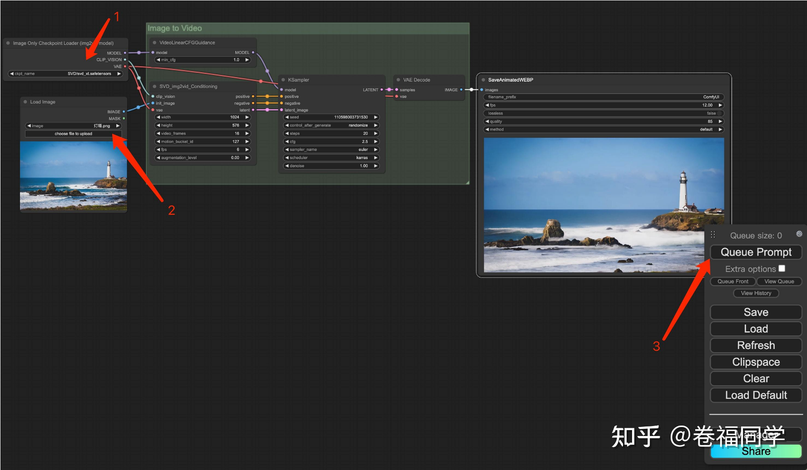

##  Sora

### Sora简介

Sora 由OpenAI发布于2024年2月份，一经发布就轰动了世界。

Sora是一种文生视频大模型，但OpenAI的野心不止于此，官网的副标题是“Word Simulator（世界模拟器）”。因为Sora在使用大量的视频训练的过程中，学习到了客观世界的物理规律，例如行走、自由落体、视角变换、近大远小等。

###  Sora有望推动机器人的发展

Sora推出之所以轰动，不是因为它是文生视频，而是因为它通过观看大量的视频，理解了真实世界的物理规律。这就是“涌现”能力，除了文生视频带动视频相关行业的颠覆，还有两个更重要的价值： 通过AGI的途径之一（多种模态）、 直接用在机器人上。

## SVD

###  Stable Video Diffusion简介

Stable Video Diffusion，简称SVD，由StabilityAI发布于2023年11月，开源，能够生成帧率 14、分辨率 576x1024 的视频。

SVD-XT是SVD 的微调升级版，分辨率不变，但能够生成帧率 25 的视频；

###  SVD的训练过程

先搜集了5.8亿个视频剪辑。经过层层筛选，最后保留了1.5亿个视频片段的超高质量数据集。

SVD的训练分为三个主要步骤： 文生图预训练、 视频生成预训练、 高质量视频微调。

## SVD配合ComfyUI 

