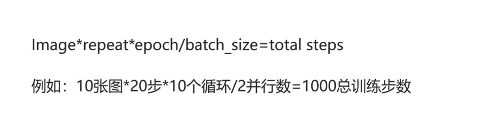

##  AI绘画的应用场景

-  人物
   -  换脸
   -  换装
   -  换姿势
   -  换表情
-  抠图
-  局部重绘
-  放大
-  换背景
-  换颜色

##  Stable Diffusion

###  SD的发布时间

1.0发布于2022年9月，2.0发布于2022年11月，3.0发布于2024年5月。

### SDXL简介

SDXL 就是 SD 的升级版，图片生成的效果更好、更逼真、分辨率更高。

### SD的主要原理

将输入（文本或图片）向量化 ——>    通过VAE压缩到Latent隐空间 ——>  在隐空间中多次去噪 ——> 通过VAE解码还原到像素空间

###   从 U-Net 到Transformer 

由于自注意力的可扩展性、强大的性能，扩散模型背后的骨干网络，已经由U-Net替换成了Transformer架构。Transformer 已然完成了深度学习领域的大一统。

### 隐空间的作用

隐空间通俗来说将图片数据量压缩，这样便于提升训练和推理的性能。类似于视频帧的压缩。

###  SD应用的主要文件夹

重点关注几个文件夹： checkpoint 大模型文件夹 、 embeddings 向量化、Lora微调、VAE变分自编码器、 ControlNet插件、Custom Nodes 自定义节点

## LoRA训练

###   repeat、epoch、batch_size的区别

###  学习率 

学习率类似于车速。学习率过高，学的太快，囫囵吞枣，可能会过拟合。学习率太低，可以更好看清路上的风景，也就是AI可以更细致的去学习，但是可能会导致不拟合，也就是出图完全不像，学的太慢了，并且花费的时间更多。

学习率默认值1e-4，即0.0001。

###  打tag

**如果是希望灵活调整的特征，都必须把tag打清楚**。如果是固化在模型里面的特征，都不要去打tag。例如，如果希望头发颜色可以自定义，则必须写明 red hair ，如果不写明，将来AI会认为“人类的头发就是红色的”，将来所有生成的图片都将是红色头发。

##  提示词

###  权重语法

SD权重语法汇总如下：

语法	|	说明
---	|	---
`prompt`	|	没有任何符号，默认情况，1倍的权重
`(prompt)`	|	增加权重，1层为1.1倍，2层为1.21倍，3层为1.331倍
`(prompt: x)`	|	自定义权重，x最好控制在0.4~1.6之间。太小容易被忽视，太大容易拟合图像出错
`[prompt]` | 降低权重。1层中括号为0.9倍，3层中括号为0.729倍
`{prompt}` | 轻微增加权重。1层花括号为1.05倍，三层大括号为1.15倍
`[prompt1 and prompt2]`	|	prompt1和prompt2的混合，例如`[hot and dog]`表示在火中的狗
`[prompt1_prompt2]`	|	组合语法。比如`[coffee_cake]`表示咖啡蛋糕，既不是生成咖啡，也不是生成蛋糕。
`[prompt:0.8]`	|	在80%时刻才开始生成prompt，前面的时间跟该prompt无关
`[prompt::0.8]`	|	前80%时间段生成prompt，后面的时间跟该prompt无关
`[prompt1:prompt2:0.8]`	|	前80%的时间渲染prompt1，后20%的时间渲染prompt2
`[prompt1 \| prompt2 \| prompt3] `	|	循环往复，交替采样。如果你想把两种，将多种东西融合成一种，比如颜色渐变。
`[prompt1 break prompt2] `|在两个提示词中间写上“break”，作用就是把两个词完全隔离开，避免提示词之间的污染。
`prompt1 AND prompt2` | 组合提示词，AND必须大写。例如，如果想要头发又有紫色又有绿色，则 purple hair AND green hair。

