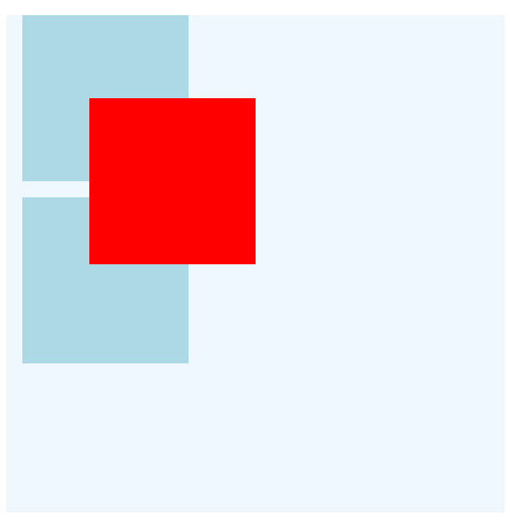
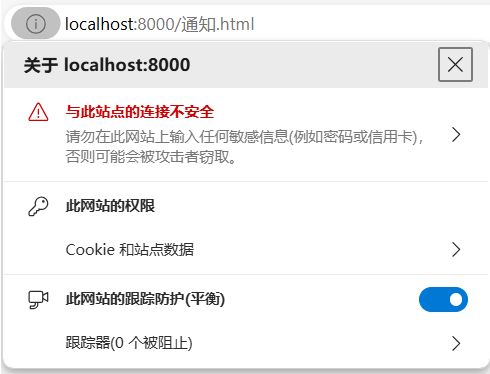

<p id="top" style="font-size:48px;color:green; font-weight:bolder;">Front-end</p>

<p><a href="#top" style="position:fixed;bottom:0px;">回到顶部</a></p>

目录：
- [基础](#基础)
  - [JavaScript的历史](#javascript的历史)
  - [JavaScript的组成](#javascript的组成)
  - [ES6标准](#es6标准)
  - [ES6的新增特性](#es6的新增特性)
  - [原始值和引用值](#原始值和引用值)
  - [typeof 操作符](#typeof-操作符)
  - [布尔类型](#布尔类型)
  - [可选链](#可选链)
  - [数值类型](#数值类型)
  - [原始值的相等判定](#原始值的相等判定)
  - [引用值的相等判定](#引用值的相等判定)
- [字符串](#字符串)
    - [字符串简介](#字符串简介)
    - [字符串的不可变性](#字符串的不可变性)
    - [字符串的长度](#字符串的长度)
    - [原始值引用类型](#原始值引用类型)
    - [大小写转换](#大小写转换)
    - [indexOf()和lastIndexOf()方法](#indexof和lastindexof方法)
    - [includes()方法](#includes方法)
    - [startWith()和endsWith()方法](#startwith和endswith方法)
    - [去除字符串的首尾空格](#去除字符串的首尾空格)
    - [重复字符串](#重复字符串)
    - [padStart()和padEnd()方法](#padstart和padend方法)
    - [slice()、substring()和substr()方法](#slicesubstring和substr方法)
    - [阻止反斜杠转义](#阻止反斜杠转义)
    - [字符串模板字面量](#字符串模板字面量)
- [JSON](#json)
  - [JSON语法](#json语法)
  - [JSON与JavaScript对象的区别](#json与javascript对象的区别)
  - [将对象转换为JSON](#将对象转换为json)
  - [将JSON序列化为对象](#将json序列化为对象)
  - [JSON不是对象，而是字符串](#json不是对象而是字符串)
- [数组](#数组)
    - [新建数组](#新建数组)
    - [数组的长度](#数组的长度)
    - [数组的拖尾逗号](#数组的拖尾逗号)
    - [数组的本质也是对象](#数组的本质也是对象)
    - [数组的迭代](#数组的迭代)
    - [数组的归并](#数组的归并)
    - [数组的at()方法](#数组的at方法)
    - [数组的concat()方法](#数组的concat方法)
    - [数组的fill()方法](#数组的fill方法)
    - [数组的flat()方法](#数组的flat方法)
    - [数组的includes()方法](#数组的includes方法)
    - [数组的indexOf()和lastIndexOf()方法](#数组的indexof和lastindexof方法)
    - [数组的find()和findIndex()方法](#数组的find和findindex方法)
    - [数组的join()方法](#数组的join方法)
    - [数组的slice()方法](#数组的slice方法)
    - [数组的splice()方法](#数组的splice方法)
    - [在数组首尾插入删除元素](#在数组首尾插入删除元素)
    - [数组元素的默认值](#数组元素的默认值)
    - [数组元素的排序](#数组元素的排序)
- [原型链](#原型链)
- [代理](#代理)
  - [代理](#代理-1)
  - [创建空代理](#创建空代理)
  - [get()捕获器、set()捕获器和反射API](#get捕获器set捕获器和反射api)
- [迭代器和生成器](#迭代器和生成器)
  - [可迭代对象](#可迭代对象)
  - [从可迭代对象创建迭代器](#从可迭代对象创建迭代器)
  - [生成器](#生成器)
  - [可迭代对象的forEach()方法](#可迭代对象的foreach方法)
- [对象](#对象)
    - [新建对象实例](#新建对象实例)
    - [对象的简写属性](#对象的简写属性)
    - [对象的可计算属性](#对象的可计算属性)
    - [对象的枚举](#对象的枚举)
    - [对象的属性名和属性值](#对象的属性名和属性值)
    - [对象的属性特性](#对象的属性特性)
    - [对象的数据属性](#对象的数据属性)
    - [对象的属性的特性使用](#对象的属性的特性使用)
    - [对象的访问器属性](#对象的访问器属性)
    - [对象的拖尾逗号](#对象的拖尾逗号)
    - [对象的for in方法](#对象的for-in方法)
    - [对象的toString()方法](#对象的tostring方法)
    - [对象的valueOf()方法](#对象的valueof方法)
    - [对象方法的简写](#对象方法的简写)
    - [对象属性的读取和赋值](#对象属性的读取和赋值)
    - [对象属性名的简写](#对象属性名的简写)
    - [使用Object.assign()合并对象](#使用objectassign合并对象)
    - [使用三点操作符合并对象](#使用三点操作符合并对象)
- [Map和Set](#map和set)
    - [Map类型基础](#map类型基础)
    - [Map到数组的转换](#map到数组的转换)
    - [Map的方法](#map的方法)
    - [Set类型](#set类型)
- [函数](#函数)
    - [箭头函数](#箭头函数)
    - [立执行函数](#立执行函数)
    - [默认参数值](#默认参数值)
    - [函数的arguments对象](#函数的arguments对象)
    - [函数内部的this对象](#函数内部的this对象)
    - [参数收集和参数扩展](#参数收集和参数扩展)
    - [函数的call()和apply()方法](#函数的call和apply方法)
    - [函数的暂时性死区](#函数的暂时性死区)
- [类和实例](#类和实例)
    - [新建类](#新建类)
    - [静态成员](#静态成员)
    - [私有属性](#私有属性)
    - [属性默认值](#属性默认值)
- [期约和异步](#期约和异步)
  - [期约](#期约)
  - [async](#async)
  - [期约的实例方法和期约链](#期约的实例方法和期约链)
  - [顶层await](#顶层await)
- [正则表达式](#正则表达式)
    - [正则表达式常用符号汇总](#正则表达式常用符号汇总)
    - [分组、前瞻和后顾](#分组前瞻和后顾)
- [DOM](#dom)
  - [窗口尺寸](#窗口尺寸)
  - [窗口事件](#窗口事件)
  - [使用document获取元素对象](#使用document获取元素对象)
    - [预置元素](#预置元素)
    - [document.querySelector()](#documentqueryselector)
    - [document.querySelectorAll()](#documentqueryselectorall)
    - [document.getElementById()](#documentgetelementbyid)
    - [document.getElementsByTagName()](#documentgetelementsbytagname)
    - [getElementsByClassName()](#getelementsbyclassname)
  - [使用innerHTML属性设置元素内容](#使用innerhtml属性设置元素内容)
  - [添加元素](#添加元素)
  - [复制元素](#复制元素)
  - [删除元素](#删除元素)
  - [元素、节点的区别](#元素节点的区别)
  - [节点属性](#节点属性)
- [CSS](#css)
- [样式优先级](#样式优先级)
- [选择器](#选择器)
- [文字样式](#文字样式)
  - [单个文字样式](#单个文字样式)
    - [文本颜色](#文本颜色)
    - [字体](#字体)
    - [字号](#字号)
    - [字重（加粗）](#字重加粗)
    - [倾斜](#倾斜)
    - [文本阴影](#文本阴影)
    - [文字前缀](#文字前缀)
  - [段落样式](#段落样式)
    - [首行缩进：text-indent](#首行缩进text-indent)
    - [文本对齐：text-align](#文本对齐text-align)
    - [行间距：line-height](#行间距line-height)
    - [单词间距：word-spacing、 字符间距：letter-spacing](#单词间距word-spacing-字符间距letter-spacing)
    - [段落中的空格和空行](#段落中的空格和空行)
    - [文字渐变](#文字渐变)
- [背景、边框、轮廓](#背景边框轮廓)
  - [背景](#背景)
    - [背景颜色](#背景颜色)
    - [背景图片](#背景图片)
    - [背景图片固定](#背景图片固定)
    - [背景图片尺寸](#背景图片尺寸)
  - [边框](#边框)
    - [边框样式](#边框样式)
    - [边框宽度](#边框宽度)
    - [边框颜色](#边框颜色)
    - [单独各边](#单独各边)
    - [合并样式](#合并样式)
    - [快速设置四边框数值](#快速设置四边框数值)
    - [边框汇总](#边框汇总)
    - [圆角边框](#圆角边框)
  - [轮廓](#轮廓)
- [媒体查询](#媒体查询)
- [特效](#特效)
  - [线性渐变](#线性渐变)
  - [过渡](#过渡)
  - [动画](#动画)
    - [定义动画](#定义动画)
    - [动画的组合](#动画的组合)
  - [图片阴影](#图片阴影)
  - [利用border-radius属性实现裁剪](#利用border-radius属性实现裁剪)
  - [块阴影box-shadow](#块阴影box-shadow)
- [Node.js](#nodejs)
  - [文件处理](#文件处理)
    - [引入fs模块](#引入fs模块)
    - [读取文本文件](#读取文本文件)
    - [写入文本文件](#写入文本文件)
    - [追加文本文件](#追加文本文件)
    - [复制文件](#复制文件)
    - [删除文件](#删除文件)
    - [重命名文件](#重命名文件)
    - [移动文件](#移动文件)
    - [创建和删除目录](#创建和删除目录)
    - [检查文件或目录是否存在](#检查文件或目录是否存在)
  - [路径处理](#路径处理)
    - [引入path模块](#引入path模块)
    - [内置路径](#内置路径)
    - [路径提取](#路径提取)
    - [合并路径](#合并路径)
    - [解析路径：normalize()、resolve()](#解析路径normalizeresolve)
  - [模块导出与导入](#模块导出与导入)
    - [CommanJS模块语法](#commanjs模块语法)
    - [ESM模块语法](#esm模块语法)
  - [HTTP模块](#http模块)
    - [HTTP服务端实现：使用Node.js http模块](#http服务端实现使用nodejs-http模块)
    - [HTTP服务端实现：使用express库](#http服务端实现使用express库)
    - [HTTP客户端实现：使用Fetch](#http客户端实现使用fetch)
  - [npm的使用](#npm的使用)
- [Next.js](#nextjs)
  - [动态路由](#动态路由)
- [React Native](#react-native)
  - [Android项目配置文件——AndroidManifest.xml](#android项目配置文件androidmanifestxml)
    - [Android项目源码结构](#android项目源码结构)
    - [mainfest节点](#mainfest节点)
    - [application节点](#application节点)
    - [XML文件中的变量说明](#xml文件中的变量说明)
    - [activity节点](#activity节点)
    - [user-permission节点](#user-permission节点)
  - [React Native项目所有依赖文件的使用说明](#react-native项目所有依赖文件的使用说明)
  - [为安卓apk签名](#为安卓apk签名)
  - [安卓开发环境的配置](#安卓开发环境的配置)
    - [Android SDK的安装和配置](#android-sdk的安装和配置)
    - [JDK的安装和配置](#jdk的安装和配置)
    - [安卓手机的有线调试和无线调试](#安卓手机的有线调试和无线调试)
    - [adb命令的使用](#adb命令的使用)
    - [Gradle的配置和使用](#gradle的配置和使用)
- [定位](#定位)
    - [相对定位](#相对定位)
    - [绝对定位](#绝对定位)
    - [固定定位](#固定定位)
    - [粘滞定位](#粘滞定位)
- [浮动](#浮动)
- [Electron](#electron)
  - [Electron入门](#electron入门)
    - [安装](#安装)
    - [main.js文件](#mainjs文件)
    - [index.html文件](#indexhtml文件)
    - [Preload.js文件](#preloadjs文件)
    - [启动应用](#启动应用)
  - [渲染器进程向主进程发送消息](#渲染器进程向主进程发送消息)
  - [新建窗口](#新建窗口)
    - [新建基本窗口](#新建基本窗口)
    - [新建窗口的详细配置](#新建窗口的详细配置)
  - [主进程监听消息](#主进程监听消息)
- [WebSocket](#websocket)
  - [HTTP协议的问题](#http协议的问题)
  - [WebSocket服务端：Node.js ws模块实现](#websocket服务端nodejs-ws模块实现)
  - [WebSocket客户端：浏览器实现](#websocket客户端浏览器实现)
- [Socket](#socket)
  - [Socket通信](#socket通信)
    - [Socket服务端：Node.js net 模块实现](#socket服务端nodejs-net-模块实现)
    - [Socket客户端：Node.js net模块实现](#socket客户端nodejs-net模块实现)
- [Web API](#web-api)
  - [位置](#位置)
  - [桌面通知](#桌面通知)
  - [Local Storage](#local-storage)
  - [postMessage()](#postmessage)
  - [自定义事件](#自定义事件)
  - [Style API](#style-api)
  - [URL API](#url-api)
  - [定时器API](#定时器api)
    - [setTimeout()](#settimeout)
    - [setInterval()](#setinterval)
    - [requestAnimationFrame()](#requestanimationframe)
  - [Flie System API：浏览器读写本地文件](#flie-system-api浏览器读写本地文件)
- [React](#react)
  - [React 基础](#react-基础)
    - [在HTML页面中直接引入React](#在html页面中直接引入react)
    - [新建并启动React项目](#新建并启动react项目)
    - [控制样式](#控制样式)
    - [使用 React 实现表单双向绑定](#使用-react-实现表单双向绑定)
  - [组件间通信](#组件间通信)
    - [父子组件间通过 Props 通信](#父子组件间通过-props-通信)
    - [任意组件间通过 Redux 通信](#任意组件间通过-redux-通信)
  - [React Hooks](#react-hooks)
    - [useState()](#usestate)
    - [useEffect()](#useeffect)
- [WebRTC](#webrtc)
  - [原理](#原理)
  - [SDP](#sdp)
  - [ICE Candidate（连接候选项）](#ice-candidate连接候选项)
  - [STUN服务器](#stun服务器)
  - [媒体协商](#媒体协商)
  - [获取媒体流](#获取媒体流)
  - [录制与下载](#录制与下载)

#  基础

##  JavaScript的历史

JavaScript问世于1995年，最初是用于控制浏览器页面行为的脚本语言，例如验证某个字段是否已经填写，或者测试输入值的合法性。后来，欧洲计算机制造商协会（Ecma）下属的TC39委员会发布了ECMA-262，作为ECMAScript的语言标准。1998年，ECMAScript被纳入国际标准。此后，各大浏览器厂商以ECMAScript标准为依据，分别实现了自己的JavaScript语言。时至今日，对ECMAScript支持最好的浏览器是Google Chrome和Microsoft Edge，这两个浏览器均使用了Chromium开源内核。Chromium基于Google开源的V8引擎。

除了作为浏览器的脚本语言，在2009年，Node.js问世。Node.js是一个基于Chrome V8引擎的JavaScript运行时。Node.js在语法上采用了JavaScript语言，同时带来了用于操作服务端的模块，例如：文件系统模块fs、操作系统模块os。Node.js将JavaScript的宿主环境从浏览器端带到了服务器端。

经过了27年的发展，如今的JavaScript已经成长为了最流行的语言之一，以及开发者们最喜爱的编程语言之一。

##  JavaScript的组成

一般而言，我们所说的Javascript指的是客户端Javascript，也就是浏览器中的Javascript脚本。但是，严格来讲，根据使用环境，我们将Javascript分为两类：

* __客户端Javascript__：在浏览器中运行的Javascript。

* __服务端Javascript__：可以访问本地操作系统的Javascript。比如最初的Node.js，以及近几年比较热门的Deno.js、Bun.js。


客户端JavaScript由ECMAScript、BOM、DOM三部分组成：

* __EcmaScript__：即ECMA-262定义的国际标准，定义了语法规则、数据类型、关键字、模块、全局对象等核心语言特性。

* __DOM__（Document Object Model）：文档对象模型，规定了JavaScript如何操作HTML元素。

* __BOM__（Browser Object Model）：浏览器对象模型，用于与浏览器窗口交互，例如页面导航、浏览历史、离线存储等。


以Node.js为例，其Javascript的组成分为如下几部分：

* __EcmaScript__：即ECMA-262定义的国际标准，定义了语法规则、数据类型、关键字、模块、全局对象、异步、代理等核心语言特性。

* __CommonJS__：用于访问本地操作系统的API，包含了大量开箱急用的模块，例如文件系统模块fs、操作系统模块os、Web服务器模块http等。


## ES6标准

ECMAScript 标准自2015年以来每年6月会发布一个新版本。ECMAScript 的某个特性从想法到最终的标准一般会经历stage0——stage4 五个阶段，分别是：strawman（最初想法）、proposal（提案）、draft（草案）、candidate（候选）、finished（完成）。一般而言，一个提案一旦进入草案阶段就很有可能会纳入最终的标准。

在以前，从标准的发布到浏览器厂商的支持又会经历很长的时间，这时可以使用polyfill框架用于实现浏览器暂不支持的特性。不过现在这种情况已经得到了好转，甚至对于很多特性，往往是浏览器厂商率先推出，而后TC39委员会将其作为标准纳入。

## ES6的新增特性

下面列出了自ECMAScript 2015 发布以来的新增特性：

* __ES6__：发行于2015年6月，新增了许多影响深远的特性：箭头函数、模块、迭代器、生成器、期约、反射、代理。ES6的发布对于JavaScript来说是一个里程碑事件，这是经典JavaScript和现代JavaScript的分水岭，奠定了JavaScript繁荣的基础。之后的ES版本也可以统称为“ES6”。

* __ES7__：发布于2016年6月，新增了指数操作符。

* __ES8__：发布于2017年6月，`async/await`、`Object.values()/keys()/entries()`、对象字面量拖尾逗号。async和await又是现代JavaScript发展史上另外一个极其重要的特性。

* __ES9__：发布于2018年6月，新增了`Promise finally()`、异步迭代、剩余和扩展属性。

* __ES10__：发布于2019年6月，新增了数组打平、字符串定长填充等特性。

* __ES11__：发布于2020年6月，新增了可选链、空位合并等特性。

* __ES12__：发布于2021年6月，新增了`Promise any()`、`String.prototype.replaceAll()`等特性。

* __ES13__：发布于2022年6月，新增了顶层`await`、`Array.prototype.at()`、class私有方法 / 静态方法等特性。

* __ES14__：发布于2023年6月，主要新增了数组的非破坏性方法，例如`Array.prototype.toReversed()`、`Array.prototype.toSorted()`等

##  原始值和引用值

Javascript的数据类型大体上分为两类：原始类型和引用类型。原始类型的数据值保存于栈中，引用类型的值保存于堆中，这是这两种类型最根本的区别，也决定了后续对这两种类型的赋值、修改、拷贝操作的不同。

原始类型保存于栈中，它是一种先进后出的数据结构，从管理角度来讲，它是由操作系统分配管理的，也就是说它是规整的，内存的大小在申请之后不会发生变化。因此，它不会出现碎片化，并且读取速度非常的快，因此基本的原始数据类型就非常适合存放于栈中。

原始数据类型分为如下几类，后面我们会一一详细讲到：
- 数值
- 字符串
- 布尔值
- null
- undefined
- Symbol

相比于栈的固定大小，堆的分配非常自由，它是由程序员自己去分配的，比如程序员考虑到某些情况需要更多的内存，它就可以在堆上面申请一个足够大的内存。除此之外，内存的分配非常自由，它并不要求是连续的内存，只要有空间，都可以被拿来分配。不过这样就会导致产生很多碎片，不利于高速读取，因此堆的操作的速度要比栈慢很多。堆主要存放的是大小不固定的内存结构，因此，对象、数组、结构体等引用类型经常被存放到堆上。

基于栈的存储特性，当我们为一个引用类型赋值时，本质上赋予的是一个指针，也叫内存地址，这才导致了声明方式和拷贝方式与原始类型的不同。

引用数据类型分为如下两个大类：基本引用类型、集合引用类型。

基本引用类型又分为：
* 原始值包装类型：包括Number、String、Boolean。
* 内置引用类型：包括Date、RegExp、Math等。

集合引用类型是我们经常使用的类型，分为：
* 对象（狭义的）
* 数组
* 集合（弱集合）
* 映射（弱映射）

##  typeof 操作符

由于Javascript的类型是松散的，不像静态语言那样需要事先声明，Javascript会根据数据值本身去推导数据类型，typeof操作符就是为此而生的。对一个值使用typeof操作符会返回如下字符串之一：

- "undefined" : 未定义的值
- "boolean" : 布尔值
- "string" : 字符串 
- "number" : 数值
- "object" : 表示值为对象(非函数)或null
- "function" : 表示值为函数
- "symbol" ：表示值为符号


##  布尔类型


布尔（英语：Boolean）是计算机科学中的逻辑数据类型，以发明布尔代数的数学家乔治·布尔为名。它是只有两种值的原始类型 : true和false。

下面这些值可以被显示或隐式地转换为true：

* 非空字符串，注意，`" "`中间有一个空格，也算非空。
* 任意对象，包括空对象
* 正负无穷大（ Infinity、- Infinity）
* 非零数值

下面这些值可以被显示或隐式地转换为false：

* 空字符串`""`
* NaN
* 数字0
* null
* undefined

可以使用`!!()`和`Boolean()`将其它形式的值显示地转换为布尔类型，以便于条件判断，前者是后者的简写形式。

来看下面的示例：

```js
// 下面这些值都视作true
Boolean(hello')  // => true
Boolean('  ')  // 非空字符串，空格也算非空
Boolean(5/0)  // 正负无穷大
Boolean({})   // 任意对象，包括空对象

// 下面这些值都视作false
Boolean('')   // =>false 空字符串
Boolean(0)   
Boolean(NaN)
Boolean(null)
Boolean(undefined)
```

在`if`语句中，不必显式地使用`!!()`，会自动隐式调用:

```js
const a=2
if (a){console.log(true)}   //=> true
let b
if (b){console.log(true)}
else {console.log(false)}   //=> false
```

## 可选链


如果对象obj不存在属性c，则obj.c返回undefined。而如果继续对obj.c读取属性，例如obj.c.d，则此时会报错，使用EcmaScript 2020新增的可选链(?.)特性， 可以解决这个报错的问题。如下示例：

```js
const obj = {a:1,b:2}
console.log(obj.c)  // undefined
console.log(obj.c.d)  // 报错，因为obj.c为undefined
console.log(obj?.c?.d)  // 存在属性则返回，不存在则会返回undefined，而不会报错 
```

可选链加强了程序的健壮性，无需开发者手动处理潜在的报错问题。

##  数值类型


数值类型是最常见的原始类型，包括整数、浮点数、无穷大（小）、NaN。

使用如下方式新建数值类型的变量：

```js
let num = 1     // 整数
let floatNum = 0.1   // 浮点数
let num=1.0  // 虽然跟了小数点，但依然会被处理成整数
```

NaN是一种特殊的数值，表示运算错误，但不会报错。Infinity表示无穷大，-Infinity表示无穷小，例如：

```js
console.log(0/0)   //=> NaN
console.log(5/0)   // => Infinity，很多语言会报错，但是这里为无穷大
console.log(5/-0)  // => -Infinity
```

有三种函数用于将其它形式的值转为数值，Number()是通用的，可将类似数值的字符串或单数值元素的数组转换为数组。parseInt()和parseFloat()用于将开头是数字而存在非数字的字符串提取成数值，例如：

```js
console.log(Number(true))  // 遇布尔值转为1或0
console.log(Number(null))  // 0
console.log(Number(undefined))  // NaN
console.log(Number('123'))           // =>123
console.log(Number('123 456'))    // => NaN
console.log(Number('123hello'))   // => NaN
console.log(Number(''))  //=>0
console.log(parseInt('123hello'))  //=> 123
console.log(parseFloat('1.23hello')) //=> 1.23
```

由于乘法运算和减法运算在碰到数值时会隐式调用Number()，因此可以使用此方法快速调用Number()，可以看作一种语法糖，例如：

```js
console.log(true * 1)    //=>1，等同于Number(true) 
console.log('123' * 2)   // => 246，等同于Number('123')
```


## 原始值的相等判定

JavaScript原始值的相等性判定有两种情况：严格相等、不严格相等。分别使用两个和三个等号。

这两种相等性判定的区别只有一个：

```
是否进行类型转换
```

用一个示例可以很好的进行说明：

```js
console.log(1==true)  // true ，进行了类型转换，true转换成了1，相等

console.log(1===true)  // false 不进行类型转换
```

## 引用值的相等判定

引用值的相等性判定不区分严格与否，两个和三个等号是等价的。引用值的相等判定只有一个依据：

```
比较两个引用值的指针是否指向同一处
```

例如，如下两个对象，虽然内容上看起来一样，但是它们实际的内容却存储在内存的不同地方，即指针的指向不一样，因此永远不会相等：

```js
const objA = {name:"bob"}
const objB = {name:"bob"}
console.log(objA==objB)  // false 
console.log(objA===objB)  // false 
```

由于对象使用等号拷贝值时，默认使用浅拷贝，即只拷贝指针，那么这两个对象的指针指向同一处，因此相等，如下示例：

```js
const objC = {name:"bob"}
objD = objC // 此时只拷贝了指针
console.log(objC==objD)  // true
console.log(objC===objD) // true
```


# 字符串


###  字符串简介


字符串类型表示零个或多个16为Unicode字符序列，可以用三种符号包裹：单引号、双引号和反引号（ES6新增）。

双引号和单引号在Javascript中没有区别，这是与其它语言不同的地方。但是，引号必须成对使用。

有些时候，需要嵌套使用引号，这时候需要将使用一种引号包裹另一种引号，以区分不同的部分，例如：

```js
eval("console.log("hello,world")") // 语法错误
eval("console.log('hello,world')") // 正确
```

### 字符串的不可变性

字符串是不可变的，意思是一旦创建，就不能改变，例如：

```js
let str = "hello,world"
str.replace("h","H")
console.log(str)  // hello,world
```

在上面的例子中，我们本意是像将字符串"hello,world"中的“h"替换为“H”，但事与愿违了，因为字符串是不能改变的。

### 字符串的长度

字符串的长度可以通过length()方法获得，例如：

```js
let str = "hello,world"
console.log(str.length)  // 11
```

### 原始值引用类型

读者可能会纳闷儿，字符串不是原始类型吗？为什么它可以像引用类型一样可以调用方法？

其实，数值、字符串、布尔值这三种原始类型比较特殊，可以被包装成原始值引用类型，调用一些方法，不过，这个过程是系统帮我们自动完成的。例如，当调用str.length()时，系统会先为str生成一个对应的引用类型，这个引用类型包含各种方法供str调用。


### 大小写转换

可以使用如下两种方法对字符串进行大小写转换。

```js
let str='Hello'
console.log(str.toLowercase())   // =>'hello'
console.log(str.toUpperCase())   // =>'HELLO'
```

### indexOf()和lastIndexOf()方法

可以使用indexOf()返回字符或子串在字符串中第一次出现的索引位置，lastIndexOf()方法类型，只是从字符串的末尾开始查找。

```js
let str = 'hello,world'
console.log(str.indexOf('o'))  //=>4
console.log(str.lastIndexOf('o')) //=>7
console.log(str.indexOf('wo')) //=>6
```

### includes()方法

可以使用includes()方法确认字符串是否包含某个字符或子串，例如：

```js
let str='hello,world'
console.log(str.includes('hello'))    //=>true
```

### startWith()和endsWith()方法

startWith()方法用于确认字符串是否以某个字符或子串开头，而endsWith()方法用于确认字符串是否以某个字符或子串结尾。例如：

```js
let str='hello,world'
console.log(str.startsWith('hello'))  //=> true
console.log(str.endsWith('world'))    //=>true
```

### 去除字符串的首尾空格

有三种方法去除字符串的首尾空格，如下所示：

```js
let str='  hello,world  '  // 首尾各有两个空格
console.log(str.trim())      //=>'hello,world'，同时去除首尾空格
console.log(str.trimLeft())  //=>'hello,world  '，只去除左边的空格
console.log(str.trimRight()) //=>'  hello,world'，只去除右边的空格
```

### 重复字符串

使用repeat()方法对字符串进行重复，例如：

```js
let str='hello'
console.log(str.repeat(3))  //=>'hellohellohello'
```

### padStart()和padEnd()方法

有时候需要保证字符串的长度是固定的，就需要在左右使用字符进行填充。

```js
let str='hello'
console.log(str.padStart(10))  //=> '     hello'，在左侧填充默认的5个空格
console.log(str.padEnd(10))    //=>'hello     '，在右侧填充5个空格
console.log(str.padStart(3))   //=>'hello'，长度足够，原样返回
console.log(str.padStart(10,',')) // =>',,,,,hello'，在左侧使用逗号填充
```

### slice()、substring()和substr()方法

要提取子字符串，有三种方法。slice()和substring()需要传入提取开始的位置和结束位置，而substr()需要传入开始位置和提取的字数量。

```js
let str='hello,world'
console.log(str.slice(4,7))  //=>'o,w' ，从索引4位置开始提取，到索引7位置之前结束（左闭右开原则）
console.log(str.slice(4))    //=> 'o,world'，从索引4位置开始提取，一直到结束
console.log(str.substr(4,3)) // =>'o,w'，从索引4位置开始提取，提取3个字符
```

### 阻止反斜杠转义

Windows平台下的路径字符串带有反斜杠，反斜杠在字符串中会进行转义，这并不是我们期待的现象。为了阻止转义，可以使用`String.raw` 函数，这个函数返回反引号中未经处理的文本，示例如下：

```js
// 反斜杠默认转义
const path1 = "D:\test"
console.log(path1)  // D:  est （\t表示一个Tab空格）

// 阻止转义

const path2 = String.raw`D:\test`
console.log(path2)  // D:\test
```


### 字符串模板字面量

模板字面量取代了早期和其它语言的`%d`、`%f`等写法，使得变量化的字符串更容易书写，也更易阅读。模板字符串使用反单引号包容，它有最主要的两个特点：保留了换行符等不可见字符（以往只能用`\n`）；提供了变量解析和运算。

```js
let str = `第一行 (这里按回车) 
第二行`
console.log(str)   // =>'第一行\n第二行'

let a=1
let b=2
console.log(`a的值是${a}`)  // =>'a的值是1'
console.log(`a+b的结果是${a+b}`)    // => 'a+b的结果是3'
```

虽然string类型是原始值，但是表现出像对象一样使用属性和方法。

```js
let str='hello'
console.log(str.length)  // =>5， 字符串的长度
console.log([...str])  //=>[ 'h', 'e', 'l', 'l', 'o' ] ，将字符串快速打平为数组
```


# JSON

JSON全称是JavaScript对象表示法，是通用的数据交换格式，许多软件的配置文件均使用JSON文件格式。

可以包括三种语法：
* 原始值
* 对象
* 数组

JSON无法包括如下的数据类型:
- 集合
- 映射

## JSON语法

JSON存在四组标记符号：
- 中括号`[]`表示数组
- 花括号`{}`表示键值对
- 引号包裹住键的名称和字符串类型的键值，键值为数字是不加引号。
- 逗号区分数组的各个元素和各个键值对

## JSON与JavaScript对象的区别

JSON的格式与JavaScript对象（包括数组）的字面量格式非常类似，使用时容易搞混，要注意几个区别：
- JSON的键必须使用引号包裹，而JavaScript对象的键可以用也可以不用引号包裹。
- JavaScript对象允许用双斜杠添加注释，而JSON不能添加任何注释。
- JavaScript允许使用拖尾逗号，而JSON不能使用，逗号只能放在元素之间，不能用在末尾。

## 将对象转换为JSON

要将对象转换为JSON字符串，使用JSON.stringify()方法，例如：

```js
const obj = {a:1, b:2, c:3}

const json = JSON.stringify(obj)  
console.log(json)   //  {"a":1,"b":2,"c":3}
```

可以在第二个参数中指定一个数组，表示筛选哪些属性进入JSON字符串：

```js
const obj = {a:1, b:2, c:3}

const json = JSON.stringify(obj,['a','c'])  
console.log(json)   //  {"a":1,"c":3}
```

## 将JSON序列化为对象

可以将JSON序列化为对象，使用JSON.parse()方法。例如：

```
const json = '{"a":1,"b":2,"c":3}'

const obj = JSON.parse(json)
console.log(obj)
```

再来看一个例子，从本地的配置文件中读取JSON字符串转化为对象，修改后保存回配置文件。
如下是配置文件settings.json的内容：

```JSON
{
	"a":1,
  	"b":2,
  	"c":3
}
```

如下读取配置文件并解析为对象，然后写回配置文件中：

```js
const fs = require('fs')

const json = fs.readFileSync('settings.json','utf8')
const obj = JSON.parse(json)  
console.log(obj)   // { a: 1, b: 2, c: 3 }

obj.a = 2
obj.c = 5
const json2 = JSON.stringify(obj)
fs.writeFileSync('settings.json',json2,'utf8')

```

## JSON不是对象，而是字符串

需要特别强调的是，JSON不是对象，而是字符串。许多人习惯称呼JSON格式为“JSON对象”，这种说法是错误的。JSON的本质就是字符串，可以使用typeof关键字验证：

```js
const obj = {a:1, b:2, c:3}
const json = JSON.stringify(obj)  
console.log(typeof json)  // string
```


# 数组


### 新建数组

有多种方式新建数组。

**使用Array()构造函数新建数组**

第一种方式是使用Array()构造函数，如下：

```js
const arr1 = new Array()  // 建立一个空数组

const arr2 = new Array(3)  // 建立一个包含3个元素的数组
```

**使用数组字面量新建数组**

第二种方式是使用数组字面量，外层用中括号(`[]`)包裹，数组元素之间用逗号隔开，如下：

```js
const arr1 = []  // 建立一个空数组
const arr2 = [1,2,3]  // 建立一个数组，包括3个元素
```

**使用Array.from()方法新建数组**

第三种方式是使用Array.from()静态方法，该方法接收一个可迭代对象，例如：

```js
const str = 'hello'  // 字符串是可迭代对象
const arr1 = Array.from(str) 
console.log(arr1)  // ['h','e','l','l','o']
const set = new Set(1,2,3)  // 集合是可迭代对象
const arr2 = Array.from(set)
console.log(arr2)  // [1,2,3]
```

**使用Array.of()方法新建数组**

第四种方式是使用Array.of()静态方法，该方法与Array.from()类似，区别是Array.of()接收若干个元素作为参数组成新数组的元素，例如：

```js
const arr = Array.of(1,2,3)
console.log(arr) // [1,2,3]
```

**使用三点运算符(…)新建数组**

第五种方式是使用三点运算符(...)，该方法可以看作是Array.from()方法的语法糖，接收一个可迭代对象，通常用于快速将字符串转化为数组，例如：

```js
const str = 'hello'
const arr = [...str]
console.log(arr)  // ['h','e','l','l','o']
```

当然，还有许多方法可以新建或返回新数组，比如:Object.keys()、Object.values()、Object.entries(),这将在后面会讲到。

### 数组的长度

数组的长度不是固定的，哪怕一开始指定数组的长度，其长度也是可以动态伸缩的。例如：

```js
const arr= new Array(3)
arr[3] = 1
console.log(arr) // 4
```


### 数组的拖尾逗号

有些时候，我们会看到数组元素的结尾也存在一个逗号，这种逗号叫做拖尾逗号，通常是为了在频繁地增减数组元素的时候同时保证语法的正确，拖尾逗号不占用数组的长度，例如：

```js
// 下面两种写法的结果是一样的
const arr1 = [1,2,3]
const arr2 = [1,2,3,]
console.log(arr1.length, arr2.length)  // 3  3
```


###  数组的本质也是对象


我们知道，数组的索引使用中括号，中括号里面是数字，表示元素的序号，从0开始，例如：

```js
const arr = [1,2,3]

console.log(arr[0])  // 1
```

这种中括号的访问方式类似于对象的属性访问。我们知道，对于是字面量的属性名称，对象属性的访问需要使用引号，将这种规则加到数组上试试：

```js
const arr = [1,2,3]

console.log(arr["0"])  // 1
```

依然能够找到第一个元素。

这就说明，数组的本质也是对象，只不过基于对象做了一些特殊处理，包括：
- 默认情况下，数组元素的属性名是整数，且从0开始整数递增。
- 数组不能使用点号语法访问元素值，例如arr.0是错误的。

既然属性的本质是对象，那么除了只能是数值的默认属性之外，也可以添加一些自定义属性，例如：

```js
const arr = [1,2,3]

arr['key1'] = 'hello'
arr['key2'] = 'world'

console.log(arr)   // [ 1, 2, 3, key1: 'hello', key2: 'world' ]
console.log(arr.key1)  // hello, 对象的点号访问语法
console.log(arr['key2'])  // world,  对象的中括号加引号访问语法
```

### 数组的迭代


数组有五个迭代函数，它们都接收一个函数作为参数，传入的函数接收三个参数：元素、索引位置、数组本身。这五个迭代函数分别是：
* **Array.prototype.map()**：返回对每个元素进行操作后的新数组。
* **Array.prototype.filter()**：返回回调函数返回值为true的元素组成的新数组。
* **Array.prototype.every()**：如果回调函数返回值均为true，则返回true，否则返回false。
* **Array.prototype.some()**：只要有一个或以上的回调函数返回值为true，则返回true，否则返回false。
* **Array.prototype.forEach()**：不返回新数组，而是直接在原来的数组上对每个元素执行回调函数定义的操作。

来看几个例子：

```js
const arr = [1, 2, 3, 4, 5, 6, 7, 8, 9 ]
const arr2 = arr.map((element,index,array)=>element*2)  
// 对每个元素乘以2，存储到新数组中，arr2=[2,4,6,8,10,12,14,16,18]

const arr3 = arr.filter((element,index,array)=>element > 5) 
// 找出大于5的值，存储到新数组中，arr3=[6,7,8,9]

const arr4=arr.every((element,index,array)=>element%2==0) 
// 所有元素都是偶数吗？显然不是，arr4 = false
const arr5=arr.some((element,index,array)=>element%2==0)  
// 存在元素是偶数吗？arr5=true

arr.forEach((element,index,array)=>element**2)  
// 直接修改原数组，对每个元素进行平方，arr=[1,4,9,16,25,36,49,64,81]
```


###  数组的归并


归并操作是对数组的元素进行叠加运算，例如累加或累积，涉及reduce()和reduceRight()，这两个方法的区别只是叠加运算的方向相反。

reduce()方法接收一个函数参数，这个函数与前面的函数参数有所不同，它期待4个参数：
* prev：叠加运算的初始值，默认为第一项
* cur：迭代的当前元素，第一次迭代为第二项
* index：索引位置
* array：数组本身

来看下面的示例——数组累加求和。

```js
const arr = [1, 2, 3, 4]
const result = arr.reduce( (prev, cur)=> prev + cur )
console.log(result)
```
该归并操作的细分步骤如下：

* 第一次归并：`prev=1，cur=2`
* 第二次归并：`prev = prev+cur=1+2=3，cur = 3`
* 第三次归并：`prev=prev+cur=3+3=6 ，cur=4`
* 第四次归并：`prev=prev+cur=6+4=10`


### 数组的at()方法

ES2019新增了`at()`方法，该方法可以从倒数第一位开始访问数组元素，以往我们要找到数组的最后一个元素，使用的是：

```js
const arr = [1,2,3]
console.log(arr[arr.length-1])  // 3
```

现在，有了`at()`方法，便可以非常方便地返回最后一个元素值:
```js
const arr = [1,2,3]
console.log(arr.at(-1))  // 3
```

通过索引返回元素，`at()`方法比中括号形式更加通用，因为`at()`可以接收一个正整数或负整数，正整数就是正序索引，等同于中括号形式`([])`,而负整数就是逆序索引，例如：

```js
const arr = [1,2,3]
console.log(arr.at(0))  // 1 , 等价于arr[0]
console.log(arr.at(-1))  // 3 , 返回倒数第一个元素值
console.log(arr.at(-2)) // 2 , 返回倒数第二个元素值
```


### 数组的concat()方法
使用concat()方法可以合并数组，返回有原数组和实参组成的新数组：

```js
const arr1 = [1, 2, 3]
const arr2 = [4, 5, 6]
const arr3 =arr1.concat(arr2)
console.log(arr3)  // [1,2,3,4,5,6]
```

当然，也可以使用扩展运算符更便捷的操作：

```js
cosnt arr1 = [1, 2, 3]
const arr2 = [4, 5, 6]
const arr3=[...arr1 , ...arr2 ]         
console.log(arr3)//[1,2,3,4,5,6]
```

需要特别注意的是，这两种方法只有在所有元素均为原始值的前提下，新数组与源数组是相互独立的。如果源数组中存在引用值元素，那么新数组与源数组同时关联着这些引用值元素。

这是由引用值自身的特性决定的，为了保险起见，建议只对所有元素都为原始值的数组使用这两种操作。


### 数组的fill()方法

数组的fill()可以让数组在指定的索引范围内填入相同的值，该方法接收三个参数： 要填充的值、起始索引(默认为0)、终止索引(默认为最后一个元素，可以用负整数表示倒数)。

fill()方法会修改源数组，来看下面的例子：

```js
const arr1 = [1,2,3,4,5,6]
const arr2=[...arr1]
const arr3=[...arr1]

arr1.fill(20)
console.log(arr1)
// [20,20,20,20,20,20]
// => 所有位置都填充为20

arr2.fill(20,2)
console.log(arr2)
// [1,2,20,20,20,20]
// 从第3个元素开始，一直到结尾

arr3.fill(20,1,-2)
// [1,20,20,20,5,6]
// 从第2个开始(包含)，到倒数第二个结束(不包含)
```


find()和findIndex()在找到第一个匹配的元素之后就不再往后迭代，因此，倘若要找到全部匹配的元素，则应该使用filter()方法。


### 数组的flat()方法

有些场景下，我们需要将具有嵌套结构的数组打平，ES2019新增了flat()方法用于数组的打平操作，例如：

```j
const arr1= [ 1, [2,3],4 ]
const arr2=arr.flat()
console.log(arr2)   //=>[1,2,3,4]
```

该方法还可以接收一个整数，表示打平的深度，默认情况下，打平一级嵌套，例如：

```js
const arr=[[[1]]]   // 三级嵌套
const arr1=arr.flat()  
console.log(arr1)    //=> [[1]]

const arr2=arr.flat(2)
console.log(arr2)  //=>[1]
```
  
注意，当打平深度高于嵌套层级时，永远只会返回一维数组：

```js
// const arr=[[[1]]]
const arr3=arr.flat(6)
console.log(arr)   //=>[1]
```

也就是说，打平的结果永远还是数组。


### 数组的includes()方法

仅仅是查看是否包含某个元素，可使用Array.prototype.includes()方法，该方法返回一个布尔值，例如：

```js
const arr = [1,2,3]
console.log(arr.includes(1)) // true
console.log(arr.includes(5)) // false
```


### 数组的indexOf()和lastIndexOf()方法

如果不仅要看是否包含某个元素，还要找出第一次出现的位置，则应该使用Array.prototype.indexOf()方法，如果能找到，则返回第一次出现的索引位置，如果没有，则返回-1。如果要返回最后一次出现的索引位置，则使用Array.prototype.lastIndexOf()，例如：

```js
cosnt arr = [1, 2, 3, 4, 2, 5]

const result1 = arr.indexOf(2)  // 第一次出现2的索引位置
console.log(result1)  // 1
const result2= arr.indexOf(6)  //第一次出现6的索引位置，没有找到
console.log(result2)  // -1

const result3 = arr.lastIndexOf(2)  // 最后一次出现2的索引位置
console.log(result3)  // 4
```

请注意indexOf()和lastIndexOf()只能找到第一次和最后一次出现的位置，如果需要将所有的位置都找到，则应该使用filter()方法。

### 数组的find()和findIndex()方法

上面的查找方法只能查看是否包含特定的元素，如果要查找符合某些要求的元素，则需要使用Array.prototype.find()和Array.prototype.findIndex()方法。find()方法返回第一个匹配的元素，findIndex()方法返回第一个匹配的元素的索引位置。

这两个方法都接收一个callback函数，该函数接收三个参数：元素、索引位置、数组本身。例如：

```js
const arr = [1, 2, 3, 4, 5, 6 ] 
const result1 = arr.find(item => item%2==0)  // 返回第一个偶数
console.log(result1)  // 2
const result2 = arr.findIndex(item => item%2==0)  // 返回第一个偶数的索引位置 
console.log(result2)  // 1
```


### 数组的join()方法

可以使用join()将数组元素用指定的符号拼接起来，再转换为字符串，例如：

```js
const arr = [1,2 ,3, 4 ]
const str = arr.join('&')
console.log(str)  // '1&2&3&4'
```

如果没有给定符号，则默认使用英文逗号拼接(,)，例如：

```js
const arr = [1,2 ,3, 4 ]
const str = arr.join()  // 等价于 arr.join('') 和 arr.join(',')
console.log(str)
```

注意，在开始拼接之前，每个元素会先隐式调用toString()方法转成字符串，然后用给定的符号拼接。例如：

```js
const arr = [1,2,{a:1},3]
const str = arr.join()
console.log(str) // '1,2,[object Object],3'
```

在上面的代码中，元素{a:1}是Object类型，任意Object类型使用toString()均会返回字符串`[object Object]`，所以会打印出上面的结果。


### 数组的slice()方法

数组实例的slice()用于返回一个子数组，也叫数组切片，该方法接收两个参数：
* 起点的索引位置(包含)
* 终点的索引位置(不包含)

例如：

```js
const arr1 = [1,2,3,4,5,6]
const arr2 = arr1.slice(1,3)
console.log(arr2)  // [2,3]
```

有一种简便的记忆方法：slice(n,m)返回第 n+1 到第 m 个元素组成的新数组。


### 数组的splice()方法

splice()方法可以在任意位置对数组插入、删除元素。一个完整的splice()方法依次接收如下参数：

* 插入或删除的起点索引位置
* 要删除的元素个数，如果不指定，那么从起点位置开始的后面的所有元素都被删除
* 后面的参数为要从起点位置之后开始填充的元素

例如，arr.splice(n,m,x,y)表示从arr的第n+1个元素开始删除m个元素，然后在此处插入x、y元素。

需要注意的是，splice()方法直接修改源数组，而不是返回新数组，来看下面的例子：

```js
const arr=[1,2,3,4,5,6]
arr.splice(1,3,20,30,40)
console.log(arr) // [ 1, 20, 30, 40, 5, 6 ]
// 从第2个位置开始删除3个元素，然后在第2个位置之后填充20，30，40
```

### 在数组首尾插入删除元素

在数组首尾插入/删除元素，有四种情况：
* push() :在数组尾部增加任意数量的元素，并选择性返回数组的新长度。
* pop(): 删除数组的最后一项，并选择性返回刚刚删除的最后一项。
* shift() :删除数组的第一项，并选择性返回刚刚删除的第一项。
* unshift():在数组开头添加任意数量的元素，并选择性返回数组的新长度。

上述"选择性返回"的意思是可以接收返回值，也可以不接收。例如：

```js
const arr1 = [1,2,3]
arr1.push(4)  // 不接收返回值，此时arr1=[1,2,3,4]

const arr2 = [4,5,6]
```

对数组的首尾进行增减元素的示例如下：

```js
const arr =[2,3]  
arr.push(4)  // 在尾部压入一个新元素，此时arr = [2,3,4]
arr.push(5,6,7)  // 在尾部一次性压入3个新元素，此时arr=[2,3,4,5,6,7]
arr.pop()   // 从尾部弹出最后一个元素，此时 arr = [2,3,4,5,6]
arr.unshift(1)  //从首部压入一个新元素，此时arr= [1,2,3,4,5,6]
arr.unshift(-3,-2,-1,0)  // 在首部一次性压入4个新元素，此时 arr= [-3,-2,-1,0,1,2,3,4,5,6]，注意压入的顺序
arr.shift()  // 从首部弹出第一个元素，此时arr =[-2,-1,0,1,2,3,4,5,6]
console.log(arr) // [-2,-1,0,1,2,3,4,5,6]
```

###  数组元素的默认值


如果没有给定数组的某个元素的具体值，那么该元素就会被赋予默认值undefined，例如：

```js
const arr = new Array(3)
console.log(arr[0]) // undefined 
```


### 数组元素的排序


对数组排序要用到两个函数：sort()和reverse()，这两个函数本质一样，只是一个正序一个倒序。

sort()函数接收一个callback函数作为参数，该函数只需要给出谁大谁小的定义逻辑即可，该函数接收两个值，需要返回正数、0、负数表示排序谁排在前面。这两个函数都会直接修改原数组。

需要特别提醒的是，如果不给sort()传入排序函数，sort()会按照字符串的形式升序排序，哪怕所有元素都是数字，例如：

```js
const arr = [1,3,11,222,2]
arr.sort() )
console.log( arr )    //=> [1,11,2,222,3]，这显然不符合我们的预期
```

来继续看下面几个例子。

对元素均为字符串的数组进行升序排序：

```js
const arr = ['zhang san', 'li si', 'wang wu','zhao liu']
arr.sort( )  
console.log(arr)         // => ['li si', 'wang wu', 'zhang san', 'zhao liu'] ，默认会按照元素的字符进行排序
```

对元素均为数值的数组进行排序，默认为升序：

```js
const arr = [1,3,11,222,2]   
arr.sort( (value1,value2)=>value1-value2 )  
console.log(arr)  //=> [ 1, 2, 3, 11, 222 ]
```

这个例子让参数作减法，返回正数、负数以决定排序逻辑。

在实际应用中，并不是都只对数值或字符串进行排序，比如下面这个例子，无论是什么数组，都应该按照赵、钱、孙、李、周、吴、郑、王的顺序排列：

```js
const str = "赵、钱、孙、李、周、吴、郑、王"
const standard = str.split('、')
const arr = ['王' , '李' ,'周', '赵' ,'吴','钱','郑','孙' ]
arr.sort ( (value1,value2) => standard.indexOf(value1)-standard.indexOf(value2)) 
console.log(arr)
```

这个例子使用了数组的indexOf()方法，通过在标准数组中查询索引，再将索引作减法，以确定谁排在前面。

# 原型链


JavaScript最最初就支持类的定义，不过，ES6之前是使用构造函数的方式，ES6正式支持使用class关键字定义一个类。这两种方式的底层原理是相同的，都是基于原型的继承。

多个实例往往需要共享一些方法，因此我们定义一个类，作为多个实例的构造器，每个实例都使用这个命名空间中的成员。例如，通过Array构造函数实例化了arr1和arr2，我们就说arr1和arr2都继承了Array。Array默认存在一个共享空间，供实例调用，这个共享空间就是实例的原型，默认为构造函数或类的prototype属性的值，即Array.prototype。

类本质上是一个命名空间，包含两个空间：

* 静态成员，可以直接被类调用，例如Array.from()、Object.values()。

* prototype对象，这个对象里面的成员是供实例使用、供子类继承的。例如Array.prototype.forEach()。

虽然不是ES标准，但是大多数浏览器都为实例或子类提供了`__proto__`属性，该属性的值有两种情况：

* 实例对应的类的prototype对象

* 子类的prototype对象对应的父类的prototype对象

例如：

```js
console.log([].__proto__===Array.prototype)
// =>true，空数组实例对应的类是Array

console.log(Array.prototype.__proto__===Object.prototype)
//=> true，Array的父类是Object

console.log(Object.prototype.__proto__===null)
//=> true，Object的父类是null
```

Object的父类是null，这只是标准上的规定，我们需要知道的是，所有类型的起点都源于Object。
我们将上面两个操作串联起来，就形成了一条原型链：

```js
console.log([].__proto__.__proto__===Object.prototype)
```

由此我们可以得出JavaScript的继承逻辑：Object是所有引用类型的继承起点，Object生出Array、Map、Set、Function等类型，再由这些类型生成实例。这些实例拥有丰富的方法，是因为可以通过原型链往上追溯，直到追溯到Object。

因此，要全面了解一个数据类型，从三方面入手：

* 看静态成员

* 看prototype对象中有哪些方法提供给了实例

* 通过`[类名].prototype.__proto__.__proto__....`不断往上追溯，寻找更丰富的方法，提供给实例使用

拿Array类型举例，从三方面入手：

* 看静态成员，有Array.from()、Array.of()、Array.isArray()等静态方法

* 看Array.prototype，有Array.prototype.length、Array.prototype.sort()、Array.ptototype.splice()、Array.prototype.forEach()等诸多方法供数组实例使用。

* 往上追溯，有Object.prototype.toString()、Object.prototype.toString()等方法，这些方法也可以被数组实例使用。

另外要提醒的是，追溯的过程遵循就近原则，从实例本身开始追溯，如果已经找到了成员，那么就会直接使用该成员，而不再继续追溯。

最后要强调的是，不要修改内置类型的prototype对象，也不要修改默认的`__proto__`指向，这些都会改变内置类型本身的行为。实际上，JavaScript语言规定的原型链是让我们去使用的，不是让我们去修改的，在绝大部分情况下，我们用好实例及其API就足够了。JavaScript不是偏向面向对象的语言，其更多侧重于函数式编程。但是对于原型和原型链这个知识点，我们一定要深入理解，这是Javascript语言的核心特性之一。


# 代理

ES6标准新增的代理与反射为开发者提供了拦截并向基本操作嵌入额外行为的能力。比如我们在读取或设置一个Object的属性的值的时候，有时候需要加入额外操作，以提供响应式的能力。大受欢迎的Vue3.x就大量运用了这种特性，成为最受欢迎的响应式框架。

## 代理

代理就是目标对象的抽象，它拦截了外界对目标对象的直接访问，从而有效的保护了目标对象。拦截操作全部都定义在捕获器对象中。

虽然ES5时代的Object.defineProperty()方法也能实现类似的目标，但是它对于目标对象是破坏性的操作，而我们今天要说的代理是一种非破坏性的操作。

## 创建空代理

空代理就是什么操作也不拦截，这个时候的代理对象只是起到一个“传话筒”的作用。从代码表现来看，此时捕获器是一个空对象。

```js 
const target = {a:1, b:2}
const handler = {}    // 拦截操作是空的
const proxy = new Proxy(target,handler)
proxy.a // => 1  // 如实返回
proxy.b  // =>2
```

## get()捕获器、set()捕获器和反射API

实际上，使用代理最常见的就是在捕获器之中添加get()和set()方法。get()方法接收三个参数，分别是：目标对象，正在读取的目标对象的属性，代理对象。set()方法接收四个参数，分别是：目标对象，正在设置的目标对象的属性，设置的新值，代理对象。

同时，利用Reflect对象的API，可以快速将对代理的操作传递到目标对象上。

```js
const obj = {a:1, b:2}
const handler = {
    get(target,property,receiver){
        console.log(`你正在读取${property}属性`)
    },
    set(target,property,value,receiver){
        console.log(`你将${property}属性的值改成了${value}`)
        Reflect.set(...arguments)      // 将修改操作传递到目标对象上
    },
}
const proxy = new Proxy(obj,handler)
console.log(proxy.a)  // =>'你正在读取a属性'
proxy.b = 3    // => '你将b属性的值改成了3'
console.log(obj.b)  //=>3，目标对象的属性值也跟着改了
```


# 迭代器和生成器

## 可迭代对象

对于某种数据类型，如果它的元素可以按照确定的顺序进行有限的读取，那么我们认为这个数据类型是可迭代对象。所以，可迭代对象有两大关键特征：元素的数量是有限的；元素的顺序是确定的。

因此，数组、Map、Set都是可迭代类型。要特别注意两种类型：string是可迭代对象，里面的字符是它的元素；而Object类型不是可迭代对象，因为Object的元素的顺序是不确定的。

## 从可迭代对象创建迭代器

所有的可迭代对象都有一个`[Symbol.iterator]()`方法，使用该方法可以返回一个迭代器

```js  
const arr = [1,2,3]  
const iter = arr[Symbol.iterator]()  
```

返回的迭代器有一个next()方法，不断得弹出元素值，done属性为false表示还有值可以被弹出，直到done属性变为true表示至此所有元素已经“耗尽”：

```js
iter.next()   //=> {value:1, done:false}
iter.next()  // => {value:2, done:false}
iter.next()  // => {value:3, done:true}，元素耗尽
iter.next()  //=> {value:undefined ,done:true}，后面的值都将是undefined
```

## 生成器

生成器的作用是生成一个自定义的可迭代对象，通过yield不断生成元素，通过return生成终止。生成器是一个函数，与普通函数的区别是在函数名称前面加上了一个星号。

```js
function * generator() {
    yield 1
    yield 2
    return 3
}
const iter = generator()
iter.next()   //=> {value:1, done:false}
iter.next()  // => {value:2, done:false}
iter.next()  // => {value:3, done:true}，元素耗尽
iter.next()  //=> {value:undefined ,done:true}，后面的值都将是undefined
```

## 可迭代对象的forEach()方法

forEach()是大多数可迭代对象都具有的方法，forEach()方法接收一个回调函数作为参数，该函数接收三个参数：

element：可迭代对象的元素

index：该元素的索引位置

array/map/set：可迭代对象本身，可以根据当前可迭代对象的类型定义一个意义明显的参数名称。

```js
const map = new Map().set('a',1).set('b',2).set('c',3)
map.forEach((element,index,map)=>{
console.log(`键${index}的值是${element}`)
})
// 输出：
// 键a的值是1
// 键b的值是2
// 键c的值是3
```


# 对象


###  新建对象实例

Object是JavaScript中最常见的数据类型，也是其它引用类型的基类。一个对象实例由一个或多个名 / 值对组成。

创建对象的方法有多种，第一种是使用对象字面量的方式新建一个对象实例：

```js
const obj = {a:1,b:2}
```

第二种方式是使用new Object()创建对象，如下：

```js
const obj = new Object({a:1, b:2})
```
第三种方式是使用Object.fromEntites()创建对象，这个方法接受一个可迭代对象，例如一个二维数组：

```js
const arr = [ ['a',1],['b',2] ]

const obj = Object.fromEnties(arr)

console.log(obj)  // {a:1, b:2}
```

也可以接收一个Map类型的实例，例如：

```js
const map = new Map([ ['a',1],['b',2] ])

const obj = Object.fromEnties(map)

console.log(obj)  // {a:1, b:2}
```

第五种方式是读取一个JSON字符串创建对象，该字符串包裹的是一个对象字面量，也可以是通过Node.js的fs模块的readFileSync()方法从本地某个.json文件读取的。

通过JSON字符串创建对象的示例如下所示：

```js
const str = '{'a':1,'b':2}'

const obj = JSON.parse(str)

console.log(obj)  // {a:1, b:2}
```


###  对象的简写属性


Ecamscript 6为对象新增了简写特性，这并没有改变对象本身的行为，但极大地提升了编码和阅读的效率。

上面这个例子演示的是属性值是变量的情况，但是又有一个特征，就是：属性名和属性值的标识符是一样的，例如：

```js
const a=1
const b=2
const obj={a:a,b:b} 
console.log(obj)  // {a:1, b:2}
```

这时候，就可以使用简写方式：

```js
const a=1
const b=2
const obj={a,b} // 等价于 const obj = {a:a, b:b}
console.log(obj)  // {a:1, b:2}
```

除了属性可以简写以外，方法也有简写的方式，就是去掉冒号和function关键字，例如：

```js
const obj = {
	a:1,
   	b:2,
   	sum(){
    	return a+b
	}
}

console.log(obj.sum())
```

在有些场景中，可以看到对象的最后一个属性值后面还留有一个逗号，这种逗号叫做拖尾逗号。拖尾逗号可用在需要经常增加、删除对象属性的情况，可以保证每次操作的一致性，避免发生低级的语法错误。

不过，要特别注意的是，JSON格式不支持拖尾逗号。

###  对象的可计算属性

对象的可计算属性是ES6新增的特性。有些情况下，属性名是一个变量，无法使用点号语法得到属性值，此时可以使用方括号的方式读取属性，例如：

```js
const key1 = 'a'
const key2 = 'b'
const obj = {}

obj[key1] = 1
obj[key2] = 2

console.log(obj)   // {a:1, b:2}
```

使用中括号的优势是可以通过变量访问属性。

对于一个确定的属性名称，除了使用点号外，也可以使用中括号读取属性，但此时需要使用引号：

```js
const obj = {}

obj['a'] = 1
obj['b'] = 2
console.log(obj)  // {a:1, b:2}
```

### 对象的枚举

对象是一组名/值对，可以使用如下方法枚举属性名、属性值、名/值对：

```js
const obj =  {a:1, b:2, c:3}

const keys = Object.keys(obj)
console.log(keys)  //   [ 'a', 'b', 'c' ]

const values = Object.values(obj)
console.log(values)  //  [ 1, 2, 3 ]

const entries = Object.entries(obj)
console.log(entries)  // [ [ 'a', 1 ], [ 'b', 2 ], [ 'c', 3 ] ]
```


###  对象的属性名和属性值


使用点号可以访问或者设置对象的属性值：

```js
const obj = {a:1,b:2}
console.log(obj.a)
obj.a=2
comsole.log(obj)
```

除了点号，还可以使用中括号访问或设置对象的属性值，注意需要对属性名使用引号：

```js
const obj = {a:1,b:2}
console.log(obj["a"])  
``` 

以上两种方式适用于属性名是字面量的情况下，如果属性名是个变量标识符，那么只能使用中括号，且不能加引号，例如：

```js
const key1='a'
const key2='b'
const  obj = {}
obj[key1]=1   // 解析为obj["a"]=1
obj[key2]=2 // 解析为obj["b"]=2
```

对象的属性值也可以是变量，例如：

```
const a=1
const b=2
const obj={a:a,b:b}
// 解析为 const obj={a:1,b:2}
```

对象的成员不仅可以是变量，也可以是函数。按照习惯，在对象中，变量被称呼为属性，函数被称呼为方法。例如：

```js
const obj = {
  a:1 ,
  b:2,
  c:function(){
    console.log('hello,world')
  }
}
```

在上面的代码中，对象实例obj有两个属性a和b，有一个方法c()。


###  对象的属性特性


对象的属性的特性属于比较复杂但不是很难的知识点。

对象的成员分为属性和方法，而对象的属性又分为：
- 数据属性
- 访问器属性

### 对象的数据属性

一般情况下，对象的属性就是数据属性，例如：

```js
const obj = {a:1,b:2}
```

这里，a、b均为数据属性。

对象的数据属性有4个特性：

- **value**：表示该属性的值
- **writable**：表示该属性的值是否可以被修改
- **enumerable**：表示该属性是否可以通过for-in 循环遍历，默认情况下为true，如果将该特性设置为false，则for-in循环时将遍历不到该属性。
- **configurable**：表示是否可以通过delet删除该属性，或者是否可以修改其特性。

这里要注意的是writable和configurable的区别，writable侧重于能不能修改属性的值，而configurable侧重于能不能配置该属性的特性。

### 对象的属性的特性使用

Object.defineProperty()方法来定义：

```js
const obj = {}

Object.defineProperty(obj,'a',{
	value:1,
  	writable:false,   // 不能修改该属性的值
  	enumerable:true,
  	configurable:true
})

console.log(obj.a)    // 1
obj.a = 2
console.log(obj.a)  //  1 ： 不会报错，但是静默失败
```

### 对象的访问器属性

对象的访问器属性有4个特性：

- **get**：获取函数，在读取该属性时调用。
- **set**：获取函数，在写入属性时被调用。
- **enumerable**：与数据属性的作用相同。
- **configurable**：与数据属性的作用相同。

这里的难点是get和set，如果对属性只定义了get函数，那么该属性就是只读的，必须同时定义get和set函数才说明该属性是可写的，例如：

```js
const obj = {a:1}

Object.defineProperty(obj,'b',{
	get(){return this.a},
  	set(value){this.a = value}
})

console.log(obj.b)    // 1
obj.b = 2
console.log(obj.a)  //   2
```

这里a是数据属性，b是a的访问器属性，可读可写。再来看一个只读访问器的例子：

```js
const obj = {a:1}

Object.defineProperty(obj,'b',{
	get(){return this.a},
})

console.log(obj.b)    // 1
obj.b = 2
console.log(obj.a)  //   1 ： 不会报错，但是静默失败
```

### 对象的拖尾逗号

一个对象往往有多个名/值对，各个名/值对之间使用逗号隔开，需要说明的是，最后一个名/值对后面的逗号也是允许的，并不会报错：

```js
const obj = {
	a:1,
	b:2,
	c:3,
}
```

这个宽松的语法特性在需要频繁复制粘贴追加的属性时非常有用，因为格式是统一的，我们不需要频繁的增减逗号。

不过，需要特别说明的是，JSON的写法类似于对象，不过，JSON的写法与对象有两个最大的不同：
* JSON字符串中的对象的属性名必须加引号。
* JSON字符串中，对象不允许使用拖尾逗号，使用会报错。

###  对象的for in方法


可迭代对象可以使用for of 循环遍历，而Object类型并非可迭代对象，不过可以使用for in 方法遍历其属性名和属性值，例如：

```js
const obj = {a:1, b:2, c:3}

for (let key in obj){
	console.log(key)  // a  b  c
}
```

从这里可以看出，如果只有一个参数，那么只遍历属性名称。


### 对象的toString()方法

所有对象实例的toString()方法会返回一个固定的字符串`[object Object]`，例如：

```js
console.log({}.toString())  // [object Object]

console.log({a:1, b:2}.toString())  // [object Object]
```

当对象与对象相加，对象与字符串相加时，会隐式调用toString()，如下：

```js
console.log({}+{})  //   [object Object][object Object]
console.log(({}+{}).length)  // 30

console.log({}+'Hello')  // [object Object]Hello
```

### 对象的valueOf()方法

对象示例的valueOf()返回对象本身，例如：

```js
console.log({}.valueOf())  //  {}
console.log({a:1, b:2}.valueOf())  //  { a: 1, b: 2 }
```


###  对象方法的简写

对象往往具备多个方法，方法其实就是函数，只不过在对象的命名空间中我们称之为方法，例如：

```js
const obj = {
	a:1,
  	b:2,
  	say:function(){
    	console.log('Hello,World!')
    }
}

obj.say()
```

此时可以省略方法名称后面的冒号和function关键字：

```js
const obj = {
  a:1,
  b:2,
  say(){
    console.log('Hello,World!')
  }
}

obj.say()
```

### 对象属性的读取和赋值

通常情况下，对象的属性名是明确的字面量，这时候时候点号选取对象属性，读取或写入属性的值，例如：

```js
const obj = {a:1, b:2}
console.log(obj.a)

obj.a = 2
console.log(obj.a)
```

使用点号可以连续读取属性，例如：

```js
const obj = {a:{a:1,b:2}, b:2}

console.log(obj.a.a)
```

这里的两个属性名a并不冲突，因为它们从属于不同的对象命名空间。


###  对象属性名的简写

在很多时候，对象的属性值是一个变量标识符，而这个标识符和属性名是一样的，例如：

```js
const a = 1
const b = 2

const obj = {a:a, b:b}
console.log(obj)  // {a:1, b:2}
```

这种情况下，可以使用一种简化的语法，如下：

```js
const a = 1
const b = 2

const obj = {a , b}
console.log(obj)  // {a:1, b:2}
```


### 使用Object.assign()合并对象

可以使用Object.assign()合并对象，例如：

```js
const obj1 = {a:1, b:2}
const obj2 = {a:2, c:3}

const obj = Object.assign(obj1,obj2)
console.log(obj)  // { a: 2, b: 2, c: 3 }
```

合并对象时，如果存在同名属性，则后边的对象属性值会覆盖前面的属性值。

### 使用三点操作符合并对象

作为一种语法糖，可以使用三点操作符合并对象：

```js
const obj1 = {a:1, b:2}
const obj2 = {a:2, c:3}

const obj = {...obj1,...obj2}
console.log(obj)  // { a: 2, b: 2, c: 3 }
```

最后，要特别说明的是，无论使用Object.assign()，还是使用三点运算符，只推荐源对象不包括嵌套属性、并且属性值是原始值的时候使用，此时新对象对于源对象是独立的，不存在深浅拷贝的问题。如果源对象包括嵌套属性、或者属性值存在非原始值（其实嵌套属性本身也意味着属性值非原始值了），那么新对象的某些属性可能还引用着源对象，这里面有一些“语法陷阱”需要避免，建议先使用其它方式将对象打平，再进行合并。


# Map和Set


### Map类型基础
Map类型是ES6新增的集合引用类型，对于强调键值映射和迭代的操作来说，Map类型比Object类型更加实用。Map的优势在于：
* 是可迭代对象，这意味着不需要像Object那样使用for-in循环来遍历元素。
* 更加方便的增删改查操作。

使用构造函数新建一个空Map：

```js
const map = new Map()
```

要在新建的时候同时填充内容，可以使用set链式操作：

```js
const map =new Map().set('a',1).set('b',2)
```

除此之外，new Map()方法接收一个二维数组作为新Map实例的键值对：

```js
const map =new Map([ ['a',1],['b',2] ])
```

因此，可以使用Object.entreis()静态方法将对象的元素填充进map：

```js
const obj = {a:1,b:2}
const map=new Map(Object.entries(obj))   
```
 
打印map时，输出结果是这样的：

```js
const map =new Map().set('a',1).set('b',2)
console.log(map)
// => Map(2) { 'a' => 1, 'b' => 2 }
```

### Map到数组的转换

对map实例使用下面三种方法，可以返回可迭代对象：
* keys()，返回由键组成的新数组
* values()，返回由值组成的新数组
* entries()，返回由键值组成的二维数组

例如：

```js
const map = new Map().set('a',1).set('b',2).set('c',3)

console.log(map.keys())  //=>[Map Iterator] { 'a', 'b', 'c' }

console.log(map.values())// => [Map Iterator] { 1, 2, 3 }

console.log(map.entries())// => [Map Entries] { [ 'a', 1 ], [ 'b', 2 ], [ 'c', 3 ] }
```

使用Array.from()或者`[...iterator]`，就可以将上面几个可迭代对象转换为真正的数组：

```js
// 承接上文代码
console.log([...map.keys()])// => [ 'a', 'b', 'c' ]

console.log([...map.values()]) // => [ 1, 2, 3 ]

console.log([...map.entries()]) // => [ [ 'a', 1 ], [ 'b', 2 ], [ 'c', 3 ] ]
```


### Map的方法

要增加或修改Map实例的键值，使用set()方法，允许链式操作，如果set()方法中的键名已在map中存在，那么就会修改键对应的值，否则就是增加键值，例如：

```js
const map =new Map([ ['a',1],['b',2] ])
map.set('b',3)   //修改键对应的值
map.set('c',3)   // 增加键值
map.set('d',4).set('c',5).set('f',6)   //链式操作
console.log(map)
//=> Map(6) { 'a' => 1, 'b' => 3, 'c'=>3,'d'=>4,'e'=>5,'f'=>6}
```

使用has()方法可以查询map是否存在某个键：

```js
// 承接上文的map
map.has(' a ')   //   => true
map.get( ' aa ' )  //  => false
使用get()方法可以通过键查询对应的值，如果键不存在，则返回undefined：
// 承接上文的map
map.get('a')     // 1
map.get('aa')    //  undefined
```

使用delete()方法删除map中的键，删除成功返回true，删除不成功(键不存在)则返回false，例如：

```js
// 承接上文的map
map.delete('f')    // =>true
map.delete('f')   // =>false，键已经在上一步被删除了
```

要取得map的键值对的个数，使用size属性：

```js
// 承接上文
console.log(map.size)   // =>5
```

如果要清空map中所有的键值对，使用clear()方法，例如：

```js
// 承接上文
map.clear()
console.log(map.size)   // 0
console.log(map)  // Map(0) {}
```

### Set类型

Set数据类型类是ES6新增的集合引用类型，表示元素唯一的集合。结构上类似于数组，与数组的区别是Set的元素不能重复。

可以使用构造函数新建一个空的Set实例：

```js
const set = new Set()
```

该函数也接收一个可迭代对象：

```js
const set = new Set([1,2,3])
```

打印一个set实例会输出如下结果：

```js
const set = new Set([1,2,3]
console.log(set)  //=> Set(3) { 1, 2, 3 }
```

set实例的size属性返回set的元素个数：

```js
const set = new Set([1,2,3])
console.log(set.size)
```

使用add()方法添加元素，可使用链式操作：
```js
const set = new Set().add(1).add(2).add(3)
```

要查询是否包含某个元素，使用has()方法，该方法返回一个布尔值：

```js
const set = new Set([1,2,3])
console.log(set.has(2))
console.log(set.has(6))
```

要删除某个元素，使用delete()方法，可以选择接收返回值，返回值是一个布尔值，表示是否已删除成功:

```js
const set = new Set([1,2,3])
set.delete(1)
console.log(set.delete(2))  //=>true
console.log(set.delete(2))  //=> false
```

要清空set的所有严元素，使用clear()方法：

```js
const set = new Set([1,2,3])
set.clear()
console.log(set.size)  //=>0
```


# 函数


###  箭头函数


箭头函数省去了function关键字，改而使用胖箭头来隔开参数列表和函数体：

```js
let fun = (arg1,arg2,...) =>{ 
    // statements
}
```

箭头函数通常被当作参数传递给其它函数使用，例如：

```js
const  arr=[1,2,3]
arr.forEach(x=>x*2)
console.log(arr)  //=>[2,4,6]
```

使用箭头函数有几个注意事项。

第一，当参数只有一个参数时，可不加圆括号。没有参数或者多于1个参数，都需要加圆括号，例如：

```js
const  fun1 = x=>x+1  // 只有一个参数
const  fun2 = ()=>1   // 没有参数
const  fun3 = (x,y)=>x+y  // 多于一个参数
```

第二，当箭头函数的函数体只有一行，并且这一行是赋值、打印、返回值的时候，不能加花括号，也不能写return，例如：

```js
// 这两种写法都是错的：
const  fun1= x => return x+1
const  fun2= x => {return x+1}

// 这三种写法是对的：
const  fun3= x =>x+1
const  fun4= x =>console.log(x)
const  fun5= x =>x.a=1
```

第三，当箭头函数的函数体只有一行，并且这一行返回一个对象时，需要在花括号两边加上圆括号，例如：

```js
const fun = () => ({a:1,b:2})
console.log(fun())  // {a:1,b:2}
```

### 立执行函数


匿名立执行函数


```
(function() {

  console.log(1)

})()
```


具名立执行函数
```
(function log() {

  console.log(1)

})()

```

传参

```
(function add(a, b) {

  console.log(a + b)

})(1, 2)
```


###  默认参数值


在定义函数时，可以为参数赋予一个默认值。如果调用该函数时没有传递实参，那么就会使用默认值传递，这比以往的默认undefined值更方便了一步。

```js
function  sum(a=0,b=0){
  return a+b
}

console.log(sum())    // => 0
console.log(sum(1))   //=> 1
console.log(sum(1,2)) //=>3
```


###  函数的arguments对象


对于使用了function关键字的函数声明或函数表达式，函数内部有一个arguments对象，这是一个类数组对象，可以通过Array.from(arguments)将其转化为数组。arguments.length表示实参的个数。`arguments[n]`表示第n个参数。

注意，箭头函数没有arguments对象。

有了arguments对象，即便是不写形参，也可以定义函数，例如：

```js
function sum(){
	const result=Array.from(arguments).reduce((prev,cur)=>prev+cur)
	return result
}
 
console.log(sum(1,2))
console.log(sum(1,2,3))
```


### 函数内部的this对象

this，顾名思义，就是“这个”。

this被用在对象的方法中，表示“这个对象”。

函数可以被用作对象的方法。同一个函数，被不同对象调用时，上下文是不一样的，this指代调用的上下文对象。

```js
function sayName(){
	console.log(`I am ${this.name}`)   
}

const zhangsan = {
	name: 'Zhang San',
	sayName: sayName
}
const lisi = {
	name : 'Li Si',
	sayName : sayName
}

zhangsan.sayName()   // I am Zhang San  
lisi.sayName()   // I am Li Si   
```


###  参数收集和参数扩展


定义函数时，如果不确定参数的个数，可以进行参数收集。参数收集的意思是只定义一个参数列表，未来传递实参时，无论参数有多少个，都会作为一个数组传递进来。这样我们就解决了参数个数不确定的问题，例如定义一个求和函数：

```js
functionsum(...values){
     constresult = values.reduce((prev,cur)=>prev+cur)
     console.log(result)
}
```

这里将参数打包成一个数组，函数只针对数组进行处理，规避了参数个数不确定的问题。调用函数时，使用sum(1,2)或者sum(1,2,3,4)都是能进行求和的，因为总是会打包成一个数组处理：

```js
[1,2].reduce((prev,cur)=>prev+cur)
[1,2,3,4].reduce((prev,cur)=>prev+cur)
```

现在，假设有一个现成的数组：

```js
constarr = [1,2,3,4]
```

我们想调用上面定义的sum()函数对其元素进行求和，我们就需要先将这些元素一一取出，再依次传参，就像这样：

```js
sum(arr[0],arr[1],arr[2],arr[3])
```

这无疑是麻烦的，使用扩展操作符，可以自动将数组解包：

```js
sum(...arr)
```

这一行将会被解析为：

```js
sum(1,2,3,4)
```

这就是参数扩展。

另外，请注意，大家可能会跟上面的参数收集搞混，认为直接传数组是可以的，实际上，如果直接传递数组sum(arr)，那么函数体中就会是这样的操作：

```js
[[1,2,3,4]].reduce((prev,cur)=>prev+cur)
```

这是无法求出结果的。

可以看到，参数收集和参数扩展分别用于函数定义和函数调用。一个将形参列表打包，一个用于实参的快速解包。


### 函数的call()和apply()方法

函数的call()方法是另一种形式的函数调用，例如`a.b(1,2)`等价于`b.call(a,1,2)`。

再比如Symbol.iterator.call(arr)。由于这个例子中被调用的函数是System.iterator，中间有个句点，所有只能写成这种形式。

apply()与call()相比只是传参的形式不同。


###  函数的暂时性死区

参数是按顺序被赋值的，因此，前面的参数不可以引用后面的参数的默认值，也不能引用函数体中的成员值，这就是“暂时性死区”规则，例如：

```js
function  example(a=b,  b=1,c=data){
    const data=1
}
```

这段代码有两处错误：
* 参数a不能引用后面的参数b的值
* 参数c不能引用后面的函数体成员data的值

而下面这个例子是正确的：

```js
function  example(a=1 , b=a){
    const data=b
    console.log(data)
}
example()      //=>1
```

其实，简单来讲，所谓**暂时性死区**，不过也遵循了局部作用域的声明规则。使用let和const声明的时候，声明和引用是按顺序来的，即只能先声明后引用，后面的引用前面的，反过来不可以，不存在声明提升。


# 类和实例


###    新建类

使用class关键字新建一个类，示例如下：

```
class Example{
        a = 0;
        b = 0;

        function foo(){
                console.log(“hello，world”)

        }
}

class p1 = new Example()
p1.a=1
p1.b=2
p1.foo()


class p2 = new Example()
p2.a ='hello'
p2.b='world'
```

在上面的代码中，a、b都是实例属性，foo是实例方法。通过new 新建一个实例，然后可以读写属性、方法。

###   静态成员

静态成员是属于类，而不属于实例，通过类读取和修改。要设置静态成员，使用static关键字，例如：

```
class Example{
        static a = 0;
}

Example.a = "hello,world"
console.log(Example.a)
```

###   私有属性

普通属性可以通过 ` 实例.属性 ` 的方式获取和修改，而私有成员则不能通过这种方式获取和修改，如果要读写私有成员，只能通过方法。要设置私有属性，使用#符号，无论是初始化还是引用私有属性，都需要使用井号。示例如下：

```
<script>
class Example {
        a = 0;
        #b = 0;

        getB(){
                return this.#b
        }
        
        setB(newValue){
                this.#b = newValue
        }
}

const p = new Example()
console.log(p.getB())

p.setB('hello')
console.log(p.getB())

</script>

```

###   属性默认值
可以在定义类的时候，给属性一个默认值，例如：

```
class Example{
        a = 0;
        b = 0;

        function fun1(){
                console.log(“hello，world”)

        }
}
```

虽然不给a、b赋默认值也可以通过语法检测，但给属性赋默认值是一个好的编程习惯。


# 期约和异步


## 期约

期约是为了简化异步编程而设计的语言特性。

使用new Promise()构造函数可以新建一个期约，该函数接收一个函数作为参数，我们先传入一个空函数：

```js
const p=new Promise(()=>{})
console.log(p)
// 输出： Promise { <pending> }
```

上述输出表示期约的状态，目前为`<pending>`。

上面的函数参数又可以接收如下两个函数参数：

* resolve() : 可将期约的状态变为resolved

* reject() : 可将期约的状态变为rejected

示例如下：

```js
const p=new Promise((resolve,reject)=>resolve())
console.log(p)
// 输出：Promise { undefined }
```

这个表示期约的值是undefined，期越的状态是resolved（默认）。

现在，给定一个期约值：

```
const p=new Promise((resolve,reject)=>resolve(1))
console.log(p)
//输出： Promise { 1 }
```

将期约变为rejected状态：


```
const p=new Promise((resolve,reject)=>reject(1))
console.log(p)
// 输出： Promise { <rejected>  1 }
```

这个输出结果表示期约当前的状态是rejected，期约值是1。同时，此时控制台会输出一些错误信息，我们先不管它。

通过打印期约对象，我们可以发现，期约分为三种状态：

* pending 

* resolved

* rejected

期约的状态决定了后续的操作是调用then()还是调用catch()。期约值是期约链式操作的数据流转的第一步。

除了构造函数以外，可以使用如下方式快速创建期约：

```js
const  p1= Promise.resolve(1)
console.log(p1)
// 输出：Promise { 1 }

const  p2= Promise.reject(1)
console.log(p2)
//输出： Promise { <rejected> 1 }
```

## async

async是ES2017推出的异步函数关键字。

把函数声明为async意味着该函数的返回值将会是一个`<resolved>`状态的期约：

```js
async function test(){
      return 1 
      // 等价于：
     // return Promise.resolve(1)
}
console.log(test())  
//  输出：promise { 1 }
```

## 期约的实例方法和期约链

多层串联的回调函数本质上是多个函数的链式操作，上一个函数的返回值作为参数传递给下一个函数，使用期约对象的then()方法，就能实现链式操作，例如：

```js
const p = Promise.resolve(1)

p.then(x=>x+1)
.then(x=>x*2)
.then(x=>console.log(x))   //=>4
```

期约对象的链式操作有三个方法：then()、catch()、finally()。这三个方法都接收一个函数作为参数，表示下一步的操作。

当期约对象的状态变为resolved时，就可以调用then()，例如：

```js
const p = Promise.resolve(1)
p.then(x=>x+1)
           .then(x=>x*2)
           .then(x=>console.log(x))   //=>4
```


当期约对象的状态变为rejected时，就可以调用catch()，不过，一次正常的catch()之后，状态就会变为resolved，例如：

```js
const p= Promise.reject(1)
p.catch(x=>x+1)
             .then(x=>x*2)
             .then(x=>console.log(x))   //输出：4
```

期约对象无论是什么状态，都可以调用finally()。如下：

```js
const p= Promise.reject(1)
p.finally(()=>console.log('期约链开始'))
         .catch(x=>x+1)             
         .then(x=>x*2)
         .then(x=>console.log(x))
         .finally(()=>console.log('期约链停止'))  
```

期约链是一个串行操作，像流水线一样，每道工序可能包含：自己的操作、流转的数据，如果不显式或隐式地使用return为下一个操作提供数据，那么该步操作会直接将上一步的数据流转到下一步。

也就是说，每一步肯定有一个流转数据，就看你用不用、处不处理，每一步也肯定会输出流转数据到下一步。流转的数据就是每一步都回调函数的第一个参数，如下示例：

```js
const p= Promise.resolve(1)        
p.then((x)=>console.log('期约链开始'))
         .then(x=>{
               x=x+1                                
              return 3                    
          })
         .then(x=>x*2)                      
         .then((x)=>console.log(`现在流转的数          据是${x}`))
```

在上面这个例子中，由Promise.resolve()产生期约链条的流转数据1，每一步的操作其实就是一个箭头函数，箭头函数的第一个参数是流转的数据，函数体是对流转数据的处理或其它行为，第一个then()没有对流转数据进行处理，所以直接往下传递。第二个then()对流转数据进行处理，但是显式地return 3，此时流转数据就是3。第三个then()对流转数据乘以2，注意，根据箭头函数的规则，这一行其实隐式地return了6。最后一个then()是获取流转数据并输出。

由上面的几个例子还可以看出，期约的链式操作是打平的，解决了以往的回调函数层层嵌套的问题，写法上更直观，理解起来也更直接。不过，人们
对语法简洁性的追求是无限的，比起不断地使用then()，还有个更简洁的方式，那就是使用await。

## 顶层await

顶层await特性在ES2022标准中被推出。

async定义的函数依然是同步求值的，await关键字才是真正的异步。

以往，await只能写在async函数里面，ES2022新增了顶层await特性，允许await在函数外面书写。

要在node环境中测试最新(ES2022)的顶层await特性，需要将后缀名改为mjs。


           
# 正则表达式

###   正则表达式常用符号汇总

表示匹配数量的字符：

符号	|	说明
---	|	---
` + `	|	常用，一个或多个前一个字符（组）
` * `	|	0个或多个前一个字符（组）
` ？`	|	0个或1个前一个字符


用中括号表示单字符分组。中括号表示字符范围中的一个，只能匹配一个字符，例如：

示例	|	说明
---	|	---
` [1-9] `	|	数字1-9中的任意一个数字
` [a-f] ` 	|	字母a-f中的任意一个字母
` [a-zA-Z] `	|	大写和小写字母中的任意一个
` [abc123] ` 	|	这六个字符中的一个
` [^abc123] `	|	不是这六个字符中的一个
` [茴回囘囬] ` 	|	茴字的四种写法中的一个
` [abc|cde] `	|	匹配abc或cde，注意这里不是匹配一个字符

用圆括号包裹的内容视同一个字符，用于多字符分组。

表示字母、数字集合的符号：

符号	|	说明
---	|	---
` \d `	|	digital，任意数字，相当于` [0-9]` 
` \D `	|	任意非数字，相当于` [^0-9] ` 
` \w `	|	word，任意字母
` \W `	|	任意非字母
` \s `	|	space，任意空白字符
` \S `	|	任意非空白字符

需要转义的符号：

需要转义的符号	|	说明及使用方式
---	|	---
` ^ `	|	文本的开头，若要匹配该字符本身，需使用`\^`
` $ `	|	文本的结尾，若要匹配该字符本身，需使用`\$`
` . `	|	任意字符，若要匹配该字符本身，需使用`\. `
` * `	|	匹配0个或多个前一个字符（组），若要匹配该字符本身，需使用`\*`
` + `	|	匹配1个或多个前一个字符（组），若要匹配该字符本身，需使用`\+`
` ？`	|	匹配0个或1个前一个字符（组），若要匹配该字符本身，需使用`\?`
` = `	|	若要匹配该字符本身，需使用`\=`
` ! `	|	范围取反，若要匹配该字符本身，需使用`\!`
` : `	|	若要匹配该字符本身，需使用`\:`
` \| `	|	任选，匹配左边的子表达式或右边的子表达式。若要匹配该字符本身，需使用`\|`
` \ `	|	转义，若要匹配该字符本身，需使用`\\`
` / `	|	若要匹配该字符本身，需使用`\/`
` ( `	|	表示分组的起始，若要匹配该字符本身，需使用`\(`
` ) `	|	表示分组的结束，若要匹配该字符本身，需使用`\)`
` [ `	|	若要匹配该字符本身，需使用` \[ `  
` ] `	|	若要匹配该字符本身，需使用` \] `
` { `	|	命名捕获组，若要匹配该字符本身，需使用` \{ `
` } `	|	命名捕获组，若要匹配该字符本身，需使用` \} `

其它的不常见字符例如` @ `、` # `、` % `、` & `、` ~ `、` ' `、` " `则不需要转义。

匹配模式：

符号	|	说明
---	|	---
` g `	|	全局标志，意味着要找到所有匹配而不仅仅是第一个。
` i `	|	不区分大小写。
` m `	|	多行模式。类似于sed，对每一行进行匹配。这意味着`^`和`$`会匹配到每一行的开头和末尾，而不仅仅是文件的开头和结尾。

###   分组、前瞻和后顾

(?=@) 返回@符号前边的子字符串

正向后顾语法结构是(?<=pattern)
(?<=@)返回@符号后边的子字符串


# DOM 

- [窗口尺寸](#窗口尺寸)
- [窗口事件](#窗口事件)
- [使用document获取元素对象](#使用document获取元素对象)
  - [预置元素](#预置元素)
  - [document.querySelector()](#documentqueryselector)
  - [document.querySelectorAll()](#documentqueryselectorall)
  - [document.getElementById()](#documentgetelementbyid)
  - [document.getElementsByTagName()](#documentgetelementsbytagname)
  - [getElementsByClassName()](#getelementsbyclassname)
- [使用innerHTML属性设置元素内容](#使用innerhtml属性设置元素内容)
- [添加元素](#添加元素)
- [复制元素](#复制元素)
- [删除元素](#删除元素)
- [元素、节点的区别](#元素节点的区别)
- [节点属性](#节点属性)


##   窗口尺寸

关于窗口尺寸，window对象有如下属性：
- innerHeight： 获取窗口内容区域的高度，返回一个数值。
- innerWidth： 获取窗口内容区域的宽度。
- outerHeight： 获取窗口的高度，包括边框和菜单栏等。
- outerWidth： 获取窗口的宽度，包括边框和菜单栏等。
- screenLeft、SreenX： 获取从窗口左边缘到屏幕左边缘的像素数。返回一个数值。
- screenTop、SreenY： 获取从窗口上边缘到屏幕上边缘的像素数。

##   窗口事件

window对象定义了许多与资源加载或变化相关的事件，包括：
- onabort： 在资源加载过程中被终止时触发。
- onerror： 在资源加载出错时触发。
- onload： 在资源加载完成后触发。
- onresize： 在窗口缩放时触发。
- onunload： 在窗口从浏览器卸载时触发。

在发生交互行为时，会传递一个event对象，如下是该对象的一些表示窗口位置的相关属性：
- event.pageX 表示页面内的位置。
- event.scrollTop 表示滚动条的位置。
- event.scrillTo(x,y) 的作用是滚动一定的位置。

##  使用document获取元素对象

###  预置元素

document对象有一些预置元素成员，可以直接定位到该元素，包括：
-  document.head：	head元素
-  document.body：	body元素
-  document.title： 文档标题
-  document.images：文档中的img元素组成的类数组
-  document.links：文档中的a元素组成的类数组

使用document获取对象元素主要包括两类方法：getElement系列和querySelector系列。
getElement 系列方法比较古老，已经被querySelector系列方法替代，实际中应该优先使用querySelector()和querySelectorAll()两种方法。

###  document.querySelector()

document.querySelector()返回一个Element对象，表示找到的第一个节点。下面的例子中，样式包含title的元素可能有多个，但该方法只返回找到的第一个。

```js
const element1 = document.querySelector('.title')
```

###  document.querySelectorAll()

document.querySelectorAll()方法返回Element对象数组，表示所有找到的节点组成的类数组对象。下面的例子中，样式包含title的元素可能有多个，该方法找到所有匹配的元素并返回一个类数组。

```js
const elements = document.querySelectorAll('.title')
console.log(elements.length)
```

###    document.getElementById()

document.getElementById()方法返回指定id值的元素，由于id是唯一的，因此返回的是一个元素对象。如下示例得到一个id值为title的元素。注意，不要在id值前面加 # 。

```js
const element1 = document.getElementById('title')
```

###  document.getElementsByTagName()

document.getElementsByTagName()方法通过元素标签查找元素，一般会找到多个元素，返回的结果是HTMLElement对象组成的集合。例如如下代码返回所有div元素的集合。

```js
const divs = document.getElementsByTagName('div')
console.log(divs.length)
```

###  getElementsByClassName()

getElementsByClassName()方法返回指定class值的元素对象，无论找到0个、1个还是多个，始终返回`HTMLCollection []`，这是一个类数组对象。


## 使用innerHTML属性设置元素内容

元素对象的innerHTML属性的作用是读取或设置元素的内容，元素的内容本质上是一个字符串，但是可以使用HTML标签，浏览器会按照HTML语法渲染出内容。

如下示例分别读取body和head的内容：

```
console.log(document.body.innerHTML)
console.log(document.head.innerHTML)
```

innerHTML元素既可以读，也可以写，如下示例表示覆盖原有内容，使用新内容：

```
document.body.innerHTML='<h1>new content</h1>'
```

许多时候并不想要覆盖原内容，而只是想追加新的内容，则应该使用+=：

```
document.body.innerHTML += '<h1>appended new content</h1>'
```

## 添加元素

添加元素要针对具体的情况选择合适的方法，主要有五种方式：
-  innerHTML ： 通过+=的方式设置新的HTML内容，达到添加元素的目的
-  append()： 添加到父元素的末尾
-  prepend()： 添加到父元素的开头
-  before()： 添加到元素的前面
-  after()： 添加到元素的后面

另外，appendChild()方法和insertBefore()方法已经过时，应该弃用。

添加子元素最简单的方式就是使用innerHTML。innerHTML的值是符合HTML语法的字符串。如下示例将新的段落添加到页面的末尾：

```html
<body>
        <p>原始内容</p>
</body> 

<script>
      // 注意是+= ，表示追加，如果是 = 则会覆盖原内容
        document.body.innerHTML +=  '<p>new content</p> '
</script>
```

append()和prepend()这两个方法用于为父元素挂载新的子元素。前者挂载到末尾，后者挂载到开头。示例如下：

```html
<body>
        <p>other content</p>
</body> 

<script>
        
        const p1 = document.createElement('p')
        p1.innerHTML='p1 content'
        
        const p2 = document.createElement('p')
        p2.innerHTML='p2 content'
        
        // 挂载到body的开头
        document.body.prepend(p1)
        
        // 挂载到body的末尾
        document.body.append(p2)
</script>
```

before()和after()分别在之前和之后添加同辈元素。示例如下：

```html
<body>
      <p id="old">old content</p>
</body> 

<script>
        const p= document.querySelector('#old')

        // 新建元素
        const p1 = document.createElement('p')
        p1.innerHTML='p1 content'
        
        // 新建元素
        const p2 = document.createElement('p')
        p2.innerHTML='p2 content'

        // 插入到前面
        p.before(p1)  
        // 添加到后面 
        p.after(p2)
</script>
```

## 复制元素
使用cloneNode()方法可以复制元素，该方法返回新的元素对象，使用true选项复制全部内容。

```
<body>
        <p id='old'>old content</p>
</body> 

<script>
        const p = document.querySelector('#old')
        const p2 = p.cloneNode(true)
        p.after(p2)
</script>
```

## 删除元素
元素对象调用remove()方法可以删除自己，例如：

```
<body>
        <p>will be deleted content</p>
</body> 
<script> 
        const p = document.querySelector('p')
        p.remove()
</script>
```

replaceChild() 和removeChild()方法已经过时，不推荐使用。

##  元素、节点的区别

元素一定是节点，节点不一定是元素，带有尖括号标签的是HTML元素，例如`<body>`、`<head>`、`<div>`等，HTML元素是一种节点，除了HTML元素以外，还有Text节点、Comment节点、Document对象，这些都不是HTML元素。

不再包含下一级元素的纯文本就是节点，而非元素。

nodeType数值	|节点类型
|---|---|
Document|	9
Element|	1
Text	|3
Comment	|8

##  节点属性

属性   | 说明
|---|---|
parentNode	|父节点
children	|包含所有子元素的类数组对象，不包括非元素节点
childNodes|	包含所有子节点的类数组对象
firstElementChild|	第一个子元素
firstChild	|第一个子节点
lastElementChild	|最后一个子元素
lastChild	|最后一个子节点
previousElementSibling|	前一个紧邻同辈元素
nextElementSibling	|后一个紧邻同辈元素
nodeType|	节点类型
nodeValue	|Text或Comment节点的文本内容
nodeName	|作为元素的HTML标签名，全部大写，例如'DIV'、'IMG'

上面，如果没有子节点或者子元素，则返回null。

```js
const element1 = document.body.children[0]
const element2 = document.body.firstElementChild

const element3 = document.body.children.at(-1)
const element4 = document.body.lastElementChild
```

# CSS

# 样式优先级

可以在多处为同一个元素多次设置样式，这需要基于某种规则进行优先级排序，优先级高的会覆盖掉优先级低的属性。CSS样式的优先级从高到底排序如下：

- 元素内嵌样式： 使用style属性写在元素的标签内。
- 文档内嵌样式： 定义在style标签中的样式。
- 外部样式：由link标签的ref属性指定css文件的相对或绝对路径。

如果在属性值结尾带上!important标记，那么就表示此处的优先级最高。例如下面的例子中，根据优先级规则，h1标题的文本应该为蓝色，但是由于style中使用了!important，所以最终结果为红色。

```html
<style>
h1{ color: red !important }
</style>

<h1 style="color:blue;">Hello,CSS</h1>
```


# 选择器


选择器的语法说明汇总如下。

常见的选择器：

- `*`  选取所有元素
- ` type ` ： 选取指定类型的元素
- ` .className ` ： 选取包含class样式名的元素
- ` #idName `   ： 选择指定id值的元素

根据属性选取：

- ` [attr] ` ：选取定义了attr属性的元素
- ` type[attr] ` ：选取定义了attr属性的type类型的元素
- ` [attr="val"] ` ：选取定义了attr属性,且值为val的元素
- ` [attr^="val"] ` ：选取定义了attr属性,且值以val开头的元素
- ` [attr$="val"] ` ： 选取定义了attr属性,且属性值以val结尾的元素
- ` [attr*="val"] ` ：选取定义了attr属性,且属性值包含val的元素
- ` [attr~="val"] ` ：选取定义了attr属性,且属性值包含多个值,而其中一个为val的元素
- ` [attr|="val"] ` ：选取定义了attr属性,且值是以连字符分割的值,而第一个为val的元素

根据元素间的层级关系选取：

- ` 选择器 , 选择器 ` ： 逗号表示或的意思,选择匹配至少一个选择器的元素.
- ` 选择器1  选择器2 ` ： 空格表示后代，从匹配选择器1的后代中，选择匹配选择器2的元素。
- ` 选择器1 > 选择器2 ` ： 尖括号表示子元素，从匹配选择器1的子元素中，选择匹配选择器2的元素。
- ` 选择器1 + 选择器2 `： 加号表示紧跟其后，在匹配选择器1之后，紧跟其后匹配选择器2.
- ` 选择器1 ~ 选择器2 `： 破浪号表示后面，在匹配选择器1之后，从后续元素匹配选择器2.

选取第n个子元素：

- ` ::first-line ` ：选择块级元素文本的首行
- ` ::first-letter ` ：选择块级元素文本的首字母。
- ` :before` 或 `:after ` ：在选取元素之前或之后插入内容
- `:root`：选取根元素
- ` :first-child ` ：选择第一个子元素
- ` :last-child ` ：选择最后一个子元素
- ` :only-child ` ：如果只有唯一一个子元素，选择该元素
- ` only-of-type ` ： 选取属于父元素的特定类型的唯一子元素
- ` nth-child(n) `： 选取父元素的第 n 个子元素。
- `:nth-last-child(n)`：选取父元素的倒数第n个子元素。
-  ` nth-of-type ` ：选取属于父元素的特定类型的第n个子元素
- ` nth-last-of-type(n) ` ：选取属于父元素的特定类型的倒数第n个子元素

根据元素的启用与否选取：

- ` enabled ` ：选取已启用的元素
- ` disabled ` ：选取被禁用的元素
- ` checked ` ：选取所有选中的复选框和单选按钮
- ` default ` ：选取默认元素
- ` :valid ` 或 ` :invalid `： 选取基于输入验证判定的有效或者无效的input元素。
- ` in-range ` 或  ` out-of-range `： 选取被限定在指定范围之内或者之外的input元素。
- ` required `  或 ` :optional ` ：根据是否允许使用required属性选取input元素。

根据用户的交互状态选取；

- ` :link `  ：选取未访问的链接元素
- ` :visited `  ：选取已访问的链接元素
- ` :hover `  ：选取鼠标指针悬停在其上面的元素
- ` :active `  ：选取当前用户激活的元素，这通常意味着用户即将点击该元素
- ` :focus `  ：选取获得焦点的元素
- ` :not(选择器) `  ：否定选择，选择不匹配选择器的元素。
- ` :empty `  ：选取不包含任何子元素或文本的元素
- ` :lang(语言) `  ：选取lang属性为指定值的元素
- ` :target `  ：选取URL片段标识符指向的元素。


# 文字样式

- [单个文字样式](#单个文字样式)
  - [文本颜色](#文本颜色)
  - [字体](#字体)
  - [字号](#字号)
  - [字重（加粗）](#字重加粗)
  - [倾斜](#倾斜)
  - [文本阴影](#文本阴影)
- [段落样式](#段落样式)
  - [首行缩进：text-indent](#首行缩进text-indent)
  - [文本对齐：text-align](#文本对齐text-align)
  - [行间距：line-height](#行间距line-height)
  - [单词间距：word-spacing、 字符间距：letter-spacing](#单词间距word-spacing-字符间距letter-spacing)
  - [段落中的空格和空行](#段落中的空格和空行)
  - [文字渐变](#文字渐变)


##    单个文字样式

###  文本颜色

颜色使用color，如下定义段落的颜色：

```
p{color:red;}
```

###  字体

```css
p{font-family:Arial;}

```

一些字体名称：
- 微软雅黑："MicroSoft YaHei"
- 幼圆："YouYuan"
- 隶书："LiSu"
- 楷体："KaiTi"    
- 宋体："SimSun"
- 新宋体："NSimSun"

###  字号

字号，font-size，表示文字的大小。字号的大小有多种设置形式。

第一种方式是绝对大小。分为两类：像素值和单词形式。

像素值是最常见的形式，使用px（Pixel）作为单位。1像素约等于0.4毫米。例如：

```
<style>
    p {
        font-size: 18px;
    }
</style>

<p>文字示例</p>
```

单词形式包括：xx-small、x-small、small、medium、large、x-large、xx-large、smaller、larger。这些值是绝对大小，每个值对应一个绝对像素值，medium是默认值，相当于16px。

第二种方式是相对大小。分为两种：百分数、em和rem。

对应font-size属性，em和百分数都是相对于父元素的字号计算的。1em等价于100%，表示与父元素字号相等，1.5em等价于150%，表示父元素字号的1.5倍。例如：

```html
<style>
    div {
        font-size: 16px;
    }

    p {
        font-size: 2em;
    }
</style>

<div>父元素字号：16px
    <p>子元素字号：2em，即32px</p>
</div>
```

使用em需要特别注意的是，只有对于font-size来说，em才与百分比等价。但是，对于其它属性来说，em相对的是：

```
当前元素的font-size
```

举个例子可以说明这个问题，下面的例子中，子元素的边框宽度为0.5em，通过getComputedStyle()得到的结果约16px，这就说明除了font-size外的其它属性的em是相对于本元素的font-size计算的。

```html
<style>
    div {
        font-size: 16px;
    }

    p {
        font-size: 2em;
        border: black solid 0.5em;
    }
</style>

<div>父元素字号：16px
    <p>子元素字号：2em，即32px；边框宽度：0.5em，约16px</p>
</div>


<script>
            const p = document.getElementsByTagName('p')[0] // 获取p元素
            console.log(getComputedStyle(p).fontSize) // 获取p的字号
    console.log(getComputedStyle(p).border) // 获取p的边框宽度
</script>
```

rem是新增的标准，r 是 root 的意思，表示在em的基础上，相对于根元素即body的字号。body元素默认16px字号。所以，一般情况下，1rem即16px。如下示例：

```html
<style>
    div {
        font-size: 32px;
    }

    p {
        font-size: 0.5rem;
    }
</style>

<div>父元素字号：32px
    <p>子元素字号：0.5rem，相对于body的16px，结果是8px</p>
</div>


<script>
        // 获取p元素对象
        const p = document.getElementsByTagName('p')[0] 
        // 获取p的字号
        console.log(getComputedStyle(p).fontSize) 
</script>
```


###  字重（加粗）

字重，font-weight，也就是通常所说的加粗。

font-weight的属性值有两种写法。

第一种写法是单词。 包括lighter、normal、bold、bolder。

第二种写法是数字：100-900，取整百数，共有9个数。

这两种写法存在一种对应关系，不过，不同浏览器可能不同，笔者在 Edge(Chromium) 122 上测试的对应关系如下：
- 100、200、300对应lighter，细体。
- 400、500对应normal，正常粗细，这是默认值。
- 600、700、800、900对应bold，加粗。

###  倾斜

文本倾斜比较简单，一般只使用如下样式即可：

```
font-style: italic;
```

默认值为normal。

###  文本阴影

有时候，你希望为文本加个阴影，此时可以使用text-shadow属性。需要指定三个值：阴影颜色、横向偏移距离、纵向偏移距离，顺序不强制要求。示例如下：

```html
<style>
    span {
        text-shadow: lightblue 0.5em 0.5em;
    }

</style>

<span>文本阴影</span>
```

这表示阴影颜色为浅蓝，阴影向下向右均偏移半个字号。

### 文字前缀

如果需要加文字前缀，使用::before，示例：

```
h2::before {
  content: "H2";
```

##  段落样式

###  首行缩进：text-indent

我们经常在书本看到，每个段落的第一行是空了两个汉字的，这叫做段落缩进，也叫首行缩进，使用text-indent。text-indent的取值单位与font-size类似，既可以是使用px作为绝对值，也可以使用em和百分号作为相对值。

不过，需要特别注意的是，这里的em和百分比没有等价关系，em是相对于本元素的font-size，而百分比不是的。

由于标准格式是首行缩进2个汉字，因此不要使用px和百分比，直接使用如下样式即可：

```
text-indent: 2em;
```

这样，不管文字大小怎么变换，首行始终是缩进2个汉字。

### 文本对齐：text-align

如同文字编辑软件Word一样，文本对齐也是段落的基础设置，使用text-align，可取如下值：
- left：左对齐，默认
- right： 右对齐
- center ： 居中对齐
- justify： 两端对齐

### 行间距：line-height

行距控制行之间的距离，使用line-height。如果属性值是纯数字，则表示几倍行距，例如1.5表示1.5倍行距。这里的倍数是相对于font-size的倍数，因此纯数字与em是等效的。也就是说，如果要设置2倍行距，下面两种方式是一样的：

```css
line-height: 2;
line-height: 2em;
```

###  单词间距：word-spacing、 字符间距：letter-spacing

word-spacing 表示单词间的距离。对于英文文本来说，就是单词与单词间的距离。而对于中文文本来说，是标点符号隔开的两小串文本之间的距离。

letter-spacing表示字符间的距离。对于英文文本来说，就是字母间的距离。对于中文文本来说，就是汉字间的距离。

基于上面两种分析，可以发现，对于中英文夹杂的文章来说，没有哪一种是可以兼顾的。

###  段落中的空格和空行

默认情况下， 一段文本中，连续多个空格会被压缩成1个空格。同时，在一对`<p>`标签中永远只会输出一个段落，哪怕源代码中写了几段。

例如，下面两个段落在浏览器的呈现是一样的：

```html
<p>
    空白测试          空白测试 
    
    换行测试
</p>

<p>
    空白测试 空白测试 换行测试
</p>
```

第一个段落中，虽然有很多空白，虽然看似写了两段话，但是渲染结果与下面那个段落并无二致。

如果需要人为保留源码中的空白和换行，使用如下样式：

```
white-space: pre;
```

###  文字渐变

有些时候，需要对文字的颜色加上渐变效果，则可以使用如下的样式设置：

```html
<style>
    span {
        background-image: linear-gradient(45deg, red, green);
        background-clip: text;
        color: transparent;
        display: inline;
    }
</style>

<span>文字渐变示例</span>
```

注意，某些浏览器可能不支持文字渐变。


# 背景、边框、轮廓

## 背景

背景一般包括背景颜色或背景图片。属性如下：
- background： 设置所有背景值的简写属性
- background-attchment： 设置元素的背景附着属性，决定背景图片是否随页面一起滚动。
- background-clip： 设置背景颜色和图像的裁剪区域
- background-color： 设置背景颜色
- background-image： 设置元素背景图像
- background-origin： 设置背景图像绘制的起始位置
- background-position： 设置背景图像在元素盒子中的位置
- background-repeat： 设置背景图像的重复方式
- background-size： 设置背景图像的绘制尺寸

背景包括背景颜色和背景图像。

### 背景颜色

背景颜色使用background-color，一般可以简写为background。

### 背景图片

使用网络链接可以设置背景图片。注意，不是直接写链接，而是作为参数传入url()。例如：

```
<style>
    div {
        width: 700px;
        height: 500px;
        background-image: url("https://example.com/example.png");
}
</style>

<div></div>
```

不过，如果图片比div小，则默认会重复，使用background-repeat设置重复方式：

- space： 完全填充
- no-repeat ： 不重复

有时候设置背景图片不重复后，还希望背景图片能在容器的正中间显示，此时做如下设置：

```css
background-image: url("https://example.com/example.png");
background-repeat: no-repeat;
background-position: center;
```

### 背景图片固定

有时候，我们希望把背景图片固定到页面中，不随之滚动，可做如下设置：

```css
body{
        background-image: url("https://example.com/example.png");
        background-repeat: no-repeat;
        background-position: center;
        background-attachment: fixed;
}
```

### 背景图片尺寸

使用background-size手动设置背景图片尺寸，可以是绝对尺寸：

```
background-size: 400px 500px;
```

也可以是相对尺寸,相对的是容器的宽度和高度:

```
background-size: 50% 50%;
```

还可以是相对容器的文本字号:

```
background-size: 2em 4em;
```

上面几个属性值也可以混着使用。


##  边框

大部分元素都可以设置边框，例如p、div、img等等。

### 边框样式

边框样式使用border-style制定，默认边框是透明的。因此，如果要设置宽度、颜色，一定一定要首先设置border-style为可见的一种属性，例如solid，这点切记。

大多数情况只需要使用下面这条属性即可：

```css
border-style: solid;
```

border-style可以取如下值：

-  solid  ：定义实线边框，这是最常见的，一般只需要记住这个即可，下面可以不记。
-  none   ： 默认，无边框                
-  dotted ： 定义一个点线边框                
-  dashed  ：  定义一个虚线边框               
-  double ： 定义两个边框。 两个边框的宽度和 border-width 的值相同 
-  groove ： 定义3D沟槽边框。效果取决于边框的颜色值               
-  ridge  ： 定义3D脊边框。效果取决于边框的颜色值          
-  inset  ： 定义一个3D的嵌入边框。效果取决于边框的颜色值        
-  outset ： 定义一个3D突出边框。 效果取决于边框的颜色值            

### 边框宽度

指定宽度值：

```css

    border-width:5px;
```

使用内置关键字： thick 、medium（默认值） 和 thin。

```css
p{
border-style:solid;
    border-width:medium;
}
```

### 边框颜色

border-color

颜色值、RGB、十六进制。

### 单独各边

在连字符中加入边的指代。left、right、top、bottom。

```css
p{
	border-top-style:dotted;
	border-left-style:solid;
	border-top-color:red;
	border-left-width: 5px;
}
```

### 合并样式

```css
p{
	border:5px solid red;
}
h1{
	border-top:5px solid red;
	border-left:5px dotted green;
}
```

### 快速设置四边框数值

- 值1   值2   值3   值4	上->右->下->左
- 值1   值2   值3  	上->左右->下
- 值1   值2   	上下->左右
- 值1  	上下左右

```css
p{
	border-style : dashed;
	border-width: 5px 2px;  /* 上下宽5px，左右宽2px */
	border-color: red  green blue;  /*上边颜色红色、左右颜色绿色，下边颜色蓝色*/
}
```

### 边框汇总

对于边框需要考虑几点：
- 哪一边：分为top、bottom、left、right。如果不写，则为所有边。
- width： 宽度。
- style：样式。包括虚线、实现、单点划线、双点划线等。
- color：边框的颜色。
- image：边框的图像。图像与颜色只能选择一种。

边框包括如下属性：

- border： 为所有边界设置的简写属性，包括宽度、样式、颜色。
- border-top/bottom/left/right： 为上、下、左、右单独设置的属性。
- border-bottom-color： 为下边框设置的颜色，其它方向类似。
- border-bottom-left-radius： 将边框左下角设置为圆角，属性值为圆角值，其它方向为bottom-right、top-left、top-right。
- border-bottom-style： 设置下边框的样式，其它方向类似。
- border-bottom-width： 设置下边框的宽度，其它方向类似。
- border-color： 统一设置四边的颜色。
- border-image： 设置四边的图像
- border-image-outset：指定图像向边框盒外部扩展的区域。
- border-image-repeat： 指定边框图像的缩放和重复方式。
- border-style： 统一设置四边的样式。
- border-top-style：设置上边框的样式，其它方向类似。
- border-width：统一设置四边的宽度。
- box-shadow：设置元素的一个或多个阴影效果。

### 圆角边框

要定义圆角边框，使用border-radius属性。

```css
border-radius: 10px;
```

单独一个角：

```css
border-top-left-radius: 10px;
```

类似地，还有右上：top-right，坐下：bottom-left，右下：bottom-right。

## 轮廓

轮廓与边框类似，区别如下：

- 轮廓不占空间
- 无法为一边单独设置轮廓

轮廓包括如下属性：

- outline-color： 设置元素边框外围轮廓线的颜色
- outline-offset： 设置轮廓距离元素边框边缘的偏移量
- outline-style： 设置轮廓的样式
- outline-width： 设置轮廓的宽度
- outline： 轮廓的简写属性。

# 媒体查询

媒体查询主要用于区分手机、平板、电脑，以及横屏、竖屏的状态，以便于根据用户的屏幕种类及状态，呈现合适的布局。主要根据屏幕的宽度来推断。

and运算符用于符号两边规则均满足条件的匹配，例如：

```css
@media (min-width:300px)  and (max-width:600px){
        /*匹配宽度在300px到600px之间的设备*/
}
```

max-device-width： 设备宽度，max-width：界面宽度

# 特效

##  线性渐变

线性渐变使用如下函数：

```css
linear-gradient(角度, 起始颜色, 终止颜色)
```

```css
<style>
    div {
        width: 300px;
        height: 300px;
        background: linear-gradient(45deg,red,blue);
    }
</style>

<div></div>
```

角度单位是deg。0表示从下到上，45deg从左下到右上。


##  过渡

过渡表示当某个属性发生变化时，应该在一定的时间内以动画的形式展现。

过渡使用transition属性 ，该属性是一种简写方式，同时接收三个值：
- 过渡的属性，如果有多个属性，使用逗号隔开。
- 过渡时间，单位为s或ms。
- 过渡的渐变方式。

过渡的渐变方式主要有：
- linear： 线性过渡
- ease：中间较慢，两端较快
- ease-in-out： 中间较快，两端较慢
- ease-in： 慢速开始，然后加速
- ease-out： 快速开始，然后减速

为了直观地呈现过渡，通常使用:hover定义鼠标悬停时的样式。

```html
<style>
    div {
        width: 100px;
        height: 100px;
        background: lightblue;
        transition: background 0.5s ease-in-out;
    }

    div:hover {
        background: lightgreen;
    }
</style>
<div></div>
```

##  动画

-  定义关键帧
-  定义动画
-  定义动画组合

为某个属性定义一个动画帧：

```html
<style>
@keyframes color-fade
{
    from {background:lightblue;}
    to {background:lightgreen;}
}

div{
        width: 100px;
        height: 100px;
        background: lightblue;
        animation: color-fade 0.5s ;
}
</style>

<div></div>
```

### 定义动画

animation主要包括如下细分属性：
- animation-name： 动画名称
- animation-duration： 播放时长
- animation-delay： 延迟时间
- animation-direction： 方向，默认正向，反向为reverse
- animation-timing-function： 速度函数

一般情况下，将几个属性合在一起写，如同上述的例子一样。绝大多数情况会用到如下5个属性，依次指定即可。

```css
animation : 关键帧名称  时长  次数  过渡类型  方向
```

这5个属性中，大多数情况设置的是前三个个：关键帧名称、时长、次数。

时长为播放一次动画的时间，单位为s或ms。默认为0，如果不设置就看不到动画。

次数是一个整数值，如果需要一直播放，设为infinite。

过渡的意思是淡入淡出等效果，主要的过渡类型如下：

- linear	：	动画从开始到结束的速度是相同的
- ease	 ：	默认值，动画以低速开始，然后加快，在结束前变慢
- ease-in	：	 动画以低速开始
- ease-out	 ：	动画以低速结束
- ease-in-out	：	动画以低速开始，并以低速结束

方向有四个值：
- norma： 默认，从0%到100%
- reverse： 反向，每次都从100%到0%
- alternate： 第一次正向，第二次反向，第三次正向，第四次反向，依此类推，此选项可以模拟动画的呼吸效果。
- alternate-reverse：与alternate类似，只不过反过来，奇数次反向，偶数次正向。


### 动画的组合

动画的组合分有两种方式：
- 在一个关键帧定义中，写多个属性，用分号分隔
- 在animation值中，写多个关键帧，用逗号分隔

可以将强关联的属性组合起来，比如：

```html
<style>
    @keyframes fade{
        from{width:10px; height:10px; background: lightblue;}
        to{width:200px; height:200px; background: lightcoral;}
    }
    div{
        animation: fade 3s infinite ease;
    }
    </style>
    
    <div></div>
```

也可以将多个关键帧组合，例如：

```html
<style>
    @keyframes 尺寸{
        from {
            width: 10px;
            height: 10px;
        }

        to {
            width: 200px;
            height: 200px;
        }
    }

    @keyframes 颜色 {
        from {background: lightblue;}
        to {background: lightcoral;}
    }

    div {
        animation: 尺寸 3s infinite ease, 颜色  3s infinite ease;
    }
</style>

<div></div>
```

##  图片阴影

```css
filter:drop-shadow( offset-x offset-y blur-radius spread-radius color )
```

- ffset-x：此参数设置图像的水平偏移。正值将创建右侧的偏移量，负值将创建左侧的偏移量。
- offset-y：此参数设置图像的垂直偏移。正值创建到底部的偏移量，负值创建到顶部的偏移量。
- blur-radius：设置模糊半径的值。它是一个可选参数。
- spread-radius：设置扩散半径的值。它是一个可选参数。
- color:它设置阴影的颜色。它的可选参数。


```html
<style>
    img{
        filter: drop-shadow(0 0 5em #646cffaa)
    }
</style>


```

##  利用border-radius属性实现裁剪

大多数情况下，我们需要将div或者图片裁剪成圆角矩形或圆形，此时，可以很使用如下属性：

```css
border-radius: 50%;
```

如下示例将div裁剪成圆角矩形：

```html
<style>
   div{
    width:100px;
    height:100px;
    background: lightblue;
    border-radius: 25%;
   }
</style>

<div></div>
```

如下示例将图片裁剪成圆形：

```html
<style>
   img{
    border-radius: 50%;
   }
</style>


```

##  块阴影box-shadow

之前介绍过text-shadow，这个属性为文本创建阴影。

对于块元素，有一个类似地属性，叫做box-shadow。

box-shadow接受三个值：向下的偏移量、向右的偏移量、阴影颜色。顺序不强制要求。示例如下：

```css
<style>
    div {
        width: 100px;
        height: 100px;
        background: lightblue;
        box-shadow: orange 10px 10px;
    }
</style>

<div></div>
```

#  Node.js

## 文件处理

### 引入fs模块


使用如下代码引入fs模块：

```js
const fs = require('fs')
```

###  读取文本文件

比较常见的就是使用utf8编码读取文件，返回字符串，例如：

```js
const content = fs.readFileSync('file.txt', 'utf8')  
console.log(content)
```

当然还有fs.readFile()和fs.promise.readFile()这两种异步读取方式，还有更低级的read()方法，这几种方式的代码更复杂一些。对于大部分数据量不大的文本文件，只需要使用readFileSync()这种同步方式即可。

### 写入文本文件

要写入文件内容，使用writeFileSync()方法：

```js
fs.writeFileSync('file.txt', 'some content', 'utf8')
```

与读取文件类似，写文件操作也有对应的异步方法和低级API，大部分情况下使用同步方式即可。

### 追加文本文件

要追加文件内容，使用appendFileSync()方法：

```js
fs.appendFileSync('file.txt','new content','utf8')
```

### 复制文件

要复制文件，使用copyFileSync()方法：

```js
fs.copyFileSync('old.txt' ,  'new.txt')
fs.copyFileSync('old.txt' ,  'new.txt')
```

### 删除文件

要删除文件，使用rmSync()方法，如下命令删除当前工作目录下的old.txt文件：

```js
fs.rmSync('old.txt')
```

### 重命名文件

要重命名文件，使用renameSync()方法，例如：

```js
fs.renameSync('old.txt','new.txt')  // 重命名
```

### 移动文件

值得一提的是，移动文件的本质也是重命名文件——对文件的路径进行重命名，fs模块并没有类似moveSync()的方法，仍然是使用renameSync()以重命名路径的方式完成文件的移动，如下示例将old.txt移动到文件夹dir下：

```js
fs.renameSync('old.txt','dir/old.txt')
```

如下示例移动且重命名文件：

```js
fs.renameSync('old.txt','dir/new.txt') 
```

fs.readDirSync()方法用于列举文件或目录下的文件列表，类似于ls命令，如下示例读取当前目录下的文件列表：

```js
console.log(fs.readdirSync('.'))
```

这会输出一个由字符串组成的数组，每个元素就是文件或目录名。

### 创建和删除目录

使用mkdirSync()新建目录，使用rmdirSync()删除目录，例如：

```js
fs.mkdirSync('newdir')
fs.rmdirSync('newdir')
```

注意，如果目录已经存在，则会报错。

### 检查文件或目录是否存在

existsSync()方法检查文件或目录是否存在，传入相对或绝对路径：

```js
console.log(fs.existsSync('file.txt'))  // 检查文件是否存在
console.log(fs.existsSync('dir'))  // 检查目录是否存在
```

fs.statSync()返回文件或目录的属性，包括修改时间、创建时间、文件大小等元数据。

```js
console.log(fs.statSync('file.txt')) 
```

## 路径处理

### 引入path模块

如果需要处理路径，则需要用到path模块。首先使用如下代码引入path模块：

```js
const path = require('path')
```

### 内置路径

下面列出了一些常用的内置路径：
- process.cwd() 当前工作目录的绝对路径。
- __filename  当前代码文件的绝对路径。
-  __dirname 当前代码文件所在目录的绝对路径。
- os.homedir() 家目录，需要先引入os模块。
- path.sep  /或\，取决于操作系统。

### 路径提取

如下是使用path模块进行路径解析的示例代码：

```js
const p = "D:\\Test\\example.js"
console.log(path.basename(p))  // example.js，含后缀的文件名
console.log(path.extname(p))  // .js ， 后缀名
console.log(path.basename(p, path.extname(p))) // example，不含后缀的文件名
console.log(path.dirname(p)) //  D:\Test ，所在目录
```

### 合并路径

path.join()用于组合多个路径，它会自己处理路径中存在的'/'、'//'、'..'。
```js
console.log(path.join('a','//b','./c')) // a\b\c

// 自动解析相对路径符号
console.log(path.join('a',  '.',  'b',  '..',  'c')) // a\c 
```

### 解析路径：normalize()、resolve()

path.normalize()规范化路径为当前操作系统的格式。

```js
console.log(path.normalize('a/b/c')) // a\b\c

'/foo/bar/baz/asdf'
console.log(path.normalize('/foo/bar//baz/asdf/quux/..'))  // '/foo/bar/baz/asdf'

```

path.resolve()从最后一个路径开始，反向处理。

```js
path.resolve('/foo/bar', './baz')   // returns '/foo/bar/baz'
path.resolve('/foo/bar', 'baz')   // returns '/foo/bar/baz'
path.resolve('/foo/bar', '/baz')   // returns '/baz'
path.resolve('/foo/bar', '../baz')   // returns '/foo/baz'
path.resolve('home','/foo/bar', '../baz')   // returns '/foo/baz'
path.resolve('home','./foo/bar', '../baz')   // returns '/home/foo/baz'
path.resolve('home','foo/bar', '../baz')   // returns '/home/foo/baz'
path.resolve('home', 'foo', 'build','aaaa','aadada','../../..', 'asset') //return '/home/foo/asset'
```

## 模块导出与导入

###   CommanJS模块语法

CommanJS语法也叫cjs。这种方式在ES6推出之前解决了Node端JavaScript文件模块化问题，当时浏览器还不支持模块化。这种方式，只适用于Node环境，不能用于浏览器。

要使用CommanJS语法，有两种方式：
- 使用.js或.cjs扩展名。
- 在本目录下的package.json中，添加一行：`  "type" : "commonjs" ` 。

要使用CommanJS语法，将需要导出的值用逗号分隔、花括号包裹，然后赋给module.exports，示例如下：

```js
const a =1 
const foo=()=>console.log('hello,world')

module.exports = {a,foo}
```

导入时，可以作为一个整体对象导入，其成员就是被导入文件导出的对象。如下示例：

```js
const datas = require('./export.js')
datas.foo()
```

也可以只导入部分变量，如下示例：

```js
const {foo} = require('./export.js')
fun()
```

###   ESM模块语法

ESM，即ES Module，在2015年的ES6版本中被推出，这种语法同时支持Nodejs和浏览器环境。

要使用ESM语法，有两种方式：
- 将扩展名改为.mjs。
- 在同目录下的package.json中，添加一行：` "type" : "module" ` 。

ESM语法主要包括：
-  具名导出
-  具名导入
-  默认导出
-  默认导入

要导出变量，使用export 关键字加上花括号，填入要导出的对象，用逗号隔开，例如export.mjs文件：

```js
const a = 1;
const str = "hello";
const arr = [1,2,3];
const foo = ()=>console.log("hello,world");

export {a,str,arr,foo}
```

请注意，这里的花括号不是对象，这个语法也不是对象简写，只是语法规则规定将要导出的对象写在export {} 中而已。

如果要导入，使用import关键字和花括号，填入需要导入的对象，用逗号隔开，例如// import.mjs：

```js
import {a,str,arr,fun} from "./export.js"
console.log(str)
console.log(arr)
foo()
```

如果需要导入所有对象，则可以使用如下import.mjs文件中的语法。

```js
import * as vars from "./export.js"

console.log(vars.str)
console.log(vars.arr)
vars.foo()
```

有些时候从不同的文件导入同名变量，这时候就发生了命名冲突，可以使用as起个别名，如下import.mjs文件：

```js
import { data as data1 } from "./export1.js"
import { data as data2} from "./export2.js"
 ```

使用具名导入时，需要查看源文件中导出了哪些对象，需要在import{} 中填入准确的变量名，虽然可以使用as重命名，但终归不是很方便。

为了解决这个问题，可以使用默认导出，使用export default 关键字加上花括号，例如：

```js
// export.mjs
const a = 1;
const b = 2;
const str = "hello";
const arr = [1,2,3];
const foo = ()=>console.log("hello,world");

export default {a,b,str,arr,foo}
```

在默认导入时，可以在本文件中使用一个自定义的名称，例如：

```js
import  datas  from './export.js'

console.log(datas.a)
console.log(datas.arr)
datas.foo()
```

在实践中，具名导出导入、默认导出导入均有使用，应熟练掌握。

## HTTP模块

### HTTP服务端实现：使用Node.js http模块

一个Node.js HTTP服务端的基本代码骨架如下：

```js
const http = require('http')

// 创建 HTTP 服务器
const server = http.createServer((req, res) => {
  res.end('Hello, World!'); // 发送响应内容
})

// 让服务器监听 3000 端口
server.listen(3000, () => {
  console.log('服务器运行在 http://localhost:3000/')
})
```

通常使用req，res表示请求对象和响应对象，这是惯用的写法。

请求的URL包括三大部分：主机名+端口、路径、查询参数。

req.url只包括路径和查询参数，而调用new URL()需要传入完整的URL，因此需要补上主机名+端口：

```js
const url = new URL(req.url, ' http://localhost:8080')
```

此时，就可以分别得到路径和查询参数了：

```js
console.log(url.pathname)           //  路径
console.log(url.searchParams)  //  查询参数，是一个可迭代对象。
```

解析请求体需要监听req对象的data事件，得到请求体：

```js
req.on('data',data=>console.log(data.toString()))
```

由于安全原因，HTTP服务器默认不能跨域访问，如果在浏览器script脚本中使用fetch()方法会被拒绝访问。要解除这个限制，可以添加一行如下代码：

```js
res.setHeader("Access-Control-Allow-Origin", "*")
```

要返回数据，会用到两个方法：res.write()和res.end()。res.write()可以重复调用，表示不断开连接的情况下多次返回。而一旦遇到了res.end()，就会在返回这一次的数据后立即断开。如下示例表示返回了三次数据后断开连接：

```js
res.write('hello')
res.write('world')
res.end('res end')
```

### HTTP服务端实现：使用express库

express是非常流行的Node.js HTTP库，可以实现生产级的HTTP服务器。示例如下：

```js
const express = require('express')
const bodyParser = require('body-parser')
const app = express()

// 使用第三方库bodyParser处理json格式的请求体
app.use(bodyParser.json()) 

app.post('/post', (req, res) => {
    // 获取请求体，为对象类型
    console.log(req.body)

    res.status(200)
    res.header("Content-Type", "application/json")
    res.send('{"key":"value"}') // 返回json
})

app.listen(8080, () => {
    console.log('Example app listening on port 8080')
})
```

###  HTTP客户端实现：使用Fetch

在Node.js和浏览器环境中均可使用fetch()发送HTTP请求、接收服务器响应，语法相同。

基本示例如下：

```sh
//  请求四件套：method、url、headers、body
const method = 'post'
const url = 'http://127.0.0.1:8080/post'
const headers = new Headers({'Content-Type': 'application/json'})
const body = '{"key":"value"}'

async function request(){
    const response = await fetch(url, {method, headers,body})
    // 状态码
    const status = await response.status
    console.log(status)
    // 响应体，json格式
    const result = await response.json()
    console.log(result)
}

request()
```

请求方法有两种：GET和POST，如果要携带正文（即请求体），应使用POST方法。

请求头使用new Headers()初始化，传入一个JavaScript对象，每个键值对对应着HTTP请求报文的头部的键值对。

```js
new Headers({'Content-Type': 'application/json'})
```

请求体是一个JavaScript对象，包括method、headers、body三个属性。其中，headers属性的是是一个Headers对象。

```js
const req = {
    method: 'POST',
    headers: new Headers({})
    body: 'req body'
}
```

fetch()函数返回的是一个期约对象，使用await解析期约值。如上面示例代码。

上面示例中的res对象还可以有如下属性和方法：
- status，取得返回码，如200。
- statusText，取得返回码状态，例如OK。
- headers，取得响应头。
- body， 取得响应体，这是一个ReadableStream对象。
- json()，如果响应体是一个JSON对象，使用该方法可以直接解析为JavaScript对象。


## npm的使用

npm是Node.js官方的包管理器工具，默认随着node一起安装，无需单独安装。可以运行npm -v确认是否已安装。

在确认npm安装后，一般需要更换镜像源以加速下载，运行如下命令更换为阿里云的npm镜像源：

```sh
npm config set registry https://registry.npmmirror.com/ 
```

运行如下命令，如果输出新的镜像地址则表示镜像源更换成功：

```sh
npm config get registry
```

通常，在项目根目录下，有一个package.json文件，文件中有scripts项，使用如下命令运行脚本：

```sh
npm run 脚本名称
```

在scripts之下，可以添加一个条目，条目的属性名为脚本名称，属性值为要运行的命令，例如：

```sh
"hello":"echo hello"
```

此时，运行 npm run hello，命令行会执行echo hello。

有些比较大的npm包会自带二进制命令，如果是本地安装的（本地安装的意思是将文件下载到当前目录下），二进制命令会被放在./node_modules/.bin目录下，无需将该目录下的命令添加到系统PATH环境变量，直接使用如下命令运行二进制程序：

```sh
npx 二进制命令名称
```

上述命令只能在二进制命令所在的项目目录内运行。如果是经常需要使用的命令，那么推荐全局安装，此时在任意目录内都可以运行。


# Next.js

一个页面就导出的react组件，也可以说，一个页面就是一个js、jsx、ts、tsx文件。

每个页面都使用其文件名作为路由。

如果在pages目录下创建了demo.js，内容如下：

```js
export default function Demo(){
    return <h1>Demo Page</h1>
}
```

那么该页面就可以通过/about访问。

## 动态路由

用方括号封装文件夹名，

```js
// pages/users/[name].js
 
import { useRouter } from 'next/router'
 
export default function User() {
  const router = useRouter()
  const { name } = router.query
 
  return <h1>hello, {name}</h1>
}

```

这样一来，就会根据URL具体路径动态的返回页面内容。例如访问/users/zhangsan，就会返回 ` <h1>hello, zhangsan</h1> ` ，访问/users/lisi，就会返回 ` <h1>hello, lisi</h1> ` 。

# React Native

## Android项目配置文件——AndroidManifest.xml

AndroidManifest.xml是安卓项目的配置文件，里面包含了从应用级别到页面级别的各种属性设置。该文件需要引用其它文件的内容，如变量、图片、代码文件等，因此，需要先弄清楚Android项目结构。

###  Android项目源码结构

react native项目通过Gradle工具编译后的安卓项目代码放在android子文件夹下，而安卓子项目的源代码又放在app/src/main目录下，该目录有三个子文件（夹）：
- java： 存放Java或Kotlin代码。
- AndroidManifest.xml： Android应用配置文件。
- res ： 存放资源文件。

其中，res文件夹又有4个子目录：
- drawable： 存放图片文件或图片描述文件。
- layout： 存放页面描述文件，后缀名为xml。
- values： 存放变量定义文件。例如字符串变量strings.xml、颜色变量colors.xml、样式变量styles.xml等。

由于设备的分辨率不同，所以同一张图片往往需要准备不同的分辨率的图片。因此，drawable又有几个子目录：
- drawable-xhdpi： 存放适配720P屏幕的图片。
- drawable-xxhdpi： 存放适配1080P屏幕的图片。
- drawable-xxxhdpi： 存放适配1.5K及以上屏幕的图片。

在这三个目录存放不同分辨率的同名图片，应用在运行时，会自动根据屏幕分辨率选择具体文件夹下的图片。

大致明白了Android项目结构，就可以分析AndroidManifest.xml文件的内容了。因为后缀名是xml，所以AndroidManifest.xml遵循标准的XML语法。一个XML文件的内容是由多级嵌套节点组成的，每个节点通常包含开始标签、节点属性、子节点、结束标签。下面剖析常见的几个节点。

###  mainfest节点

manifest元素是安卓配置文件的根元素。属性包括：
- xmlns： XML版本。
- package： 包名，通常为公司域名的逆序字符串。

###   application节点

application节点是mainfest节点的子节点，指定了应用级别的一些配置信息，主要属性包括：
- android:allowBackup， 是否运行应用备份。为true表示允许，false为不允许。
- android:icon， 指定App在手机屏幕上显示的图标。
- android:label， 指定App在手机屏幕上显示的名称。
- android:roundIcon， 指定App的圆角图标。

###   XML文件中的变量说明

无论是AndroidManifest.xml，还是页面描述文件，都需要用到变量。

字符串变量放在了res/values目录下的strings.xml中。例如：

```
<resources>
        <string name="变量名">变量值</string>
</resources>
```

这样就可以在其它位置直接使用该变量，加上“@string/”前缀即可：

```
android:label = "@string/变量名"
```

除了字符串变量，另一个经常引用的资源就是图片。假设软件运行在1080P屏幕上，则首先要把图片放到res/drawable/drawable-xxhdpi目录下，然后可以在xml文件中通过属性android:src引用了，格式语法为：

```
android:src = "@drawable/不带后缀名的图片名称"
```

###  activity节点

activity节点是application节点的子节点，它是活动页面的注册声明。一个activity节点代表一个页面，只有在这里注册了activity节点，才能在运行时访问对应的页面。

一个页面通常包含两部分：xml页面描述文件、Java或Kotlin代码文件。

页面描述文件、代码文件、用于注册页面的activity节点的android:name属性，这三个名称应该按照规则对应。用语言描述这种规则不好理解，直接给出示例更加直接，示例如下：

```
页面描述文件名： activity_main.xml
代码逻辑文件名 ： MainActivity.java 或 MainActivity.kt
activity节点：
<activity  android:name=".MainActivity" > </activity>
如果没有子节点，也可以简写成：
<activity  android:name=".MainActivity"  />
```

另外，如果该页面是App的入口页面，还应该在该activity节点下面添加一些内容，修改后的节点内容如下：

```
<activity  android:name=".MainActivity">
        <intent-filter>
                <action android:name="android.intent.action.MAIN"/>
                <category android:name="android.intent.category.LAUNCHER">
        </intent-filter>
</activity>
```

###  user-permission节点

user-permission节点是manifest的子节点，与application节点同级。该节点用来声明应用所需的权限。一个权限对应一个user-permission节点，权限名称作为android:name属性的值。

例如，如果应用需要访问网络，则需要声明：

```
<uses-permission android:name="android.permission.INTERNET" />
```

常见的权限名称如下列表。

网络访问类：

- android.permission.INTERNET	允许应用联网
- android.permission.CHANGE_WIFI_STATE 允许程序改变Wi-Fi连接状态
- android.permission.CHANGE_NETWORK_STATE 允许程序改变网络连接状态
- android.permission.BLUETOOTH 允许程序连接到已配对的蓝牙设备
- android.permission.ACCESS_WIFI_STATE 允许程序访问Wi-Fi网络状态信息


电话短信类：

- android.permission.WRITE_SMS 允许程序写短信
- android.permission.READ_SMS 允许程序读取短信息
- android.permission.READ_OWNER_DATA 允许程序读取所有者数据
- android.permission.SEND_SMS 允许程序发送SMS短信
- android.permission.CALL_PHONE 运行程序打电话
- android.permission.WRITE_SETTINGS 允许程序读取或写入系统设置
- android.permission.WRITE_CONTACTS 允许程序写入联系人数据
- android.permission.RECEIVE_SMS 允许程序监控一个将收到短信息，记录或处理
- android.permission.WRITE_CALENDAR 允许一个程序写入用户日历数据

多媒体类：

- android.permission.SET_WALLPAPER 允许程序设置壁纸
- android.permission.RECORD_AUDIO 允许程序录制音频
- android.permission.CAMERA  允许使用照相机的权限
- android.permission.VIBRATE 允许访问振动设备
- android.permission.MODIFY_AUDIO_SETTINGS 允许程序修改全局音频设置

系统设置类：

- android.permission.MODIFY_PHONE_STATE 允许修改话机状态
- android.permission.INSTALL_PACKAGES 允许安装程序
- android.permission.CLEAR_APP_USER_DATA 允许一个程序清除用户设置
- android.permission.DISABLE_KEYGUARD 允许程序禁用键盘锁
- android.permission.CHANGE_CONFIGURATION 允许一个程序修改当前设置
- android.permission.BRICK 请求能够禁用设备
- android.permission.SET_TIME_ZONE 允许程序设置时间区域
- android.permission.SET_ANIMATION_SCALE 修改全局信息比例
- android.permission.REBOOT 请求能够重新启动设备
- android.permission.SET_ORIENTATION  允许旋转屏幕的权限
- android.permission.DELETE_PACKAGES  允许删除安装包权限
- android.permission.FLASHLIGHT  允许访问闪光灯的权限


##  React Native项目所有依赖文件的使用说明


由于从零开始配置React Native环境需要使用代理工具下载大量的包，这会消耗很多时间，而且还要修改一些文件内容，每次都这样做比较麻烦。因此我将React Native环境配置好以后将相关的依赖文件打包分享，大家只要下载这些文件并解压到对应的位置，同时只需要简单的配置就可以直接开始开发React Native项目了，不需要下载大量的包。

相关依赖的版本如下：
- JDK： 20
- Gradle ： 8.6
- Android： 14
- React Native： 0.73.5
- React ： 18.2.0

分享的文件包括：
- jdk-20_windows-x64_bin.exe： JDK 20。
- Android-SDK.7z： Android SDK命令行工具。
- .gradle.7z： gradle构建工具包，已经包含所有所需的依赖。
- ReactNativeDemo.7z： 已经配置好的React Native示例项目。

将这四个文件都下载到本地。

-  第一步，安装JDK。

双击jdk-20_windows-x64_bin.exe安装JDK到一个目录，例如 D:\Program Files\Java\jdk-20。然后在系统或用户的环境变量列表中，新建一个变量JAVA_HOME，值为JDK的安装目录。然后，在系统或用户的Path变量中，新增一条%JAVA_HOME%\bin。在终端运行 javac、java，测试是否安装配置成功。

-  第二步，配置Android SDK。

然后，解压 Android-SDK.7z 到一个不包含空格的英文路径，例如直接解压到D盘。在系统或用户的环境变量中，新增一个变量ANDROID_HOME，值为D:\Android-SDK。 随后，在系统或用户的Path变量中，新增三条：

```sh
%ANDROID_HOME%\cmdline-tools\latest\bin
%ANDROID_HOME%\platform-tools
%ANDROID_HOME%\build-tools\34.0.0
```

在终端中依次运行sdkmanager.bat 、 adb检查Android SDK是否配置成功。

-  第三步，配置gradle。

解压.gradle.7z到用户家目录，注意，压缩包直接包含一个.gradle文件夹，因此直接解压即可，不要再重复创建.gradle文件夹，也就是说，在用户家目录的.gradle文件夹下，应该直接看到子文件夹，而不是.gradle文件夹。

-  第四步，连接手机。可以通过USB有线连接或者WiFi无线连接。具体方法在另一篇文章中。

至此，环境配置已经完成了。

-  第五步，解压ReactNativeDemo.7z到一个不包含空格的英文路径下，通过终端进入这个文件，然后运行npm run android，稍等一会儿后，在手机上会看到应用安装请求，点击允许，即可在手机上看到App画面。

要构建apk，先通过终端进入项目的android子目录，然后运行 \gradlew.bat assembleRelease，等待一段时间后，即可在app\build\outputs\apk\release目录下看到apk文件，此安装包可以直接安装到手机上。


##  为安卓apk签名

在构建安卓apk时，为apk签名之后才能提交到应用商店。

首先需要使用keytool命令生成密钥文件，keytool命令位于JDK安装目录的bin目录下，在安装JDK时已经将该目录添加到PATH环境变量中了。

进入到项目的android/app/ 目录下，运行如下命令，这会在当前目录生成密钥文件release.keystore：

```sh
keytool -genkey -v -keystore release.keystore -alias release -keyalg RSA -keysize 2048 -validity 10000
```

然后编辑项目的android/app 目录下的build.gradle，新增release代码段如下所示，storePassword和keyPassword是运行keytool时输入的密码。然后在buildTypes的release代码段中，将debug改成release。修改后的代码部分内容如下：

```
signingConfigs {
        release {
            storeFile file('release.keystore')
            storePassword 'android'
            keyAlias 'release'
            keyPassword 'android'
        }
        debug {
            storeFile file('debug.keystore')
            storePassword 'android'
            keyAlias 'androiddebugkey'
            keyPassword 'android'
        }
    }


buildTypes {
          // ...
   release {
       signingConfig signingConfigs.release
         // ....
    }
}

```

##  安卓开发环境的配置

###   Android SDK的安装和配置

要开发安卓项目，必须安装Android SDK。可以直接下载Android Studio，这会附带安装Android SDK，也可以只下载Android SDK命令行工具。本文讲解Android SDK命令行工具的安装和使用。

1、下载并解压cmdline-tools命令行工具

首先需要去Android 开发者官网下载cmdline-tools压缩包。打开 https://developer.android.google.cn/studio?hl=zh-cn ，将页面拉到最底部，可以清晰地找到“仅限命令行工具”，根据平台下载对应的压缩包，这里我们选择Windows版本，压缩包体积应该在150MB左右。


 

下载后解压，将解压出来的 ` cmdline-tools ` 文件夹放到一个只包含英文路径文件夹下，本示例为 ` D:\Android-SDK ` 。 

2、设置ANDROID_HOME环境变量

在用户或系统的环境变量列表中，新增一个环境变量ANDROID_HOME，其变量值为刚刚存放cmdline-tools文件夹的路径，本示例为` D:\Android-SDK `。

请注意，设置 ` ANDROID_HOME ` 环境变量这个步骤非常重要，开发时的许多命令都会读取这个变量，读不到就会报错！

然后，注销或重启电脑以使环境变量生效。

3、移动cmdline-tools下的文件

在 ` %ANDROID_HOME%\cmdlines-tools ` 中新建一个名为latest的文件夹，将原先 cmdline-tools 下的四个文件移动到这里。这一步是官方文档推荐的做法，目的是方便 cmdline-tools 版本的管理。


4、在Path环境变量中添加条目

进入到用户或系统的Path环境变量中，添加一条：

```
%ANDROID_HOME%\cmdline-tools\latest\bin
```

这是为了方便直接直接调用sdkmanager.bat。sdkmanager.bat 用于查看、安装、更新和卸载 Android SDK 的软件包。

5、安装Android开发工具包

使用如下命令列出可用的安卓工具包及其版本：

```sh
sdkmanager.bat  --list --no_https --proxy=http --proxy_host=g.cn --proxy_port=80
```

后面的--proxy_host表示国内的镜像仓库，因为国外的无法访问。

任何Android开发都至少需要安装下面命令中列出的三个包：

```sh
sdkmanager.bat "build-tools;34.0.0" "platform-tools" "platforms;android-34" --no_https --proxy=http --proxy_host=g.cn --proxy_port=80
```

这里对上面3个工具包的含义做一些解释：
- "build-tools;34.0.0" ： build工具，直接安装list列表中最高的那个版本即可，目前是34.0.0。
- "platform-tools" ：平台工具，没有版本选择，默认安装最新版，直接写这个即可。
- "platforms;android-34" ：注意，这里很重要。这里34的意思是安卓的api34。Android13对应api34，Android13对应api33。api34可以兼容安卓9以上的版本，因此直接安装这个版本即可。

使用如下命令检查已经安装的包：

```sh
sdkmanager.bat  --list_installed
```

输出内容：应该至少包含如下三个条目：

```
Installed packages:
  Path                 | Version | Description                | Location
  -------              | ------- | -------                    | -------
  build-tools;34.0.0   | 34.0.0  | Android SDK Build-Tools 34 | build-tools\34.0.0
  platform-tools       | 35.0.0  | Android SDK Platform-Tools | platform-tools
  platforms;android-34 | 3       | Android SDK Platform 34    | platforms\android-34

```

6、接受许可

这个步骤容易被忽略，但却非常非常重要，一定一定要执行！使用如下命令接受许可：

```sh
sdkmanager --licenses
```

系统会提示你接受所有尚未接受的许可。在每一次终端的询问中需要手动输入 y 表示同意使用协议，默认是N（不同意）。

7、在Path环境变量中添加条目

在用户或系统的PATH环境变量中新增如下两项：

```sh
%ANDROID_HOME%\platform-tools
%ANDROID_HOME%\build-tools\34.0.0
```

注销或重启电脑以使环境变量生效。

在终端中运行 ` adb ` 命令，如果输出了adb的帮助信息则环境变量设置成功。

至此，Android SDK配置工作已经完成了。


###   JDK的安装和配置

构建安卓项目时，需要用到Gradle打包工具，而Gradle又依赖于JDK，因此需要提前安装JDK。注意，JDK版本必须与Gradle的版本对应，目前，Gradle 8.6适配的最高版本是JDK 20。

进入JDK下载页面下载对应的版本，然后安装，本示例安装目录为：` D:\Program Files\Java\jdk-20 `。

在用户或系统环境变量设置窗口中，新增一条变量，变量名是` JAVA_HOME ` ，变量值是JDK的安装目录，本例中为` D:\Program Files\Java\jdk-20 `。

在PATH环境变量中新增一条：

```
%JAVA_HOME%\bin
```

打开终端，运行下面两个命令：

```
javac
java
```

如果输出了帮助信息，则JDK安装配置成功。

###   安卓手机的有线调试和无线调试

将电脑连接到手机是安卓开发的必备步骤。以小米手机为例，进入 “设置—— 我的设备——全部参数与信息” ，连续点击 “MIUI版本” 7次，即可打开开发者选项 。

进入“设置——更多设置——开发者选项”，开启“USB调试”、“USB安装”、“USB调试（安全设置）”。

 

使用数据线连接电脑和手机，会自动触发打开一个弹窗，在弹窗中有“传输照片”、“传输文件”等选项，选择传输文件。

运行：

```sh
adb  devices 
```

输出的内容中，手机设备标识符右边的状态是device表示已连接。注意，一定要是device，其它的单词都表示未连接。

 

有线调试需要一直连着数据线，不是很方便。现在大多数手机都支持无线调试。

要使用无线调试，有两个前提条件：

1、 手机已经与电脑使用USB成功连接过一次，且授权没有撤销。对于小米手机，应该要在无线调试页面的下方看到一个“已配对的设备”。
2、 手机与电脑在同一WiFi下，也可以打开电脑上的移动热点。

从有线调试切换到无线调试的过程中，可能需要运行adb kill-server重启一次adb服务，以及重启一次手机上的无线调试开关。重启无线调试开关后，手机的IP地址端口号会改变。


在无线调试页面可以看到手机IP地址和端口，使用adb connect命令连接这个IP地址和端口，例如：

```sh
adb connect 192.168.0.104:39287
```

如果输出connected表示连接成功。

此时，在终端运行 adb devices ，如果设备的状态是device表示连接成功。


###   adb命令的使用
- 安装apk ： ` adb install  xxx.apk   -r ` ， -r选项表示覆盖安装
- 显示第三方应用  ： `adb shell pm list packages -3 `
- 显示所有应用    ` adb shell pm list packages  `
- 传递文件 ：  ` adb  push  1.png    /sdcard/1 `
- 拉取文件 ： ` adb    push   .    /sdcard/1/1.png `
- 向屏幕输入一些信息：   ` adb shell input text "hello"  `
- 模拟屏幕点击 ： `  adb shell input tap 500 1450 `
- 模拟滑动：   ` adb shell input swipe 100 500 100 1450 100 `
- 查看电池：  ` adb shell dumpsys battery `


###   Gradle的配置和使用

gradle是React Native和Flutter调试、构建安卓App的打包工具。gradle可以简单的类比为前端的webpack，webpack将源文件打包成HTML、CSS、JavaScript，而gradle将源文件打包成apk或aar（Android Assemble Bundle）。

gradle无需安装，gradle的本质是一些安卓源代码、脚本和配置文件，会调用Android SDK和Java命令构建安卓Apk。

1、Gradle项目结构

gradle项目的文件结构如下：

```
.gradle 
app
gradle
        └─wrapper
                └─gradle-wrapper.jar
                └─gradle-wrapper.propertier
build.gradle
gradle.properties
gradlew
gradlew.bat
settings.gradle
```

每个文件的含义如下：
- .gradle : gradle本地配置
- app：apk的输出目录
- gradle/wrapper/gradle-wrapper.propertier： gradle-wrapper的配置文件
- gradle/wrapper/gradle-wrapper.jar： 与gradle-wrapper.propertier对应
- build.gradle ： gradle项目的配置文件
- gradle.properties： gradle项目的配置文件
- gradlew： Linux、MacOS平台构建安卓app时运行的脚本
- gradlew.bat： Windows平台构建安卓app时运行的脚本
- settings.gradle： gradle项目的配置文件

2、 gradle和gradle-wrapper的区别

gradle是一个全局、通用的构建工具，而gradle-wrapper是在项目本地目录使用的构建工具。

对于React Native或Flutter而言，并不需要使用gradle，直接运行gradlew.bat脚本即可，gradlew就是gradle-wrapper对应的脚本工具。

3、 添加国内镜像仓库

换源几乎是包管理器的必备操作。有些软件包的仓库在国内是无法访问的，因此需要增加国内的镜像仓库，实际上只需要改两个文件：

- ./android/gradle/wrapper/gradle-wrapper.properties
- ./android/build.gradle

下面依次说明怎么修改。

要修改的第一个文件是gradle-wrapper.properties，只需要修改distributionUrl的那一行，把后面的链接改成国内阿里云的，文件是gradle-8.6-all.zip，注意版本。

```
distributionBase=GRADLE_USER_HOME
distributionPath=wrapper/dists
distributionUrl=https://mirrors.aliyun.com/macports/distfiles/gradle/gradle-8.6-all.zip
networkTimeout=10000
validateDistributionUrl=true
zipStoreBase=GRADLE_USER_HOME
zipStorePath=wrapper/dists
```

这里补充说明一下每一行的含义：

- distributionBase ： gradle的根目录。GRADLE_USER_HOME默认为家目录下的.gradle文件夹，保持默认，不要修改。
- distributionPath ：gradle的路径，与上面的根目录组合就是gradle的实际位置。
- zipStoreBase和zipStorePath ： 第三方工具的放置位置。

要修改的第二个文件是build.gradle。这里面的repositories部分定义了gradle应该去哪里下载第三方插件，默认内容是google()和mavenCentral()两个国外仓库。

这两个仓库需要使用挂代理才能使用，但是不能删除，因为有些插件的有些版本国内的镜像仓库并没有，必须要去这里下载。所以保留这两个仓库，在后面添加三个仓库，修改后的内容是：

```
repositories {
     google()
     mavenCentral()
     maven { url 'https://maven.aliyun.com/repository/google' }
     maven { url 'https://maven.aliyun.com/repository/jcenter' }
     maven { url 'https://maven.aliyun.com/nexus/content/groups/public'}
    }
```

4、使用gradlew打包安卓apk

通过Flutter命令构建好安卓子项目后，就可以构建apk了。首先进入android子项目中：

```sh
cd android
```

然后运行如下命令开始打包apk：

```sh
.\gradlew.bat assemble
```

实际上gradlew.bat 还有很多其它子命令，表示不同的任务，使用如下命令查看：

```sh
.\gradlew.bat tasks
```

比较常用的有三个命令：
- .\gradlew.bat assemble： 打包成apk文件，国内应用商店使用这个文件。
- .\gradlew.bat bundle： 打包成aar文件，谷歌应用商店使用这个文件。
- .\gradlew.bat build： 除了打包成安装包，还会进行测试等工作。

打包完成后，在./android/app/build/outputs/apk/release文件夹下，可以找到app-release.apk文件。将这个文件拷贝到手机安装即可。不过，由于app没有签名，会提示不能直接安装，忽略风险继续安装即可。

# 定位

- [相对定位](#相对定位)
- [绝对定位](#绝对定位)
- [固定定位](#固定定位)
- [粘滞定位](#粘滞定位)

### 相对定位

当一个元素被设置成相对定位后，就会相对于本来所在的位置进行偏移。

但是，相对定位元素偏移到新位置后，其原来的位置并不会被其它兄弟元素递补填充。

```html
<style>
    #相对定位元素 {
        width: 100px;
        height: 100px;
        background: red;
        position: relative;
        top: 50px;
        left: 50px;
    }

    .其它兄弟元素 {
        width: 100px;
        height: 100px;
        background: lightblue;
        margin:10px;
    }
</style>


<body>
    <div class="其它兄弟元素"></div>
    <div id="相对定位元素"></div>
    <div class="其它兄弟元素"></div>
</body>
```

效果如下：


### 绝对定位

当一个元素被设置成绝对定位时，就会被移除正常的布局流，本来所占的位置会被其它兄弟元素递补填充。它独立于容纳块内的其它的兄弟元素，相对于容纳块左上角的距离始终不变。

容纳块是指已经设置relative或absolute的最近的上级元素。如果没有，则容纳块是body元素。

```html
<title>绝对定位</title>
<style>
    #容纳块 {
        width: 400px;
        height: 400px;
        background: aliceblue;
        position: relative;
    }

   #绝对定位元素{
    width: 100px;
    height:100px;
    background: lightblue;
    position: absolute;
    top: 50px;
    left: 50px;
   }

   .其它兄弟元素{
    width: 100px;
    height: 100px;
    background: red;
    margin:10px
   }


</style>

<body>
    <div id="容纳块">
        <div id="绝对定位元素"></div>
        <div class="其它兄弟元素"></div>
        <div class="其它兄弟元素"></div>
    </div>

</body>
```

效果如下：




### 固定定位

当一个元素被设置成固定定位，那么它就会被移除正常的布局流，本来的位置会被其它元素递补填充。同时，无论是滚动还是放缩页面，它相对于页面左上角的距离始终不变。

```html

<style>
    #固定定位元素 {
        width: 100px;
        height: 100px;
        background: red;
         position: fixed;
        top: 50px;
        left: 50px;
    }
    .页面其它元素 {
        width: 100px;
        height: 500px;
        background-color: lightblue;
        margin: 10px;
    }
</style>
<body>
    <div class="页面其它元素"></div>
    <div id="固定定位元素"></div>
    <div class="页面其它元素"></div>
</body>
```

效果如下：


可以滚动页面或放缩浏览器窗口，查看固定定位的效果。    

### 粘滞定位

sticky 英文字面意思是粘，粘贴，所以可以把它称之为粘性定位。

当页面规定没有超出目标区域时，它的行为就像 position:relative；当页面滚动超出目标区域时，它的表现就像 position:fixed;，它会固定在目标位置。

# 浮动

把一个元素“浮动”(float) 起来，会改变该元素本身和在正常布局流（normal flow）中跟随它的其他元素的行为。这一元素会浮动到左侧或右侧，并且从正常布局流 (normal flow) 中移除，这时候其他的周围内容就会在这个被设置浮动 (float) 的元素周围环绕。
float 属性有四个可能的值：

* left — 将元素浮动到左侧。
* right — 将元素浮动到右侧。
* none — 默认值，不浮动。
* inherit — 继承父元素的浮动属性。

浮动一般用于文字环绕图片的场景。一般将小尺寸图片设置为浮动，后面跟一大段文字。在图片上设置float:left或float:right可以实现文字环绕的效果。如下示例：

```html


<div>
    浮动测试浮动测试浮动测试浮动测试浮动测试
    浮动测试浮动测试浮动测试浮动测试浮动测试
    浮动测试浮动测试浮动测试浮动测试浮动测试
</div>
```

效果如下：


# Electron

## Electron入门

### 安装

运行如下命令安装Electron：

```sh
npm i electron
```

### main.js文件

main.js是应用程序的入口文件。内容如下：

```js
const { app, BrowserWindow } = require('electron') 
 
const mainWindow = null
app.on('ready',()=>{
    mainWindow = new BrowserWindow({ 
        width:500,
        height:500,
        webPreferences:{ 
          nodeIntegration:true //设置为true就可以在这个渲染进程中调用Node.js
        }
    });
 
    mainWindow.loadFile('index.html'); // 加载本地文件
    // mainWindow.loadURL('https://zhuiyi.ai/'); // 加载远程文件
 
    mainWindow.webContents.openDevTools({ mode: 'bottom' }); // 控制台开关
  
    mainWindow.on('close',()=>{ 
        // 在窗口要关闭的时候触发
        e.preventDefault(); // 避免进程意外关闭导致进程销毁
    })
 
    mainWindow.on('closed',()=>{ 
       // 当窗口已经关闭的时候触发
    })
 
})
```

### index.html文件

main.js中使用的index.html就是第一个页面。

```html
<!DOCTYPE html>
<html lang="en">
<head>
    <meta charset="UTF-8">
    <meta name="viewport" content="width=device-width, initial-scale=1.0">
    <title>Hello World!</title>
</head>
<body>
    <h1>Hello World!</h1>
</body>
</html>
```

### Preload.js文件

preload.js 文件内容：

```js
window.addEventListener('DOMContentLoaded', () => {
  const replaceText = (selector, text) => {
    const element = document.getElementById(selector)
    if (element) element.innerText = text
  }

  for (const type of ['chrome', 'node', 'electron']) {
    replaceText(`${type}-version`, process.versions[type])
  }
})
```


### 启动应用

运行如下命令启动应用：

```sh
npx electron .
```


##  渲染器进程向主进程发送消息

preload.js暴露变量或函数：

```js
const { contextBridge, ipcRenderer } = require('electron')

contextBridge.exposeInMainWorld('msg', {
        
  ping: () => ipcRenderer.invoke('ping')
})
```

主进程监听消息：

```js
const {app, BrowserWindow, ipcMain} = require('electron')

app.whenReady().then(()=>{
        ipcMain.handle('ping',()=>'pong')
})
```

## 新建窗口

###   新建基本窗口


首先新建一个文件window.js，表示新建窗口的脚本。

```js
// 引入BrowserWindow类用于新建窗口
// 引入ipcMain用于后续监听渲染进程的消息
const  {BrowserWindow, ipcMain} = require('electron')

// 新建窗口的函数
const createWindow=()=>{

  // 新建空白窗口
    const window = new BrowserWindow({
    width: 800,
    height: 600,
    webPreference:{
        preload: './preload.js'
    }
  })
  // 加载内容
  window.loadFile('index.html')

  // 处理渲染进程发过来的消息
    ipcMain.handle('channel1',(event,...args)=>{
        return args.toString() + ' have been received.'
    })
}

// 导出
module.exports = {createWindow}
```

然后，在main.js中引入createWindow()函数。

当app whenReady时调用新建窗口的函数。


```js
// 引入app作为主应用程序
const {app} = require('electron')
// 引入窗口
const createWindow = require('window.js')

// 当app就绪时才能新建窗口
appp.on('ready',createWindow)

// 当所有窗口关闭时程序退出
app.on('window-all-closed', () => {
  if (process.platform !== 'darwin') {
    app.quit();
  }
});

// 激活程序后，如果没有窗口，就使用第一个渲染器进程
app.on('activate', () => {
  if (BrowserWindow.getAllWindows().length === 0) {
    第一个渲染器进程()
  }
```

###   新建窗口的详细配置

BrowerWindow类创建窗口。返回窗口对象，通常命名为window。

- width、height 宽度高度
- minWidth 最小宽度
- maxWidth 最大宽度
- minHeight 最小高度
- maxHeight 最大高度
- resizeable： 是否可以改变大小
- moveable： 是否可移动
- frame： 是否显示标题栏
- transparent： 是否透明
- x，y  位置
- title： 标题文本
- icon： 标题栏图标 传入路径


window的方法：
- loadFile() 加载内容，传入本地的HTML文件路径

on事件：
- close

BrowerWindow类的webPreferences

把这个属性单独拿出来，因为很关键。
 
有一个很重要的选项：preload，指定预加载脚本文件。


##  主进程监听消息

ipcRenderer是Node.js EventEmitter的实例。

在预加载脚本中暴露API：

```js
const { contextBridge, ipcRenderer } = require('electron/renderer')

contextBridge.exposeInMainWorld('electronAPI', {
  // foo是页面可以直接调用的函数
  // 通过window.electronAPI.foo()的形式调用
  // data消息形参
  // channel1表示频道，主进程就监听这个频道
  foo : (msg1,msg2) => ipcRenderer.invoke('channel1',msg1,msg2)
})
```

data表示传递的参数。参数的个数可以是任意的，因为在主进程的handle函数中，都会被收集成一个数组。

然后，在renderer.js中，点击页面中的按钮触发，传递实际的参数，通过预加载脚本发送消息给主进程，获取回应：

```js
document.querySelector('#button').onclick = () => {
  // 传入实际参数，
  // 数量不限，但是数量要与preload.js定义的一致
   window.electronAPI.foo('消息内容1','消息内容2')
  // window.electronAPI.foo()返回的是期约
  // 通过then()获取结果
   .then(result=>alert(result))

}
```

ipcRenderer.invoke()和ipcMain.handle()是在electron7之后使用的双向通信api，官方推荐使用。

同时，应该减少使用ipcRenderer.send()和ipcMain.on()

# WebSocket

## HTTP协议的问题

HTTP协议有两大特点：
- 无状态的：不保存之前请求的数据。
- 被动的： 服务器被动的接受客户端的请求。

所以，HTTP协议只适用于请求网页、Web API这类情况，不适用于聊天这种情况，因为聊天需要服务器和客户端保持长时间的连接，且要让服务器可以主动向客户端发送数据。

虽然有些方法可以让HTTP协议实现聊天功能，就是轮询。客户端每隔一段时间（例如1秒中）就发送一次请求，看有没有新的消息，这种方式有点取巧，不够直接。

为了实现长连接和双向通信，WebSocket标准应运而生，目前大多数浏览器都能很好的支持WebSocket。


##  WebSocket服务端：Node.js ws模块实现

我们使用Nodejs的ws模块实现WebSocket服务器。首先安装ws模块：

```sh
npm i ws
```

然后编写server.js：

```js
const ws = require('ws')

const wss = new ws.Server({port: 3000})

// 监听connection事件
wss.on('connection', client => {
        
         // 监听message事件
    client.on('message', msg => {
            console.log(`from client:${msg}`)
       client.send(`from server:${msg} has been received`)
    })
})
```

首先导入ws模块，使用Server类指定端口即可开启一个WebSocket Server，一般命名为wss。

wss有一个connection事件，表示监听客户端的连接，当有新的客户端连接时触发。回调函数会传入一个client参数，表示特定的客户端对象。

每个客户端对象都有一个message事件，表示监听客户端的消息。回调函数会传入一个msg参数，表示该客户端发过来的消息。

客户端对象还有一个send()方法，表示发送消息给该客户端。

wss对象还有一个clients成员，这是一个类数组对象，表示所有的客户端对象。利用这个类数组对象的forEach()方法可以实现广播功能，即发消息给所有的客户端，进而实现群聊的功能。

运行 node server.js 就可以开启一个简单的WebSocket服务器。

##  WebSocket客户端：浏览器实现

WebSocket客户端使用浏览器实现，示例如下：

```html
<span>消息输入框：</span>
<input id="input" />

<button onclick="send()">发送</button>
<p>消息列表：</p>
<div id="lists"></div>

<script>

    const client = new WebSocket('ws://localhost:3000')

    // 输入框元素对象
    const input = document.querySelector('#input')
        
         // 发送消息给服务端
    function send() {
        client.send(input.value)
    }

    // 监听message，接收服务器的消息
    client.onmessage = msg => {
        document.querySelector("#lists").innerHTML += msg.data+'<br />'
    }

</script>
```

使用new WebSocket()传入ws协议地址加端口即可连接ws服务器，前提是ws服务器已开启。

示例中的ws是客户端对象，ws.send()表示发送数据到服务器。ws.onmessage监听服务器的消息，并指定如何处理消息。

# Socket

## Socket通信

### Socket服务端：Node.js net 模块实现

Socket通信的服务端代码示例如下：

```js
const net = require('net')
const server = net.createServer()

// 监听客户端的连接
server.on("connection", client => {

    // 监听客户端的消息：data事件
    client.on("data", data => {
        console.log(data.toString().trim())

        // 发送给客户端
        client.write('服务器已收到')
    })
})
server.listen(8888, () => console.log('服务器已启动'))
```

### Socket客户端：Node.js net模块实现

Socket通信的客户端使用Node.js实现，代码如下：

```js
const net = require('net')
const client = net.createConnection({host:'127.0.0.1',port:8888})

// 监听客户端命令行的输入：data事件，发送给服务端
process.stdin.on('data',data=>client.write(data.toString()))

// 监听服务端的消息：data事件
client.on('data',data=>console.log(data.toString().trim()))
```


# Web API

## 位置
要获取设备的位置和速度，可以通过navigator.geoloaction.getCurrentPosition()方法，通过解析回调函数的参数可以得到经度、纬度、设备前进方向和速度，示例如下：

```html
<script>
        navigator.geolocation.getCurrentPosition(position=>{
                // 经度
                console.log('经度', position.coords.latitude)
                // 纬度
                console.log('纬度', position.coords.longitude)
        
        })
</script>
```

##  桌面通知

可以直接调用Notification()函数即可创建一条通知，代码示例如下：

```html
<script>
        new Notification( 'Title', {body:'content', icon:'notice.png'} )
</script>
```

不过，需要注意两点：
-  不能直接以本地文件运行，要以服务器形式运行
-  需要手动允许通知权限

首先，点击浏览器链接左边的标记，点击“此网站的权限”。



找到通知那一栏，设置为“允许”。


这样，就可以看到桌面通知了。

##  Local Storage

要在浏览器本地存储数据，可以使用cookie、local storage、session storage，这三种对象的区别如下：
- cookie： 最古老的方式，使用特定的格式字符串存储和传输本地数据。
- local storage： 持久化的本地存储，在关闭浏览器后依然有效。
- session storage： 临时的本地存储，在关闭窗口后删除。

下面讲解localStorage对象的使用方法。

要存储键值对，使用setItem()方法：

```js
localStorage.setItem(key, value)
```

也可以直接使用点号语法：

```js
localStorage.key = value
```

使用getItem()方法读取键对应的值：

```js
localStorage.getItem(key)
```

也可以直接使用点号语法：

```js
console.log(localStorage.key)
```

使用removeItem()方法可以删除键值对：

```js
localStorage.removeItem(key)
```

使用clear()方法可以清空所有本地存储的键值对：

```js
localStorage.clear()
```

##   postMessage()

postMessage()方法用于主页面向子页面发送消息。

首先，在需要发送消息的源窗口中，通过 iframe 标签嵌入另一个窗口，然后，iframe元素调用postMessage()方法发送消息，主页面main.html的代码如下：

```html
<h1>main page</h1>
<!-- 嵌入sub.html -->
<iframe src="sub.html" id="sub"><iframe>   

<script>
        // 向sub.html发送消息
        document.querySelector('#sub').contentWindow.postMessage('message from main page!')
</script>
```

然后，在子页面sub.html就可以监听消息：

```html
<h2>sub page</h2>
<script>
window.onmessage=e=> document.body+=e.data
</script>
```

##  自定义事件

大部分情况下，我们都是使用的浏览器提供的默认事件，这些事件都由用户触发，如鼠标单击、键盘按键。其实，可以自定义事件。

要创建自定义事件，使用如下方式定义一个事件对象event，事件名称是myevent，注意事件对象和事件名称概念要区分，不要搞混了。

```js
const event = document.createEvent("CustomEvent")
event.initCustomEvent("myevent", true, false, "event happened!")
```

上面的示例中，initCustomEvent的四个参数的含义是：
- 自定义事件的名称，如示例中的myevent
- 事件是否冒泡
- 事件是否可以取消
- 任意值，作为事件传递的detail数据。

定义好事件后，任意的HTML元素都可以订阅这个事件了：

```js
document.addEventListener("myevent",event=>console.log(event.detail))
```

然后，使用disPatchEvent()函数触发：

```js
document.dispatchEvent(event)
```

该示例的完整代码如下：

```js
<script>
    const event = document.createEvent("CustomEvent")
    event.initCustomEvent("myevent", true, false, "event happened!")
    
    document.addEventListener("myevent",event=>console.log(event.detail))
    document.dispatchEvent(event)
</script>
```

##   Style API

可以使用JavaScript操作样式，包括内联样式和外部样式表。

如果属性名称是一个单词，在HTML元素中的style属性名称就是JavaScript设置的style属性名称。

```js
document.querySelector('p').color='red'
document.querySelector('p').display='inline'
```

如果在HTML中，元素的style属性里面的样式名称是用两个单词用连字符连接，例如background-color，那么在JavaScript中的style属性名称为backgroundColor，而不是background-color。例如：

```js
document.querySelector('p').backgroundColor='red'
document.querySelector('p').fontSize='20px'
```

还有一点要注意，JavaScript操作的样式值都必须是字符串，例如颜色值是'#ffffff'，而不是#ffffff。再比如字体大小应该写成'20px'，写成20px、20、'20'都是错误的。

可以使用JavaScript引入外部的CSS文件，示例如下：

```js
const link = document.createElement('link')
link.rel='stylesheet'
link.href='custom.css'
document.head.append(link)
```

className设置或返回HTML中class属性的值，是一个字符串。classList是一个包含class名称的类数组对象。

```js
<p class="aaa bbb">
<script>
const p = document.querySelector('p')
console.log(p.className)  // 'aaa bbb'
p.classList.add('ccc')
p.classList.remove('aaa')
console.log(p.className)  // 'bbb ccc'
console.log(p.classList.length)
console.log(…p)
</script>
```

## URL API

浏览器和Node.js都有一个全局类型URL，使用new URL可以新建一个url实例，便于对链接进行解析。

new URL()的第一个参数可以是绝对路径或相对路径，如下是一个绝对路径示例：

```js
let url = new URL("https://example.com:8000/path/file.txt?key=value")
```

如果是相对路径，则必须将主机名和端口作为第二个参数：

```js
let url = new URL("/path/file.txt?key=value", "https://example.com:8000")
```

生成了url对象后，就可以得到各个部分了，包括：

- url.href： 完整链接，例如https://example.com:8000/path/file.txt?key=value。
- url.host：主机名和端口，例如example.com:8000。
- url.protocol： 协议，例如https。
- url.port：端口，例如8000。
- url.host：主机名，例如example.com。
- url.pathname：路径，例如/path/file.txt。
- url.searchParams：查询参数对象。

查询参数对象url.searchParams是一个包含键值对的对象，可以获取、设置、添加、删除键值对。例如：

```js
// 获取键对应的值：
url.searchParams.get("key") 
// 修改键的值：
url.searchParams.set("key","newValue")
// 查看是否存在某个键：
url.searchParams.has("key")
// 添加一个键值对：
url.searchParams.append("ke2","value2")
// 删除一个键值对：
url.searchParams.delete("ke2","value2")
```

另外，很多时候需要对链接中的中文字符或空格字符进行编解码，这主要用到两个内置函数：

- encodeURI()	：	将非ASCII字符编码成机器可读的字符。
- decodeURI()	：	将ASCII反转成人类可读的字符。

这两个函数的用法示例如下：

```js
console.log(encodeURI('你好 世界'))  
// out： %E4%BD%A0%E5%A5%BD%20%E4%B8%96%E7%95%8C
//  20%表示空格

console.log(decodeURI('%E4%BD%A0%E5%A5%BD%20%E4%B8%96%E7%95%8C'))
// out： 你好 世界
```

## 定时器API

JavaScript定时器API可以延迟执行、循环执行另一个函数，有三种方法：setTimeout() 、 setInterval() 、 requestAnimationFrame() 。

###  setTimeout()
setTimeout()的作用是在一定延时之后执行某个函数。它接受两个参数，第一个参数是函数名称，也可以是箭头函数，第二个参数是延迟的时间，单位为毫秒。

如下示例先定义了要执行的函数，然后将函数名称传给setTimeout()，注意，函数名称后面不可以加括号。

```html
function foo(){
        console.log('2秒后')
}
setTimeout(foo, 2000)
```

上述示例在Node.js环境下也同样适用。

### setInterval()

setInterval()的作用是按照给定的时间间隔重复执行一个函数。它接受两个参数，第一个参数是函数名称，也可以是箭头函数，第二个参数是间隔时间，单位为毫秒。

可以使用clearInterval()函数取消定时。只需要将setInterval()赋给一个变量，如果要取消定时，将该变量传给clearInterval()即可。如下是一个按秒更新的计数器，在5秒之后便不再更新：

```html
<script>
    
    let a = 0
   
    function foo() {
        a = a + 1
        console.log(a)
        if (a == 5) clearInterval(循环)
    }

    const 循环 = setInterval(foo, 1000)

</script>
```

上述示例在Node.js环境下也同样适用。

###  requestAnimationFrame()

requestAnimationFrame() 告诉浏览器希望执行一个动画，并且要求浏览器在下次重绘之前调用指定的回调函数更新动画。该方法需要传入一个回调函数作为参数，该回调函数会在浏览器下一次重绘之前执行。

requestAnimationFrame()的基本语法如下：

```js
function animation(){
      // 每次执行的逻辑
      requestAnimationFrame(animation)
}
animation()
```


如下示例代码，变量a会在每帧之后加1：

```html
<body>
</body>

<script>
     let a = 0
     function animation() {
            a = a + 1
            document.body.innerHTML = a
            requestAnimationFrame(animation)
      }
     animation()
</script>
```


##  Flie System API：浏览器读写本地文件

```html
<!DOCTYPE html>
<html lang="en">

<head>
    <meta charset="UTF-8">
    <meta name="viewport" content="width=device-width, initial-scale=1.0">
    <title>Document</title>

</head>

<body>
    <button id="button">打开文件</button>

    <script>
        document.getElementById('button').onclick = async () => {
            const [fileHandle] = await window.showOpenFilePicker();
            const file = await fileHandle.getFile()
            const text = await file.text()
            console.log('旧内容:',text)
            const  writable = await fileHandle.createWritable()
            await writable.write(text+'\n新内容\n新内容\n')
            await writable.close();

            const file2 = await fileHandle.getFile()
            const text2 = await file2.text()
            console.log('新内容:',text2)

        }
    </script>

</body>

</html>

```


# React

##  React 基础

###  在HTML页面中直接引入React

-  引入react.js
-  引入react-dom.js
-  引入babel.js

在页面使用React的简单示例：

```html
<head>
    <script src="https://unpkg.com/react/umd/react.development.js"></script>
    <script src="https://unpkg.com/react-dom/umd/react-dom.development.js"></script>
    <script src="https://unpkg.com/babel-standalone/babel.min.js"></script>
</head>

<body>
    <div id="root"></div>

    <script type="text/babel">
        const container = document.getElementById('root')
        const root = ReactDOM.createRoot(container)
        root.render(<h1>hello</h1>)
    </script>

</body>
```


###  新建并启动React项目

运行如下三行命令即可快速新建并启动一个React 项目：

```sh
npx create-react-app my-app
cd my-app
npm run start
```

这会初始化一个新项目，my-app就是项目和文件夹的名称，然后下载相关的依赖，运行 npm run start 命令会自动打开浏览器，呈现React项目默认页面。

React主要的入口文件包括：
- ./src/App.js ：这个文件是根组件，其它的组件都会被导入到这里。
- ./src/index.js： 入口脚本。作用是导入react包，挂载和渲染根组件到页面的某个元素上。
- ./public/index.html： 入口页面。有一个id为root的div，React将会挂载到这个元素下面。

现在，编辑./src/App.js文件内容如下：

```js
export default ()=> <h1>Hello, React !</h1>
```

浏览器会自动刷新为新的内容。

###  控制样式

对于图形界面来说，样式也不可或缺。要为元素定义样式，可以在标签中添加style属性，这与HTML语法类似，但是，有几点不同的是：
1、属性值必须用引号包裹，单双引号都可以；
2、类似background-color包含连字符的属性名，必须写成backgroundColor这种小驼峰；
3、原生的CSS各属性之间是分号，现在必须改成逗号，因为是JS对象。

定义样式的示例如下：

```js
export default ()=> 
        <div style={{backgroundColor: 'red', width: '50%', height: '200px'}}>
                Hello, React !
        </div>
```

###  使用 React 实现表单双向绑定

```js
import { useState } from 'react'

export default ()=> {
    const [msg, setMsg] = useState('')
    // 处理输入框的Change事件
    // event.target 表示事件发生的源头，这里就是输入框
    function handler(event) {
        setMsg(event.target.value)
    }

  return <>
    {/* 输入框内容改变时会不断触发Change事件 */}
    <input onInput={handler} />
    <div>输入的内容是：{msg}</div>
  </>
}
```

##  组件间通信

### 父子组件间通过 Props 通信

子组件的示例代码如下：

```js
// Props 子组件
export default ({ count, handleClick }) => {

  return <>
    <button onClick={handleClick}>
      点了 {count} 次
    </button>

  </>
}
```

父组件的示例代码及注释如下：

```js
// Props 父组件
// 由于用到了组件状态，所以需要导入useState
import { useState } from 'react'

// 导入子组件
import Prop子组件 from './Prop子组件'

// 定义、默认导出组件
export default ()=> {

  // 组件函数内部
  // 定义变量
  const [count, setCount] = useState(1)

  // 定义处理函数
  function handleClick() {
    setCount(count + 1)
  }

  // 返回单标签包裹的JSX
  return <>
    <h1>使用Prop进行传值</h1>
    下面两个按钮都是子组件：<br/>
    <Prop子组件 count={count} handleClick={handleClick} />
    <Prop子组件 count={count} handleClick={handleClick} />
  </>

}
```


###   任意组件间通过 Redux 通信

首先，定义store仓库：

```js
// 引入createStore
import {createStore} from 'redux'

// 定义修改器
// state表示当前状态
// action表示携带通信数据的事件
function reduce(state,action){
    // 数据改变了，被赋予了事件的新值payload
    // payload命名只是习惯，可以是其它名称
    state.data = action.payload
    // 返回一个新的状态
    return state
} 

// 传入修改器定义中心仓库Store
// 第二个参数表示state初始值
// 注意，一定要定义初始值
const store = createStore(reduce,{data:''})

export default store

// Store和state的区别：
// Store是仓库对象
// state是仓库对象的某一时刻的数据快照

// Store的三大核心用法:
// dispatch()
// subscribe()
// getState()
```

然后，定义事件触发端：

```js
import Store from "./定义Store仓库";

export default ()=>{
    function handler(event){
        // 只要输入框内容改变就会触发，输入内容作为action的payload
        Store.dispatch({type:'msg',payload:event.target.value})
    }
    return <>
        <h2>事件触发端：</h2>
        请输入:<input autoFocus id="input" onInput={handler}/><br/>
    </>
}
```

然后，定义事件接收端：

```js
import { useState } from "react";
import Store from "./定义Store仓库";

const style={
    width:'300px',
    height:'100px',
    background:'hsl(90,50%,90%)',
    padding:'10px',
}

export default ()=>{
    const [info,setInfo] = useState('')

    // 中心仓库监听变化，一旦数据更新则执行函数
    // getState()方法获取最新的数据
    Store.subscribe(()=>setInfo(Store.getState().data))
    return <>
        <h2>事件接收端：</h2>
        <div style={style}>{info}</div>
    </>
}
```


##  React Hooks

###    useState()

useState()函数返回一个包含两个值的数组：变量和更新该变量的函数。变量的初始值就是useState()的第一个参数。

变量更新函数接收一个参数作为该变量的新的值，更新函数每执行一次，组件就重新渲染一次。

useState()的语法如下：

```js
let [some, setSome] = useState(initValue)
```

some 表示一个变量名。setSome表示更新该变量的函数，每触发一次该函数，组件就重新渲染一次。该函数名也可以是其它写法，不过一般是set小驼峰的形式。initValue表示初始值，应该根据变量赋一个对应类型的初始值。由于变量值会改变，所以不要使用const，而应该使用let。

如下示例定义多个变量：

```js
let [count,setCount] = useState(0)
let [name,setName] = useState("")
let [arr,setArr] = useState([])
```

一个使用useState的组件示例如下，当单击按钮时，调用变量更新函数，组件重新渲染，其中的内容改变。

```js
// 导入 useState，注意加花括号
import { useState } from 'react'
export default () => {

     let [count, setCount] = useState(0)

   return <button onClick={()=>setCount(count + 1)}>点了 {count} 次 ！</button>
    
}
```


有几个注意的点：

- 使用之前必须导入useState、useEffect；
- useState()和useEffect()必须写在组件的内部；
- 使用按钮点击事件时，必须写成onClick小驼峰形式，onclick写法在React中是错的；
- onClick的值是函数名称，一定不能加括号。

###  useEffect()


useEffect()表示在挂载和重新渲染之后执行某些操作。

```js
import { useState, useEffect } from 'react'

export default () => {

    let [count, setCount] = useState(0)

    useEffect(() => console.log('count值已更新为'+ count ))

    return <button onClick={()=>setCount(count + 1)}>点了 {count} 次 ！</button>

}
```


# WebRTC

## 原理


web real-time communication，网页实时通信。主要用于视频通话。

RTCPeerConnection确保打开线路，打开媒体通道。

mediaDevices.getUserMedia处理摄像头、话筒、视频和声音。

RTCDataChannel数据通道的通信。

SDP，Session Description Protocol会话描述协议，用于在p2p协商时共享彼此的IP地址和端口，以及双方都能使用的音频和视频的编码信息。

ICE，穿透Nat建立点对点通信的方法，其中会用到STUN和TURN服务器。本地主机将包发送到stun服务器。stun服务器将请求的全球IP地址和端口返回给nat内部的主机。通过这两个步骤，就可以确保通信线路，并获取可以从外部进行通信的地址和端口。stun对于穿透nat必不可少。

## SDP

SDP是基于文本的描述协议，描述了自己的媒体信息、能接受的媒体信息。SDP不是网络协议，而是一种在用户之间传递媒体信息所遵循的标准格式，就好比markdown标准一样，规定了标题怎么写、加粗怎么加，大家都按照这个语法写文件即可，这样别人也能看懂你的markdown源码。SDP文本可以附加在HTTP报文的body中传给对方。如下是一个SDP示例：

```
v=0
o=- 2397106153131073818 2 IN IP4 127.0.0.1
s=-
t=0 0
a=group:BUNDLE video
a=msid-semantic: WMS gLzQPGuagv3xXolwPiiGAULOwOLNItvl8LyS
m=video 9 UDP/TLS/RTP/SAVPF 96 97
c=IN IP4 0.0.0.0
a=rtcp:9 IN IP4 0.0.0.0
a=ice-ufrag:l5KU
a=ice-pwd:+Sxmm3PoJUERpeHYL0HW4/T9
a=ice-options:trickle
a=fingerprint:sha-256 7C:93:85:40:01:07:91:BE:DA:64:A0:37:7E:61:CB:9D:91:9B:44:F6:C9:AC:3B:37:1C:00:15:4C:5A:B5:67:74
a=setup:actpass
a=mid:video
a=sendrecv
a=rtcp-mux
a=rtcp-rsize
a=rtpmap:96 VP8/90000
a=rtcp-fb:96 goog-remb
a=rtcp-fb:96 transport-cc
a=rtcp-fb:96 ccm fir
a=rtcp-fb:96 nack
a=rtcp-fb:96 nack pli
a=rtpmap:97 rtx/90000
a=fmtp:97 apt=96
a=ssrc-group:FID 2527104241
a=ssrc:2527104241 cname:JPmKBgFHH5YVFyaJ
a=ssrc:2527104241 msid:gLzQPGuagv3xXolwPiiGAULOwOLNItvl8LyS c7072509-df47-4828-ad03-7d0274585a56
a=ssrc:2527104241 mslabel:gLzQPGuagv3xXolwPiiGAULOwOLNItvl8LyS
a=ssrc:2527104241 label:c7072509-df47-4828-ad03-7d0274585a56
```


## ICE Candidate（连接候选项）

candidate中文翻译为候选人，顾名思义，在WebRTC中表示连接的候选方案，因为两个用户传输可以有多个候选方案，比如有两块网卡，那么每块网卡都对应一个候选项，再比如传输层可以是TCP，也可以是UDP。

ICE Candidate 主要分为以下三种类型：

- host 类型：即本机内网的 IP 和端口
- srflx 类型：即本机 NAT 映射后的外网的 IP 和端口
- relay 类型：即中继服务器的 IP 和端口

一般由以下字段组成:

```
IP: xxx.xxx.xxx.xxx       \\IP地址
  port: number              \\端口
  type: host/srflx/relay    \\类型
  priority: number          \\优先级
  protocol: UDP/TCP         \\传输协议
  usernameFragment: string  \\访问服务的用户名
  ...
```

如下是一个客户端的ICE candidate示例：

```
sdpMid: audio, sdpMLineIndex: 0, candidate:2213672593 1 udp 2122260223 30.2.228.19 51068 typ host
sdpMid: video, sdpMLineIndex: 1, candidate:2213672593 1 udp 2122260223 30.2.228.19 55061 typ host
 
sdpMid: audio, sdpMLineIndex: 0, candidate:3446803041 1 tcp 1518280447 30.2.228.19 9 typ host
sdpMid: video, sdpMLineIndex: 1, candidate:3446803041 1 tcp 1518280447 30.2.228.19 9 typ host
 
sdpMid: video, sdpMLineIndex: 1, candidate:150963819 1 udp 41885439 182.92.80.26 54400 typ relay raddr 42.120.74.91 rport 37714
sdpMid: audio, sdpMLineIndex: 0, candidate:150963819 1 udp 41885439 182.92.80.26 59241 typ relay raddr 42.120.74.91 rport 49618
```

双方都会提供自己的candidates给对方，双方商量出一个最优的传输方案。

candidate与SDP协议一样，也只是一种信息交流所遵循的文本格式。

## STUN服务器

STUN 服务器的目的就是为用户找到公网地址+端口，让用户可以使用这个公网地址+端口与其他用户进行通信。

STUN 是非常轻量级的，用户可以使用 docker 建立一个 STUN 服务器。STUN 服务器通常在 3478 端口上运行，TLS 端口为 5349。由于STUN搭建的成本低廉，所消耗的资源也不多，因此有许多免费的STUN服务器。


##  媒体协商


创建RTCPeerConnection。

```js
// 新建本地PC(PeerConnection)和远程PC(PeerConnection)对象
const localPC = new RTCPeerConnection()
const remotePC = new RTCPeerConnection()
```

createOffer()、setLocalDescription()、setRemoteDescription()、createAnswer()


```js
localPC.createOffer()
.then(offer=>{
localPc.setLocalDescription(offer)
socket.emit('offer', offer)
})
```

接收Offer、发送Answer

```js
socket.on('offer', offer) => {
  // 新建对方PC(PeerConnection)对象
  remotePc = new RTCPeerConnection()
  await remotePc.setRemoteDescription(offer)
  let remoteAnswer = await remotePc.createAnswer()
  await remotePc.setLocalDescription(remoteAnswer)
  socket.emit('answer', remoteAnswer)
});
```

接收Answer

```js
socket.on('answer', answer) => {
  // 将 Answer 保存为远程描述；
  await localPc.setRemoteDescription(answer);
});
```

监听candidate

```js
localPC.onicecandidate = event => {
  if (event.candidate) {
    remotePC.addIceCandidate(event.candidate)
  }
}

remotePC.onicecandidate = event=>{
  if (event.candidate) {
                localPC.addIceCandidate(event.candidate);
  }
}
```


只要检测到remotePC有数据流，就可以传给视频组件HTML元素了。

```js
remotePC.ontrack = event =>{
  video.srcObject = e.streams[0]
  video.oncanplay => video.play()
}

```

##  获取媒体流

媒体流包括：
- 摄像头
- 麦克风
- 设备屏幕
- 设备声音

使用getUserMedia()获取摄像头和麦克风； 使用getDisplayMedia()获取设备屏幕和设备声音。

```js
const constraints = { video: true, audio: true }

// 获取视频HTML元素
const video = document.querySelector("#video")

// getUserMedia()返回期约，因此使用then()接收
navigator.mediaDevices.getDisplayMedia(constraints)
.then(localStream=>video.srcObject = localStream)


```


##  录制与下载

```js

// 设置录制的参数
const options = {mimeType: "video/webm;codecs=vp8"}
// 录制对象
const mediaRecorder = new MediaRecorder(window.stream,options)
// 录制文件存储区
const buffer = []

// 录制
function record(){
  mediaRecorder.ondataavailable = event => buffer.push(event.data)
}


// 下载
function download(){
  const blob = new Blob(buffer,{type: 'video/webm'})
  const url = window.URL.createObjectURL(blob)

  //模拟链接，进行点击下载
  var a = document.createElement("a")   
  a.href = url
  a.style.display = "none"   //不显示
  a.download = "video.webm"
  a.click()
}

const recordButton = document.querySelector('#record')
const downloadButton = document.querySelector('#download')
recordButton.onclick = record
downloadButton.onclick = download

```
