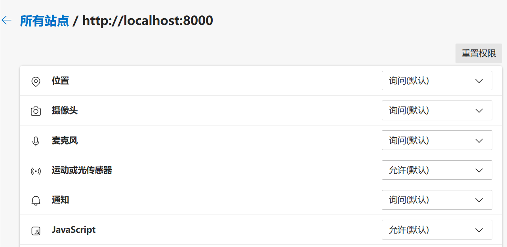

<style>
  h1{
    background: azure;
  }
  h2{
    background: pink;
  }
  h3{
    background: lightblue;
  }
</style>

<p id="top" style="font-size:48px;color:green; font-weight:bolder;">Front-end</p>

<p><a href="#top" style="position:fixed;">回到顶部</a></p>

目录：
- [DOM](#dom)
  - [窗口尺寸](#窗口尺寸)
  - [窗口事件](#窗口事件)
  - [使用document获取元素对象](#使用document获取元素对象)
    - [预置元素](#预置元素)
    - [document.querySelector()](#documentqueryselector)
    - [document.querySelectorAll()](#documentqueryselectorall)
    - [document.getElementById()](#documentgetelementbyid)
    - [document.getElementsByTagName()](#documentgetelementsbytagname)
    - [getElementsByClassName()](#getelementsbyclassname)
  - [使用innerHTML属性设置元素内容](#使用innerhtml属性设置元素内容)
  - [添加元素](#添加元素)
  - [复制元素](#复制元素)
  - [删除元素](#删除元素)
  - [元素、节点的区别](#元素节点的区别)
  - [节点属性](#节点属性)
- [样式优先级](#样式优先级)
- [选择器](#选择器)
- [文字样式](#文字样式)
  - [单个文字样式](#单个文字样式)
    - [文本颜色](#文本颜色)
    - [字体](#字体)
    - [字号](#字号)
    - [字重（加粗）](#字重加粗)
    - [倾斜](#倾斜)
    - [文本阴影](#文本阴影)
  - [段落样式](#段落样式)
    - [首行缩进：text-indent](#首行缩进text-indent)
    - [文本对齐：text-align](#文本对齐text-align)
    - [行间距：line-height](#行间距line-height)
    - [单词间距：word-spacing、 字符间距：letter-spacing](#单词间距word-spacing-字符间距letter-spacing)
    - [段落中的空格和空行](#段落中的空格和空行)
    - [文字渐变](#文字渐变)
- [背景、边框、轮廓](#背景边框轮廓)
  - [背景](#背景)
    - [背景颜色](#背景颜色)
    - [背景图片](#背景图片)
    - [背景图片固定](#背景图片固定)
    - [背景图片尺寸](#背景图片尺寸)
  - [边框](#边框)
    - [边框样式](#边框样式)
    - [边框宽度](#边框宽度)
    - [边框颜色](#边框颜色)
    - [单独各边](#单独各边)
    - [合并样式](#合并样式)
    - [快速设置四边框数值](#快速设置四边框数值)
    - [边框汇总](#边框汇总)
    - [圆角边框](#圆角边框)
  - [轮廓](#轮廓)
- [媒体查询](#媒体查询)
- [特效](#特效)
  - [线性渐变](#线性渐变)
  - [过渡](#过渡)
  - [动画](#动画)
    - [定义动画](#定义动画)
    - [动画的组合](#动画的组合)
  - [图片阴影](#图片阴影)
  - [利用border-radius属性实现裁剪](#利用border-radius属性实现裁剪)
  - [块阴影box-shadow](#块阴影box-shadow)
- [Node.js](#nodejs)
  - [文件处理](#文件处理)
    - [引入fs模块](#引入fs模块)
    - [读取文本文件](#读取文本文件)
    - [写入文本文件](#写入文本文件)
    - [追加文本文件](#追加文本文件)
    - [复制文件](#复制文件)
    - [删除文件](#删除文件)
    - [重命名文件](#重命名文件)
    - [移动文件](#移动文件)
    - [创建和删除目录](#创建和删除目录)
    - [检查文件或目录是否存在](#检查文件或目录是否存在)
  - [路径处理](#路径处理)
    - [引入path模块](#引入path模块)
    - [内置路径](#内置路径)
    - [路径提取](#路径提取)
    - [合并路径](#合并路径)
    - [解析路径：normalize()、resolve()](#解析路径normalizeresolve)
  - [模块导出与导入](#模块导出与导入)
    - [CommanJS模块语法](#commanjs模块语法)
    - [ESM模块语法](#esm模块语法)
  - [HTTP模块](#http模块)
    - [HTTP服务端实现：使用Node.js http模块](#http服务端实现使用nodejs-http模块)
    - [HTTP服务端实现：使用express库](#http服务端实现使用express库)
    - [HTTP客户端实现：使用Fetch](#http客户端实现使用fetch)
  - [npm的使用](#npm的使用)
- [Next.js](#nextjs)
  - [动态路由](#动态路由)
- [React Native](#react-native)
  - [Android项目配置文件——AndroidManifest.xml](#android项目配置文件androidmanifestxml)
    - [Android项目源码结构](#android项目源码结构)
    - [mainfest节点](#mainfest节点)
    - [application节点](#application节点)
    - [XML文件中的变量说明](#xml文件中的变量说明)
    - [activity节点](#activity节点)
    - [user-permission节点](#user-permission节点)
  - [React Native项目所有依赖文件的使用说明](#react-native项目所有依赖文件的使用说明)
  - [为安卓apk签名](#为安卓apk签名)
  - [安卓开发环境的配置](#安卓开发环境的配置)
    - [Android SDK的安装和配置](#android-sdk的安装和配置)
    - [JDK的安装和配置](#jdk的安装和配置)
    - [安卓手机的有线调试和无线调试](#安卓手机的有线调试和无线调试)
    - [adb命令的使用](#adb命令的使用)
    - [Gradle的配置和使用](#gradle的配置和使用)
- [定位](#定位)
    - [相对定位](#相对定位)
    - [绝对定位](#绝对定位)
    - [固定定位](#固定定位)
    - [粘滞定位](#粘滞定位)
- [浮动](#浮动)
- [Electron](#electron)
  - [Electron入门](#electron入门)
    - [安装](#安装)
    - [main.js文件](#mainjs文件)
    - [index.html文件](#indexhtml文件)
    - [Preload.js文件](#preloadjs文件)
    - [启动应用](#启动应用)
  - [渲染器进程向主进程发送消息](#渲染器进程向主进程发送消息)
  - [新建窗口](#新建窗口)
    - [新建基本窗口](#新建基本窗口)
    - [新建窗口的详细配置](#新建窗口的详细配置)
  - [主进程监听消息](#主进程监听消息)
- [WebSocket](#websocket)
  - [HTTP协议的问题](#http协议的问题)
  - [WebSocket服务端：Node.js ws模块实现](#websocket服务端nodejs-ws模块实现)
  - [WebSocket客户端：浏览器实现](#websocket客户端浏览器实现)
- [Socket](#socket)
  - [Socket通信](#socket通信)
    - [Socket服务端：Node.js net 模块实现](#socket服务端nodejs-net-模块实现)
    - [Socket客户端：Node.js net模块实现](#socket客户端nodejs-net模块实现)
- [Web API](#web-api)
  - [位置](#位置)
  - [桌面通知](#桌面通知)
  - [Local Storage](#local-storage)
  - [postMessage()](#postmessage)
  - [自定义事件](#自定义事件)
  - [Style API](#style-api)
  - [URL API](#url-api)
  - [定时器API](#定时器api)
    - [setTimeout()](#settimeout)
    - [setInterval()](#setinterval)
    - [requestAnimationFrame()](#requestanimationframe)
  - [浏览器直接读写本地文件系统](#浏览器直接读写本地文件系统)
- [React](#react)
  - [React 基础](#react-基础)
    - [在HTML页面中直接引入React](#在html页面中直接引入react)
    - [新建并启动React项目](#新建并启动react项目)
    - [控制样式](#控制样式)
    - [使用 React 实现表单双向绑定](#使用-react-实现表单双向绑定)
  - [组件间通信](#组件间通信)
    - [父子组件间通过 Props 通信](#父子组件间通过-props-通信)
    - [任意组件间通过 Redux 通信](#任意组件间通过-redux-通信)
  - [React Hooks](#react-hooks)
    - [useState()](#usestate)
    - [useEffect()](#useeffect)


# DOM 

- [窗口尺寸](#窗口尺寸)
- [窗口事件](#窗口事件)
- [使用document获取元素对象](#使用document获取元素对象)
  - [预置元素](#预置元素)
  - [document.querySelector()](#documentqueryselector)
  - [document.querySelectorAll()](#documentqueryselectorall)
  - [document.getElementById()](#documentgetelementbyid)
  - [document.getElementsByTagName()](#documentgetelementsbytagname)
  - [getElementsByClassName()](#getelementsbyclassname)
- [使用innerHTML属性设置元素内容](#使用innerhtml属性设置元素内容)
- [添加元素](#添加元素)
- [复制元素](#复制元素)
- [删除元素](#删除元素)
- [元素、节点的区别](#元素节点的区别)
- [节点属性](#节点属性)


##   窗口尺寸

关于窗口尺寸，window对象有如下属性：
- innerHeight： 获取窗口内容区域的高度，返回一个数值。
- innerWidth： 获取窗口内容区域的宽度。
- outerHeight： 获取窗口的高度，包括边框和菜单栏等。
- outerWidth： 获取窗口的宽度，包括边框和菜单栏等。
- screenLeft、SreenX： 获取从窗口左边缘到屏幕左边缘的像素数。返回一个数值。
- screenTop、SreenY： 获取从窗口上边缘到屏幕上边缘的像素数。

##   窗口事件

window对象定义了许多与资源加载或变化相关的事件，包括：
- onabort： 在资源加载过程中被终止时触发。
- onerror： 在资源加载出错时触发。
- onload： 在资源加载完成后触发。
- onresize： 在窗口缩放时触发。
- onunload： 在窗口从浏览器卸载时触发。

在发生交互行为时，会传递一个event对象，如下是该对象的一些表示窗口位置的相关属性：
- event.pageX 表示页面内的位置。
- event.scrollTop 表示滚动条的位置。
- event.scrillTo(x,y) 的作用是滚动一定的位置。

##  使用document获取元素对象

###  预置元素

document对象有一些预置元素成员，可以直接定位到该元素，包括：
-  document.head：	head元素
-  document.body：	body元素
-  document.title： 文档标题
-  document.images：文档中的img元素组成的类数组
-  document.links：文档中的a元素组成的类数组

使用document获取对象元素主要包括两类方法：getElement系列和querySelector系列。
getElement 系列方法比较古老，已经被querySelector系列方法替代，实际中应该优先使用querySelector()和querySelectorAll()两种方法。

###  document.querySelector()

document.querySelector()返回一个Element对象，表示找到的第一个节点。下面的例子中，样式包含title的元素可能有多个，但该方法只返回找到的第一个。

```js
const element1 = document.querySelector('.title')
```

###  document.querySelectorAll()

document.querySelectorAll()方法返回Element对象数组，表示所有找到的节点组成的类数组对象。下面的例子中，样式包含title的元素可能有多个，该方法找到所有匹配的元素并返回一个类数组。

```js
const elements = document.querySelectorAll('.title')
console.log(elements.length)
```

###    document.getElementById()

document.getElementById()方法返回指定id值的元素，由于id是唯一的，因此返回的是一个元素对象。如下示例得到一个id值为title的元素。注意，不要在id值前面加 # 。

```js
const element1 = document.getElementById('title')
```

###  document.getElementsByTagName()

document.getElementsByTagName()方法通过元素标签查找元素，一般会找到多个元素，返回的结果是HTMLElement对象组成的集合。例如如下代码返回所有div元素的集合。

```js
const divs = document.getElementsByTagName('div')
console.log(divs.length)
```

###  getElementsByClassName()

getElementsByClassName()方法返回指定class值的元素对象，无论找到0个、1个还是多个，始终返回`HTMLCollection []`，这是一个类数组对象。


## 使用innerHTML属性设置元素内容

元素对象的innerHTML属性的作用是读取或设置元素的内容，元素的内容本质上是一个字符串，但是可以使用HTML标签，浏览器会按照HTML语法渲染出内容。

如下示例分别读取body和head的内容：

```
console.log(document.body.innerHTML)
console.log(document.head.innerHTML)
```

innerHTML元素既可以读，也可以写，如下示例表示覆盖原有内容，使用新内容：

```
document.body.innerHTML='<h1>new content</h1>'
```

许多时候并不想要覆盖原内容，而只是想追加新的内容，则应该使用+=：

```
document.body.innerHTML += '<h1>appended new content</h1>'
```

## 添加元素

添加元素要针对具体的情况选择合适的方法，主要有五种方式：
-  innerHTML ： 通过+=的方式设置新的HTML内容，达到添加元素的目的
-  append()： 添加到父元素的末尾
-  prepend()： 添加到父元素的开头
-  before()： 添加到元素的前面
-  after()： 添加到元素的后面

另外，appendChild()方法和insertBefore()方法已经过时，应该弃用。

添加子元素最简单的方式就是使用innerHTML。innerHTML的值是符合HTML语法的字符串。如下示例将新的段落添加到页面的末尾：

```html
<body>
        <p>原始内容</p>
</body> 

<script>
      // 注意是+= ，表示追加，如果是 = 则会覆盖原内容
        document.body.innerHTML +=  '<p>new content</p> '
</script>
```

append()和prepend()这两个方法用于为父元素挂载新的子元素。前者挂载到末尾，后者挂载到开头。示例如下：

```html
<body>
        <p>other content</p>
</body> 

<script>
        
        const p1 = document.createElement('p')
        p1.innerHTML='p1 content'
        
        const p2 = document.createElement('p')
        p2.innerHTML='p2 content'
        
        // 挂载到body的开头
        document.body.prepend(p1)
        
        // 挂载到body的末尾
        document.body.append(p2)
</script>
```

before()和after()分别在之前和之后添加同辈元素。示例如下：

```html
<body>
      <p id="old">old content</p>
</body> 

<script>
        const p= document.querySelector('#old')

        // 新建元素
        const p1 = document.createElement('p')
        p1.innerHTML='p1 content'
        
        // 新建元素
        const p2 = document.createElement('p')
        p2.innerHTML='p2 content'

        // 插入到前面
        p.before(p1)  
        // 添加到后面 
        p.after(p2)
</script>
```

## 复制元素
使用cloneNode()方法可以复制元素，该方法返回新的元素对象，使用true选项复制全部内容。

```
<body>
        <p id='old'>old content</p>
</body> 

<script>
        const p = document.querySelector('#old')
        const p2 = p.cloneNode(true)
        p.after(p2)
</script>
```

## 删除元素
元素对象调用remove()方法可以删除自己，例如：

```
<body>
        <p>will be deleted content</p>
</body> 
<script> 
        const p = document.querySelector('p')
        p.remove()
</script>
```

replaceChild() 和removeChild()方法已经过时，不推荐使用。

##  元素、节点的区别

元素一定是节点，节点不一定是元素，带有尖括号标签的是HTML元素，例如`<body>`、`<head>`、`<div>`等，HTML元素是一种节点，除了HTML元素以外，还有Text节点、Comment节点、Document对象，这些都不是HTML元素。

不再包含下一级元素的纯文本就是节点，而非元素。

nodeType数值	|节点类型
|---|---|
Document|	9
Element|	1
Text	|3
Comment	|8

##  节点属性

属性   | 说明
|---|---|
parentNode	|父节点
children	|包含所有子元素的类数组对象，不包括非元素节点
childNodes|	包含所有子节点的类数组对象
firstElementChild|	第一个子元素
firstChild	|第一个子节点
lastElementChild	|最后一个子元素
lastChild	|最后一个子节点
previousElementSibling|	前一个紧邻同辈元素
nextElementSibling	|后一个紧邻同辈元素
nodeType|	节点类型
nodeValue	|Text或Comment节点的文本内容
nodeName	|作为元素的HTML标签名，全部大写，例如'DIV'、'IMG'

上面，如果没有子节点或者子元素，则返回null。

```js
const element1 = document.body.children[0]
const element2 = document.body.firstElementChild

const element3 = document.body.children.at(-1)
const element4 = document.body.lastElementChild
```

# 样式优先级

可以在多处为同一个元素多次设置样式，这需要基于某种规则进行优先级排序，优先级高的会覆盖掉优先级低的属性。CSS样式的优先级从高到底排序如下：

- 元素内嵌样式： 使用style属性写在元素的标签内。
- 文档内嵌样式： 定义在style标签中的样式。
- 外部样式：由link标签的ref属性指定css文件的相对或绝对路径。

如果在属性值结尾带上!important标记，那么就表示此处的优先级最高。例如下面的例子中，根据优先级规则，h1标题的文本应该为蓝色，但是由于style中使用了!important，所以最终结果为红色。

```html
<style>
h1{ color: red !important }
</style>

<h1 style="color:blue;">Hello,CSS</h1>
```


# 选择器


选择器的语法说明汇总如下。

常见的选择器：

- `*`  选取所有元素
- ` type ` ： 选取指定类型的元素
- ` .className ` ： 选取包含class样式名的元素
- ` #idName `   ： 选择指定id值的元素

根据属性选取：

- ` [attr] ` ：选取定义了attr属性的元素
- ` type[attr] ` ：选取定义了attr属性的type类型的元素
- ` [attr="val"] ` ：选取定义了attr属性,且值为val的元素
- ` [attr^="val"] ` ：选取定义了attr属性,且值以val开头的元素
- ` [attr$="val"] ` ： 选取定义了attr属性,且属性值以val结尾的元素
- ` [attr*="val"] ` ：选取定义了attr属性,且属性值包含val的元素
- ` [attr~="val"] ` ：选取定义了attr属性,且属性值包含多个值,而其中一个为val的元素
- ` [attr|="val"] ` ：选取定义了attr属性,且值是以连字符分割的值,而第一个为val的元素

根据元素间的层级关系选取：

- ` 选择器 , 选择器 ` ： 逗号表示或的意思,选择匹配至少一个选择器的元素.
- ` 选择器1  选择器2 ` ： 空格表示后代，从匹配选择器1的后代中，选择匹配选择器2的元素。
- ` 选择器1 > 选择器2 ` ： 尖括号表示子元素，从匹配选择器1的子元素中，选择匹配选择器2的元素。
- ` 选择器1 + 选择器2 `： 加号表示紧跟其后，在匹配选择器1之后，紧跟其后匹配选择器2.
- ` 选择器1 ~ 选择器2 `： 破浪号表示后面，在匹配选择器1之后，从后续元素匹配选择器2.

选取第n个子元素：

- ` ::first-line ` ：选择块级元素文本的首行
- ` ::first-letter ` ：选择块级元素文本的首字母。
- ` :before` 或 `:after ` ：在选取元素之前或之后插入内容
- `:root`：选取根元素
- ` :first-child ` ：选择第一个子元素
- ` :last-child ` ：选择最后一个子元素
- ` :only-child ` ：如果只有唯一一个子元素，选择该元素
- ` only-of-type ` ： 选取属于父元素的特定类型的唯一子元素
- ` nth-child(n) `： 选取父元素的第 n 个子元素。
- `:nth-last-child(n)`：选取父元素的倒数第n个子元素。
-  ` nth-of-type ` ：选取属于父元素的特定类型的第n个子元素
- ` nth-last-of-type(n) ` ：选取属于父元素的特定类型的倒数第n个子元素

根据元素的启用与否选取：

- ` enabled ` ：选取已启用的元素
- ` disabled ` ：选取被禁用的元素
- ` checked ` ：选取所有选中的复选框和单选按钮
- ` default ` ：选取默认元素
- ` :valid ` 或 ` :invalid `： 选取基于输入验证判定的有效或者无效的input元素。
- ` in-range ` 或  ` out-of-range `： 选取被限定在指定范围之内或者之外的input元素。
- ` required `  或 ` :optional ` ：根据是否允许使用required属性选取input元素。

根据用户的交互状态选取；

- ` :link `  ：选取未访问的链接元素
- ` :visited `  ：选取已访问的链接元素
- ` :hover `  ：选取鼠标指针悬停在其上面的元素
- ` :active `  ：选取当前用户激活的元素，这通常意味着用户即将点击该元素
- ` :focus `  ：选取获得焦点的元素
- ` :not(选择器) `  ：否定选择，选择不匹配选择器的元素。
- ` :empty `  ：选取不包含任何子元素或文本的元素
- ` :lang(语言) `  ：选取lang属性为指定值的元素
- ` :target `  ：选取URL片段标识符指向的元素。


# 文字样式

- [单个文字样式](#单个文字样式)
  - [文本颜色](#文本颜色)
  - [字体](#字体)
  - [字号](#字号)
  - [字重（加粗）](#字重加粗)
  - [倾斜](#倾斜)
  - [文本阴影](#文本阴影)
- [段落样式](#段落样式)
  - [首行缩进：text-indent](#首行缩进text-indent)
  - [文本对齐：text-align](#文本对齐text-align)
  - [行间距：line-height](#行间距line-height)
  - [单词间距：word-spacing、 字符间距：letter-spacing](#单词间距word-spacing-字符间距letter-spacing)
  - [段落中的空格和空行](#段落中的空格和空行)
  - [文字渐变](#文字渐变)


##    单个文字样式

###  文本颜色

颜色使用color，如下定义段落的颜色：

```
p{color:red;}
```

###  字体

```css
p{font-family:Arial;}

```

一些字体名称：
- 微软雅黑："MicroSoft YaHei"
- 幼圆："YouYuan"
- 隶书："LiSu"
- 楷体："KaiTi"    
- 宋体："SimSun"
- 新宋体："NSimSun"

###  字号

字号，font-size，表示文字的大小。字号的大小有多种设置形式。

第一种方式是绝对大小。分为两类：像素值和单词形式。

像素值是最常见的形式，使用px（Pixel）作为单位。1像素约等于0.4毫米。例如：

```
<style>
    p {
        font-size: 18px;
    }
</style>

<p>文字示例</p>
```

单词形式包括：xx-small、x-small、small、medium、large、x-large、xx-large、smaller、larger。这些值是绝对大小，每个值对应一个绝对像素值，medium是默认值，相当于16px。

第二种方式是相对大小。分为两种：百分数、em和rem。

对应font-size属性，em和百分数都是相对于父元素的字号计算的。1em等价于100%，表示与父元素字号相等，1.5em等价于150%，表示父元素字号的1.5倍。例如：

```html
<style>
    div {
        font-size: 16px;
    }

    p {
        font-size: 2em;
    }
</style>

<div>父元素字号：16px
    <p>子元素字号：2em，即32px</p>
</div>
```

使用em需要特别注意的是，只有对于font-size来说，em才与百分比等价。但是，对于其它属性来说，em相对的是：

```
当前元素的font-size
```

举个例子可以说明这个问题，下面的例子中，子元素的边框宽度为0.5em，通过getComputedStyle()得到的结果约16px，这就说明除了font-size外的其它属性的em是相对于本元素的font-size计算的。

```html
<style>
    div {
        font-size: 16px;
    }

    p {
        font-size: 2em;
        border: black solid 0.5em;
    }
</style>

<div>父元素字号：16px
    <p>子元素字号：2em，即32px；边框宽度：0.5em，约16px</p>
</div>


<script>
            const p = document.getElementsByTagName('p')[0] // 获取p元素
            console.log(getComputedStyle(p).fontSize) // 获取p的字号
    console.log(getComputedStyle(p).border) // 获取p的边框宽度
</script>
```

rem是新增的标准，r 是 root 的意思，表示在em的基础上，相对于根元素即body的字号。body元素默认16px字号。所以，一般情况下，1rem即16px。如下示例：

```html
<style>
    div {
        font-size: 32px;
    }

    p {
        font-size: 0.5rem;
    }
</style>

<div>父元素字号：32px
    <p>子元素字号：0.5rem，相对于body的16px，结果是8px</p>
</div>


<script>
        // 获取p元素对象
        const p = document.getElementsByTagName('p')[0] 
        // 获取p的字号
        console.log(getComputedStyle(p).fontSize) 
</script>
```


###  字重（加粗）

字重，font-weight，也就是通常所说的加粗。

font-weight的属性值有两种写法。

第一种写法是单词。 包括lighter、normal、bold、bolder。

第二种写法是数字：100-900，取整百数，共有9个数。

这两种写法存在一种对应关系，不过，不同浏览器可能不同，笔者在 Edge(Chromium) 122 上测试的对应关系如下：
- 100、200、300对应lighter，细体。
- 400、500对应normal，正常粗细，这是默认值。
- 600、700、800、900对应bold，加粗。

###  倾斜

文本倾斜比较简单，一般只使用如下样式即可：

```
font-style: italic;
```

默认值为normal。

###  文本阴影

有时候，你希望为文本加个阴影，此时可以使用text-shadow属性。需要指定三个值：阴影颜色、横向偏移距离、纵向偏移距离，顺序不强制要求。示例如下：

```html
<style>
    span {
        text-shadow: lightblue 0.5em 0.5em;
    }

</style>

<span>文本阴影</span>
```

这表示阴影颜色为浅蓝，阴影向下向右均偏移半个字号。


##  段落样式

###  首行缩进：text-indent

我们经常在书本看到，每个段落的第一行是空了两个汉字的，这叫做段落缩进，也叫首行缩进，使用text-indent。text-indent的取值单位与font-size类似，既可以是使用px作为绝对值，也可以使用em和百分号作为相对值。

不过，需要特别注意的是，这里的em和百分比没有等价关系，em是相对于本元素的font-size，而百分比不是的。

由于标准格式是首行缩进2个汉字，因此不要使用px和百分比，直接使用如下样式即可：

```
text-indent: 2em;
```

这样，不管文字大小怎么变换，首行始终是缩进2个汉字。

### 文本对齐：text-align

如同文字编辑软件Word一样，文本对齐也是段落的基础设置，使用text-align，可取如下值：
- left：左对齐，默认
- right： 右对齐
- center ： 居中对齐
- justify： 两端对齐

### 行间距：line-height

行距控制行之间的距离，使用line-height。如果属性值是纯数字，则表示几倍行距，例如1.5表示1.5倍行距。这里的倍数是相对于font-size的倍数，因此纯数字与em是等效的。也就是说，如果要设置2倍行距，下面两种方式是一样的：

```css
line-height: 2;
line-height: 2em;
```

###  单词间距：word-spacing、 字符间距：letter-spacing

word-spacing 表示单词间的距离。对于英文文本来说，就是单词与单词间的距离。而对于中文文本来说，是标点符号隔开的两小串文本之间的距离。

letter-spacing表示字符间的距离。对于英文文本来说，就是字母间的距离。对于中文文本来说，就是汉字间的距离。

基于上面两种分析，可以发现，对于中英文夹杂的文章来说，没有哪一种是可以兼顾的。

###  段落中的空格和空行

默认情况下， 一段文本中，连续多个空格会被压缩成1个空格。同时，在一对`<p>`标签中永远只会输出一个段落，哪怕源代码中写了几段。

例如，下面两个段落在浏览器的呈现是一样的：

```html
<p>
    空白测试          空白测试 
    
    换行测试
</p>

<p>
    空白测试 空白测试 换行测试
</p>
```

第一个段落中，虽然有很多空白，虽然看似写了两段话，但是渲染结果与下面那个段落并无二致。

如果需要人为保留源码中的空白和换行，使用如下样式：

```
white-space: pre;
```

###  文字渐变

有些时候，需要对文字的颜色加上渐变效果，则可以使用如下的样式设置：

```html
<style>
    span {
        background-image: linear-gradient(45deg, red, green);
        background-clip: text;
        color: transparent;
        display: inline;
    }
</style>

<span>文字渐变示例</span>
```

注意，某些浏览器可能不支持文字渐变。


# 背景、边框、轮廓


- [背景](#背景)
  - [背景颜色](#背景颜色)
  - [背景图片](#背景图片)
  - [背景图片固定](#背景图片固定)
  - [背景图片尺寸](#背景图片尺寸)
- [边框](#边框)
  - [边框样式](#边框样式)
  - [边框宽度](#边框宽度)
  - [边框颜色](#边框颜色)
  - [单独各边](#单独各边)
  - [合并样式](#合并样式)
  - [快速设置四边框数值](#快速设置四边框数值)
  - [边框汇总](#边框汇总)
  - [圆角边框](#圆角边框)
- [轮廓](#轮廓)


## 背景

背景一般包括背景颜色或背景图片。属性如下：
- background： 设置所有背景值的简写属性
- background-attchment： 设置元素的背景附着属性，决定背景图片是否随页面一起滚动。
- background-clip： 设置背景颜色和图像的裁剪区域
- background-color： 设置背景颜色
- background-image： 设置元素背景图像
- background-origin： 设置背景图像绘制的起始位置
- background-position： 设置背景图像在元素盒子中的位置
- background-repeat： 设置背景图像的重复方式
- background-size： 设置背景图像的绘制尺寸

背景包括背景颜色和背景图像。

### 背景颜色

背景颜色使用background-color，一般可以简写为background。

### 背景图片

使用网络链接可以设置背景图片。注意，不是直接写链接，而是作为参数传入url()。例如：

```
<style>
    div {
        width: 700px;
        height: 500px;
        background-image: url("https://example.com/example.png");
}
</style>

<div></div>
```

不过，如果图片比div小，则默认会重复，使用background-repeat设置重复方式：

- space： 完全填充
- no-repeat ： 不重复

有时候设置背景图片不重复后，还希望背景图片能在容器的正中间显示，此时做如下设置：

```css
background-image: url("https://example.com/example.png");
background-repeat: no-repeat;
background-position: center;
```

### 背景图片固定

有时候，我们希望把背景图片固定到页面中，不随之滚动，可做如下设置：

```css
body{
        background-image: url("https://example.com/example.png");
        background-repeat: no-repeat;
        background-position: center;
        background-attachment: fixed;
}
```

### 背景图片尺寸

使用background-size手动设置背景图片尺寸，可以是绝对尺寸：

```
background-size: 400px 500px;
```

也可以是相对尺寸,相对的是容器的宽度和高度:

```
background-size: 50% 50%;
```

还可以是相对容器的文本字号:

```
background-size: 2em 4em;
```

上面几个属性值也可以混着使用。


##  边框

大部分元素都可以设置边框，例如p、div、img等等。

### 边框样式

边框样式使用border-style制定，默认边框是透明的。因此，如果要设置宽度、颜色，一定一定要首先设置border-style为可见的一种属性，例如solid，这点切记。

大多数情况只需要使用下面这条属性即可：

```css
border-style: solid;
```

border-style可以取如下值：

-  solid  ：定义实线边框，这是最常见的，一般只需要记住这个即可，下面可以不记。
-  none   ： 默认，无边框                
-  dotted ： 定义一个点线边框                
-  dashed  ：  定义一个虚线边框               
-  double ： 定义两个边框。 两个边框的宽度和 border-width 的值相同 
-  groove ： 定义3D沟槽边框。效果取决于边框的颜色值               
-  ridge  ： 定义3D脊边框。效果取决于边框的颜色值          
-  inset  ： 定义一个3D的嵌入边框。效果取决于边框的颜色值        
-  outset ： 定义一个3D突出边框。 效果取决于边框的颜色值            

### 边框宽度

指定宽度值：

```css

    border-width:5px;
```

使用内置关键字： thick 、medium（默认值） 和 thin。

```css
p{
border-style:solid;
    border-width:medium;
}
```

### 边框颜色

border-color

颜色值、RGB、十六进制。

### 单独各边

在连字符中加入边的指代。left、right、top、bottom。

```css
p{
	border-top-style:dotted;
	border-left-style:solid;
	border-top-color:red;
	border-left-width: 5px;
}
```

### 合并样式

```
p{
	border:5px solid red;
}
h1{
	border-top:5px solid red;
	border-left:5px dotted green;
}
```

### 快速设置四边框数值

- 值1   值2   值3   值4	上->右->下->左
- 值1   值2   值3  	上->左右->下
- 值1   值2   	上下->左右
- 值1  	上下左右

```css
p{
	border-style : dashed;
	border-width: 5px 2px;  /* 上下宽5px，左右宽2px */
	border-color: red  green blue;  /*上边颜色红色、左右颜色绿色，下边颜色蓝色*/
}
```


### 边框汇总

对于边框需要考虑几点：
- 哪一边：分为top、bottom、left、right。如果不写，则为所有边。
- width： 宽度。
- style：样式。包括虚线、实现、单点划线、双点划线等。
- color：边框的颜色。
- image：边框的图像。图像与颜色只能选择一种。

边框包括如下属性：

- border： 为所有边界设置的简写属性，包括宽度、样式、颜色。
- border-top/bottom/left/right： 为上、下、左、右单独设置的属性。
- border-bottom-color： 为下边框设置的颜色，其它方向类似。
- border-bottom-left-radius： 将边框左下角设置为圆角，属性值为圆角值，其它方向为bottom-right、top-left、top-right。
- border-bottom-style： 设置下边框的样式，其它方向类似。
- border-bottom-width： 设置下边框的宽度，其它方向类似。
- border-color： 统一设置四边的颜色。
- border-image： 设置四边的图像
- border-image-outset：指定图像向边框盒外部扩展的区域。
- border-image-repeat： 指定边框图像的缩放和重复方式。
- border-style： 统一设置四边的样式。
- border-top-style：设置上边框的样式，其它方向类似。
- border-width：统一设置四边的宽度。
- box-shadow：设置元素的一个或多个阴影效果。

### 圆角边框

要定义圆角边框，使用border-radius属性。

```
border-radius: 10px;
```

单独一个角：

```
border-top-left-radius: 10px;
```

类似地，还有右上：top-right，坐下：bottom-left，右下：bottom-right。

## 轮廓

轮廓与边框类似，区别如下：

- 轮廓不占空间
- 无法为一边单独设置轮廓

轮廓包括如下属性：

- outline-color： 设置元素边框外围轮廓线的颜色
- outline-offset： 设置轮廓距离元素边框边缘的偏移量
- outline-style： 设置轮廓的样式
- outline-width： 设置轮廓的宽度
- outline： 轮廓的简写属性。


# 媒体查询

媒体查询主要用于区分手机、平板、电脑，以及横屏、竖屏的状态，以便于根据用户的屏幕种类及状态，呈现合适的布局。主要根据屏幕的宽度来推断。

and运算符用于符号两边规则均满足条件的匹配，例如：

```
@media (min-width:300px)  and (max-width:600px){
        /*匹配宽度在300px到600px之间的设备*/
}
```


max-device-width： 设备宽度，max-width：界面宽度

# 特效

- [线性渐变](#线性渐变)
- [过渡](#过渡)
- [动画](#动画)
  - [定义动画](#定义动画)
  - [动画的组合](#动画的组合)
- [图片阴影](#图片阴影)
- [利用border-radius属性实现裁剪](#利用border-radius属性实现裁剪)
- [块阴影box-shadow](#块阴影box-shadow)


##  线性渐变

线性渐变使用如下函数：

```
linear-gradient(角度, 起始颜色, 终止颜色)
```

```
<style>
    div {
        width: 300px;
        height: 300px;
        background: linear-gradient(45deg,red,blue);
    }
</style>

<div></div>
```

角度单位是deg。0表示从下到上，45deg从左下到右上。


##  过渡

过渡表示当某个属性发生**变化**时，应该在一定的时间内以动画的形式展现。

过渡使用transition属性 ，该属性是一种简写方式，同时接收三个值：
- 过渡的属性，如果有多个属性，使用逗号隔开。
- 过渡时间，单位为s或ms。
- 过渡的渐变方式。

过渡的渐变方式主要有：
- linear： 线性过渡
- ease：中间较慢，两端较快
- ease-in-out： 中间较快，两端较慢
- ease-in： 慢速开始，然后加速
- ease-out： 快速开始，然后减速

为了直观地呈现过渡，通常使用:hover定义鼠标悬停时的样式。

```html
<style>
    div {
        width: 100px;
        height: 100px;
        background: lightblue;
        transition: background 0.5s ease-in-out;
    }

    div:hover {
        background: lightgreen;
    }
</style>
<div></div>
```


##  动画

-  定义关键帧
-  定义动画
-  定义动画组合

为某个属性定义一个动画帧：

```html
<style>
@keyframes color-fade
{
    from {background:lightblue;}
    to {background:lightgreen;}
}

div{
        width: 100px;
        height: 100px;
        background: lightblue;
        animation: color-fade 0.5s ;
}
</style>

<div></div>
```

### 定义动画

animation主要包括如下细分属性：
- animation-name： 动画名称
- animation-duration： 播放时长
- animation-delay： 延迟时间
- animation-direction： 方向，默认正向，反向为reverse
- animation-timing-function： 速度函数

一般情况下，将几个属性合在一起写，如同上述的例子一样。绝大多数情况会用到如下5个属性，依次指定即可。

```css
animation : 关键帧名称  时长  次数  过渡类型  方向
```

这5个属性中，大多数情况设置的是前三个个：关键帧名称、时长、次数。

时长为播放一次动画的时间，单位为s或ms。默认为0，如果不设置就看不到动画。

次数是一个整数值，如果需要一直播放，设为infinite。

过渡的意思是淡入淡出等效果，主要的过渡类型如下：

- linear	：	动画从开始到结束的速度是相同的
- ease	 ：	默认值，动画以低速开始，然后加快，在结束前变慢
- ease-in	：	 动画以低速开始
- ease-out	 ：	动画以低速结束
- ease-in-out	：	动画以低速开始，并以低速结束

方向有四个值：
- norma： 默认，从0%到100%
- reverse： 反向，每次都从100%到0%
- alternate： 第一次正向，第二次反向，第三次正向，第四次反向，依此类推，此选项可以模拟动画的呼吸效果。
- alternate-reverse：与alternate类似，只不过反过来，奇数次反向，偶数次正向。


### 动画的组合

动画的组合分有两种方式：
- 在一个关键帧定义中，写多个属性，用分号分隔
- 在animation值中，写多个关键帧，用逗号分隔

可以将强关联的属性组合起来，比如：

```html
<style>
    @keyframes fade{
        from{width:10px; height:10px; background: lightblue;}
        to{width:200px; height:200px; background: lightcoral;}
    }
    div{
        animation: fade 3s infinite ease;
    }
    </style>
    
    <div></div>
```

也可以将多个关键帧组合，例如：

```html
<style>
    @keyframes 尺寸{
        from {
            width: 10px;
            height: 10px;
        }

        to {
            width: 200px;
            height: 200px;
        }
    }

    @keyframes 颜色 {
        from {background: lightblue;}
        to {background: lightcoral;}
    }

    div {
        animation: 尺寸 3s infinite ease, 颜色  3s infinite ease;
    }
</style>

<div></div>
```

##  图片阴影

```
filter:drop-shadow( offset-x offset-y blur-radius spread-radius color )
```

- ffset-x：此参数设置图像的水平偏移。正值将创建右侧的偏移量，负值将创建左侧的偏移量。
- offset-y：此参数设置图像的垂直偏移。正值创建到底部的偏移量，负值创建到顶部的偏移量。
- blur-radius：设置模糊半径的值。它是一个可选参数。
- spread-radius：设置扩散半径的值。它是一个可选参数。
- color:它设置阴影的颜色。它的可选参数。


```html
<style>
    img{
        filter: drop-shadow(0 0 5em #646cffaa)
    }
</style>


```


##  利用border-radius属性实现裁剪

大多数情况下，我们需要将div或者图片裁剪成圆角矩形或圆形，此时，可以很使用如下属性：

```css
border-radius: 50%;
```

如下示例将div裁剪成圆角矩形：

```html
<style>
   div{
    width:100px;
    height:100px;
    background: lightblue;
    border-radius: 25%;
   }
</style>

<div></div>
```

如下示例将图片裁剪成圆形：

```html
<style>
   img{
    border-radius: 50%;
   }
</style>


```


##  块阴影box-shadow

之前介绍过text-shadow，这个属性为文本创建阴影。

对于块元素，有一个类似地属性，叫做box-shadow。

box-shadow接受三个值：向下的偏移量、向右的偏移量、阴影颜色。顺序不强制要求。示例如下：

```
<style>
    div {
        width: 100px;
        height: 100px;
        background: lightblue;
        box-shadow: orange 10px 10px;
    }
</style>

<div></div>
```

# Node.js


## 文件处理

### 引入fs模块


使用如下代码引入fs模块：

```js
const fs = require('fs')
```

###  读取文本文件

比较常见的就是使用utf8编码读取文件，返回字符串，例如：

```js
const content = fs.readFileSync('file.txt', 'utf8')  
console.log(content)
```

当然还有fs.readFile()和fs.promise.readFile()这两种异步读取方式，还有更低级的read()方法，这几种方式的代码更复杂一些。对于大部分数据量不大的文本文件，只需要使用readFileSync()这种同步方式即可。

### 写入文本文件

要写入文件内容，使用writeFileSync()方法：

```js
fs.writeFileSync('file.txt', 'some content', 'utf8')
```

与读取文件类似，写文件操作也有对应的异步方法和低级API，大部分情况下使用同步方式即可。

### 追加文本文件

要追加文件内容，使用appendFileSync()方法：

```js
fs.appendFileSync('file.txt','new content','utf8')
```

### 复制文件

要复制文件，使用copyFileSync()方法：

```js
fs.copyFileSync('old.txt' ,  'new.txt')
fs.copyFileSync('old.txt' ,  'new.txt')
```

### 删除文件

要删除文件，使用rmSync()方法，如下命令删除当前工作目录下的old.txt文件：

```js
fs.rmSync('old.txt')
```

### 重命名文件

要重命名文件，使用renameSync()方法，例如：

```js
fs.renameSync('old.txt','new.txt')  // 重命名
```

### 移动文件

值得一提的是，移动文件的本质也是重命名文件——对文件的路径进行重命名，fs模块并没有类似moveSync()的方法，仍然是使用renameSync()以重命名路径的方式完成文件的移动，如下示例将old.txt移动到文件夹dir下：

```js
fs.renameSync('old.txt','dir/old.txt')
```


如下示例移动且重命名文件：

```js
fs.renameSync('old.txt','dir/new.txt') 
```

fs.readDirSync()方法用于列举文件或目录下的文件列表，类似于ls命令，如下示例读取当前目录下的文件列表：

```js
console.log(fs.readdirSync('.'))
```

这会输出一个由字符串组成的数组，每个元素就是文件或目录名。

### 创建和删除目录

使用mkdirSync()新建目录，使用rmdirSync()删除目录，例如：

```js
fs.mkdirSync('newdir')
fs.rmdirSync('newdir')
```

注意，如果目录已经存在，则会报错。

### 检查文件或目录是否存在

existsSync()方法检查文件或目录是否存在，传入相对或绝对路径：

```js
console.log(fs.existsSync('file.txt'))  // 检查文件是否存在
console.log(fs.existsSync('dir'))  // 检查目录是否存在
```

fs.statSync()返回文件或目录的属性，包括修改时间、创建时间、文件大小等元数据。

```js
console.log(fs.statSync('file.txt')) 
```

## 路径处理

### 引入path模块


如果需要处理路径，则需要用到path模块。首先使用如下代码引入path模块：

```js
const path = require('path')
```

### 内置路径

下面列出了一些常用的内置路径：
- process.cwd() 当前工作目录的绝对路径。
- __filename  当前代码文件的绝对路径。
-  __dirname 当前代码文件所在目录的绝对路径。
- os.homedir() 家目录，需要先引入os模块。
- path.sep  /或\，取决于操作系统。

### 路径提取

如下是使用path模块进行路径解析的示例代码：

```js
const p = "D:\\Test\\example.js"
console.log(path.basename(p))  // example.js，含后缀的文件名
console.log(path.extname(p))  // .js ， 后缀名
console.log(path.basename(p, path.extname(p))) // example，不含后缀的文件名
console.log(path.dirname(p)) //  D:\Test ，所在目录
```

### 合并路径

path.join()用于组合多个路径，它会自己处理路径中存在的'/'、'//'、'..'。
```js
console.log(path.join('a','//b','./c')) // a\b\c

// 自动解析相对路径符号
console.log(path.join('a',  '.',  'b',  '..',  'c')) // a\c 
```

### 解析路径：normalize()、resolve()

path.normalize()规范化路径为当前操作系统的格式。

```js
console.log(path.normalize('a/b/c')) // a\b\c

'/foo/bar/baz/asdf'
console.log(path.normalize('/foo/bar//baz/asdf/quux/..'))  // '/foo/bar/baz/asdf'

```

path.resolve()从最后一个路径开始，反向处理。

```js
path.resolve('/foo/bar', './baz')   // returns '/foo/bar/baz'
path.resolve('/foo/bar', 'baz')   // returns '/foo/bar/baz'
path.resolve('/foo/bar', '/baz')   // returns '/baz'
path.resolve('/foo/bar', '../baz')   // returns '/foo/baz'
path.resolve('home','/foo/bar', '../baz')   // returns '/foo/baz'
path.resolve('home','./foo/bar', '../baz')   // returns '/home/foo/baz'
path.resolve('home','foo/bar', '../baz')   // returns '/home/foo/baz'
path.resolve('home', 'foo', 'build','aaaa','aadada','../../..', 'asset') //return '/home/foo/asset'
```


## 模块导出与导入

###   CommanJS模块语法

CommanJS语法也叫cjs。这种方式在ES6推出之前解决了Node端JavaScript文件模块化问题，当时浏览器还不支持模块化。这种方式，只适用于Node环境，不能用于浏览器。

要使用CommanJS语法，有两种方式：
- 使用.js或.cjs扩展名。
- 在本目录下的package.json中，添加一行：`  "type" : "commonjs" ` 。

要使用CommanJS语法，将需要导出的值用逗号分隔、花括号包裹，然后赋给module.exports，示例如下：

```js
const a =1 
const foo=()=>console.log('hello,world')

module.exports = {a,foo}
```

导入时，可以作为一个整体对象导入，其成员就是被导入文件导出的对象。如下示例：

```js
const datas = require('./export.js')
datas.foo()
```

也可以只导入部分变量，如下示例：

```js
const {foo} = require('./export.js')
fun()
```


###   ESM模块语法

ESM，即ES Module，在2015年的ES6版本中被推出，这种语法同时支持Nodejs和浏览器环境。

要使用ESM语法，有两种方式：
- 将扩展名改为.mjs。
- 在同目录下的package.json中，添加一行：` "type" : "module" ` 。

ESM语法主要包括：
-  具名导出
-  具名导入
-  默认导出
-  默认导入

要导出变量，使用export 关键字加上花括号，填入要导出的对象，用逗号隔开，例如export.mjs文件：

```
const a = 1;
const str = "hello";
const arr = [1,2,3];
const foo = ()=>console.log("hello,world");

export {a,str,arr,foo}
```

请注意，这里的花括号不是对象，这个语法也不是对象简写，只是语法规则规定将要导出的对象写在export {} 中而已。

如果要导入，使用import关键字和花括号，填入需要导入的对象，用逗号隔开，例如// import.mjs：

```js
import {a,str,arr,fun} from "./export.js"
console.log(str)
console.log(arr)
foo()
```

如果需要导入所有对象，则可以使用如下import.mjs文件中的语法。

```js
import * as vars from "./export.js"

console.log(vars.str)
console.log(vars.arr)
vars.foo()
```

有些时候从不同的文件导入同名变量，这时候就发生了命名冲突，可以使用as起个别名，如下import.mjs文件：

```js
import { data as data1 } from "./export1.js"
import { data as data2} from "./export2.js"
 ```

使用具名导入时，需要查看源文件中导出了哪些对象，需要在import{} 中填入准确的变量名，虽然可以使用as重命名，但终归不是很方便。

为了解决这个问题，可以使用默认导出，使用export default 关键字加上花括号，例如：

```js
// export.mjs
const a = 1;
const b = 2;
const str = "hello";
const arr = [1,2,3];
const foo = ()=>console.log("hello,world");

export default {a,b,str,arr,foo}
```

在默认导入时，可以在本文件中使用一个自定义的名称，例如：

```js
import  datas  from './export.js'

console.log(datas.a)
console.log(datas.arr)
datas.foo()
```

在实践中，具名导出导入、默认导出导入均有使用，应熟练掌握。


## HTTP模块

### HTTP服务端实现：使用Node.js http模块

一个Node.js HTTP服务端的基本代码骨架如下：

```js
const http = require('http')

// 创建 HTTP 服务器
const server = http.createServer((req, res) => {
  res.end('Hello, World!'); // 发送响应内容
})

// 让服务器监听 3000 端口
server.listen(3000, () => {
  console.log('服务器运行在 http://localhost:3000/')
})
```

通常使用req，res表示请求对象和响应对象，这是惯用的写法。

请求的URL包括三大部分：主机名+端口、路径、查询参数。

req.url只包括路径和查询参数，而调用new URL()需要传入完整的URL，因此需要补上主机名+端口：

```js
const url = new URL(req.url, ' http://localhost:8080')
```

此时，就可以分别得到路径和查询参数了：

```
console.log(url.pathname)           //  路径
console.log(url.searchParams)  //  查询参数，是一个可迭代对象。
```

解析请求体需要监听req对象的data事件，得到请求体：

```js
req.on('data',data=>console.log(data.toString()))
```

由于安全原因，HTTP服务器默认不能跨域访问，如果在浏览器script脚本中使用fetch()方法会被拒绝访问。要解除这个限制，可以添加一行如下代码：

```js
res.setHeader("Access-Control-Allow-Origin", "*")
```

要返回数据，会用到两个方法：res.write()和res.end()。res.write()可以重复调用，表示不断开连接的情况下多次返回。而一旦遇到了res.end()，就会在返回这一次的数据后立即断开。如下示例表示返回了三次数据后断开连接：

```js
res.write('hello')
res.write('world')
res.end('res end')
```

### HTTP服务端实现：使用express库

express是非常流行的Node.js HTTP库，可以实现生产级的HTTP服务器。示例如下：

```
const express = require('express')
const bodyParser = require('body-parser')
const app = express()

// 使用第三方库bodyParser处理json格式的请求体
app.use(bodyParser.json()) 

app.post('/post', (req, res) => {
    // 获取请求体，为对象类型
    console.log(req.body)

    res.status(200)
    res.header("Content-Type", "application/json")
    res.send('{"key":"value"}') // 返回json
})

app.listen(8080, () => {
    console.log('Example app listening on port 8080')
})
```


###  HTTP客户端实现：使用Fetch

在Node.js和浏览器环境中均可使用fetch()发送HTTP请求、接收服务器响应，语法相同。

基本示例如下：

```
//  请求四件套：method、url、headers、body
const method = 'post'
const url = 'http://127.0.0.1:8080/post'
const headers = new Headers({'Content-Type': 'application/json'})
const body = '{"key":"value"}'

async function request(){
    const response = await fetch(url, {method, headers,body})
    // 状态码
    const status = await response.status
    console.log(status)
    // 响应体，json格式
    const result = await response.json()
    console.log(result)
}

request()
```

请求方法有两种：GET和POST，如果要携带正文（即请求体），应使用POST方法。

请求头使用new Headers()初始化，传入一个JavaScript对象，每个键值对对应着HTTP请求报文的头部的键值对。

```js
new Headers({'Content-Type': 'application/json'})
```

请求体是一个JavaScript对象，包括method、headers、body三个属性。其中，headers属性的是是一个Headers对象。

```js
const req = {
    method: 'POST',
    headers: new Headers({})
    body: 'req body'
}
```

fetch()函数返回的是一个期约对象，使用await解析期约值。如上面示例代码。

上面示例中的res对象还可以有如下属性和方法：
- status，取得返回码，如200。
- statusText，取得返回码状态，例如OK。
- headers，取得响应头。
- body， 取得响应体，这是一个ReadableStream对象。
- json()，如果响应体是一个JSON对象，使用该方法可以直接解析为JavaScript对象。


## npm的使用

npm是Node.js官方的包管理器工具，默认随着node一起安装，无需单独安装。可以运行npm -v确认是否已安装。

在确认npm安装后，一般需要更换镜像源以加速下载，运行如下命令更换为阿里云的npm镜像源：

```
npm config set registry https://registry.npmmirror.com/ 
```

运行如下命令，如果输出新的镜像地址则表示镜像源更换成功：

```
npm config get registry
```

通常，在项目根目录下，有一个package.json文件，文件中有scripts项，使用如下命令运行脚本：

```
npm run 脚本名称
```

在scripts之下，可以添加一个条目，条目的属性名为脚本名称，属性值为要运行的命令，例如：

```
"hello":"echo hello"
```

此时，运行 npm run hello，命令行会执行echo hello。

有些比较大的npm包会自带二进制命令，如果是本地安装的（本地安装的意思是将文件下载到当前目录下），二进制命令会被放在./node_modules/.bin目录下，无需将该目录下的命令添加到系统PATH环境变量，直接使用如下命令运行二进制程序：

```
npx 二进制命令名称
```

上述命令只能在二进制命令所在的项目目录内运行。如果是经常需要使用的命令，那么推荐全局安装，此时在任意目录内都可以运行。


# Next.js

一个页面就导出的react组件，也可以说，一个页面就是一个js、jsx、ts、tsx文件。

每个页面都使用其文件名作为路由。

如果在pages目录下创建了demo.js，内容如下：

```
export default function Demo(){
    return <h1>Demo Page</h1>
}
```

那么该页面就可以通过/about访问。

## 动态路由

用方括号封装文件夹名，

```
// pages/users/[name].js
 
import { useRouter } from 'next/router'
 
export default function User() {
  const router = useRouter()
  const { name } = router.query
 
  return <h1>hello, {name}</h1>
}

```

这样一来，就会根据URL具体路径动态的返回页面内容。例如访问/users/zhangsan，就会返回 ` <h1>hello, zhangsan</h1> ` ，访问/users/lisi，就会返回 ` <h1>hello, lisi</h1> ` 。


# React Native

## Android项目配置文件——AndroidManifest.xml


AndroidManifest.xml是安卓项目的配置文件，里面包含了从应用级别到页面级别的各种属性设置。该文件需要引用其它文件的内容，如变量、图片、代码文件等，因此，需要先弄清楚Android项目结构。

###  Android项目源码结构

react native项目通过Gradle工具编译后的安卓项目代码放在android子文件夹下，而安卓子项目的源代码又放在app/src/main目录下，该目录有三个子文件（夹）：
- java： 存放Java或Kotlin代码。
- AndroidManifest.xml： Android应用配置文件。
- res ： 存放资源文件。

其中，res文件夹又有4个子目录：
- drawable： 存放图片文件或图片描述文件。
- layout： 存放页面描述文件，后缀名为xml。
- values： 存放变量定义文件。例如字符串变量strings.xml、颜色变量colors.xml、样式变量styles.xml等。

由于设备的分辨率不同，所以同一张图片往往需要准备不同的分辨率的图片。因此，drawable又有几个子目录：
- drawable-xhdpi： 存放适配720P屏幕的图片。
- drawable-xxhdpi： 存放适配1080P屏幕的图片。
- drawable-xxxhdpi： 存放适配1.5K及以上屏幕的图片。

在这三个目录存放不同分辨率的同名图片，应用在运行时，会自动根据屏幕分辨率选择具体文件夹下的图片。

大致明白了Android项目结构，就可以分析AndroidManifest.xml文件的内容了。因为后缀名是xml，所以AndroidManifest.xml遵循标准的XML语法。一个XML文件的内容是由多级嵌套节点组成的，每个节点通常包含开始标签、节点属性、子节点、结束标签。下面剖析常见的几个节点。

###  mainfest节点

manifest元素是安卓配置文件的根元素。属性包括：
- xmlns： XML版本。
- package： 包名，通常为公司域名的逆序字符串。

###   application节点

application节点是mainfest节点的子节点，指定了应用级别的一些配置信息，主要属性包括：
- android:allowBackup， 是否运行应用备份。为true表示允许，false为不允许。
- android:icon， 指定App在手机屏幕上显示的图标。
- android:label， 指定App在手机屏幕上显示的名称。
- android:roundIcon， 指定App的圆角图标。

###   XML文件中的变量说明

无论是AndroidManifest.xml，还是页面描述文件，都需要用到变量。

字符串变量放在了res/values目录下的strings.xml中。例如：

```
<resources>
        <string name="变量名">变量值</string>
</resources>
```

这样就可以在其它位置直接使用该变量，加上“@string/”前缀即可：

```
android:label = "@string/变量名"
```

除了字符串变量，另一个经常引用的资源就是图片。假设软件运行在1080P屏幕上，则首先要把图片放到res/drawable/drawable-xxhdpi目录下，然后可以在xml文件中通过属性android:src引用了，格式语法为：

```
android:src = "@drawable/不带后缀名的图片名称"
```


###  activity节点

activity节点是application节点的子节点，它是活动页面的注册声明。一个activity节点代表一个页面，只有在这里注册了activity节点，才能在运行时访问对应的页面。

一个页面通常包含两部分：xml页面描述文件、Java或Kotlin代码文件。

页面描述文件、代码文件、用于注册页面的activity节点的android:name属性，这三个名称应该按照规则对应。用语言描述这种规则不好理解，直接给出示例更加直接，示例如下：

```
页面描述文件名： activity_main.xml
代码逻辑文件名 ： MainActivity.java 或 MainActivity.kt
activity节点：
<activity  android:name=".MainActivity" > </activity>
如果没有子节点，也可以简写成：
<activity  android:name=".MainActivity"  />
```

另外，如果该页面是App的入口页面，还应该在该activity节点下面添加一些内容，修改后的节点内容如下：

```
<activity  android:name=".MainActivity">
        <intent-filter>
                <action android:name="android.intent.action.MAIN"/>
                <category android:name="android.intent.category.LAUNCHER">
        </intent-filter>
</activity>
```

###  user-permission节点

user-permission节点是manifest的子节点，与application节点同级。该节点用来声明应用所需的权限。一个权限对应一个user-permission节点，权限名称作为android:name属性的值。

例如，如果应用需要访问网络，则需要声明：

```
<uses-permission android:name="android.permission.INTERNET" />
```

常见的权限名称如下列表。

网络访问类：

- android.permission.INTERNET	允许应用联网
- android.permission.CHANGE_WIFI_STATE 允许程序改变Wi-Fi连接状态
- android.permission.CHANGE_NETWORK_STATE 允许程序改变网络连接状态
- android.permission.BLUETOOTH 允许程序连接到已配对的蓝牙设备
- android.permission.ACCESS_WIFI_STATE 允许程序访问Wi-Fi网络状态信息


电话短信类：

- android.permission.WRITE_SMS 允许程序写短信
- android.permission.READ_SMS 允许程序读取短信息
- android.permission.READ_OWNER_DATA 允许程序读取所有者数据
- android.permission.SEND_SMS 允许程序发送SMS短信
- android.permission.CALL_PHONE 运行程序打电话
- android.permission.WRITE_SETTINGS 允许程序读取或写入系统设置
- android.permission.WRITE_CONTACTS 允许程序写入联系人数据
- android.permission.RECEIVE_SMS 允许程序监控一个将收到短信息，记录或处理
- android.permission.WRITE_CALENDAR 允许一个程序写入用户日历数据

多媒体类：

- android.permission.SET_WALLPAPER 允许程序设置壁纸
- android.permission.RECORD_AUDIO 允许程序录制音频
- android.permission.CAMERA  允许使用照相机的权限
- android.permission.VIBRATE 允许访问振动设备
- android.permission.MODIFY_AUDIO_SETTINGS 允许程序修改全局音频设置

系统设置类：

- android.permission.MODIFY_PHONE_STATE 允许修改话机状态
- android.permission.INSTALL_PACKAGES 允许安装程序
- android.permission.CLEAR_APP_USER_DATA 允许一个程序清除用户设置
- android.permission.DISABLE_KEYGUARD 允许程序禁用键盘锁
- android.permission.CHANGE_CONFIGURATION 允许一个程序修改当前设置
- android.permission.BRICK 请求能够禁用设备
- android.permission.SET_TIME_ZONE 允许程序设置时间区域
- android.permission.SET_ANIMATION_SCALE 修改全局信息比例
- android.permission.REBOOT 请求能够重新启动设备
- android.permission.SET_ORIENTATION  允许旋转屏幕的权限
- android.permission.DELETE_PACKAGES  允许删除安装包权限
- android.permission.FLASHLIGHT  允许访问闪光灯的权限


##  React Native项目所有依赖文件的使用说明


由于从零开始配置React Native环境需要使用代理工具下载大量的包，这会消耗很多时间，而且还要修改一些文件内容，每次都这样做比较麻烦。因此我将React Native环境配置好以后将相关的依赖文件打包分享，大家只要下载这些文件并解压到对应的位置，同时只需要简单的配置就可以直接开始开发React Native项目了，不需要下载大量的包。

相关依赖的版本如下：
- JDK： 20
- Gradle ： 8.6
- Android： 14
- React Native： 0.73.5
- React ： 18.2.0

分享的文件包括：
- jdk-20_windows-x64_bin.exe： JDK 20。
- Android-SDK.7z： Android SDK命令行工具。
- .gradle.7z： gradle构建工具包，已经包含所有所需的依赖。
- ReactNativeDemo.7z： 已经配置好的React Native示例项目。

将这四个文件都下载到本地。

-  第一步，安装JDK。

双击jdk-20_windows-x64_bin.exe安装JDK到一个目录，例如 D:\Program Files\Java\jdk-20。然后在系统或用户的环境变量列表中，新建一个变量JAVA_HOME，值为JDK的安装目录。然后，在系统或用户的Path变量中，新增一条%JAVA_HOME%\bin。在终端运行 javac、java，测试是否安装配置成功。

-  第二步，配置Android SDK。

然后，解压 Android-SDK.7z 到一个不包含空格的英文路径，例如直接解压到D盘。在系统或用户的环境变量中，新增一个变量ANDROID_HOME，值为D:\Android-SDK。 随后，在系统或用户的Path变量中，新增三条：

```
%ANDROID_HOME%\cmdline-tools\latest\bin
%ANDROID_HOME%\platform-tools
%ANDROID_HOME%\build-tools\34.0.0
```

在终端中依次运行sdkmanager.bat 、 adb检查Android SDK是否配置成功。

-  第三步，配置gradle。

解压.gradle.7z到用户家目录，注意，压缩包直接包含一个.gradle文件夹，因此直接解压即可，不要再重复创建.gradle文件夹，也就是说，在用户家目录的.gradle文件夹下，应该直接看到子文件夹，而不是.gradle文件夹。

-  第四步，连接手机。可以通过USB有线连接或者WiFi无线连接。具体方法在另一篇文章中。

至此，环境配置已经完成了。

-  第五步，解压ReactNativeDemo.7z到一个不包含空格的英文路径下，通过终端进入这个文件，然后运行npm run android，稍等一会儿后，在手机上会看到应用安装请求，点击允许，即可在手机上看到App画面。

要构建apk，先通过终端进入项目的android子目录，然后运行 \gradlew.bat assembleRelease，等待一段时间后，即可在app\build\outputs\apk\release目录下看到apk文件，此安装包可以直接安装到手机上。


##  为安卓apk签名


在构建安卓apk时，为apk签名之后才能提交到应用商店。

首先需要使用keytool命令生成密钥文件，keytool命令位于JDK安装目录的bin目录下，在安装JDK时已经将该目录添加到PATH环境变量中了。

进入到项目的android/app/ 目录下，运行如下命令，这会在当前目录生成密钥文件release.keystore：

```
keytool -genkey -v -keystore release.keystore -alias release -keyalg RSA -keysize 2048 -validity 10000
```

然后编辑项目的android/app 目录下的build.gradle，新增release代码段如下所示，storePassword和keyPassword是运行keytool时输入的密码。然后在buildTypes的release代码段中，将debug改成release。修改后的代码部分内容如下：

```
signingConfigs {
        release {
            storeFile file('release.keystore')
            storePassword 'android'
            keyAlias 'release'
            keyPassword 'android'
        }
        debug {
            storeFile file('debug.keystore')
            storePassword 'android'
            keyAlias 'androiddebugkey'
            keyPassword 'android'
        }
    }


buildTypes {
          // ...
   release {
       signingConfig signingConfigs.release
         // ....
    }
}

```


##  安卓开发环境的配置

###   Android SDK的安装和配置

要开发安卓项目，必须安装Android SDK。可以直接下载Android Studio，这会附带安装Android SDK，也可以只下载Android SDK命令行工具。本文讲解Android SDK命令行工具的安装和使用。

1、下载并解压cmdline-tools命令行工具

首先需要去Android 开发者官网下载cmdline-tools压缩包。打开 https://developer.android.google.cn/studio?hl=zh-cn ，将页面拉到最底部，可以清晰地找到“仅限命令行工具”，根据平台下载对应的压缩包，这里我们选择Windows版本，压缩包体积应该在150MB左右。


 

下载后解压，将解压出来的 ` cmdline-tools ` 文件夹放到一个只包含英文路径文件夹下，本示例为 ` D:\Android-SDK ` 。 

2、设置ANDROID_HOME环境变量

在用户或系统的环境变量列表中，新增一个环境变量ANDROID_HOME，其变量值为刚刚存放cmdline-tools文件夹的路径，本示例为` D:\Android-SDK `。

请注意，设置 ` ANDROID_HOME ` 环境变量这个步骤非常重要，开发时的许多命令都会读取这个变量，读不到就会报错！

然后，注销或重启电脑以使环境变量生效。

3、移动cmdline-tools下的文件

在 ` %ANDROID_HOME%\cmdlines-tools ` 中新建一个名为latest的文件夹，将原先 cmdline-tools 下的四个文件移动到这里。这一步是官方文档推荐的做法，目的是方便 cmdline-tools 版本的管理。

现在，你的目录结构应该如下图所示：


4、在Path环境变量中添加条目

进入到用户或系统的Path环境变量中，添加一条：

```
%ANDROID_HOME%\cmdline-tools\latest\bin
```

这是为了方便直接直接调用sdkmanager.bat。sdkmanager.bat 用于查看、安装、更新和卸载 Android SDK 的软件包。

5、安装Android开发工具包

使用如下命令列出可用的安卓工具包及其版本：

```sh
sdkmanager.bat  --list --no_https --proxy=http --proxy_host=g.cn --proxy_port=80
```

后面的--proxy_host表示国内的镜像仓库，因为国外的无法访问。

任何Android开发都至少需要安装下面命令中列出的三个包：

```
sdkmanager.bat "build-tools;34.0.0" "platform-tools" "platforms;android-34" --no_https --proxy=http --proxy_host=g.cn --proxy_port=80
```

这里对上面3个工具包的含义做一些解释：
- "build-tools;34.0.0" ： build工具，直接安装list列表中最高的那个版本即可，目前是34.0.0。
- "platform-tools" ：平台工具，没有版本选择，默认安装最新版，直接写这个即可。
- "platforms;android-34" ：注意，这里很重要。这里34的意思是安卓的api34。Android13对应api34，Android13对应api33。api34可以兼容安卓9以上的版本，因此直接安装这个版本即可。

使用如下命令检查已经安装的包：

```
sdkmanager.bat  --list_installed
```

输出内容：应该至少包含如下三个条目：

```
Installed packages:
  Path                 | Version | Description                | Location
  -------              | ------- | -------                    | -------
  build-tools;34.0.0   | 34.0.0  | Android SDK Build-Tools 34 | build-tools\34.0.0
  platform-tools       | 35.0.0  | Android SDK Platform-Tools | platform-tools
  platforms;android-34 | 3       | Android SDK Platform 34    | platforms\android-34

```

6、接受许可

这个步骤容易被忽略，但却非常非常重要，一定一定要执行！使用如下命令接受许可：

```
sdkmanager --licenses
```

系统会提示你接受所有尚未接受的许可。在每一次终端的询问中需要手动输入 y 表示同意使用协议，默认是N（不同意）。

7、在Path环境变量中添加条目

在用户或系统的PATH环境变量中新增如下两项：

```
%ANDROID_HOME%\platform-tools
%ANDROID_HOME%\build-tools\34.0.0
```

注销或重启电脑以使环境变量生效。

在终端中运行 ` adb ` 命令，如果输出了adb的帮助信息则环境变量设置成功。

至此，Android SDK配置工作已经完成了。


###   JDK的安装和配置

构建安卓项目时，需要用到Gradle打包工具，而Gradle又依赖于JDK，因此需要提前安装JDK。注意，JDK版本必须与Gradle的版本对应，目前，Gradle 8.6适配的最高版本是JDK 20。

进入JDK下载页面下载对应的版本，然后安装，本示例安装目录为：` D:\Program Files\Java\jdk-20 `。

在用户或系统环境变量设置窗口中，新增一条变量，变量名是` JAVA_HOME ` ，变量值是JDK的安装目录，本例中为` D:\Program Files\Java\jdk-20 `。

在PATH环境变量中新增一条：

```
%JAVA_HOME%\bin
```

打开终端，运行下面两个命令：

```
javac
java
```

如果输出了帮助信息，则JDK安装配置成功。

###   安卓手机的有线调试和无线调试

将电脑连接到手机是安卓开发的必备步骤。以小米手机为例，进入 “设置—— 我的设备——全部参数与信息” ，连续点击 “MIUI版本” 7次，即可打开开发者选项 。

进入“设置——更多设置——开发者选项”，开启“USB调试”、“USB安装”、“USB调试（安全设置）”。


 

使用数据线连接电脑和手机，会自动触发打开一个弹窗，在弹窗中有“传输照片”、“传输文件”等选项，选择传输文件。

运行：

```
adb  devices 
```

输出的内容中，手机设备标识符右边的状态是device表示已连接。注意，一定要是device，其它的单词都表示未连接。


 


有线调试需要一直连着数据线，不是很方便。现在大多数手机都支持无线调试。

要使用无线调试，有两个前提条件：

1、 手机已经与电脑使用USB成功连接过一次，且授权没有撤销。对于小米手机，应该要在无线调试页面的下方看到一个“已配对的设备”。
2、 手机与电脑在同一WiFi下，也可以打开电脑上的移动热点。

从有线调试切换到无线调试的过程中，可能需要运行adb kill-server重启一次adb服务，以及重启一次手机上的无线调试开关。重启无线调试开关后，手机的IP地址端口号会改变。


在无线调试页面可以看到手机IP地址和端口，使用adb connect命令连接这个IP地址和端口，例如：

```sh
adb connect 192.168.0.104:39287
```

如果输出connected表示连接成功。

此时，在终端运行 adb devices ，如果设备的状态是device表示连接成功。


###   adb命令的使用
- 安装apk ： ` adb install  xxx.apk   -r ` ， -r选项表示覆盖安装
- 显示第三方应用  ： `adb shell pm list packages -3 `
- 显示所有应用    ` adb shell pm list packages  `
- 传递文件 ：  ` adb  push  1.png    /sdcard/1 `
- 拉取文件 ： ` adb    push   .    /sdcard/1/1.png `
- 向屏幕输入一些信息：   ` adb shell input text "hello"  `
- 模拟屏幕点击 ： `  adb shell input tap 500 1450 `
- 模拟滑动：   ` adb shell input swipe 100 500 100 1450 100 `
- 查看电池：  ` adb shell dumpsys battery `


###   Gradle的配置和使用

gradle是React Native和Flutter调试、构建安卓App的打包工具。gradle可以简单的类比为前端的webpack，webpack将源文件打包成HTML、CSS、JavaScript，而gradle将源文件打包成apk或aar（Android Assemble Bundle）。

gradle无需安装，gradle的本质是一些安卓源代码、脚本和配置文件，会调用Android SDK和Java命令构建安卓Apk。

1、Gradle项目结构

gradle项目的文件结构如下：

```
.gradle 
app
gradle
        └─wrapper
                └─gradle-wrapper.jar
                └─gradle-wrapper.propertier
build.gradle
gradle.properties
gradlew
gradlew.bat
settings.gradle
```

每个文件的含义如下：
- .gradle : gradle本地配置
- app：apk的输出目录
- gradle/wrapper/gradle-wrapper.propertier： gradle-wrapper的配置文件
- gradle/wrapper/gradle-wrapper.jar： 与gradle-wrapper.propertier对应
- build.gradle ： gradle项目的配置文件
- gradle.properties： gradle项目的配置文件
- gradlew： Linux、MacOS平台构建安卓app时运行的脚本
- gradlew.bat： Windows平台构建安卓app时运行的脚本
- settings.gradle： gradle项目的配置文件

2、 gradle和gradle-wrapper的区别

gradle是一个全局、通用的构建工具，而gradle-wrapper是在项目本地目录使用的构建工具。

对于React Native或Flutter而言，并不需要使用gradle，直接运行gradlew.bat脚本即可，gradlew就是gradle-wrapper对应的脚本工具。

3、 添加国内镜像仓库

换源几乎是包管理器的必备操作。有些软件包的仓库在国内是无法访问的，因此需要增加国内的镜像仓库，实际上只需要改两个文件：

- ./android/gradle/wrapper/gradle-wrapper.properties
- ./android/build.gradle

下面依次说明怎么修改。

要修改的第一个文件是gradle-wrapper.properties，只需要修改distributionUrl的那一行，把后面的链接改成国内阿里云的，文件是gradle-8.6-all.zip，注意版本。

```
distributionBase=GRADLE_USER_HOME
distributionPath=wrapper/dists
distributionUrl=https://mirrors.aliyun.com/macports/distfiles/gradle/gradle-8.6-all.zip
networkTimeout=10000
validateDistributionUrl=true
zipStoreBase=GRADLE_USER_HOME
zipStorePath=wrapper/dists
```

这里补充说明一下每一行的含义：

- distributionBase ： gradle的根目录。GRADLE_USER_HOME默认为家目录下的.gradle文件夹，保持默认，不要修改。
- distributionPath ：gradle的路径，与上面的根目录组合就是gradle的实际位置。
- zipStoreBase和zipStorePath ： 第三方工具的放置位置。

要修改的第二个文件是build.gradle。这里面的repositories部分定义了gradle应该去哪里下载第三方插件，默认内容是google()和mavenCentral()两个国外仓库。

这两个仓库需要使用挂代理才能使用，但是不能删除，因为有些插件的有些版本国内的镜像仓库并没有，必须要去这里下载。所以保留这两个仓库，在后面添加三个仓库，修改后的内容是：

```
repositories {
     google()
     mavenCentral()
     maven { url 'https://maven.aliyun.com/repository/google' }
     maven { url 'https://maven.aliyun.com/repository/jcenter' }
     maven { url 'https://maven.aliyun.com/nexus/content/groups/public'}
    }
```

4、使用gradlew打包安卓apk

通过Flutter命令构建好安卓子项目后，就可以构建apk了。首先进入android子项目中：

```sh
cd android
```

然后运行如下命令开始打包apk：

```sh
.\gradlew.bat assemble
```

实际上gradlew.bat 还有很多其它子命令，表示不同的任务，使用如下命令查看：

```sh
.\gradlew.bat tasks
```

比较常用的有三个命令：
- .\gradlew.bat assemble： 打包成apk文件，国内应用商店使用这个文件。
- .\gradlew.bat bundle： 打包成aar文件，谷歌应用商店使用这个文件。
- .\gradlew.bat build： 除了打包成安装包，还会进行测试等工作。

打包完成后，在./android/app/build/outputs/apk/release文件夹下，可以找到app-release.apk文件。将这个文件拷贝到手机安装即可。不过，由于app没有签名，会提示不能直接安装，忽略风险继续安装即可。


# 定位

- [相对定位](#相对定位)
- [绝对定位](#绝对定位)
- [固定定位](#固定定位)
- [粘滞定位](#粘滞定位)

### 相对定位

当一个元素被设置成相对定位后，就会相对于本来所在的位置进行偏移。

但是，相对定位元素偏移到新位置后，其原来的位置并不会被其它兄弟元素递补填充。

```html
<style>
    #相对定位元素 {
        width: 100px;
        height: 100px;
        background: red;
        position: relative;
        top: 50px;
        left: 50px;
    }

    .其它兄弟元素 {
        width: 100px;
        height: 100px;
        background: lightblue;
        margin:10px;
    }
</style>


<body>
    <div class="其它兄弟元素"></div>
    <div id="相对定位元素"></div>
    <div class="其它兄弟元素"></div>
</body>
```

效果如下：


### 绝对定位

当一个元素被设置成绝对定位时，就会被移除正常的布局流，本来所占的位置会被其它兄弟元素递补填充。它独立于容纳块内的其它的兄弟元素，相对于容纳块左上角的距离始终不变。

容纳块是指已经设置relative或absolute的最近的上级元素。如果没有，则容纳块是body元素。

```html
<title>绝对定位</title>
<style>
    #容纳块 {
        width: 400px;
        height: 400px;
        background: aliceblue;
        position: relative;
    }

   #绝对定位元素{
    width: 100px;
    height:100px;
    background: lightblue;
    position: absolute;
    top: 50px;
    left: 50px;
   }

   .其它兄弟元素{
    width: 100px;
    height: 100px;
    background: red;
    margin:10px
   }


</style>

<body>
    <div id="容纳块">
        <div id="绝对定位元素"></div>
        <div class="其它兄弟元素"></div>
        <div class="其它兄弟元素"></div>
    </div>

</body>
```

效果如下：


### 固定定位

当一个元素被设置成固定定位，那么它就会被移除正常的布局流，本来的位置会被其它元素递补填充。同时，无论是滚动还是放缩页面，它相对于页面左上角的距离始终不变。

```html

<style>
    #固定定位元素 {
        width: 100px;
        height: 100px;
        background: red;
         position: fixed;
        top: 50px;
        left: 50px;
    }
    .页面其它元素 {
        width: 100px;
        height: 500px;
        background-color: lightblue;
        margin: 10px;
    }
</style>
<body>
    <div class="页面其它元素"></div>
    <div id="固定定位元素"></div>
    <div class="页面其它元素"></div>
</body>
```

效果如下：


可以滚动页面或放缩浏览器窗口，查看固定定位的效果。    

### 粘滞定位

sticky 英文字面意思是粘，粘贴，所以可以把它称之为粘性定位。

当页面规定没有超出目标区域时，它的行为就像 position:relative；当页面滚动超出目标区域时，它的表现就像 position:fixed;，它会固定在目标位置。


# 浮动


把一个元素“浮动”(float) 起来，会改变该元素本身和在正常布局流（normal flow）中跟随它的其他元素的行为。这一元素会浮动到左侧或右侧，并且从正常布局流 (normal flow) 中移除，这时候其他的周围内容就会在这个被设置浮动 (float) 的元素周围环绕。
float 属性有四个可能的值：

* left — 将元素浮动到左侧。
* right — 将元素浮动到右侧。
* none — 默认值，不浮动。
* inherit — 继承父元素的浮动属性。

浮动一般用于文字环绕图片的场景。一般将小尺寸图片设置为浮动，后面跟一大段文字。在图片上设置float:left或float:right可以实现文字环绕的效果。如下示例：

```html


<div>
    浮动测试浮动测试浮动测试浮动测试浮动测试
    浮动测试浮动测试浮动测试浮动测试浮动测试
    浮动测试浮动测试浮动测试浮动测试浮动测试
</div>
```

效果如下：


# Electron

## Electron入门

### 安装

运行如下命令安装Electron：

```
npm i electron
```

### main.js文件

main.js是应用程序的入口文件。内容如下：

```js
const { app, BrowserWindow } = require('electron') 
 
const mainWindow = null
app.on('ready',()=>{
    mainWindow = new BrowserWindow({ 
        width:500,
        height:500,
        webPreferences:{ 
          nodeIntegration:true //设置为true就可以在这个渲染进程中调用Node.js
        }
    });
 
    mainWindow.loadFile('index.html'); // 加载本地文件
    // mainWindow.loadURL('https://zhuiyi.ai/'); // 加载远程文件
 
    mainWindow.webContents.openDevTools({ mode: 'bottom' }); // 控制台开关
  
    mainWindow.on('close',()=>{ 
        // 在窗口要关闭的时候触发
        e.preventDefault(); // 避免进程意外关闭导致进程销毁
    })
 
    mainWindow.on('closed',()=>{ 
       // 当窗口已经关闭的时候触发
    })
 
})
```

### index.html文件

main.js中使用的index.html就是第一个页面。

```html
<!DOCTYPE html>
<html lang="en">
<head>
    <meta charset="UTF-8">
    <meta name="viewport" content="width=device-width, initial-scale=1.0">
    <title>Hello World!</title>
</head>
<body>
    <h1>Hello World!</h1>
</body>
</html>
```

### Preload.js文件

preload.js 文件内容：

```js
window.addEventListener('DOMContentLoaded', () => {
  const replaceText = (selector, text) => {
    const element = document.getElementById(selector)
    if (element) element.innerText = text
  }

  for (const type of ['chrome', 'node', 'electron']) {
    replaceText(`${type}-version`, process.versions[type])
  }
})
```


### 启动应用

运行如下命令启动应用：

```
npx electron .
```


##  渲染器进程向主进程发送消息

preload.js暴露变量或函数：

```js
const { contextBridge, ipcRenderer } = require('electron')

contextBridge.exposeInMainWorld('msg', {
        
  ping: () => ipcRenderer.invoke('ping')
})
```

主进程监听消息：

```js
const {app, BrowserWindow, ipcMain} = require('electron')

app.whenReady().then(()=>{
        ipcMain.handle('ping',()=>'pong')
})
```


## 新建窗口


###   新建基本窗口


首先新建一个文件window.js，表示新建窗口的脚本。

```js
// 引入BrowserWindow类用于新建窗口
// 引入ipcMain用于后续监听渲染进程的消息
const  {BrowserWindow, ipcMain} = require('electron')

// 新建窗口的函数
const createWindow=()=>{

  // 新建空白窗口
    const window = new BrowserWindow({
    width: 800,
    height: 600,
    webPreference:{
        preload: './preload.js'
    }
  })
  // 加载内容
  window.loadFile('index.html')

  // 处理渲染进程发过来的消息
    ipcMain.handle('channel1',(event,...args)=>{
        return args.toString() + ' have been received.'
    })
}

// 导出
module.exports = {createWindow}
```

然后，在main.js中引入createWindow()函数。

当app whenReady时调用新建窗口的函数。


```js
// 引入app作为主应用程序
const {app} = require('electron')
// 引入窗口
const createWindow = require('window.js')

// 当app就绪时才能新建窗口
appp.on('ready',createWindow)

// 当所有窗口关闭时程序退出
app.on('window-all-closed', () => {
  if (process.platform !== 'darwin') {
    app.quit();
  }
});

// 激活程序后，如果没有窗口，就使用第一个渲染器进程
app.on('activate', () => {
  if (BrowserWindow.getAllWindows().length === 0) {
    第一个渲染器进程()
  }
```


###   新建窗口的详细配置

BrowerWindow类创建窗口。返回窗口对象，通常命名为window。

- width、height 宽度高度
- minWidth 最小宽度
- maxWidth 最大宽度
- minHeight 最小高度
- maxHeight 最大高度
- resizeable： 是否可以改变大小
- moveable： 是否可移动
- frame： 是否显示标题栏
- transparent： 是否透明
- x，y  位置
- title： 标题文本
- icon： 标题栏图标 传入路径


window的方法：
- loadFile() 加载内容，传入本地的HTML文件路径

on事件：
- close


BrowerWindow类的webPreferences


把这个属性单独拿出来，因为很关键。
 
 有一个很重要的选项：preload，指定预加载脚本文件。


##  主进程监听消息

ipcRenderer是Node.js EventEmitter的实例。

在预加载脚本中暴露API：

```js
const { contextBridge, ipcRenderer } = require('electron/renderer')

contextBridge.exposeInMainWorld('electronAPI', {
  // foo是页面可以直接调用的函数
  // 通过window.electronAPI.foo()的形式调用
  // data消息形参
  // channel1表示频道，主进程就监听这个频道
  foo : (msg1,msg2) => ipcRenderer.invoke('channel1',msg1,msg2)
})
```

data表示传递的参数。参数的个数可以是任意的，因为在主进程的handle函数中，都会被收集成一个数组。

然后，在renderer.js中，点击页面中的按钮触发，传递实际的参数，通过预加载脚本发送消息给主进程，获取回应：

```js
- document.querySelector('#button').onclick = () => {
  // 传入实际参数，
  // 数量不限，但是数量要与preload.js定义的一致
   window.electronAPI.foo('消息内容1','消息内容2')
  // window.electronAPI.foo()返回的是期约
  // 通过then()获取结果
   .then(result=>alert(result))

}
```

ipcRenderer.invoke()和ipcMain.handle()是在electron7之后使用的双向通信api，官方推荐使用。

同时，应该减少使用ipcRenderer.send()和ipcMain.on()


# WebSocket
## HTTP协议的问题

HTTP协议有两大特点：
- 无状态的：不保存之前请求的数据。
- 被动的： 服务器被动的接受客户端的请求。

所以，HTTP协议只适用于请求网页、Web API这类情况，不适用于聊天这种情况，因为聊天需要服务器和客户端保持长时间的连接，且要让服务器可以主动向客户端发送数据。

虽然有些方法可以让HTTP协议实现聊天功能，就是轮询。客户端每隔一段时间（例如1秒中）就发送一次请求，看有没有新的消息，这种方式有点取巧，不够直接。

为了实现长连接和双向通信，WebSocket标准应运而生，目前大多数浏览器都能很好的支持WebSocket。


##  WebSocket服务端：Node.js ws模块实现

我们使用Nodejs的ws模块实现WebSocket服务器。首先安装ws模块：

```
npm i ws
```

然后编写server.js：

```js
const ws = require('ws')

const wss = new ws.Server({port: 3000})

// 监听connection事件
wss.on('connection', client => {
        
         // 监听message事件
    client.on('message', msg => {
            console.log(`from client:${msg}`)
       client.send(`from server:${msg} has been received`)
    })
})
```

首先导入ws模块，使用Server类指定端口即可开启一个WebSocket Server，一般命名为wss。

wss有一个connection事件，表示监听客户端的连接，当有新的客户端连接时触发。回调函数会传入一个client参数，表示特定的客户端对象。

每个客户端对象都有一个message事件，表示监听客户端的消息。回调函数会传入一个msg参数，表示该客户端发过来的消息。

客户端对象还有一个send()方法，表示发送消息给该客户端。

wss对象还有一个clients成员，这是一个类数组对象，表示所有的客户端对象。利用这个类数组对象的forEach()方法可以实现广播功能，即发消息给所有的客户端，进而实现群聊的功能。

运行 node server.js 就可以开启一个简单的WebSocket服务器。

##  WebSocket客户端：浏览器实现

WebSocket客户端使用浏览器实现，示例如下：

```html
<span>消息输入框：</span>
<input id="input" />

<button onclick="send()">发送</button>
<p>消息列表：</p>
<div id="lists"></div>

<script>

    const client = new WebSocket('ws://localhost:3000')

    // 输入框元素对象
    const input = document.querySelector('#input')
        
         // 发送消息给服务端
    function send() {
        client.send(input.value)
    }

    // 监听message，接收服务器的消息
    client.onmessage = msg => {
        document.querySelector("#lists").innerHTML += msg.data+'<br />'
    }

</script>
```

使用new WebSocket()传入ws协议地址加端口即可连接ws服务器，前提是ws服务器已开启。

示例中的ws是客户端对象，ws.send()表示发送数据到服务器。ws.onmessage监听服务器的消息，并指定如何处理消息。

# Socket

## Socket通信

### Socket服务端：Node.js net 模块实现
Socket通信的服务端代码示例如下：

```
const net = require('net')
const server = net.createServer()

// 监听客户端的连接
server.on("connection", client => {

    // 监听客户端的消息：data事件
    client.on("data", data => {
        console.log(data.toString().trim())

        // 发送给客户端
        client.write('服务器已收到')
    })
})
server.listen(8888, () => console.log('服务器已启动'))
```

### Socket客户端：Node.js net模块实现

Socket通信的客户端使用Node.js实现，代码如下：

```
const net = require('net')
const client = net.createConnection({host:'127.0.0.1',port:8888})

// 监听客户端命令行的输入：data事件，发送给服务端
process.stdin.on('data',data=>client.write(data.toString()))

// 监听服务端的消息：data事件
client.on('data',data=>console.log(data.toString().trim()))
```


# Web API

## 位置
要获取设备的位置和速度，可以通过navigator.geoloaction.getCurrentPosition()方法，通过解析回调函数的参数可以得到经度、纬度、设备前进方向和速度，示例如下：

```
<script>
        navigator.geolocation.getCurrentPosition(position=>{
                // 经度
                console.log('经度', position.coords.latitude)
                // 纬度
                console.log('纬度', position.coords.longitude)
        
        })
</script>
```

##  桌面通知

可以直接调用Notification()函数即可创建一条通知，代码示例如下：

```
<script>
        new Notification( 'Title', {body:'content', icon:'notice.png'} )
</script>
```

不过，需要注意两点：
-  不能直接以本地文件运行，要以服务器形式运行
-  需要手动允许通知权限

首先，点击浏览器链接左边的标记，点击“此网站的权限”。


找到通知那一栏，设置为“允许”。



这样，就可以看到桌面通知了。


##  Local Storage

要在浏览器本地存储数据，可以使用cookie、local storage、session storage，这三种对象的区别如下：
- cookie： 最古老的方式，使用特定的格式字符串存储和传输本地数据。
- local storage： 持久化的本地存储，在关闭浏览器后依然有效。
- session storage： 临时的本地存储，在关闭窗口后删除。

下面讲解localStorage对象的使用方法。

要存储键值对，使用setItem()方法：

```
localStorage.setItem(key, value)
```

也可以直接使用点号语法：

```
localStorage.key = value
```

使用getItem()方法读取键对应的值：

```
localStorage.getItem(key)
```

也可以直接使用点号语法：

```
console.log(localStorage.key)
```

使用removeItem()方法可以删除键值对：

```
localStorage.removeItem(key)
```

使用clear()方法可以清空所有本地存储的键值对：

```
localStorage.clear()
```


##   postMessage()

postMessage()方法用于主页面向子页面发送消息。

首先，在需要发送消息的源窗口中，通过 iframe 标签嵌入另一个窗口，然后，iframe元素调用postMessage()方法发送消息，主页面main.html的代码如下：

```html
<h1>main page</h1>
<!-- 嵌入sub.html -->
<iframe src="sub.html" id="sub"><iframe>   

<script>
        // 向sub.html发送消息
        document.querySelector('#sub').contentWindow.postMessage('message from main page!')
</script>
```

然后，在子页面sub.html就可以监听消息：

```html
<h2>sub page</h2>
<script>
window.onmessage=e=> document.body+=e.data
</script>
```


##  自定义事件

大部分情况下，我们都是使用的浏览器提供的默认事件，这些事件都由用户触发，如鼠标单击、键盘按键。其实，可以自定义事件。

要创建自定义事件，使用如下方式定义一个事件对象event，事件名称是myevent，注意事件对象和事件名称概念要区分，不要搞混了。

```
const event = document.createEvent("CustomEvent")
event.initCustomEvent("myevent", true, false, "event happened!")
```

上面的示例中，initCustomEvent的四个参数的含义是：
- 自定义事件的名称，如示例中的myevent
- 事件是否冒泡
- 事件是否可以取消
- 任意值，作为事件传递的detail数据。

定义好事件后，任意的HTML元素都可以订阅这个事件了：

```js
document.addEventListener("myevent",event=>console.log(event.detail))
```

然后，使用disPatchEvent()函数触发：

```js
document.dispatchEvent(event)
```

该示例的完整代码如下：

```js
<script>
const event = document.createEvent("CustomEvent")
event.initCustomEvent("myevent", true, false, "event happened!")

document.addEventListener("myevent",event=>console.log(event.detail))
document.dispatchEvent(event)
</script>
```

##   Style API

可以使用JavaScript操作样式，包括内联样式和外部样式表。

如果属性名称是一个单词，在HTML元素中的style属性名称就是JavaScript设置的style属性名称。

```js
document.querySelector('p').color='red'
document.querySelector('p').display='inline'
```

如果在HTML中，元素的style属性里面的样式名称是用两个单词用连字符连接，例如background-color，那么在JavaScript中的style属性名称为backgroundColor，而不是background-color。例如：

```
document.querySelector('p').backgroundColor='red'
document.querySelector('p').fontSize='20px'
```

还有一点要注意，JavaScript操作的样式值都必须是字符串，例如颜色值是'#ffffff'，而不是#ffffff。再比如字体大小应该写成'20px'，写成20px、20、'20'都是错误的。

可以使用JavaScript引入外部的CSS文件，示例如下：

```
const link = document.createElement('link')
link.rel='stylesheet'
link.href='custom.css'
document.head.append(link)
```

className设置或返回HTML中class属性的值，是一个字符串。classList是一个包含class名称的类数组对象。

```
<p class="aaa bbb">
<script>
const p = document.querySelector('p')
console.log(p.className)  // 'aaa bbb'
p.classList.add('ccc')
p.classList.remove('aaa')
console.log(p.className)  // 'bbb ccc'
console.log(p.classList.length)
console.log(…p)
</script>
```


## URL API

浏览器和Node.js都有一个全局类型URL，使用new URL可以新建一个url实例，便于对链接进行解析。

new URL()的第一个参数可以是绝对路径或相对路径，如下是一个绝对路径示例：

```
let url = new URL("https://example.com:8000/path/file.txt?key=value")
```

如果是相对路径，则必须将主机名和端口作为第二个参数：

```
let url = new URL("/path/file.txt?key=value", "https://example.com:8000")
```

生成了url对象后，就可以得到各个部分了，包括：

- url.href： 完整链接，例如https://example.com:8000/path/file.txt?key=value。
- url.host：主机名和端口，例如example.com:8000。
- url.protocol： 协议，例如https。
- url.port：端口，例如8000。
- url.host：主机名，例如example.com。
- url.pathname：路径，例如/path/file.txt。
- url.searchParams：查询参数对象。

查询参数对象url.searchParams是一个包含键值对的对象，可以获取、设置、添加、删除键值对。例如：

```
// 获取键对应的值：
url.searchParams.get("key") 
// 修改键的值：
url.searchParams.set("key","newValue")
// 查看是否存在某个键：
url.searchParams.has("key")
// 添加一个键值对：
url.searchParams.append("ke2","value2")
// 删除一个键值对：
url.searchParams.delete("ke2","value2")
```

另外，很多时候需要对链接中的中文字符或空格字符进行编解码，这主要用到两个内置函数：

- encodeURI()	：	将非ASCII字符编码成机器可读的字符。
- decodeURI()	：	将ASCII反转成人类可读的字符。

这两个函数的用法示例如下：

```js
console.log(encodeURI('你好 世界'))  
// out： %E4%BD%A0%E5%A5%BD%20%E4%B8%96%E7%95%8C
//  20%表示空格

console.log(decodeURI('%E4%BD%A0%E5%A5%BD%20%E4%B8%96%E7%95%8C'))
// out： 你好 世界
```


## 定时器API

JavaScript定时器API可以延迟执行、循环执行另一个函数，有三种方法：setTimeout() 、 setInterval() 、 requestAnimationFrame() 。

###  setTimeout()
setTimeout()的作用是在一定延时之后执行某个函数。它接受两个参数，第一个参数是函数名称，也可以是箭头函数，第二个参数是延迟的时间，单位为毫秒。

如下示例先定义了要执行的函数，然后将函数名称传给setTimeout()，注意，函数名称后面不可以加括号。

```
function foo(){
        console.log('2秒后')
}
setTimeout(foo, 2000)
```

上述示例在Node.js环境下也同样适用。

### setInterval()

setInterval()的作用是按照给定的时间间隔重复执行一个函数。它接受两个参数，第一个参数是函数名称，也可以是箭头函数，第二个参数是间隔时间，单位为毫秒。

可以使用clearInterval()函数取消定时。只需要将setInterval()赋给一个变量，如果要取消定时，将该变量传给clearInterval()即可。如下是一个按秒更新的计数器，在5秒之后便不再更新：

```
<script>
    
    let a = 0
   
    function foo() {
        a = a + 1
        console.log(a)
        if (a == 5) clearInterval(循环)
    }

    const 循环 = setInterval(foo, 1000)

</script>
```

上述示例在Node.js环境下也同样适用。

###  requestAnimationFrame()
requestAnimationFrame() 告诉浏览器希望执行一个动画，并且要求浏览器在下次重绘之前调用指定的回调函数更新动画。该方法需要传入一个回调函数作为参数，该回调函数会在浏览器下一次重绘之前执行。

requestAnimationFrame()的基本语法如下：

```js
function animation(){
      // 每次执行的逻辑
      requestAnimationFrame(animation)
}
animation()
```


如下示例代码，变量a会在每帧之后加1：

```html
<body>
</body>

<script>
     let a = 0
     function animation() {
            a = a + 1
            document.body.innerHTML = a
            requestAnimationFrame(animation)
      }
     animation()
</script>
```


##  浏览器直接读写本地文件系统

```
<!DOCTYPE html>
<html lang="en">

<head>
    <meta charset="UTF-8">
    <meta name="viewport" content="width=device-width, initial-scale=1.0">
    <title>Document</title>

</head>

<body>
    <button id="button">打开文件</button>

    <script>
        document.getElementById('button').onclick = async () => {
            const [fileHandle] = await window.showOpenFilePicker();
            const file = await fileHandle.getFile()
            const text = await file.text()
            console.log('旧内容:',text)
            const  writable = await fileHandle.createWritable()
            await writable.write(text+'\n新内容\n新内容\n')
            await writable.close();

            const file2 = await fileHandle.getFile()
            const text2 = await file2.text()
            console.log('新内容:',text2)

        }
    </script>

</body>

</html>

```


# React

##  React 基础

###  在HTML页面中直接引入React

-  引入react.js
-  引入react-dom.js
-  引入babel.js

在页面使用React的简单示例：

```
<head>
    <script src="https://unpkg.com/react/umd/react.development.js"></script>
    <script src="https://unpkg.com/react-dom/umd/react-dom.development.js"></script>
    <script src="https://unpkg.com/babel-standalone/babel.min.js"></script>
</head>

<body>
    <div id="root"></div>

    <script type="text/babel">
        const container = document.getElementById('root')
        const root = ReactDOM.createRoot(container)
        root.render(<h1>hello</h1>)
    </script>

</body>
```


###  新建并启动React项目

运行如下三行命令即可快速新建并启动一个React 项目：

```
npx create-react-app my-app
cd my-app
npm run start
```

这会初始化一个新项目，my-app就是项目和文件夹的名称，然后下载相关的依赖，运行 npm run start 命令会自动打开浏览器，呈现React项目默认页面。

React主要的入口文件包括：
- ./src/App.js ：这个文件是根组件，其它的组件都会被导入到这里。
- ./src/index.js： 入口脚本。作用是导入react包，挂载和渲染根组件到页面的某个元素上。
- ./public/index.html： 入口页面。有一个id为root的div，React将会挂载到这个元素下面。

现在，编辑./src/App.js文件内容如下：

```js
export default ()=> <h1>Hello, React !</h1>
```

浏览器会自动刷新为新的内容。


###  控制样式


对于图形界面来说，样式也不可或缺。要为元素定义样式，可以在标签中添加style属性，这与HTML语法类似，但是，有几点不同的是：
1、属性值必须用引号包裹，单双引号都可以；
2、类似background-color包含连字符的属性名，必须写成backgroundColor这种小驼峰；
3、原生的CSS各属性之间是分号，现在必须改成逗号，因为是JS对象。

定义样式的示例如下：

```
export default ()=> 
        <div style={{backgroundColor: 'red', width: '50%', height: '200px'}}>
                Hello, React !
        </div>
```

###  使用 React 实现表单双向绑定

```
import { useState } from 'react'


export default ()=> {

  const [msg, setMsg] = useState('')

  // 处理输入框的Change事件
  // event.target 表示事件发生的源头，这里就是输入框
  function handler(event) {
    setMsg(event.target.value)
  }

  return <>
    {/* 输入框内容改变时会不断触发Change事件 */}
    <input onInput={handler} />
    <div>输入的内容是：{msg}</div>
  </>
}
```


##  组件间通信

### 父子组件间通过 Props 通信

子组件的示例代码如下：

```
// Props 子组件
export default ({ count, handleClick }) => {

  return <>
    <button onClick={handleClick}>
      点了 {count} 次
    </button>

  </>
}
```

父组件的示例代码及注释如下：

```js
// Props 父组件
// 由于用到了组件状态，所以需要导入useState
import { useState } from 'react'

// 导入子组件
import Prop子组件 from './Prop子组件'

// 定义、默认导出组件
export default ()=> {

  // 组件函数内部
  // 定义变量
  const [count, setCount] = useState(1)

  // 定义处理函数
  function handleClick() {
    setCount(count + 1)
  }

  // 返回单标签包裹的JSX
  return <>
    <h1>使用Prop进行传值</h1>
    下面两个按钮都是子组件：<br/>
    <Prop子组件 count={count} handleClick={handleClick} />
    <Prop子组件 count={count} handleClick={handleClick} />
  </>

}
```


###   任意组件间通过 Redux 通信

首先，定义store仓库：

```
// 引入createStore
import {createStore} from 'redux'

// 定义修改器
// state表示当前状态
// action表示携带通信数据的事件
function reduce(state,action){
    // 数据改变了，被赋予了事件的新值payload
    // payload命名只是习惯，可以是其它名称
    state.data = action.payload
    // 返回一个新的状态
    return state
} 

// 传入修改器定义中心仓库Store
// 第二个参数表示state初始值
// 注意，一定要定义初始值
const store = createStore(reduce,{data:''})

export default store

// Store和state的区别：
// Store是仓库对象
// state是仓库对象的某一时刻的数据快照

// Store的三大核心用法:
// dispatch()
// subscribe()
// getState()
```

然后，定义事件触发端：

import Store from "./定义Store仓库";


export default ()=>{

    
    function handler(event){
        // 只要输入框内容改变就会触发，输入内容作为action的payload
        Store.dispatch({type:'msg',payload:event.target.value})
    }
    return <>
        <h2>事件触发端：</h2>
        请输入:<input autoFocus id="input" onInput={handler}/><br/>
    </>
}

然后，定义事件接收端：

import { useState } from "react";
import Store from "./定义Store仓库";

const style={
    width:'300px',
    height:'100px',
    background:'hsl(90,50%,90%)',
    padding:'10px',
}

export default ()=>{
    const [info,setInfo] = useState('')

    // 中心仓库监听变化，一旦数据更新则执行函数
    // getState()方法获取最新的数据
    Store.subscribe(()=>setInfo(Store.getState().data))
    return <>
        <h2>事件接收端：</h2>
        <div style={style}>{info}</div>
    </>
}


##  React Hooks

###    useState()

useState()函数返回一个包含两个值的数组：变量和更新该变量的函数。变量的初始值就是useState()的第一个参数。

变量更新函数接收一个参数作为该变量的新的值，更新函数每执行一次，组件就重新渲染一次。

useState()的语法如下：

```js
let [some, setSome] = useState(initValue)
```

some 表示一个变量名。setSome表示更新该变量的函数，每触发一次该函数，组件就重新渲染一次。该函数名也可以是其它写法，不过一般是set小驼峰的形式。initValue表示初始值，应该根据变量赋一个对应类型的初始值。由于变量值会改变，所以不要使用const，而应该使用let。

如下示例定义多个变量：

```js
let [count,setCount] = useState(0)
let [name,setName] = useState("")
let [arr,setArr] = useState([])
```

一个使用useState的组件示例如下，当单击按钮时，调用变量更新函数，组件重新渲染，其中的内容改变。

```js
// 导入 useState，注意加花括号
import { useState } from 'react'
export default () => {

     let [count, setCount] = useState(0)

   return <button onClick={()=>setCount(count + 1)}>点了 {count} 次 ！</button>
    
}
```


有几个注意的点：

- 使用之前必须导入useState、useEffect；
- useState()和useEffect()必须写在组件的内部；
- 使用按钮点击事件时，必须写成onClick小驼峰形式，onclick写法在React中是错的；
- onClick的值是函数名称，一定不能加括号。

###  useEffect()


useEffect()表示在挂载和重新渲染之后执行某些操作。

```js
import { useState, useEffect } from 'react'

export default () => {

    let [count, setCount] = useState(0)

    useEffect(() => console.log('count值已更新为'+ count ))

    return <button onClick={()=>setCount(count + 1)}>点了 {count} 次 ！</button>

}
```
