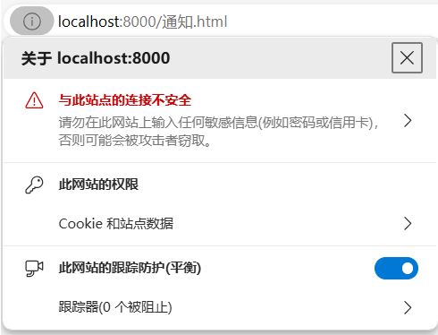
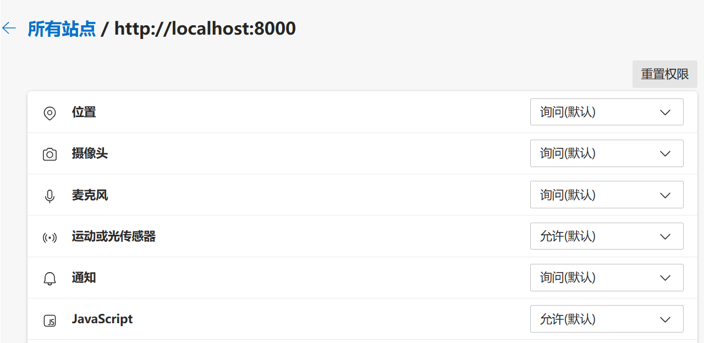

# Web API

## 位置
要获取设备的位置和速度，可以通过navigator.geoloaction.getCurrentPosition()方法，通过解析回调函数的参数可以得到经度、纬度、设备前进方向和速度，示例如下：

```html
<script>
        navigator.geolocation.getCurrentPosition(position=>{
                // 经度
                console.log('经度', position.coords.latitude)
                // 纬度
                console.log('纬度', position.coords.longitude)
        
        })
</script>
```

##  桌面通知

可以直接调用Notification()函数即可创建一条通知，代码示例如下：

```html
<script>
        new Notification( 'Title', {body:'content', icon:'notice.png'} )
</script>
```

不过，需要注意两点：
-  不能直接以本地文件运行，要以服务器形式运行
-  需要手动允许通知权限

首先，点击浏览器链接左边的标记，点击“此网站的权限”。



找到通知那一栏，设置为“允许”。



这样，就可以看到桌面通知了。

##  Local Storage

要在浏览器本地存储数据，可以使用cookie、local storage、session storage，这三种对象的区别如下：
- cookie： 最古老的方式，使用特定的格式字符串存储和传输本地数据。
- local storage： 持久化的本地存储，在关闭浏览器后依然有效。
- session storage： 临时的本地存储，在关闭窗口后删除。

下面讲解localStorage对象的使用方法。

要存储键值对，使用setItem()方法：

```js
localStorage.setItem(key, value)
```

也可以直接使用点号语法：

```js
localStorage.key = value
```

使用getItem()方法读取键对应的值：

```js
localStorage.getItem(key)
```

也可以直接使用点号语法：

```js
console.log(localStorage.key)
```

使用removeItem()方法可以删除键值对：

```js
localStorage.removeItem(key)
```

使用clear()方法可以清空所有本地存储的键值对：

```js
localStorage.clear()
```

##   postMessage()

postMessage()方法用于主页面向子页面发送消息。

首先，在需要发送消息的源窗口中，通过 iframe 标签嵌入另一个窗口，然后，iframe元素调用postMessage()方法发送消息，主页面main.html的代码如下：

```html
<h1>main page</h1>
<!-- 嵌入sub.html -->
<iframe src="sub.html" id="sub"><iframe>   

<script>
        // 向sub.html发送消息
        document.querySelector('#sub').contentWindow.postMessage('message from main page!')
</script>
```

然后，在子页面sub.html就可以监听消息：

```html
<h2>sub page</h2>
<script>
window.onmessage=e=> document.body+=e.data
</script>
```

##  自定义事件

大部分情况下，我们都是使用的浏览器提供的默认事件，这些事件都由用户触发，如鼠标单击、键盘按键。其实，可以自定义事件。

要创建自定义事件，使用如下方式定义一个事件对象event，事件名称是myevent，注意事件对象和事件名称概念要区分，不要搞混了。

```js
const event = document.createEvent("CustomEvent")
event.initCustomEvent("myevent", true, false, "event happened!")
```

上面的示例中，initCustomEvent的四个参数的含义是：
- 自定义事件的名称，如示例中的myevent
- 事件是否冒泡
- 事件是否可以取消
- 任意值，作为事件传递的detail数据。

定义好事件后，任意的HTML元素都可以订阅这个事件了：

```js
document.addEventListener("myevent",event=>console.log(event.detail))
```

然后，使用disPatchEvent()函数触发：

```js
document.dispatchEvent(event)
```

该示例的完整代码如下：

```js
<script>
    const event = document.createEvent("CustomEvent")
    event.initCustomEvent("myevent", true, false, "event happened!")
    
    document.addEventListener("myevent",event=>console.log(event.detail))
    document.dispatchEvent(event)
</script>
```

##   Style API

可以使用JavaScript操作样式，包括内联样式和外部样式表。

如果属性名称是一个单词，在HTML元素中的style属性名称就是JavaScript设置的style属性名称。

```js
document.querySelector('p').color='red'
document.querySelector('p').display='inline'
```

如果在HTML中，元素的style属性里面的样式名称是用两个单词用连字符连接，例如background-color，那么在JavaScript中的style属性名称为backgroundColor，而不是background-color。例如：

```js
document.querySelector('p').backgroundColor='red'
document.querySelector('p').fontSize='20px'
```

还有一点要注意，JavaScript操作的样式值都必须是字符串，例如颜色值是'#ffffff'，而不是#ffffff。再比如字体大小应该写成'20px'，写成20px、20、'20'都是错误的。

可以使用JavaScript引入外部的CSS文件，示例如下：

```js
const link = document.createElement('link')
link.rel='stylesheet'
link.href='custom.css'
document.head.append(link)
```

className设置或返回HTML中class属性的值，是一个字符串。classList是一个包含class名称的类数组对象。

```js
<p class="aaa bbb">
<script>
const p = document.querySelector('p')
console.log(p.className)  // 'aaa bbb'
p.classList.add('ccc')
p.classList.remove('aaa')
console.log(p.className)  // 'bbb ccc'
console.log(p.classList.length)
console.log(…p)
</script>
```

## URL API

浏览器和Node.js都有一个全局类型URL，使用new URL可以新建一个url实例，便于对链接进行解析。

new URL()的第一个参数可以是绝对路径或相对路径，如下是一个绝对路径示例：

```js
let url = new URL("https://example.com:8000/path/file.txt?key=value")
```

如果是相对路径，则必须将主机名和端口作为第二个参数：

```js
let url = new URL("/path/file.txt?key=value", "https://example.com:8000")
```

生成了url对象后，就可以得到各个部分了，包括：

- url.href： 完整链接，例如https://example.com:8000/path/file.txt?key=value。
- url.host：主机名和端口，例如example.com:8000。
- url.protocol： 协议，例如https。
- url.port：端口，例如8000。
- url.host：主机名，例如example.com。
- url.pathname：路径，例如/path/file.txt。
- url.searchParams：查询参数对象。

查询参数对象url.searchParams是一个包含键值对的对象，可以获取、设置、添加、删除键值对。例如：

```js
// 获取键对应的值：
url.searchParams.get("key") 
// 修改键的值：
url.searchParams.set("key","newValue")
// 查看是否存在某个键：
url.searchParams.has("key")
// 添加一个键值对：
url.searchParams.append("ke2","value2")
// 删除一个键值对：
url.searchParams.delete("ke2","value2")
```

另外，很多时候需要对链接中的中文字符或空格字符进行编解码，这主要用到两个内置函数：

- encodeURI()	：	将非ASCII字符编码成机器可读的字符。
- decodeURI()	：	将ASCII反转成人类可读的字符。

这两个函数的用法示例如下：

```js
console.log(encodeURI('你好 世界'))  
// out： %E4%BD%A0%E5%A5%BD%20%E4%B8%96%E7%95%8C
//  20%表示空格

console.log(decodeURI('%E4%BD%A0%E5%A5%BD%20%E4%B8%96%E7%95%8C'))
// out： 你好 世界
```

## 定时器API

JavaScript定时器API可以延迟执行、循环执行另一个函数，有三种方法：setTimeout() 、 setInterval() 、 requestAnimationFrame() 。

###  setTimeout()
setTimeout()的作用是在一定延时之后执行某个函数。它接受两个参数，第一个参数是函数名称，也可以是箭头函数，第二个参数是延迟的时间，单位为毫秒。

如下示例先定义了要执行的函数，然后将函数名称传给setTimeout()，注意，函数名称后面不可以加括号。

```html
function foo(){
        console.log('2秒后')
}
setTimeout(foo, 2000)
```

上述示例在Node.js环境下也同样适用。

### setInterval()

setInterval()的作用是按照给定的时间间隔重复执行一个函数。它接受两个参数，第一个参数是函数名称，也可以是箭头函数，第二个参数是间隔时间，单位为毫秒。

可以使用clearInterval()函数取消定时。只需要将setInterval()赋给一个变量，如果要取消定时，将该变量传给clearInterval()即可。如下是一个按秒更新的计数器，在5秒之后便不再更新：

```html
<script>
    
    let a = 0
   
    function foo() {
        a = a + 1
        console.log(a)
        if (a == 5) clearInterval(循环)
    }

    const 循环 = setInterval(foo, 1000)

</script>
```

上述示例在Node.js环境下也同样适用。

###  requestAnimationFrame()

requestAnimationFrame() 告诉浏览器希望执行一个动画，并且要求浏览器在下次重绘之前调用指定的回调函数更新动画。该方法需要传入一个回调函数作为参数，该回调函数会在浏览器下一次重绘之前执行。

requestAnimationFrame()的基本语法如下：

```js
function animation(){
      // 每次执行的逻辑
      requestAnimationFrame(animation)
}
animation()
```


如下示例代码，变量a会在每帧之后加1：

```html
<body>
</body>

<script>
     let a = 0
     function animation() {
            a = a + 1
            document.body.innerHTML = a
            requestAnimationFrame(animation)
      }
     animation()
</script>
```


##  Flie System API：浏览器读写本地文件

```html
<!DOCTYPE html>
<html lang="en">

<head>
    <meta charset="UTF-8">
    <meta name="viewport" content="width=device-width, initial-scale=1.0">
    <title>Document</title>

</head>

<body>
    <button id="button">打开文件</button>

    <script>
        document.getElementById('button').onclick = async () => {
            const [fileHandle] = await window.showOpenFilePicker();
            const file = await fileHandle.getFile()
            const text = await file.text()
            console.log('旧内容:',text)
            const  writable = await fileHandle.createWritable()
            await writable.write(text+'\n新内容\n新内容\n')
            await writable.close();

            const file2 = await fileHandle.getFile()
            const text2 = await file2.text()
            console.log('新内容:',text2)

        }
    </script>

</body>

</html>

```


# JSON

JSON全称是JavaScript对象表示法，是通用的数据交换格式，许多软件的配置文件均使用JSON文件格式。

可以包括三种语法：
* 原始值
* 对象
* 数组

JSON无法包括如下的数据类型:
- 集合
- 映射

## JSON语法

JSON存在四组标记符号：
- 中括号`[]`表示数组
- 花括号`{}`表示键值对
- 引号包裹住键的名称和字符串类型的键值，键值为数字是不加引号。
- 逗号区分数组的各个元素和各个键值对

## JSON与JavaScript对象的区别

JSON的格式与JavaScript对象（包括数组）的字面量格式非常类似，使用时容易搞混，要注意几个区别：
- JSON的键必须使用引号包裹，而JavaScript对象的键可以用也可以不用引号包裹。
- JavaScript对象允许用双斜杠添加注释，而JSON不能添加任何注释。
- JavaScript允许使用拖尾逗号，而JSON不能使用，逗号只能放在元素之间，不能用在末尾。

## 将对象转换为JSON

要将对象转换为JSON字符串，使用JSON.stringify()方法，例如：

```js
const obj = {a:1, b:2, c:3}

const json = JSON.stringify(obj)  
console.log(json)   //  {"a":1,"b":2,"c":3}
```

可以在第二个参数中指定一个数组，表示筛选哪些属性进入JSON字符串：

```js
const obj = {a:1, b:2, c:3}

const json = JSON.stringify(obj,['a','c'])  
console.log(json)   //  {"a":1,"c":3}
```

## 将JSON序列化为对象

可以将JSON序列化为对象，使用JSON.parse()方法。例如：

```
const json = '{"a":1,"b":2,"c":3}'

const obj = JSON.parse(json)
console.log(obj)
```

再来看一个例子，从本地的配置文件中读取JSON字符串转化为对象，修改后保存回配置文件。
如下是配置文件settings.json的内容：

```JSON
{
	"a":1,
  	"b":2,
  	"c":3
}
```

如下读取配置文件并解析为对象，然后写回配置文件中：

```js
const fs = require('fs')

const json = fs.readFileSync('settings.json','utf8')
const obj = JSON.parse(json)  
console.log(obj)   // { a: 1, b: 2, c: 3 }

obj.a = 2
obj.c = 5
const json2 = JSON.stringify(obj)
fs.writeFileSync('settings.json',json2,'utf8')

```

## JSON不是对象，而是字符串

需要特别强调的是，JSON不是对象，而是字符串。许多人习惯称呼JSON格式为“JSON对象”，这种说法是错误的。JSON的本质就是字符串，可以使用typeof关键字验证：

```js
const obj = {a:1, b:2, c:3}
const json = JSON.stringify(obj)  
console.log(typeof json)  // string
```


