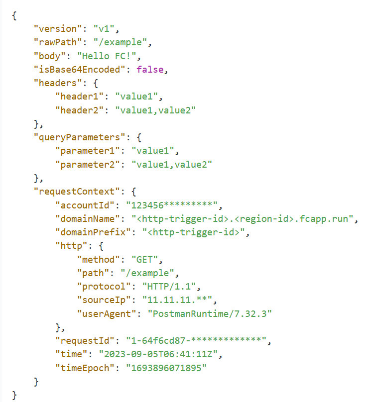

<h1 id="top" style="font-size:40px;">函数计算</h1>

<p><a style="position:fixed;left:14%;" href="#top">回到顶部</a></p>

- [触发器](#触发器)
- [函数处理程序](#函数处理程序)
- [event](#event)
- [Node.js运行时](#nodejs运行时)
- [Python运行时](#python运行时)


## 触发器

函数计算是事件驱动的云服务，因此要执行一个函数，就必须要有一个事件发生，这个事件叫做“触发器”。

- 云产品事件：例如存储桶中新增了一个文件。
- HTTP事件 ：使用浏览器、API、SDK发送HTTP请求时触发。

一个触发器加上一个请求处理程序就组成了一个可以提供服务的函数。

## 函数处理程序

一个触发器对应一个请求处理程序handler。handler包括一个文件名和方法名。

对于Python而言，请求处理程序格式为`文件名.方法名`，例如文件名是main.py，方法名为handler，那么请求处理程序为main.handler。

对于Node.js而言，请求处理程序为`文件名.方法名`，例如文件名是index.js，方法名为handler，那么请求处理程序为 index.handler。


##   event

event 为调用函数时传入的参数。即响应报文的body，用JSON格式表示。例如：



通过json模块的loads()方法可以将JSON对象转化成Python对象：

```
eventObj = json.loads(event)
```

## Node.js运行时

```
// index.mjs
export const handler = async (event, context) => {
    const eventObj = JSON.parse(event)
    
    // 请求体
    const body = eventObj.body
    return body
}
```

关键信息说明如下：
- handler ： 方法名称。例如，为FC函数配置的请求处理程序为index.handler，那么函数计算的入口就是index.mjs中的handler函数。
- event ：请求信息，包含了请求头、请求体等关键信息，格式为JSON文本。 
- context ：函数的执行环境信息。例如运行时、内存大小等。
- return ： 作为响应报文的响应体返回给客户端。

## Python运行时

使用HTTP请求处理程序前，请确保已经为函数配置**HTTP触发器**。

一个简单的HTTP处理函数示例如下：

```
def handler(event, context):
    return 'hello world'
```

