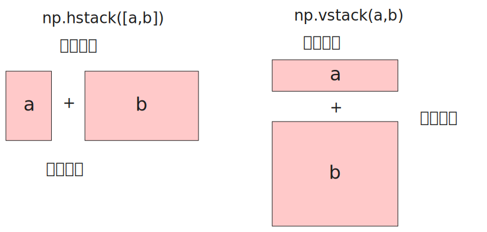

<p id="top" style="font-size:48px;color:green; font-weight:bolder;">Python</p>

<p><a href="#top" style="position:fixed;bottom:0px;">回到顶部</a></p>

目录：

<!-- <div style="position:fixed; right:100px; top:0px; width:400px; height:300px; background:azure; overflow-y:scroll">
</div> -->


- [基础](#基础)
    - [推荐书籍： 《Python编程：从入门到实践》](#推荐书籍-python编程从入门到实践)
    - [声明变量](#声明变量)
    - [注释](#注释)
    - [使用id()、is、is not、==检测相等性](#使用idisis-not检测相等性)
    - [条件语句](#条件语句)
- [列表](#列表)
    - [新建列表](#新建列表)
    - [使用range()创建数字序列](#使用range创建数字序列)
    - [数字列表的数学统计运算](#数字列表的数学统计运算)
    - [使用 in 操作符查找元素](#使用-in-操作符查找元素)
    - [使用列表推导式筛选元素](#使用列表推导式筛选元素)
    - [在末尾追加列表元素：append()](#在末尾追加列表元素append)
    - [在中间插入列表元素：insert()](#在中间插入列表元素insert)
    - [删除列表元素：pop()](#删除列表元素pop)
    - [清空列表对象或其切片：del](#清空列表对象或其切片del)
    - [使用for in 遍历列表](#使用for-in-遍历列表)
    - [使用map()函数遍历列表](#使用map函数遍历列表)
    - [列表的去重](#列表的去重)
    - [列表的排序](#列表的排序)
    - [列表与其它相似类型的互相转换](#列表与其它相似类型的互相转换)
- [面向对象](#面向对象)
  - [类](#类)
    - [类的编码风格](#类的编码风格)
    - [类的定义](#类的定义)
    - [类的实例化](#类的实例化)
    - [使用句号语法访问属性和成员](#使用句号语法访问属性和成员)
  - [类型提示](#类型提示)
- [模块、包、pip](#模块包pip)
  - [模块和包](#模块和包)
    - [示例](#示例)
    - [包和模块的区别](#包和模块的区别)
    - [包和文件夹的区别](#包和文件夹的区别)
    - [import 语法](#import-语法)
    - [from import 语法](#from-import-语法)
    - [import和from import的区别](#import和from-import的区别)
    - [from 相对导入](#from-相对导入)
    - [导入包时具体执行了什么？](#导入包时具体执行了什么)
  - [模块](#模块)
  - [pip包管理器](#pip包管理器)
    - [基础用法](#基础用法)
    - [换源](#换源)
    - [自定义安装位置](#自定义安装位置)
    - [包搜索顺序](#包搜索顺序)
    - [PYTHONPATH](#pythonpath)
  - [虚拟环境：venv](#虚拟环境venv)
- [桌面通知](#桌面通知)
- [执行系统命令](#执行系统命令)
- [命令行参数](#命令行参数)
- [读写环境变量](#读写环境变量)
- [函数](#函数)
  - [传递实参](#传递实参)
    - [按位置传递](#按位置传递)
    - [按关键字传递](#按关键字传递)
    - [传递任意数量的参数](#传递任意数量的参数)
    - [传递任意数量的关键字参数](#传递任意数量的关键字参数)
  - [Lambda函数](#lambda函数)
- [日期和时间](#日期和时间)
    - [导入datetime模块](#导入datetime模块)
    - [返回当前时间](#返回当前时间)
    - [返回当前时间戳](#返回当前时间戳)
    - [创建时间](#创建时间)
    - [基于字符串创建时间](#基于字符串创建时间)
    - [时间戳转时间](#时间戳转时间)
    - [时间转时间戳](#时间转时间戳)
    - [提取时间中的要素](#提取时间中的要素)
- [文件目录处理](#文件目录处理)
  - [路径的反斜杠问题](#路径的反斜杠问题)
  - [列举文件](#列举文件)
  - [工作目录](#工作目录)
    - [获取工作目录](#获取工作目录)
    - [改变工作目录](#改变工作目录)
  - [新建文件夹](#新建文件夹)
  - [重命名文件或目录](#重命名文件或目录)
  - [路径处理](#路径处理)
    - [相对路径和绝对路径之间的转换](#相对路径和绝对路径之间的转换)
    - [提取和去掉路径的最后一部分](#提取和去掉路径的最后一部分)
    - [合并多段路径](#合并多段路径)
    - [检测路径是否存在](#检测路径是否存在)
  - [删除操作](#删除操作)
    - [删除文件](#删除文件)
    - [删除空文件夹](#删除空文件夹)
    - [删除非空文件夹](#删除非空文件夹)
  - [使用7z命令行解压](#使用7z命令行解压)
- [文件内容处理](#文件内容处理)
  - [打开和关闭文件](#打开和关闭文件)
    - [打开文件](#打开文件)
    - [关闭文件](#关闭文件)
    - [新建文件](#新建文件)
  - [读取文件内容](#读取文件内容)
    - [读取文件内容为字符串](#读取文件内容为字符串)
    - [逐行读取文件内容](#逐行读取文件内容)
    - [读取文件内容为列表](#读取文件内容为列表)
    - [读取CSV文件](#读取csv文件)
  - [写入文件内容](#写入文件内容)
    - [覆盖文件内容](#覆盖文件内容)
    - [追加文件内容](#追加文件内容)
  - [提取文件后缀](#提取文件后缀)
  - [获取创建、访问和修改时间](#获取创建访问和修改时间)
  - [Python对象与JSON格式的转换](#python对象与json格式的转换)
    - [将字典转化为json文本](#将字典转化为json文本)
    - [将json文本转化为Python字典](#将json文本转化为python字典)
- [序列](#序列)
  - [序列的概念](#序列的概念)
  - [序列的count()方法](#序列的count方法)
  - [序列的加法和乘法](#序列的加法和乘法)
- [异步](#异步)
    - [进程、线程、协程、并发、并行概念的区别](#进程线程协程并发并行概念的区别)
    - [asyncio.create\_task()](#asynciocreate_task)
- [映射](#映射)
- [元组](#元组)
  - [新建元组](#新建元组)
  - [元组的不可变性](#元组的不可变性)
  - [通过可迭代对象得到新元组](#通过可迭代对象得到新元组)
  - [使用for in 遍历元组](#使用for-in-遍历元组)
  - [元组的索引和分片](#元组的索引和分片)
  - [元组的拖尾逗号](#元组的拖尾逗号)
- [正则表达](#正则表达)
    - [元字符](#元字符)
    - [fullmatch()](#fullmatch)
    - [分组和回引](#分组和回引)
    - [groups()](#groups)
    - [正则替换：sub](#正则替换sub)
    - [split()](#split)
- [字典](#字典)
    - [新建字典](#新建字典)
    - [字典的长度](#字典的长度)
    - [读取字典的值](#读取字典的值)
    - [设置或添加键值对](#设置或添加键值对)
    - [删除键值对](#删除键值对)
    - [对字典使用for遍历](#对字典使用for遍历)
    - [取出字典中的键：keys()](#取出字典中的键keys)
    - [取出字典中的值：values()](#取出字典中的值values)
    - [取出字典中的键值对：items()](#取出字典中的键值对items)
- [字符串](#字符串)
    - [内置函数str()](#内置函数str)
    - [format()](#format)
    - [大小写](#大小写)
    - [合并字符串](#合并字符串)
    - [isxxxx()系列函数](#isxxxx系列函数)
    - [移除前缀、后缀](#移除前缀后缀)
    - [startswith()和endswith()](#startswith和endswith)
- [HTTP](#http)
    - [快速启动静态文件服务器](#快速启动静态文件服务器)
    - [使用FastAPI实现HTTP服务器](#使用fastapi实现http服务器)
    - [使用requests模块发送请求](#使用requests模块发送请求)
    - [在flask中构造json响应体](#在flask中构造json响应体)
- [Jinja2](#jinja2)
  - [渲染模板字符串](#渲染模板字符串)
  - [渲染模板HTML](#渲染模板html)
  - [使用flask和jinja2渲染模板HTML](#使用flask和jinja2渲染模板html)
- [Jupyter](#jupyter)
  - [Juypter Notebook和Jupyter Lab的区别](#juypter-notebook和jupyter-lab的区别)
  - [Jupyter Lab](#jupyter-lab)
  - [Jupyter的快捷键](#jupyter的快捷键)
  - [在Notebook中执行系统命令](#在notebook中执行系统命令)
- [Numpy](#numpy)
    - [为什么Numpy数组比Python原生数组快？](#为什么numpy数组比python原生数组快)
    - [创建数组](#创建数组)
    - [基本属性](#基本属性)
    - [拷贝](#拷贝)
    - [拼接](#拼接)
    - [运算](#运算)
    - [索引](#索引)
    - [随机数](#随机数)
    - [存储数组数据](#存储数组数据)
    - [变形](#变形)
    - [创建单位数组](#创建单位数组)
    - [创建数列](#创建数列)
    - [数学函数](#数学函数)
- [Pandas](#pandas)
    - [读取CSV](#读取csv)
    - [排序](#排序)
    - [拼接](#拼接-1)
    - [与numpy结合](#与numpy结合)
    - [行列名称](#行列名称)
    - [条件筛选](#条件筛选)
    - [缺失值处理](#缺失值处理)
    - [loc和iloc](#loc和iloc)
    - [删除列](#删除列)


# 基础

###  推荐书籍： 《Python编程：从入门到实践》

本书是一本针对所有层次的 Python 读者而作的 Python 入门书。全书分两部分。第一部分介绍用Python 编程所必须了解的基本概念，包括 matplotlib、NumPy 和 Pygal 等强大的 Python 库和工具介绍，以及列表、字典、if 语句、类、文件与异常、代码测试等内容 ；第二部分将理论付诸实践，讲解如何开发三个项目，包括简单的 Python 2D 游戏开发，如何利用数据生成交互式的信息图，以及创建和定制简单的Web 应用，并帮读者解决常见编程问题和困惑。本书适合对 Python 感兴趣的任何层次的读者阅读。


###  声明变量

Python是弱类型、动态类型、解释型语言，声明不变可以不指明类型，解释器会根据变量的值推断适合的类型。最近的版本为Python添加了类型支持，旨在构建更健壮的Python代码。声明变量很容易，示例如下：

```py
a = 1
arr = ['hello' , 'world']
str = "hello,world"
```

注意，Python变量名称不可以是关键字。而且，应以字母或下划线开头，不可以包含空格，推荐使用连字符连接多个单词成分。
注意，Python变量名称不可以是关键字。而且，应以字母或下划线开头，不可以包含空格，推荐使用连字符连接多个单词成分。
###  注释

Python使用井号进行单行注释，当前行井号右边的内容将不会执行。

要添加多行注释，在注释内容的前后使用三个引号，单双引号均可。

###   使用id()、is、is not、==检测相等性

id()函数返回变量的内存地址。如果两个变量的内存地址相同，那么这两个变量是完全相等的。

is 可以用来检查两个变量是不是指向同一内存。

is not 是 is 的否定。

== 用来检查两个变量的值是不是相等。


###  条件语句

完整的if语句语法格式如下，注意条件后面的冒号一定不能漏掉。

```py
if  条件1:
        条件1为真时的操作
elif 条件2:
        条件2为真时的操作
elif 条件3:
        条件3为真时的操作
else
        其它情况的操作
```

示例如下：

```py
score = int(input("请输入你的分数："))

if score >= 80:
        print('优秀')
elif score >= 60:
        print('及格')
else:
        print('不及格')
```

# 列表

列表是一个包含任意对象的有序集合。与字符串和元组不同，列表是可变的：不仅长度可变，元素值也可变。同时，列表中的元素值是可以重复的。

### 新建列表

通常使用中括号包裹、逗号分隔的语法新建一个列表，如下新建了一个包含三个元素的列表：

```py
li = [1, 'hello' ,2.5] 
```

有些时候需要快速创建一个连续正整数数组，range()可以很方便的快速创建连续整数序列，range(m,n)表创建从m到n-1的整数序列，再使用list()包装成列表，例如：

```py
li = list(range(2,5))
print(li)
// 2,3,4
```

range()还可以接收第三个参数，用于指定步长：

```py
li = list(range(2,10,2))
print(li)
// 2,4,6,8
```

要获取列表的长度，即列表中有多少个元素，可以通过内置的len()函数得到：

```py
li = [1,2,3]
print(len(li)) // 3
```

通过中括号和索引可以得到某一位置该元素的值，索引从0开始，li[n]表示列表li的第n+1个元素。索引还可以是负数， li[-1]表示最后一个元素，li[-2]表示倒数第二个元素，依此类推。

```py
li = [1,2,3,4]

// 第二个元素
print(li[1])

// 最后一个元素
print(li[-1])
```

可以提取列表的某一范围内的元素，得到一个新的列表。 `[n:m]` 表示第n+1个元素到第m个元素。

```py
li = [1,2,3,4,5,6,7,8]
li2 = li[2:5]  
print(li2) # [3,4,5]
```

如果省略了冒号左边的值，则从第一个元素开始。如果省略了冒号右边的值，则一直到最后一个元素。如果都省略，相当于拷贝了一份列表的副本。

```py
li = [1,2,3,4,5,6,7,8]
li3 = li[2:]  
print(li2) # [3,4,5,6,7,8]

li4 = li[:5]
print(li4) # [1,2,3,4,5]

li5 = li[:]
print(li5 is li) # False
# is 的作用是比较两个对象的指针
```

###  使用range()创建数字序列

很多时候，需要快速生成一个数字序列，这时可以使用range()。

range()返回的是一个range序列对象，并非列表。可以使用list()进一步将序列封装成列表。

range(n,m)返回从n到m-1的序列。

```py
list(range(1,6))
# [1, 2, 3, 4, 5]
```

还可以指定第三个参数，指定步长。

```py
list(range(1,9,2))
#[1,3,5,7]
```

###  数字列表的数学统计运算

有几个方法可以对数字列表进行简单的统计运算，将列表传入这几个函数即可。

max()返回列表的最大值。

min()返回列表的最小值。

sum()返回列表的总和。

```
digits = [1, 2, 3, 4, 5, 6, 7, 8, 9, 0]

min(digits)
# 0
max(digits)
# 9
sum(digits)
# 45
```

###   使用 in 操作符查找元素

首先，使用 in 操作符用于检查某个值是否在列表中，这非常有用和方便。

index()方法用于查找元素首次出现的的索引，如果找不到就会返回ValueError异常。

```py
[1,2,3,4].index(2) 
```


###   使用列表推导式筛选元素
 
一个常见的场景是要筛选出序列中的元素，此时推导式很有用。

如下示例返回当前目录下以 .py 结尾的文件。

```py
import os
files = os.listdir('.')

[x for x in file if x.endswith('.py')]

```


### 在末尾追加列表元素：append()

使用append()方法可以将新元素添加到列表末尾：

```py
li = [1,2]
li.append(3)
```

### 在中间插入列表元素：insert()

使用insert()方法可以在指定位置插入新元素。insert(n,value)表示在第n+1个元素前面插入value这个新元素。例如：

```py
li = [1,2]
li.insert(0,3)
# 在第一个元素前面插入3
print(li) # [3,1,2]
```

### 删除列表元素：pop()

使用pop()删除列表末尾的一个元素，例如：

```py
li = [1,2,3]
li.pop()
print(li) # [1,2]
```

如果要删除指定位置的元素，只需传入索引即可：

```py
li = [1,2,3]

li.pop(0)
# 删除第一个元素
```

### 清空列表对象或其切片：del

del 语句可用于从列表中移除切片或清空整个列表。注意删除和清空的区别。

```py
a = [-1, 1, 66.25, 333, 333, 1234.5]
del a[0] # 清除第一个
del a[2:4] # 清除第3到4个
del a[:]  # 清空列表
del a  # 删除列表
```


### 使用for in 遍历列表

使用for in 语句可以遍历整个列表，示例如下：

```py
li = [1,2,3]
for item in li:
		print(li)
```

for in 语句不仅可以遍历列表，只要是可迭代对象，都可以，例如range()返回的对象。

```py
for item in range(1,4):
		print(item**2)
```

###  使用map()函数遍历列表

很多使用，需要对列表的每一个元素执行相同的操作，这叫做列表的迭代。使用内置的map()函数可以完成，map()函数的用法是：

```py
map(迭代函数, 可迭代对象)
```

非常需要注意的是，map()函数的返回结果是一个map对象，map对象也是可迭代对象，并不是我们所期待的传入对象的类型。

迭代函数通常是一个匿名函数，例如：

```py
li = [1,2,3]
li2 = map(lambda x:x**2, li)

print(list(li2)) # [1,4,9]
```

注意，示例中的li2只是一个map对象，需要使用list()包装成一个新列表。

###  列表的去重

列表允许值重复，如果要去重，可以利用set类型的不重复特性。

```py
li = [1,2,2,3,3]
set1 = set(li)
print(set1)
# {1, 2, 3}
```

###  列表的排序

列表的sort方法就地改变列表本身。

sorted()内置函数会返回一个新的列表。

sorted方法的语法如下：

```py
sorted(list, reverse, key)
```

- list ：要排序的列表
- reverse： 值为True时逆序，默认为False，从小到大。可选关键字参数。
- key： 排序依据。 例如key=str.lower不按大小写排序。可选关键字参数。

排序有两种情况：
- 对数字列表的排序： 这会按照自然数从小到大排。
- 对字符串列表的排序： 这会按照字符串的ASCII码值排序。

数字列表排序：

```py
digits = [345, 6, 22]
sorted(digits)
# [6, 22, 345]
# 默认从小到大
```

字符串列表排序：

```py
fruits = ['grape', 'raspberry', 'apple', 'banana']

# 默认按字符串字符的ASCII码从小到大排
sorted(fruits)
# ['apple', 'banana', 'grape', 'raspberry']

# 根据字符串的长度排序
sorted(fruits, key=len)
# ['grape', 'apple', 'banana', 'raspberry']
```

key还可以是一个函数。

形参表示每个元素，返回一个值，表示排序依据。

如下示例，` [: :-1] `表示字符串逆序。

```py
fruits = ['strawberry', 'fig', 'apple', 'cherry', 'raspberry', 'banana']
sorted(fruits, key=lambda word: word[::-1])
# ['banana', 'apple', 'fig', 'raspberry', 'strawberry', 'cherry']
```

###   列表与其它相似类型的互相转换

列表与其它相似类型的互相转换十分常见，例如将列表转为元组或集合：

```py
number_list = [1, 2, 3, 4, 5]
tuple_version = tuple(number_list)
set_version = set(number_list)

print(tuple_version)  # (1, 2, 3, 4, 5)
print(set_version)  # {1, 2, 3, 4, 5}
```

若要将列表转为字典，通常需要提供一个与之对应的键列表：

```py
keys = ['apple', 'banana', 'cherry']
values = [10, 20, 30]
fruit_dict = dict(zip(keys, values))

print(fruit_dict)  # {'apple': 10, 'banana': 20, 'cherry': 30}
```

反过来，集合和字典也可以转换为列表，例如：

```py
fruit_set = {'apple', 'banana', 'cherry'}
fruit_list_from_set = list(fruit_set)

fruit_dict = {'apple': 10, 'banana': 20, 'cherry': 30}
fruit_keys_list = list(fruit_dict.keys())
fruit_values_list = list(fruit_dict.values())

print(fruit_list_from_set)  # ['apple', 'banana', 'cherry']
print(fruit_keys_list)  # ['apple', 'banana', 'cherry']
print(fruit_values_list)  # [10, 20, 30]
```

# 面向对象


## 类

###  类的编码风格

- 类名应采用大驼峰命名法，并使用清晰的语义。
- 在类名的下一行包含一个文档字符串，用于写明该类的简要介绍，或者作用等信息。
- 在类中，使用一个空行分隔方法。
- 如果一个文件有多个类，类与类之间使用两个及以上的空行分隔，并写好注释。

###  类的定义

使用class关键字创建类，类名习惯上首字母大写。注意，类名后面一定要跟上括号和冒号。

```py
class Dog():
        """一次模拟小狗的简单尝试"""

        def __init__(self, name, age):
                self.name = name
                self.age = age

        def sit(self):
                print(self.name + ' is now sitting.')
```

类定义中的所有方法，第一个参数一定是self，表示对应的实例。

`__init__`为构造方法，在实例化时默认调用。在实例化时，从self之后的第二个参数开始，依次传入实例的实际属性。


###  类的实例化

直接像函数一样调用类名，传入实际的成员属性，即可实例化一个实例。

注意，不要写new。

```py
dog = Dog('milk', 3)
```

###  使用句号语法访问属性和成员

```py
dog.name
# milk

dog.sit()
# milk is now sitting.
```

##  类型提示

Python中，比较常见的类型有str、int、float。

```py
a:int = 1

str:str = 'hello' 
```

# 模块、包、pip

## 模块和包

### 示例

```py
sound/                          最高层级的包
      __init__.py               初始化 sound 包
      formats/                  用于文件格式转换的子包
              __init__.py
              wavread.py
              wavwrite.py
              aiffread.py
              aiffwrite.py
              auread.py
              auwrite.py
              ...
      effects/                  用于音效的子包
              __init__.py
              echo.py
              surround.py
              reverse.py
              ...
      filters/                  用于过滤器的子包
              __init__.py
              equalizer.py
              vocoder.py
              karaoke.py
              ...
```

### 包和模块的区别

要将一个文件夹变成Python包，需要在文件夹下添加__init__.py 文件。

包和子包是不同的包，示例中，sound包和sound.effects是不同的包。

包是文件夹，模块是Python文件。

导入包时，实际执行的是文件夹里面的__init__文件。导入模块时，就是执行这个模块文件。


### 包和文件夹的区别

一个包本质上就是操作系统的一个文件夹，里面有若干.py文件。子包就是子文件夹。

包和文件夹的唯一区别就是包里面有一个特殊文件： `__init__.py`文件。

要将一个文件夹变成Python包，需要在文件夹下添加`__init__.py` 文件。

包和子包是不同的包，示例中，sound包和sound.effects是不同的包。

### import 语法

```py
import sound.effects.echo 
```

使用时需要使用全名称前缀：

```py
 sound.effects.echo.类变量或函数。
```


如果不想麻烦，则导入时应该使用as重命名：

```py
import sound.effects.echo  as echo
```

这样，使用时：

```py
echo.类、变量或函数
```

### from import 语法

导入模块：

```py
from sound.effects import echo
```

使用：

```py
echo.类、变量或函数
```

导入模块里面的所有变量、类或函数：

```py
from sound.effects.echo import *
```

然后，不加模块前缀，直接使用里面的类、变量或函数。

导入模块里面具体的类、变量或函数：

```py
from sound.effects.echo import echofilter
```

使用时：

```py
echofilter()
```

`*` 默认为模块里面所有的全局变量、类和函数。但如果模块里面定义了 `__all__`数组，数组里面限制了导出了哪些变量、类或函数，则 `*`只会导入这些变量、类或函数。

### import和from import的区别

import 只能导入包、子包、模块，使用时需要使用全名称前缀，除非用as重命名。

from import 可以导入包、子包、模块、具体的变量、函数。导入变量或函数时直接使用，不需要前缀。

### from 相对导入

如果surround.py要导入echo.py，可以使用：

```py
from . import echo
```

. 表示当前文件夹。

如果surround.py要导入formats包，可以使用：

```py
from  .. import  formats
```

.. 表示上一级文件夹。

如果surround.py要导入formats包里面的wavread.py，可以使用：

```py
from  ..formats  import  wavread
```

..formats表示上一级文件夹中的formats文件夹。

### 导入包时具体执行了什么？

导入模块时，就是执行这个模块文件。

而导入包时，实际执行的是文件夹里面的`__init__`文件。


##  模块

大多数情况下，一个模块是一个目录，里面包含许多个文件或子目录，用来定义不同的功能。

要让一个文件夹变成一个Python模块，只需要在该文件夹内新建一个`__init__.py`文件，当模块被导入时会自动执行里面的代码。注意，`__init__py`文件一定要存在，哪怕内容为空。同时，每个子目录也要有`__init__.py`文件。


默认情况下，会按照如下顺序搜索模块：
- 当前目录。
- PYTHONPATH环境变量，这是一个目录列表。
- Python安装目录的site-packages目录。

模块可以指定只导出哪些内容，这是可以使用`__all__`变量，例如：

```py
__all__ = ["a", "foo", "bar"]
```

这样，在使用如下两个语句中的一个时，都只会导入这三个变量：

```py
import package
from package import *
```

import 语句导入另一个模块对象，另一个模块导出的内容都是该对象的成员，例如：

```py
import package
// 使用
package.foo()
```

要使用from语句导入特定的变量，使用：

```py
from package import a, foo
// 使用
print(a)
foo()
```

还可以导入另一个模块导出的全部内容：

```py
from package import *
```

还可以在导入时重命名：

```py
from package import a  as alias1
```


##   pip包管理器

pip是Python官方的包管理器，默认随着Python程序一起安装。

### 基础用法

要检查pip是否已经安装，在终端中运行：

```py
pip
```

如果已经安装，则会输出pip的帮助信息。

要安装Python包，运行：

```py
pip install package
```


如果将当前目录下的requirements.txt中列出的依赖安装到当前目录，运行：

```py
pip install -r  requirements.txt  .
```

要显示已经安装的包列表，运行：

```py
pip list
```

要卸载某个包，运行：

```py
pip uninstall package -y
```

加上 -y 或 --yes 选项表示确认卸载，如果不加，则需要在终端中手动确认。

### 换源


可以将包的下载源地址切换到国内源，例如阿里云的源，以提升下载速度。有两种方式：命令替换和手动替换。

第一种方式，命令替换，推荐使用。运行如下命令，切换成阿里云的源：

```py
pip config set global.index-url  https://mirrors.aliyun.com/pypi/simple
```

第二种方式，手动替换。在用户家目录下，创建文件pip.ini，并添加如下内容：

```py
[global]
index-url = http://mirrors.aliyun.com/pypi/simple/

[install]
trusted-host=mirrors.aliyun.com
```

这样，pip会默认使用这个源。

当然，也可以临时指定，使用 ` -i ` 选项，例如：

```py
pip install -r requirements.txt -i https://mirrors.aliyun.com/pypi/simple
```

###  自定义安装位置

pip默认会将包安装到如下位置：

```py
Python安装目录\Lib\site-packages
```

使用--target选项将Python包安装到自定义的位置。

```py
pip install  --target=安装路径名
```

如果按照路径名包含空格，需用双引号包裹。

###  包搜索顺序
Python 解释器运行时会按照如下 1~5 的顺序依次搜索 import 语句指定的包。如果有同名包，那么按照1 ~ 5 的顺序使用先找到的：

1. python主程序所在目录及其子目录
2. 环境变量 PYTHONPATH中的路径列表 
3. 标准库目录，即 Python安装目录\Lib
4. 任何.pth文件中的指定的目录，.pth 文件需要放在 Python 安装目录的根目录下
5. Python安装目录下的 site-packages 主目录


### PYTHONPATH

PYTHONPATH是第三包库的搜索路径，默认第三方包安装在`Python安装目录\Lib\site-packages`，但也可以自定义。

要获取PYTHONPATH，通过`os.environ['PYTHONPATH']`。

```py
import os
os.environ['PYTHONPATH']
```


##   虚拟环境：venv

要创建虚拟环境，请确定要放置它的目录：

```py
python -m venv 虚拟环境目录
```

一旦创建虚拟环境，就会在虚拟环境目录的Scripts下面找到两个脚本文件：
- activate.ps1 激活该虚拟环境。
- deactivate.ps1 退出该虚拟环境

虚拟环境本质上是一个文件夹，包含了特定包及其版本。避免了多个项目第三方包版本的冲突。

执行如下命令，安装requirements.txt列出的包依赖：

```py
pip install -r requirements.txt
```

 


# 桌面通知

使用plyer库，可以直接发送桌面通知。

安装plyer：

```py
pip install plyer
```


如下示例发送了一个桌面通知：

```py
from plyer import notification
notification.notify(
    title="test",		#标题
    message="aaaa",	#内容
    timeout=5,		#通知持续时间
)
```


#  执行系统命令

使用os.system()可以执行系统的命令，例如：

```py
os.system('ls')

os.system('other.py')
```


#  命令行参数

一些Python脚本需要处理命令行参数。这些参数以列表形式存储在sys模块的argv属性中。

一个脚本demo.py内容：

```py
import sys
print(sys.argv)
```

在终端调用：

```py
python demo.py one two three
```

输出结果：

```py
['demo.py', 'one', 'two', 'three']
```

第一个元素是脚本文件名，后面的元素为依次传入的参数。


# 读写环境变量

系统的所有环境变量都存储在os.environ中，这是一个字典。

要获取特定的环境变量，使用对应的键。例如获取Path环境变量：

```py
import os
os.environ['path']
```

经常需要为path添加条目，在Windows平台上，path的本质是分号分隔的字符串，此时可以通过+=添加一个路径。

```py
os.environ['path'] += ';'+r'D:\Test'
```

# 函数

## 传递实参

传递实参有三种方式： 按位置传递、 按关键字传递、传递任意数量的参数、 传递任意数量的关键字参数

###  按位置传递

位置参数是最常使用、也是默认的传参方式。

使用位置参数时，必须严格按照定义的顺序依次传入。

```py
def foo(first,last):
        print('hello', first, last)

foo('John','Baiden')
# hello Johb Baiden
```

###  按关键字传递

如果指定了形参变量名，可以不严格按照顺序传递实参值，例如：

```py
def foo(first,last):
        print('hello', first, last)

foo(last= 'Baiden', first= 'John')
# hello Johb Baiden
```


###  传递任意数量的参数

在参数前面加上星号，就变成了任意数量的实参。

在传递实参时，把后面的所有参数均打包为一个列表。

```py
def foo(*names):
    print('welcome:')
    for name in names:
        print(f'- {name}\r')

# 此时names=['mike']
foo('mike')

# 此时names=['mike','bob','smith']
foo('mike','bob','smith')
# welcome:
# - mike
# - bob
# - smith
```


###  传递任意数量的关键字参数

在参数前面加两个星号，就变成了任意数量的关键字参数。

此时，无论传递多少个关键字实参，都会打包成一个字典传给函数调用。

```py
def foo(**infos):
    print('welcome')
    for key,value in infos.items():
        print(f'- {key}:{value}')

# 此时infos={'mike':'manager'}
foo(mike='manager')

# 此时infos={'mike':'manager','bob'='programer','smith'='speaker'}
foo(mike='manager',bob='programer',smith='speaker')
```

##  Lambda函数

很多时候为了简化代码量、方便阅读，不需要单独定义函数，而直接使用Lambda函数，例如在map()函数中经常传入的是Lambda函数，而非具名函数。

使用Lambda关键字定义一个Lambda函数，语法如下：

```py
lambda 参数列表: 表达式
```

匿名函数的参数列表可以有1个或多个逗号分隔的参数，也可以没有参数。函数体经常只有一个表达式，表达式的结果就是匿名函数的返回值。示例如下：

```py
lambda x : x**2
lambda x,y : x+y
```

# 日期和时间


###  导入datetime模块

要处理日期和时间，最常用到datetime模块，首先要导入该模块：

```py
from datetime import datetime
```


### 返回当前时间

```py
datetime.now()
```


### 返回当前时间戳

```py
from datetime import datetime
now = datetime.now()
print(now.timestamp())
```

### 创建时间

```py
datetime(2023, 3, 15, 12, 30)
```

### 基于字符串创建时间

```py
datetime.strptime("2023-03-15 12:30:00", "%Y-%m-%d %H:%M:%S")
```

### 时间戳转时间

```py
datetime.fromtimestamp(1716437763.1540167)
# datetime.datetime(2024, 5, 23, 12, 16, 3, 154017)
# 最后一个是毫秒
```

### 时间转时间戳

返回2023-3-15 12:30对应的时间戳：

```py
datetime(2023, 3, 15, 12, 30).timestamp()
```

### 提取时间中的要素

```py
now = datetime.now()

# 提取年
now.strftime('%Y')
'2024'

# 提取月
now.strftime('%m')
# '05'

# 提取日
now.strftime('%d')
# '23'

# 提取年月日
now.strftime('%Y-%m-%d')
# '2024-05-23'

# 提取时分秒
now.strftime('%H-%M-%S')
# '12-12-15'
```

各个要素的语法如下：
- %Y， 四位数年
- %m， 两位数月份，单数前补0
- %d， 两位数日期，单数前补0
- %H， 两位数小时，单数前补0
- %M， 两位数分种，单数前补0
- %S， 两位数秒，单数前补0。


# 文件目录处理

##  路径的反斜杠问题

由于Windows平台文件的路径包含反斜杠，而这在Python中表示转义，为了规避这个问题，推荐在路径字符串前面加上r标识。

虽然有时候不加也能正常解析，但是最佳做法是始终加上。

##  列举文件

如下示例列举当前目录下的所有文件或子文件夹：

```py
import os
li= os.listdir('.')
print(li)
```

## 工作目录

###  获取工作目录

使用getcwd()获取工作目录：

```py
os.getcwd()
# 'C:\\Users\\用户名'
```

### 改变工作目录

使用chdir()改变工作目录：

```py
os.chdir(r'C:\Users\用户名\Desktop')
os.getcwd()
# 'C:\\Users\\用户名\\Desktop'
```

##   新建文件夹

使用os.mkdir()方法新建文件夹。

```py
import os
os.mkdir('Test') # 在当地目录新建Test文件夹
```

##   重命名文件或目录

使用rename()方法重命名文件或目录，语法如下：

```py
os.rename(old_name, new_name)
```

通过这种方式也可以移动文件（夹）。

##  路径处理

###  相对路径和绝对路径之间的转换

相对路径到绝对路径的转化，使用：

```py
os.path.abspath('file.txt') # 返回当前目录下file.txt文件的绝对路径
# 'D:\\Test\\file.txt'
```

###   提取和去掉路径的最后一部分

basename()方法提取路径的最后一部分。如果是文件，则返回文件名（含后缀）；如果是目录，则返回目录名。

```py
os.path.basename(r"D:\Test\file.txt")
# 'file.txt'
```

dirname()获取路径所在的文件夹，即去掉路径的最后一个部分，例如：

```py
os.path.dirname(r"D:\Test\file.txt")
# 'D:\\Test'
```

###   合并多段路径

使用join()方法合并多段路径：

```py
os.path.join(r"D:\Test", r"Test\file.txt")
# 'D:\\Test\\Test\\file.txt'
```

###  检测路径是否存在

os.path模块可以检测是否是文件夹、文件、链接、是否存在该路径：

- os.path.isdir(p) ： 检测是否是文件夹
- os.path.isfile(p) ： 检测是否是文件
- os.path.isexists(p)： 检测是否存在该路径
- os.path.islink(p)： 检测是否是链接

以上方法中的p表示路径，可以传入相对或绝对路径。

##  删除操作

###  删除文件

使用remove()方法删除文件，传入文件的相对或绝对路径。注意，这种方法会永久删除文件，而不会将文件移动到回收站。

###  删除空文件夹

使用os.rmdir(p)删除空文件夹：

```py
os.rmdir(r'D:\Test')
```

如果文件夹不是空的，则会报错。

使用os.removedirs(p)递归删除空文件夹：

```py
os.removedirs(r'D:\Test')
```

###  删除非空文件夹

如果要删除非空文件夹，应使用shutil库的rmtree(p)方法。

```py
import shutil
shutil.rmtree(r'D:\Test')
```

## 使用7z命令行解压

```py
apt install p7zip-full 
```

解压：

```py
7z x filename.7z  -o  指定目录
```

压缩：

```py
7z a  7z a archive.7z file1 file2 ...
```


# 文件内容处理

## 打开和关闭文件

###  打开文件

读写文件的第一步是打开文件，使用内置的open()函数，该函数需要指定三个参数：文件名、打开方式、编码。

如果文件名包含路径，路径之间使用正斜杠即可，这也适用于Windows平台。

打开方式大部分情况下只需要三种：r（只读）、w（覆盖写）、a（追加）。

对于编码，大部分情况使用通用的utf8编码即可。

在处理文件对象时，最好使用 with 关键字。优点是，子句体结束后，文件会正确关闭，即便触发异常也可以。而且，使用 with 相比等效的 try-finally 代码块要简短得多。

```py
with open('file.txt',encoding='utf8') as f:
```

f 也叫做文件描述符，这和C语言中的概念是类似的。得到f后，就可以对文件内容进行读写了。

###  关闭文件

使用with语句，子句体结束后，文件会正确关闭，使用closed属性可以检查文件是否已关闭：

```py
with open('file.txt',encoding='utf8') as f :
        print(f.read())
        
f.closed # True
```

###   新建文件

没有直接的方式新建文件，可以通过open()的方式新建。因为open()的原则是不存在就新建。

```py
# 注意，一定要加上'w'或'a'参数
file = open('file.txt', 'w', encoding='utf-8')
file.write('内容')
file.close()
```

## 读取文件内容

###   读取文件内容为字符串

使用read()方法读取全部的内容到一个字符串中，例如：

```py
with open('file.txt',encoding='utf8') as f :
        print(f.read())
```


###  逐行读取文件内容

f对象是可以可迭代对象，使用next()可以逐行读取，如下示例调用了三次next()，相当于读取了前三行：

```py
with open('file.txt',encoding='utf8') as f :
        print(next(f))
        print(next(f))
        next(f)
```


###  读取文件内容为列表

要将文件读取为列表，只需要将read()替换为readlines()即可：

```py
with open('file.txt','r',encoding='utf8') as f :
        print(f.readlines())
```

文件中的每一行就是列表中的元素，元素的类型为字符串。

需要注意的是，如果前面调用了next()方法，那么“光标”就移动到了当前行，readlines()将从下一行开始读取。

###   读取CSV文件

csv第一行表示字段名，从第二行开始，每一行代表一条记录，字段之间用逗号分隔。

如下是读取CSV的示例：

```py
import csv
f=open('file.csv')
reader = csv.reader(f)
next(reader)

row1= next(reader)
print('第一行:',row1)

row2 = next(reader)
print('第二行:',row2)
```

reader是一个可迭代对象，可使用for in 语句遍历。

## 写入文件内容

###  覆盖文件内容

要写入文件内容，需要将第二个参数设置为w。如下示例先删除原有的内容，替换为新内容。如果文件不存在，则创建新文件。

```py
with open('file.txt','w',encoding='utf8') as f :
        f.write('写入的新内容')
```

###  追加文件内容

要在文件末尾追加内容，需要将第二个参数设置为a。如下示例将新内容追加到文件末尾，如果文件不存在，则创建新文件。

```py
with open('file.txt','a',encoding='utf8') as f :
        f.write('追加的新内容')
```

如果要多次追加，多次调用write()即可。

##  提取文件后缀

使用splitext()方法可以拆分路径的后缀，返回一个元组：

```py
os.path.splitext(r"D:\Test\file.txt")
# ('D:\\Test\\file', '.txt')
```


##  获取创建、访问和修改时间

- os.path.getctime(p) ： 创建（create）时间
- os.path.getatime(p)： 访问（access）时间
- os.path.getctime(p)：修改（modify）时间 

上述方法皆传入相对或绝对路径，返回的皆为时间戳。

##   Python对象与JSON格式的转换

### 将字典转化为json文本

使用json模块的dumps()方法可以将对象转换为json文本：

```py
import json
di = {'姓名':'张三', '国籍':'中国'}
jsonStr = json.dumps(di, ensure_ascii=False)
print(jsonStr)
```

注意，由于中文编码的问题，一定要加上ensure_ascii=False，以保证中文输出。

得到的jsonStr就是一个普通的文本，可以将该文本存成一个json文件。

也可以可以使用dump()方法直接将对象直接存为json文件：

```py
import json
di = {'姓名':'张三', '国籍':'中国'}
with open('file.json','w',encoding='utf8') as f :
        json.dump(di, f, ensure_ascii=False)
```

###   将json文本转化为Python字典

使用json模块的loads()方法可以将JSON文本转换为Python对象，例如：

```py
import json
jsonStr = '{"姓名": "张三", "国籍": "中国"}'

di = json.loads(jsonStr)
print(di)
```

jsonStr就是一个普通的字符串，一般来源于对一个json文件的读取，通过使用open()和read()函数读取为字符串即可。

也可以直接加载json文件为Python对象，注意，json文件一定要是utf8编码。例如：

```py
import json
with open('file.json',encoding='utf8') as f :
        di = json.load(f)
print(di)
```


# 序列


之所以将序列单独挑出来，因为列表、元组、字符串的很多操作都是通用的，例如迭代、加法、乘法、推导式等。换言之，列表之所以适用于前述操作，就是因为列表是序列。


##   序列的概念

序列就是有序的队列，在Python中，包括列表、元组、字符串都是序列。

序列是可迭代对象。

列表、元组、字符串共用的操作总结如下：
- 加法： 拼接
- 乘法： 重复
- for in ： 遍历元素。对字符串而言，是遍历每个字符。
- in或not in： 查找元素是否存在。对字符串而言，查找子串是否在文本中。
- 推导式： for in 的简化版。
- len() ：求长度。

##  序列的count()方法

```py
fruits = ['apple', 'banana', 'orange', 'apple', 'grape', 'apple']

fruits.count('apple')
# 3
```

count()方法还适用于字符串和元组，因为它们都是序列，用法相同。


##  序列的加法和乘法

通过加法可以将两个甚至多个序列合成一个新序列。

```py
[1,2,3]+[4,5,6]
```

```py
(1,)+(2,3)
```

注意，序列加法和乘法的前提是操作数必须是同种数据类型。

```py
[1,2,3]*3
# [1,2,3,1,2,3,1,2,3]
```

字符串也是序列，因此也适用于加法和乘法：

```py
'abc'+'def'
# 'abcdef'

'abc'*3
# 'abcabcabc'
```


# 异步

###  进程、线程、协程、并发、并行概念的区别

并发：   处理多个任务。并发依然是CPU依次处理每个任务，只不过切换的时间很快，执行时间很快，人类感知不到，所以看上去是多任务处理，其实微观来看，并发是单任务。并发通过新增新的线程方式实现。

并行 ：   通过多个CPU同时执行任务。并行是真正意义上的多任务，从微观来看，两个CPU可以同时执行任务。并行通过派生子进程方式实现。

进程：   每一个进程会分配隔离的内存。增加一个进程，内核会分配新的内存单元，由于CPU依次执行每个进程，所以，多进程程序会获得更多的CPU时间，但是缺点是会增加进程间切换的时间消耗、以及要处理进程间通信问题。

线程：  进程会有一个主线程，也可以增加线程，执行并发操作。线程之间共享内存。线程消耗的资源比进程少。

协程：  协程表示线程内的任务。协程改变了任务执行的先后顺序。协程基于事件循环机制，事件循环机制是编程语言层面的实现。事件循环机制中包含一个任务队列，每次取出一个任务出来执行。协程中只要有阻塞代码，事件循环和协程的执行就会受到阻塞。协程消耗的资源比线程少。

###   asyncio.create_task()

通过asyncio的create_task方法，可以将所有任务都收集到一个队列中。任务在这里具体表现为函数。如果这个队列中中存在耗时操作，例如文件读取、网络请求、sleep，并不会阻塞等待，而是会执行后面的任务。

```py
import asyncio

async def task_one():
    print("开始执行任务一")
    await asyncio.sleep(3)  # 模拟一个耗时的操作
    print("经过了耗时操作后，任务一执行完成")

async def task_two():
    print("任务二，不耗时操作，提前完成")

async def main():
    task1 = asyncio.create_task(task_one())
    task2 = asyncio.create_task(task_two())
    await task1
    await task2

asyncio.run(main())
```

输出的结果如下：

```py
开始执行任务一
(立即显示)任务二，不耗时操作，提前完成
(3秒后才显示)经过了耗时操作后，任务一执行完成
```

可以发现，任务一中有一个sleep耗时操作，但是任务二这个不耗时的操作在前面打印出来了。


# 映射

Python映射与字典类似，在有些时候，使用映射更加方便。

映射可以合并，后面的操作数中的元素如果覆盖前面的同名键，增加新的键。

使用 `|` 操作符更新映射。

```py
d1 = {'a':1,'b':2}

# 键a的值会覆盖前面的
d2 = {'a':11,'c':3}

print(d1 | d2)
# {'a': 11, 'b': 2, 'c': 3}
# d1和d2都没有变
```

如果想就地更新映射，使用 `|=` 。

```py
d1 = {'a':1,'b':2}

# 键a的值会覆盖前面的
d2 = {'a':11,'c':3}

d1 |= d2

print(d1)
# {'a': 11, 'b': 2, 'c': 3}
```


# 元组


不可变的列表称为元组。

## 新建元组

元组的字面量使用圆括号包括、逗号分隔元素，例如：

```py
tu = (1,2,3)
```


##  元组的不可变性

为什么有了列表还要使用元组？关键就在于元组的不可变性，我们可以修改列表的元素，但是无法对元组的元素。例如，如果要更改元组中某个位置的值：

```py
tuple8 = (1,2,3,4)
# 期望修改第1个元素
tuple8[0] = 10 
```

解释器会报出如下错误：

```py
TypeError: 'tuple' object does not support item assignment
语法错误： 元组对象不支持元素赋值
```


## 通过可迭代对象得到新元组

tuple()函数接受一个可迭代对象，例如字符串或列表，从而得到一个新元组。例如，通过字符串得到元组：

```py
tu = tuple("hello")
```

通过列表得到元组：

```py
li = [1,2,3]
tu = tuple(li)
```

## 使用for in 遍历元组

元组也是可迭代对象，因此可以使用for in 遍历：

```py
tur = (1,2,3)
for i in tu:
        print(i)
```


##  元组的索引和分片

通过中括号和从0开始的索引得到元组的元素：

```py
tuple6 = (1, 2.5, 'hello')
print(tuple6[2]) # 'hello': 读取第3个位置
```

可以对元组进行分片得到新元组，` [n:m] `  表示从第n+1个元素到第m个元素，例如：

```py
tuple7= (1,2,3,4,5,6,7)
tuple8 = turple7[3:6]  # (4,5,6) ：从第4个元素到第6个元素
```

##  元组的拖尾逗号

元组的最后一个元素后面可以选择性的添加一个逗号，这并不会影响元素个数，这种逗号叫做“拖尾逗号”，在有些编辑场景下很实用。如下两种写法是等价的：

```py
tuple1 = (1,2,3,4)
tuple2 = (1,2,3,4,)
```


# 正则表达


###  元字符

次数匹配： 
- {m} m次的匹配
- {m,n} m到n次匹配
- `*`0到多次
- `+` 1到多次
- ？ 0到1次

开头结尾匹配 ：
- ^  匹配开头
- $  匹配结尾

指代字符： 
- . 任意字符
- `\W` 非字母数字
- `\s` 空白字符
- `\d` 任意数字，即0-9


###  fullmatch()

正则匹配的意思是，一个字符串是否符合一个正则表达式。

如果要求整个字符串完全符合正则表达式，使用fullmatch()。

```py
re.fullmatch(pattern, string)
```

使用fullmatch()检测整个文本是否匹配pattern，如果匹配，则返回match，否则返回None，None在终端中不会显示。

例如，检查字符串是否包含数字，可以使用正则表达式 `r'.*\d.*'`。

除了检测字符串是否匹配pattern以外，有时候还需要找到匹配的位置，此时，使用search()。

```py
import re

# 检测字符串是否包含数字
text = 'abc123def'
pattern = re.compile(r'.*\d.*')

result = pattern.fullmatch(text)
print(result)
# <re.Match object; span=(0, 9), match='abc123def'>

pattern2 = re.compile(r'\d')
result2 = pattern2.search(text)
print(result2)
# <re.Match object; span=(3, 4), match='1'>
```


###   分组和回引

如果新子串需要保留旧子串的部分内容，则需要将这部分内容用圆括号包裹，表示一个组，并用特定的格式给这个组起个名字，然后再用特定的格式在新子串中引用。

```py
定义分组：?P<name>
回引： \g<name>
```

如下示例，书名使用中文粗括号包裹，希望改为书名号，此时书名就是需要保留的内容，使用括号包裹并定义为一个组：

```py
import re
 
# 示例文本
text = "这本书的名字叫【活着】。"
 
# 正则表达式，其中有命名组
pattern = re.compile(r"【(?P<book>.*)】")
 
# 替换文本中的命名组
result = pattern.sub(r"《\g<book>》", text)
print(result)  
# 这本书的名字叫《活着》。
```


### groups()

如果要检测多个子串，可以使用分组。用圆括号包裹即创建一个分组。结果中会返回包含每组结果的元组。

```py
# 导入re模块
import re

tel = "0755-98776754"

# 定义正则表达式
pattern = re.compile(r"(\\d{4})-(\\d{8})")

result = pattern.search(tel)

print(result)   
# <re.Match object; span=(0, 13), match='0755-98776754'> 

print(result.group())    # 0755-98776754

# 返回匹配到的子串元组
print(result.groups())    # ('0755', '98776754')
# 返回第一个匹配子串
print(result.group(1))    # 0755
# 返回第二个匹配子串
print(result.group(2))    # 98776754
```

### 正则替换：sub


很多时候，要替换字符串的一部分为新的子串，但是，需要子对串进行模糊匹配，此时可以用sub()。

如果要对字符串进行正则替换，则使用re模块的sub()方法。

```py
pattern.sub(replacement, text)
```

匹配到pattern的子串，使用replacement替代。

示例：

```py
import re

text =  "123abb456"
# 数字匹配
pattern = re.compile(r'\d')
pattern.sub('*', "123abb456")
# ***abb***
```

###  split()

字符串的split()方法可以对字符串进行分割，如果要基于正则表达式进行分割，则使用re模块的split()方法。

```py
re.split(pattern, string)
```

用pattern分开string，返回列表。


```py
import re

text = 'Words, words; words'
# 非字母符号
pattern = re.compile(r'\W+') 

result = pattern.split(text)
print(result)
```

`\W`表示非字母符号。


# 字典


Python中的字典包含一个或多个键值对。这些键值对是没有顺序的，因此不能通过索引访问。

因为字典的键值对没有顺序，Python字典不是可迭代对象。

###  新建字典

通常通过一对花括号新建一个字典：

```py
di= {'a': 1, 'b': 2}
```

键需要使用单引号或双引号包裹。

###  字典的长度

通过len()方法得到字典的键值对的数量，即字典的长度：

```py
di = {'a': 1, 'b': 2, 'name': 'bob'}
print(len(di))
```

###  读取字典的值

通过中括号和引号包裹键名称可以访问对应的值。

注意，与JavaScript不同，Python字典不支持使用点号语法！

```py
di = {'a': 1, 'b': 2}
print(di['a']) 
```

###  设置或添加键值对

为键名称赋值即可添加键值对，如果键本来就存在，则会覆盖原来的值。

```py
di = {'a': 1, 'b': 2}
di['c'] = 3
di['a'] = 10
print(di) 
```

###  删除键值对

使用del语句加上键名称可以删除对应的键值对。

```py
di = {'a': 1, 'b': 2}
del di['b']
print(di)
```

###  对字典使用for遍历

```py
users = {'Hans': 'active', 'Éléonore': 'inactive', '景太郎': 'active'}
for user, status in users:
        print(user, status)
        
```

###  取出字典中的键：keys()

使用keys()方法得到包含键的一种可迭代对象，可以使用list()包装：
    
```py
di = {'a': 1, 'b': 2}
print(list(di.keys()))  
```

通过如下方式遍历字典中的键：

```py
di = {'a': 1, 'b': 2}

for k in di.keys():
        print(k)
```

### 取出字典中的值：values()

使用values()方法得到包含值的一种可迭代对象，可以使用list()包装：

```py
di = {'a': 1, 'b': 2}
print(list(di.values()))  
```

通过如下方式遍历字典中的值：

```py
di = {'a': 1, 'b': 2}

for v in di.values():
        print(v)
```

### 取出字典中的键值对：items()

使用items()方法得到包含键值对的一种可迭代对象，可以使用list()包装：

```py
di = {'a': 1, 'b': 2}
print(list(di.items))  
```

通过如下方式遍历字典中的键和值：

```py
di = {'a': 1, 'b': 2}

for k,v in di.items():
    print(k,v)
```


# 字符串


### 内置函数str()

使用str()可将其它数据类型转换为字符串。下面是一些示例：

```py
str1 = str(123)
print(str1,type(str1))
# 123 <class 'str'>

str2 = str([1,2,3])
print(str2,type(str2))
# [1, 2, 3] <class 'str'>

str3 = str({"a":1,"b":2})
print(str3,type(str3))
# {'a': 1, 'b': 2} <class 'str'>
```

使用str()可将其它数据类型转换为字符串。下面是一些示例：

```py
str1 = str(123)

str2 = str([1,2,3])

str3 = str({"a":1,"b":2})
```

str()可以避免字符串和数字合并时发生的错误，例如下面的例子，你可能期望输出 'I am 40 years old'，但实际会发生语法错误：

```py
age = 40
print('I am ' + age + ' years old')
# TypeError: can only concatenate str (not "int") to str
```

此时，str()就派上用场了，将整数转为字符串：

```py
age = 40
print('I am ' + str(age) + ' years old')
# I am 40 years old
```


###  format()

执行字符串格式化操作。点号左边的字符串如果包括花括号括起来的替换域，替换域可以包含位置索引。点号右边写上替换为的值，如果有多个替换域，依次书写。


```py
"The sum of 1 + 2 is {0}".format(1+2)
# 'The sum of 1 + 2 is 3'
```

###  大小写

- 小写：str.lower()
- 大写： str.upper()
- 大写转小写，小写转大写： str.swapcase()


###  合并字符串

可以使用加号合并两个或多个字符串，例如：

```py
'Py' + 'thon'
# 'Python'
```

使用空格也可以合并，不过这种方式仅适用于字符串字面量，例如：

```py
'Py'  'thon'
# 'Python'
```

###  isxxxx()系列函数

- isalnum()： 如果字符串中的所有字符都是字母或数字且至少有一个字符，则返回 True，， 否则返回 False。
- isspace()： 如果字符串中只有空白字符且至少有一个字符则返回 True ，否则返回 False 。
- istitle()： 如果字符串中至少有一个字符且为标题字符串则返回 True ，例如大写字符之后只能带非大写字符而小写字符必须有大写字符打头。 否则返回 False 。
- isupper()： 如果字符串中至少有一个区分大小写的字符且此类字符均为大写则返回 True ，否则返回 False 。
- islower()： 如果字符串中至少有一个区分大小写的字符且此类字符均为小写则返回 True ，否则返回 False 。
- isspace()： 如果字符串中只有空白字符且至少有一个字符则返回 True ，否则返回 False 。
- isnumeric()： 如果字符串中至少有一个字符且所有字符均为数值字符则返回 True ，否则返回 False 。 
- isdigit()： 如果字符串中的所有字符都是数字，并且至少有一个字符，返回 True ，否则返回 False 。

###  移除前缀、后缀

```py
str.removeprefix(prefix)
```

如果字符串以prefix开头，则返回删除了该前缀的新子串。如果不以该前缀开头，返回原字符串。

```py
'TestHook'.removeprefix('Test')
# 'Hook'

'BaseTestCase'.removeprefix('Test')
# 'BaseTestCase'
#  虽然包含，但不是前缀
```

```py
str.removesuffix(suffix)
```

如果字符串以 suffix 字符串结尾，则返回删除了该后缀的新子串。如果不以该后缀结尾，返回原字符串。

```py
'MiscTests'.removesuffix('Tests')
# 'Misc'
```

###   startswith()和endswith()

```py
str.endswith(substr)
```

如果字符串以指定的 substr结尾则返回 True，否则返回 False。 substr 也可以为由多个供查找的后缀构成的元组。

可选参数，限定起始和结束位置。

```py
str.startswith(substr)
```

如果字符串以指定的 substr 开始则返回 True，否则返回 False。substr 也可以为一个元组，只要有一个符合要求就返回True。


# HTTP

###   快速启动静态文件服务器


快速起一个静态文件服务器：

```sh
python -m http.server 65000
```

###   使用FastAPI实现HTTP服务器

FastAPI是Python 的第三方库，用于实现HTTP服务器。如下是一个简单的示例：


```py
import uvicorn
from fastapi import FastAPI
from fastapi.responses import JSONResponse 
import json

app = FastAPI()

@app.get("/")
async def get():
        return "Hello,World"

# 启动
if __name__ == "__main__":
    import uvicorn
    # 启动服务，注意app值为——入口文件:入口函数
    uvicorn.run(app='server:app', host="127.0.0.1", port=8080)

```

如下示例接收一个Post请求：
```py
import uvicorn
from fastapi import FastAPI
from fastapi.responses import JSONResponse 
import json

app = FastAPI()

@app.post("/post")
# request形参表示请求体，会自动把json转为dict
async def post(request:dict):
        print(request)
        headers = {"Content-Type":"application/json"}
        # 内容为json格式，要与Content-Type 对应
        content = '{"key":"value"}'
        # 返回的消息要包括：状态码、响应头、响应体
        return JSONResponse(status_code=200, headers=headers, content=content)

# 启动
if __name__ == "__main__":
    import uvicorn
    # 启动服务，注意app值为——入口文件:入口函数
    uvicorn.run(app='server:app', host="127.0.0.1", port=8080)

```


###   使用requests模块发送请求

一个典型的HTTP请求包括如下四个组成部分：

-  Method
-  URL
-  headers
-  body

发送post请求：

```py
import requests

url = 'http://127.0.0.1:8080/post'
headers = {'Content-Type': 'application/json'}
body = '{"key":"value"}'

response = requests.post(url, headers=headers, data=body)

# 打印响应码
print(response.status_code)
# 200

print(response.json())
```

发送get请求：

```py
import requests

url = 'http://127.0.0.1:8080/post'
headers = {'Content-Type': 'application/json'}

response = requests.get(url, headers=headers)

# 打印响应码
print(response.status_code)
# 200

print(response.json())
```


###   在flask中构造json响应体

在Web开发中，我们经常需要将列表数据封装到HTTP响应中返回给客户端。假设有一个API端点负责返回用户列表：

```py
from flask import jsonify

users = [
    {'id': 1, 'name': 'Alice'},
    {'id': 2, 'name': 'Bob'},
]

@app.route('/users')
def get_users():
    return jsonify(users=users)
```

# Jinja2

Jinja2是一种模板语言，类似于 f 字符串或者format()函数，可以将包含变量的字符串或HTML模板文件渲染成最终的文本。

##   渲染模板字符串

```py
from jinja2 import Template
template = Template('Hello {{ name }}!')
template.render(name='John Doe')
# Hello，John Doe
```

通过创建一个 Template 的实例，你会得到一个新的模板对象，提供一 个名为 render() 的方法，该方法在有字典或关键字参数时调用 扩充模板。字典或关键字参数会被传递到模板，即模板“上下文”。

##  渲染模板HTML

首先创建一个HTML文件，将需要解析的变量使用双花括号包裹，示例如下：

```html
<html>
<head>
    <title>{{ title }}</title>
</head>
<body>
    <h1>{{ title }}</h1>
    <p>{{ content }}</p>
</body>
</html>

```

然后，传入变量的实际值，示例如下：

```py
# 创建一个 Environment 对象，指定模板文件的路径
env = Environment(loader=FileSystemLoader('templates'))
# 加载模板文件
template = env.get_template('example.html')
# 渲染模板，传入变量的值
html = template.render(title='Python Jinja2', content='This is a blog about Python Jinja2.')
# 打印渲染后的 HTML 字符串
print(html)

```

可以得到如下标准的HTML内容输出：

```html
<html>
<head>
    <title>Python Jinja2</title>
</head>
<body>
    <h1>Python Jinja2</h1>
    <p>This is a blog about Python Jinja2.</p>
</body>
</html>

```


##   使用flask和jinja2渲染模板HTML

在使用模板引擎（如Jinja2）构建动态网页时 ，列表数据常被用来生成表格、列表项等重复结构。例如下面的HTML模板文件：

```html
<!-- users.html -->
<ul>

  <li>{{ user.name }} (ID: {{ user.id }})</li>

</ul>
```

在flask后端：

```py
from flask import render_template

@app.route('/users')
def show_users():
    users = [
        {'id': 1, 'name': 'Alice'},
        {'id': 2, 'name': 'Bob'},
    ]
    return render_template('users.html', users=users)
```

# Jupyter


Jupyter广泛用于Python学习、数据科学、机器学习领域，结合了可运行的代码和Markdown文本，可以更直观的展现Python工作流。

##  Juypter Notebook和Jupyter Lab的区别

Jupyter Lab是Jupyter Notebook的升级版，Jupyter Lab可以同时打开多个ipynb文件。

许多提供AI开发服务的云服务厂商提供了云端开箱即用的Jupyter Lab环境。因此推荐使用Jupyter Lab。

##  Jupyter Lab

如果要在本地使用Jupyter Lab，先使用pip 安装：

```sh
pip install jupyter-lab
```

进入到包含ipynb的目录，运行

```sh
jupyter-lab
```

启动jupyter。

##  Jupyter的快捷键


操作	|	快捷键
---	|	---
运行本单元	|	Ctrl + Enter 
单元转入Markdown状态	|	M
单元转入代码状态	|	Y
退出编辑	|	Esc
选中单元格，Enter	|	编辑
选中上/下一单元	|	↑/↓
撤销	|	Ctr+Z 
删除该行	|	Ctrl+D
设置1~6级标题	|	1~6
在上方/下方插入新单元	|	A/B
删除选中的单元	|	D
清除输出	|	Ctrl+E


## 在Notebook中执行系统命令

!开头以模拟系统命令。例如使用pip安装Python包：

```py
!pip install package
```


# Numpy


###  为什么Numpy数组比Python原生数组快？

为什么Numpy数组比Python原生数组快？因为Numpy数组的元素类型是固定的，而Python原生数组的元素类型可以是任意类型，这使得Numpy数组可以在内存中连续存储，一个元素的下一个地址就是下一个元素，而Python数组的元素分散存储在内存的不同区域，每个区域存储一个元素值和下一个地址，系统要先“跳到”下一个地址再读取里面的值。


### 创建数组

如下示例创建了一个2行3列的二维数组：

```py
import numpy as np
arr = np.array([[1,2,3],[4,5,6]])
```

range(n)返回从0到n-1这n个整数组成的一维数组。

arange(m,n,t)表示元素从m到n-1，步长为t。

zeros(n)表示n个元素是0的一维数组。zeros(m,n)表示m行n列元素全部为0的二维数组。

ones(n)表示n个元素是1的数组。ones(m,n)表示m行n列元素全部为1的二维数组。

eye(n)表示对角线为1，其它元素全部为0的n行n列的二维数组。对角线指的是从左上角到右下角。

```py
# 生成数字范围，默认步长为1
range(10) 
# [0,1,2,3,4,5,6,7,8,9]

# 生成数字范围且指定步长
arange(0,10,2)
# [0,2,4,6,8]

# 生成全0数组
zeros(10)
# [0,0,0,0,0,0,0,0,0,0]

# 生成全1数组
ones(10)
# [1,1,1,1,1,1,1,1,1,1]

# 对角线为1，其它为0
eye(3)
#  [  [ 1, 0, 0 ], 
#     [ 0, 1, 0 ],
#     [ 0, 0, 1 ]  ]
```


### 基本属性

一维数组就是向量，二维数组就是矩阵。ndim表示维度，也叫做秩。

形状，就是几行几列，使用shape属性得到。m x n 的二维数组，shape为(m,n)。

函数或属性	|	作用
---	|	---
shape()	|	返回形状，一个元组，(m,n) m行n列
size	|	属性为元素总个数，即mxn的值
reshape(m,n)	|	改变形状为 mxn 
dtype	|	元素的数据类型
A.T	|	A的转置矩阵


### 拷贝

跟Python的规则一样，如果直接用等号将一个数组赋值给新数组，则为浅拷贝，任何一个数组的更改都会导致另一个的同步更改，因为这两个数组的指针指向同一处内存区域。

如果要进行深拷贝，则应该使用copy()方法，这样，两个数组的指针指向不同的内存区域，两个是完全独立的，更改其中一个并不会影响另一个。


### 拼接

如果元素的行数相同，则可以进行横向连接，使用hstack()方法。

如果元素的列数相同，则可以进行纵向堆叠，使用vstack()方法。



### 运算

函数	|	作用
---	|	---
mean()	|	求平均值
max()/min()	|	求最大/最小值
std()	|	求标准差
var()	|	求方差

### 索引

与Python的数组一样，arr[n]表示一维数组的第n+1个元素。arr[m][n]表示二维数组中，第m+1行n+1列的元素。

### 随机数

函数	|	作用
---	|	---
np.random.rand(n)	|	生成n个`[0,1)`之间的一维数组
np.random.rand(m,n)	|	生成`[0,1)`之间的 mxn 二维数组，元素均匀分布
np.random.randn(n,m)	|	生成`[0,1)`之间的 mxn 二维数组，元素平均值0、方差1，呈正态分布

### 存储数组数据

可以使用.npy文件后缀名保存数组，方便重复使用。

如下示例先将arr数组使用np.save()方法保存到arr.npy文件中，然后使用load()方法读取数组，赋值给arr2：

```py
import numpy as np
arr = np.array([[1,2,3],[4,5,6]])

// 存储为arr.npy文件
np.save('arr.npy',arr)

// 读取arr.npy文件
arr2 = np.load('arr.npy')
print(arr2)
```


###  变形

方法或属性	|	作用
---	|	---
shape	|	属性返回形状，是一个元组，包括行数和列数
reshape(p,q)	|	表示重新编排形状为 p x q
reval() 	|	还原为一维数组，返回指针，依然指向原数组
flatteb() 	|	还原为一维数组，返回新数组

###  创建单位数组

方法或属性	|	作用
---	|	---
zeros(m,n)	|	生成mxn的元素全是0的二维数组
ones(m,n)	|	生成mxn的元素全为1的二维数组
eye(m,n)	|	生成主对角线为1、其它元素全为0的 m x n 的二维数组，主对角线的意思是从左上角到右下角

例如：

```py
import numpy as np

arr1 = np.zeros(3,2)
arr2 = np.ones(3,2)
arr3 = np.eye(4)
```

###  创建数列

arange(m,n,t)表示元素从m到n-1，步长为t。如果省略t，则步长为1。

```py
import numpy as np
arr = np.arange(1,10,2)
print(arr)
# [1,3,5,7,9]
```

linspace(m,n,count) 表示最大值n，最小值为m，总数为count个的均匀分隔的数组。

这两个区别在第三个参数，一个是指定步长，一个是指定元素个数（自动计算步长）。

### 数学函数

如下函数均接收一个Numpy数组作为参数：

函数	|	作用
---	|	---
np.sum()	|	求所有元素的和
np.abs ()	|	绝对值
np.sin()、np.cos() 	|	正余弦
log log10 	|	自然对数，以10为底的对数
exp 	|	自然对数的x次方
mean()	|	求平均值。
max()/min()	|	求最大/最小值。
std()	|	求标准差。
var()	|	求方差。


# Pandas


###  读取CSV

```py
pd.read_csv(路径，encoding="utf-8")
```

参数：
- header：定义那一行作为标题
- sep： 定义分隔符，一般为逗号
- names吧为文件中的每一列定义列名
- usecols： 从csv文件中提取哪些列
- dtype： 列的数据类型

写入CSV文件：

```py
pd.to_csv(路径)
```

写入Excel：

```py
pd.to_excel(路径)
```

###  排序


```py
df.sort_values(by='步数')
```

ascending=False 表示逆序

###  拼接

纵向堆叠：

```py
concat（[df1,df2], axis=0）
```

横向拼接：

```py
concat（[df1,df2], axis=1）
```

###  与numpy结合

```py
arr = nparange（100）.reshape(25, 4)
df = pd.DataFrame(arr)
```

###  行列名称


默认时，均从0开始。

使用index关键字指定行名称

使用columns关键字指定列名称

###  条件筛选

筛选出步数列中大于10000的行，并返回新的表：

```py
df[df["步数"]>=10000]
```

注意，query的参数是一个字符串形式，但字段名不要加引号，例如：

```py
df.query('  步数>=10000 and 摄入卡路里 <=1800   ' )
```


提取行或列


```py
df["A"]  提取A字段列

df["A"，"B"]  提取A和B字段列

df[:2]  提取前2行
```

###  缺失值处理


缺失值显示NaN，改成0

fillna(0)

###  loc和iloc

loc使用具体的行或列的值提取。iloc使用序号提取。

```py
df.loc(行,列)
```


第一个参数，哪些行，冒号表示所有。如果多个行，使用数组。

第二个参数，哪些列，冒号表示所有，如果多个列，使用数组形式。

```py
df.iloc(行号,列号)
```

第一个参数，哪几行。冒号表示所有，1:表示第2行到最后一行。

第二个参数，哪几列。：2表示第1行到2行

###  删除列

```py
df.drop('日期'，axis=1)
```

