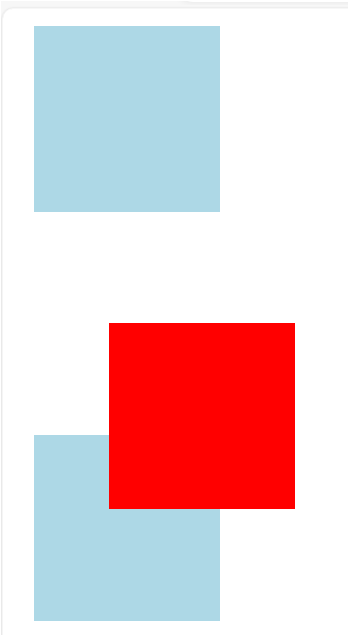
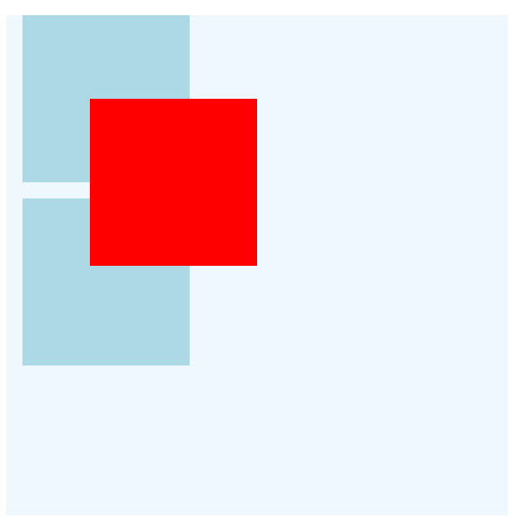
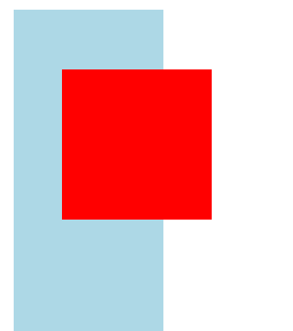

### 相对定位

当一个元素被设置成相对定位后，就会相对于本来所在的位置进行偏移。

但是，相对定位元素偏移到新位置后，其原来的位置并不会被其它兄弟元素递补填充。

```html
<style>
    #相对定位元素 {
        width: 100px;
        height: 100px;
        background: red;
        position: relative;
        top: 50px;
        left: 50px;
    }

    .其它兄弟元素 {
        width: 100px;
        height: 100px;
        background: lightblue;
        margin:10px;
    }
</style>


<body>
    <div class="其它兄弟元素"></div>
    <div id="相对定位元素"></div>
    <div class="其它兄弟元素"></div>
</body>
```

效果如下：



### 绝对定位

当一个元素被设置成绝对定位时，就会被移除正常的布局流，本来所占的位置会被其它兄弟元素递补填充。它独立于容纳块内的其它的兄弟元素，相对于容纳块左上角的距离始终不变。

容纳块是指已经设置relative或absolute的最近的上级元素。如果没有，则容纳块是body元素。

```html
<title>绝对定位</title>
<style>
    #容纳块 {
        width: 400px;
        height: 400px;
        background: aliceblue;
        position: relative;
    }

   #绝对定位元素{
    width: 100px;
    height:100px;
    background: lightblue;
    position: absolute;
    top: 50px;
    left: 50px;
   }

   .其它兄弟元素{
    width: 100px;
    height: 100px;
    background: red;
    margin:10px
   }


</style>

<body>
    <div id="容纳块">
        <div id="绝对定位元素"></div>
        <div class="其它兄弟元素"></div>
        <div class="其它兄弟元素"></div>
    </div>

</body>
```

效果如下：




### 固定定位

当一个元素被设置成固定定位，那么它就会被移除正常的布局流，本来的位置会被其它元素递补填充。同时，无论是滚动还是放缩页面，它相对于页面左上角的距离始终不变。

```html

<style>
    #固定定位元素 {
        width: 100px;
        height: 100px;
        background: red;
         position: fixed;
        top: 50px;
        left: 50px;
    }
    .页面其它元素 {
        width: 100px;
        height: 500px;
        background-color: lightblue;
        margin: 10px;
    }
</style>
<body>
    <div class="页面其它元素"></div>
    <div id="固定定位元素"></div>
    <div class="页面其它元素"></div>
</body>
```

效果如下：



可以滚动页面或放缩浏览器窗口，查看固定定位的效果。

### 粘滞定位

sticky 英文字面意思是粘，粘贴，所以可以把它称之为粘性定位。

当页面规定没有超出目标区域时，它的行为就像 position:relative；当页面滚动超出目标区域时，它的表现就像 position:fixed;，它会固定在目标位置。
