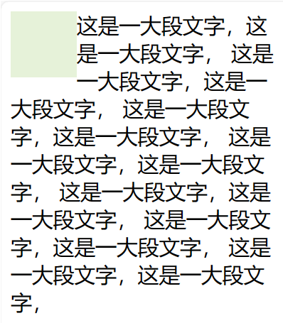

把一个元素“浮动”(float) 起来，会改变该元素本身和在正常布局流（normal flow）中跟随它的其他元素的行为。这一元素会浮动到左侧或右侧，并且从正常布局流 (normal flow) 中移除，这时候其他的周围内容就会在这个被设置浮动 (float) 的元素周围环绕。
float 属性有四个可能的值：

* left — 将元素浮动到左侧。
* right — 将元素浮动到右侧。
* none — 默认值，不浮动。
* inherit — 继承父元素的浮动属性。

浮动一般用于文字环绕图片的场景。一般将小尺寸图片设置为浮动，后面跟一大段文字。在图片上设置float:left或float:right可以实现文字环绕的效果。如下示例：

```html


<div>
    浮动测试浮动测试浮动测试浮动测试浮动测试
    浮动测试浮动测试浮动测试浮动测试浮动测试
    浮动测试浮动测试浮动测试浮动测试浮动测试
</div>
```

效果如下：



